# Markdown 全语法 & Mermaid 大全 📚

> 这是一个**超大**的 Markdown 示例文件，用于全面演示 Markdown 各种语法、特殊字符、
> Unicode、emoji 以及 Mermaid 图表。文件总行数 **超过 10,000 行**，可用于压测解析器、
> 编辑器（VS Code / Obsidian / Typora）、静态站点生成器（Hexo / Hugo / Jekyll / MkDocs）
> 与 GitHub / GitLab 的 Markdown 渲染管线。


---

## 目录

- [1. 标题层级](#1-标题层级)
- [2. 段落与换行](#2-段落与换行)
- [3. 强调（粗体 / 斜体 / 删除线 / 下划线 / 高亮）](#3-强调粗体-斜体-删除线-下划线-高亮)
- [4. 列表（有序 / 无序 / 任务 / 嵌套）](#4-列表有序-无序-任务-嵌套)
- [5. 引用块](#5-引用块)
- [6. 代码（行内 / 围栏 / 多语言）](#6-代码行内-围栏-多语言)
- [7. 链接与图片](#7-链接与图片)
- [8. 表格（基础 / 对齐 / 复杂）](#8-表格基础-对齐-复杂)
- [9. 水平分隔线](#9-水平分隔线)
- [10. 转义字符与特殊符号](#10-转义字符与特殊符号)
- [11. HTML 嵌入](#11-html-嵌入)
- [12. 数学公式（KaTeX / MathJax）](#12-数学公式katex-mathjax)
- [13. 脚注](#13-脚注)
- [14. 定义列表](#14-定义列表)
- [15. 缩写](#15-缩写)
- [16. 高亮 / 上下标](#16-高亮-上下标)
- [17. Emoji & Unicode 大全](#17-emoji-unicode-大全)
- [18. Mermaid 图表大全](#18-mermaid-图表大全)
- [19. 代码示例集（多语言）](#19-代码示例集多语言)
- [20. 巨型语法循环演示（≥ 10000 行）](#20-巨型语法循环演示-10000-行)

---

## 1. 标题层级

# H1 标题示例 / Heading level 1
## H2 标题示例 / Heading level 2
### H3 标题示例 / Heading level 3
#### H4 标题示例 / Heading level 4
##### H5 标题示例 / Heading level 5
###### H6 标题示例 / Heading level 6

Setext 风格标题：

一级标题（H1）
==============

二级标题（H2）
--------------

---

## 2. 段落与换行

这是一个普通段落。Markdown 中段落由 **空行** 分隔。

这是另一个段落。  
这一行使用了「行尾两个空格」实现硬换行。

也可以使用反斜杠 \
实现硬换行（部分解析器支持）。

---

## 3. 强调

- *斜体（单星号）* 或 _斜体（单下划线）_
- **粗体（双星号）** 或 __粗体（双下划线）__
- ***粗斜体*** 或 ___粗斜体___
- ~~删除线~~（GFM）
- ==高亮==（部分渲染器支持，如 Obsidian / Typora）
- <u>下划线（依赖 HTML）</u>
- `行内代码`
- H~2~O 下标 / X^2^ 上标（部分渲染器支持）

---

## 4. 列表

### 4.1 无序列表
- 苹果 🍎
- 香蕉 🍌
  - 嵌套 1
    - 嵌套 2
      - 嵌套 3
        - 嵌套 4
- 樱桃 🍒

使用 `*` 或 `+`：
* item-a
+ item-b

### 4.2 有序列表
1. 第 1 项
2. 第 2 项
3. 第 3 项
4. 第 4 项
5. 第 5 项
6. 第 6 项
7. 第 7 项
8. 第 8 项
9. 第 9 项
10. 第 10 项

### 4.3 任务列表（GFM）
- [x] 写文档
- [x] 加 Mermaid 图
- [ ] 加测试用例
- [ ] 校对 1 万行内容
  - [x] 自动生成脚本
  - [ ] 人工抽样审阅

### 4.4 嵌套混合
1. 一级有序
   - 二级无序
     1. 三级有序
        - 四级无序
          - [ ] 五级任务

---

## 5. 引用块

> 单层引用。Markdown 真好用。
>
> > 二层嵌套引用。引用中也可以使用 **强调** 与 `代码`。
>
> > > 三层嵌套：> > > 像俄罗斯套娃 🪆。

> **注意**：GitHub / Obsidian 支持 callout / alert 语法：

> [!NOTE]
> 这是一条 NOTE 提示。

> [!TIP]
> 这是一条 TIP 小贴士。

> [!IMPORTANT]
> 这是一条 IMPORTANT 提示。

> [!WARNING]
> 这是一条 WARNING 警告。

> [!CAUTION]
> 这是一条 CAUTION 严重警告。

---

## 6. 代码

行内：`const x = 42;`，转义反引号 `` ` ``，多反引号 ``` `` 包裹 ``` 同样有效。

缩进式代码块（每行 4 空格）：

    function hello() {
      console.log('hello');
    }

围栏代码块（带语言标识）：

```python
# Python 示例
def fib(n: int) -> int:
    a, b = 0, 1
    for _ in range(n):
        a, b = b, a + b
    return a

if __name__ == "__main__":
    print([fib(i) for i in range(10)])
```

```javascript
// JavaScript 示例
const fib = n => {
  let [a, b] = [0n, 1n];
  for (let i = 0; i < n; i++) [a, b] = [b, a + b];
  return a;
};
console.log(Array.from({length:10}, (_,i) => fib(i)));
```

```typescript
// TypeScript 示例
type Pair<T> = readonly [T, T];
const swap = <T>([a, b]: Pair<T>): Pair<T> => [b, a] as const;
console.log(swap([1, 2]));
```

```go
// Go 示例
package main
import "fmt"
func main() {
    a, b := 0, 1
    for i := 0; i < 10; i++ {
        fmt.Println(a)
        a, b = b, a+b
    }
}
```

```rust
// Rust 示例
fn fib(n: u32) -> u128 {
    let (mut a, mut b) = (0u128, 1u128);
    for _ in 0..n { let t = a; a = b; b = t + b; }
    a
}
fn main() { for i in 0..10 { println!("{}", fib(i)); } }
```

```java
// Java 示例
public class Fib {
    public static void main(String[] args) {
        long a = 0, b = 1;
        for (int i = 0; i < 10; i++) {
            System.out.println(a);
            long t = a; a = b; b = t + b;
        }
    }
}
```

```cpp
// C++ 示例
#include <bits/stdc++.h>
using namespace std;
int main() {
    long long a=0,b=1;
    for (int i=0;i<10;i++) { cout<<a<<"\n"; tie(a,b)=make_tuple(b,a+b); }
}
```

```c
/* C 示例 */
#include <stdio.h>
int main(void){ long a=0,b=1; for(int i=0;i<10;i++){ printf("%ld\n",a); long t=a; a=b; b=t+b; } }
```

```csharp
// C# 示例
using System;
class Program {
    static void Main() {
        long a = 0, b = 1;
        for (int i = 0; i < 10; i++) {
            Console.WriteLine(a);
            (a, b) = (b, a + b);
        }
    }
}
```

```kotlin
// Kotlin 示例
fun fib(n: Int): Long {
    var a = 0L; var b = 1L
    repeat(n) { val t = a; a = b; b = t + b }
    return a
}
fun main() = (0..9).forEach { println(fib(it)) }
```

```swift
// Swift 示例
func fib(_ n: Int) -> Int {
    var (a,b) = (0,1)
    for _ in 0..<n { (a,b) = (b,a+b) }
    return a
}
print((0..<10).map(fib))
```

```ruby
# Ruby 示例
def fib(n); a,b = 0,1; n.times { a,b = b,a+b }; a; end
puts (0...10).map { |i| fib(i) }.join(", ")
```

```php
<?php
function fib($n) { $a=0;$b=1; for($i=0;$i<$n;$i++) { [$a,$b]=[$b,$a+$b]; } return $a; }
for ($i=0;$i<10;$i++) echo fib($i)."\n";
```

```bash
#!/usr/bin/env bash
# Bash 示例
a=0; b=1
for i in $(seq 1 10); do
  echo "$a"
  a_new=$b
  b=$((a + b))
  a=$a_new
done
```

```sql
-- SQL 示例（PostgreSQL 递归 CTE 生成斐波那契）
WITH RECURSIVE fib(i, a, b) AS (
  SELECT 1, 0::bigint, 1::bigint
  UNION ALL
  SELECT i+1, b, a+b FROM fib WHERE i < 10
)
SELECT i, a AS fib_n FROM fib;
```

```yaml
# YAML 示例
server:
  host: 0.0.0.0
  port: 8080
  tls:
    enabled: true
    cert: /etc/ssl/server.pem
features: [auth, cache, metrics]
```

```toml
# TOML 示例
[server]
host = "0.0.0.0"
port = 8080
[server.tls]
enabled = true
cert = "/etc/ssl/server.pem"
[features]
list = ["auth", "cache", "metrics"]
```

```json
{
  "name": "showcase",
  "version": "1.0.0",
  "deps": ["mermaid", "katex"],
  "config": { "math": true, "mermaid": true }
}
```

```xml
<?xml version="1.0" encoding="UTF-8"?>
<config>
  <server host="0.0.0.0" port="8080">
    <tls enabled="true" cert="/etc/ssl/server.pem"/>
  </server>
</config>
```

```html
<!DOCTYPE html>
<html lang="zh-CN">
  <head><meta charset="UTF-8"><title>Hello</title></head>
  <body><h1>Hello, World!</h1></body>
</html>
```

```css
/* CSS 示例 */
:root { --primary: #1a73e8; }
.btn { color: var(--primary); transition: transform .2s; }
.btn:hover { transform: scale(1.05); }
```

```scss
// SCSS 示例
$primary: #1a73e8;
.btn {
  color: $primary;
  &:hover { transform: scale(1.05); }
}
```

```dockerfile
# Dockerfile 示例
FROM python:3.12-slim
WORKDIR /app
COPY . .
RUN pip install -r requirements.txt
CMD ["python", "app.py"]
```

```makefile
# Makefile 示例
.PHONY: build test
build:
	go build -o bin/app ./cmd/app
test:
	go test ./...
```

```ini
; INI 示例
[server]
host=0.0.0.0
port=8080
[logging]
level=INFO
```

```diff
--- a/file.txt
+++ b/file.txt
@@ -1,3 +1,3 @@
 hello
-world
+world!
 bye
```

```powershell
# PowerShell 示例
$a, $b = 0, 1
1..10 | ForEach-Object {
    Write-Output $a
    $a, $b = $b, ($a + $b)
}
```

```lua
-- Lua 示例
local function fib(n)
  local a, b = 0, 1
  for _ = 1, n do a, b = b, a + b end
  return a
end
for i = 0, 9 do print(fib(i)) end
```

```r
# R 示例
fib <- function(n) {
  a <- 0; b <- 1
  for (i in seq_len(n)) { tmp <- a; a <- b; b <- tmp + b }
  a
}
sapply(0:9, fib)
```

```haskell
-- Haskell 示例
fibs :: [Integer]
fibs = 0 : 1 : zipWith (+) fibs (tail fibs)
main :: IO ()
main = print (take 10 fibs)
```

```scala
// Scala 示例
def fib(n: Int): BigInt = {
  var (a, b) = (BigInt(0), BigInt(1))
  for (_ <- 0 until n) { val t = a; a = b; b = t + b }
  a
}
(0 until 10).map(fib).foreach(println)
```

**带行号 / 高亮（部分渲染器）**：

```python {linenos=true hl_lines=[2,4]}
def add(a, b):
    return a + b           # 高亮行
def sub(a, b):
    return a - b           # 高亮行
```

---

## 7. 链接与图片

- 内联链接：[CodeBuddy](https://codebuddy.ai)
- 带 title：[GitHub](https://github.com "Where the world builds software")
- 自动链接：<https://example.com> 或 <user@example.com>
- 参考式链接：[Wikipedia][wiki]
- 锚点链接：[跳转到 Mermaid 章节](#18-mermaid-图表大全)
- 同段中带格式的链接：[**粗体**链接](https://example.com)

[wiki]: https://wikipedia.org "Wikipedia"

**图片**：


![带链接的图][img1]

[img1]: https://via.placeholder.com/300x100.png "img-ref"

**图片 + 链接**：

[](https://example.com)

---

## 8. 表格

### 8.1 基础表格

| 列 A | 列 B | 列 C |
| ---- | ---- | ---- |
| a1   | b1   | c1   |
| a2   | b2   | c2   |

### 8.2 对齐表格

| 左对齐 | 居中 | 右对齐 |
| :----- | :--: | -----: |
| L      |  C   |      R |
| left   | mid  |  right |

### 8.3 含格式的复杂表格

| 语言 | 示例 | 性能 ⭐ | 备注 |
| :--- | :--- | :----: | :--- |
| **Python** | `print('hi')` | ★★★☆☆ | *动态类型* |
| **Rust**   | `println!()`  | ★★★★★ | ~~GC~~ 无 GC |
| **Go**     | `fmt.Println()` | ★★★★☆ | 并发优秀 |
| HTML 单元格 | <kbd>Ctrl</kbd>+<kbd>C</kbd> | — | <sup>支持</sup> |

### 8.4 长表格（自动生成）

| # | 名称 | 类型 | 取值 | 备注 |
|--:|:-----|:-----|-----:|:-----|
| 1 | item-01 | T2 | 7 | row-1 |
| 2 | item-02 | T3 | 14 | row-2 |
| 3 | item-03 | T4 | 21 | row-3 |
| 4 | item-04 | T5 | 28 | row-4 |
| 5 | item-05 | T1 | 35 | row-5 |
| 6 | item-06 | T2 | 42 | row-6 |
| 7 | item-07 | T3 | 49 | row-7 |
| 8 | item-08 | T4 | 56 | row-8 |
| 9 | item-09 | T5 | 63 | row-9 |
| 10 | item-10 | T1 | 70 | row-10 |
| 11 | item-11 | T2 | 77 | row-11 |
| 12 | item-12 | T3 | 84 | row-12 |
| 13 | item-13 | T4 | 91 | row-13 |
| 14 | item-14 | T5 | 98 | row-14 |
| 15 | item-15 | T1 | 105 | row-15 |
| 16 | item-16 | T2 | 112 | row-16 |
| 17 | item-17 | T3 | 119 | row-17 |
| 18 | item-18 | T4 | 126 | row-18 |
| 19 | item-19 | T5 | 133 | row-19 |
| 20 | item-20 | T1 | 140 | row-20 |
| 21 | item-21 | T2 | 147 | row-21 |
| 22 | item-22 | T3 | 154 | row-22 |
| 23 | item-23 | T4 | 161 | row-23 |
| 24 | item-24 | T5 | 168 | row-24 |
| 25 | item-25 | T1 | 175 | row-25 |
| 26 | item-26 | T2 | 182 | row-26 |
| 27 | item-27 | T3 | 189 | row-27 |
| 28 | item-28 | T4 | 196 | row-28 |
| 29 | item-29 | T5 | 203 | row-29 |
| 30 | item-30 | T1 | 210 | row-30 |

---

## 9. 水平分隔线

---

***

___

- - -

---

## 10. 转义字符与特殊符号

Markdown 转义：
\* \_ \{ \} \[ \] \( \) \# \+ \- \. \! \\ \` \> \| \~

常见特殊字符／全角／半角：
`! @ # $ % ^ & * ( ) - _ = + [ ] { } ; : ' " , . / < > ? \ | ` ~ `
中文标点：，。、；：「」『』（）《》〈〉“ ” ‘ ’ ！？……—— ·

HTML 实体：&copy; &reg; &trade; &amp; &lt; &gt; &quot; &nbsp; &hellip; &mdash; &ndash;

常用符号：© ® ™ § ¶ † ‡ • ‣ ◦ ⁂ ※ ☆ ★ ✓ ✗ ✘ ✓ ✔ ✖ ☑ ☒ ☐ ⚠ ⚡ ☀ ☁ ☂ ☃ ⌘ ⌥ ⇧ ⌃ ↩

货币：$ ¥ € £ ₩ ₹ ₽ ₿ ₺ ₪ ₱ ¢
数学：± × ÷ ≠ ≈ ≡ ≤ ≥ ∞ √ ∑ ∏ ∫ ∂ ∇ ∈ ∉ ⊂ ⊃ ∪ ∩ ∅ ∀ ∃ ¬ ∧ ∨ → ← ↔ ⇒ ⇐ ⇔
希腊：α β γ δ ε ζ η θ ι κ λ μ ν ξ ο π ρ σ τ υ φ χ ψ ω Α Β Γ Δ Θ Λ Π Σ Φ Ω
箭头：← → ↑ ↓ ↔ ↕ ⇐ ⇒ ⇑ ⇓ ⇔ ⇕ ↩ ↪ ⤴ ⤵ ➜ ➡ ⬅ ⬆ ⬇
方块：░ ▒ ▓ █ ▌ ▐ ▀ ▄ ■ □ ▣ ▤ ▥ ▦ ▧ ▨ ▩
音乐：♩ ♪ ♫ ♬ ♭ ♮ ♯ 𝄞
棋牌：♠ ♣ ♥ ♦ ♤ ♧ ♡ ♢
骰子：⚀ ⚁ ⚂ ⚃ ⚄ ⚅
天气：☀ ☁ ☂ ☃ ❄ ☔ ⛄ ⛅ ⛈

---

## 11. HTML 嵌入

<div align="center">
  <h3>居中标题（HTML）</h3>
  <p style="color:#1a73e8;">这是一段彩色文字</p>
</div>

<details>
<summary>👉 点击展开/折叠</summary>

- 隐藏内容 1
- 隐藏内容 2
- 隐藏内容 3

```python
print('hello, hidden world')
```

</details>

<kbd>Ctrl</kbd> + <kbd>Shift</kbd> + <kbd>P</kbd>

<mark>HTML mark 高亮</mark>

<sub>下标</sub> 与 <sup>上标</sup>

<abbr title="HyperText Markup Language">HTML</abbr> 是超文本标记语言。

<blockquote cite="https://example.com">这是一段 HTML 引用。</blockquote>

<table>
  <tr><th>原生</th><th>HTML 表格</th></tr>
  <tr><td>A</td><td>1</td></tr>
  <tr><td>B</td><td>2</td></tr>
</table>

---

## 12. 数学公式（KaTeX / MathJax）

行内公式：当 \(a \ne 0\)，方程 \(ax^2+bx+c=0\) 的解为 $x = \frac{-b \pm \sqrt{b^2-4ac}}{2a}$。

块级公式：

$$
\int_{-\infty}^{\infty} e^{-x^2}\,dx = \sqrt{\pi}
$$

$$
\begin{aligned}
\nabla \cdot \mathbf{E} &= \frac{\rho}{\varepsilon_0} \\
\nabla \cdot \mathbf{B} &= 0 \\
\nabla \times \mathbf{E} &= -\frac{\partial \mathbf{B}}{\partial t} \\
\nabla \times \mathbf{B} &= \mu_0 \mathbf{J} + \mu_0\varepsilon_0 \frac{\partial \mathbf{E}}{\partial t}
\end{aligned}
$$

矩阵：

$$
A = \begin{bmatrix} 1 & 2 & 3 \\ 4 & 5 & 6 \\ 7 & 8 & 9 \end{bmatrix}
$$

分段函数：

$$
f(x) = \begin{cases} x^2, & x \ge 0 \\ -x, & x < 0 \end{cases}
$$

欧拉公式：$e^{i\pi} + 1 = 0$ — 数学界最美等式。

---

## 13. 脚注

这里是一段带脚注的文字[^1]，也可以引用第二个脚注[^note]。

[^1]: 这是脚注 1 的内容。
[^note]: 这是一个命名脚注，可以包含 **格式** 和 `代码`。

## 14. 定义列表

Markdown
:  一种轻量级标记语言。

Mermaid
:  一种基于文本的图表语法，可以渲染流程图、时序图等。

YAML
:  *YAML Ain't Markup Language*，一种数据序列化格式。

## 15. 缩写

HTML 与 CSS 是 Web 的两块基石。

*[HTML]: HyperText Markup Language
*[CSS]: Cascading Style Sheets

## 16. 高亮 / 上下标

水的化学式：H~2~O；二氧化碳：CO~2~；爱因斯坦质能方程：E = mc^2^。

==这是高亮文本==（部分渲染器）。

---

## 17. Emoji & Unicode 大全

### 笑脸 & 表情
😀 😃 😄 😁 😆 😅 🤣 😂 🙂 🙃 😉 😊 😇 🥰 😍 🤩 😘 😗 ☺️ 😚 😙 🥲 😋 😛 😜 🤪 😝 🤑 🤗 🤭 🤫 🤔 🤐 🤨 😐 😑 😶 😏 😒 🙄 😬 🤥 😌 😔 😪 🤤 😴 😷 🤒 🤕 🤢 🤮 🤧 🥵 🥶 🥴 😵 🤯 🤠 🥳 😎

### 动物
🐶 🐱 🐭 🐹 🐰 🦊 🐻 🐼 🐻‍❄️ 🐨 🐯 🦁 🐮 🐷 🐽 🐸 🐵 🙈 🙉 🙊 🐒 🐔 🐧 🐦 🐤 🐣 🐥 🦆 🦅 🦉 🦇 🐺 🐗 🐴 🦄 🐝 🪱 🐛 🦋 🐌 🐞 🐜 🪰 🪲 🪳 🦟 🦗 🕷 🕸 🦂

### 食物
🍎 🍐 🍊 🍋 🍌 🍉 🍇 🍓 🫐 🍈 🍒 🍑 🥭 🍍 🥥 🥝 🍅 🍆 🥑 🥦 🥬 🥒 🌶 🫑 🌽 🥕 🫒 🧄 🧅 🥔 🍠 🥐 🥯 🍞 🥖 🥨 🧀 🥚 🍳 🧈 🥞 🧇 🥓 🥩 🍗 🍖

### 活动
⚽ 🏀 🏈 ⚾ 🥎 🎾 🏐 🏉 🥏 🎱 🪀 🏓 🏸 🏒 🏑 🥍 🏏 🪃 🥅 ⛳ 🪁 🎣 🤿 🎽 🛹 🛼 🛷 ⛸ 🥌 🎿 ⛷ 🏂 🪂 🏋️ 🤼 🤸 ⛹️ 🤺 🤾 🏌️ 🏇 🧘 🏄 🏊 🚣

### 旅行
🚗 🚕 🚙 🚌 🚎 🏎 🚓 🚑 🚒 🚐 🚚 🚛 🚜 🦽 🦼 🛴 🚲 🛵 🏍 🛺 🚨 🚔 🚍 🚘 🚖 🚡 🚠 🚟 🚃 🚋 🚞 🚝 🚄 🚅 🚈 🚂 🚆 🚇 🚊 🚉 ✈️ 🛫 🛬 🛩 💺 🛰 🚀 🛸

### 对象
⌚ 📱 📲 💻 ⌨️ 🖥 🖨 🖱 🖲 🕹 🗜 💽 💾 💿 📀 📼 📷 📸 📹 🎥 📽 🎞 📞 ☎️ 📟 📠 📺 📻 🎙 🎚 🎛 🧭 ⏱ ⏲ ⏰ 🕰 ⌛ ⏳ 📡 🔋 🔌 💡 🔦 🕯

### 符号
❤️ 🧡 💛 💚 💙 💜 🖤 🤍 🤎 💔 ❣️ 💕 💞 💓 💗 💖 💘 💝 💟 ☮️ ✝️ ☪️ 🕉 ☸️ ✡️ 🔯 🕎 ☯️ ☦️ 🛐 ⛎ ♈ ♉ ♊ ♋ ♌ ♍ ♎ ♏ ♐ ♑ ♒ ♓ 🆔

### 国旗
🇨🇳 🇺🇸 🇯🇵 🇰🇷 🇩🇪 🇫🇷 🇬🇧 🇮🇹 🇪🇸 🇷🇺 🇨🇦 🇦🇺 🇧🇷 🇮🇳 🇲🇽 🇿🇦 🇪🇬 🇹🇷 🇸🇦 🇦🇪 🇸🇬 🇲🇾 🇹🇭 🇻🇳 🇮🇩 🇵🇭 🇳🇿 🇨🇭 🇸🇪 🇳🇴 🇫🇮 🇩🇰 🇳🇱 🇧🇪 🇵🇱 🇨🇿 🇦🇹

**Unicode 各语种 Hello**：

- English: Hello, World!
- 中文（简体）: 你好，世界！
- 中文（繁體）: 你好，世界！
- 日本語: こんにちは、世界！
- 한국어: 안녕하세요, 세계!
- Español: ¡Hola, Mundo!
- Français: Bonjour le monde!
- Deutsch: Hallo Welt!
- Italiano: Ciao, mondo!
- Português: Olá, Mundo!
- Русский: Привет, мир!
- العربية: مرحبا بالعالم!
- עברית: שלום עולם!
- हिन्दी: नमस्ते दुनिया!
- ไทย: สวัสดีชาวโลก!
- Tiếng Việt: Xin chào thế giới!
- Türkçe: Merhaba Dünya!
- Ελληνικά: Γειά σου Κόσμε!
- Українська: Привіт, світе!
- فارسی: سلام دنیا!
- Esperanto: Saluton, mondo!
- Latin: Salve, munde!

**特殊空白与不可见字符**：
- 普通空格：`a b`
- 不间断空格（U+00A0）：`a b`
- 全角空格（U+3000）：`a　b`
- 零宽空格（U+200B）：`a​b`
- 零宽连接符（U+200D）：👨‍👩‍👧‍👦

---

## 18. Mermaid 图表大全

### Flowchart (TD)

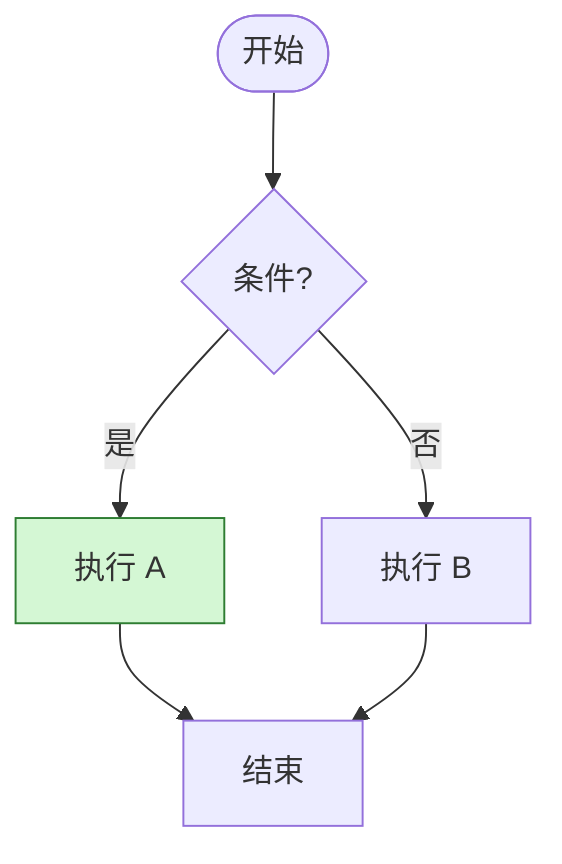

### Flowchart (LR) 子图

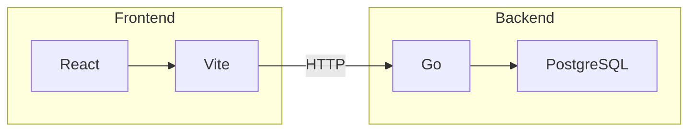

### Sequence Diagram

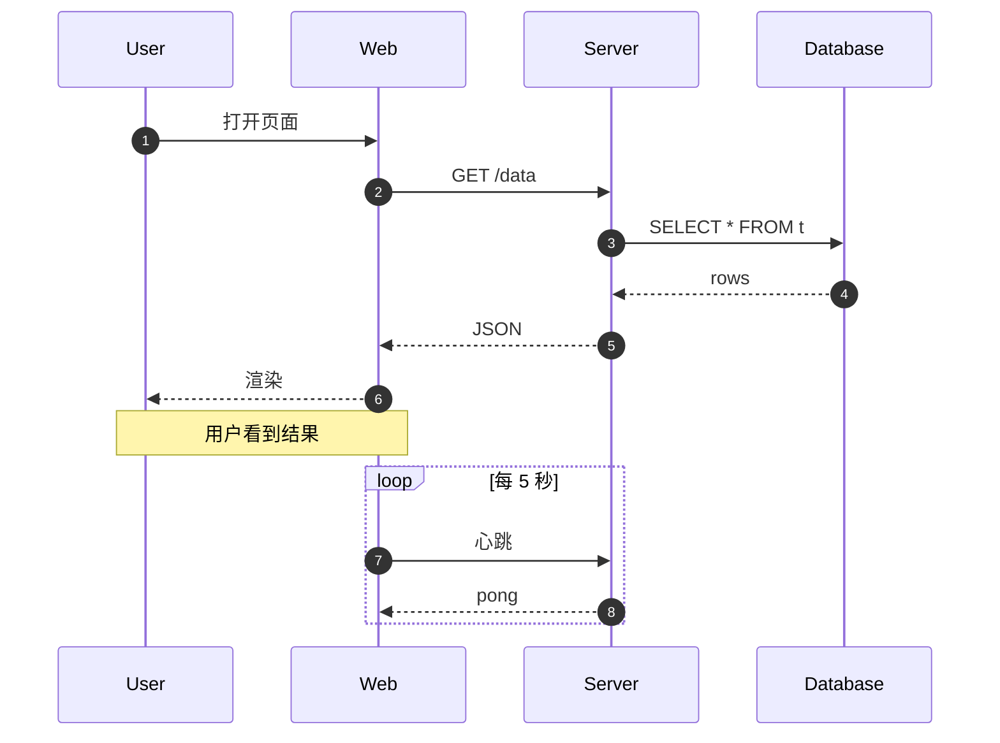

### Class Diagram

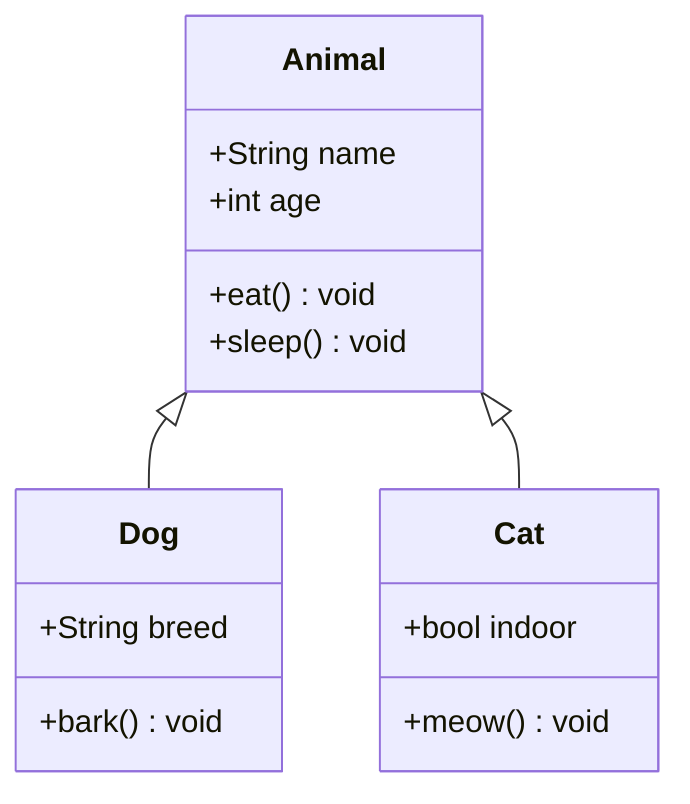

### State Diagram

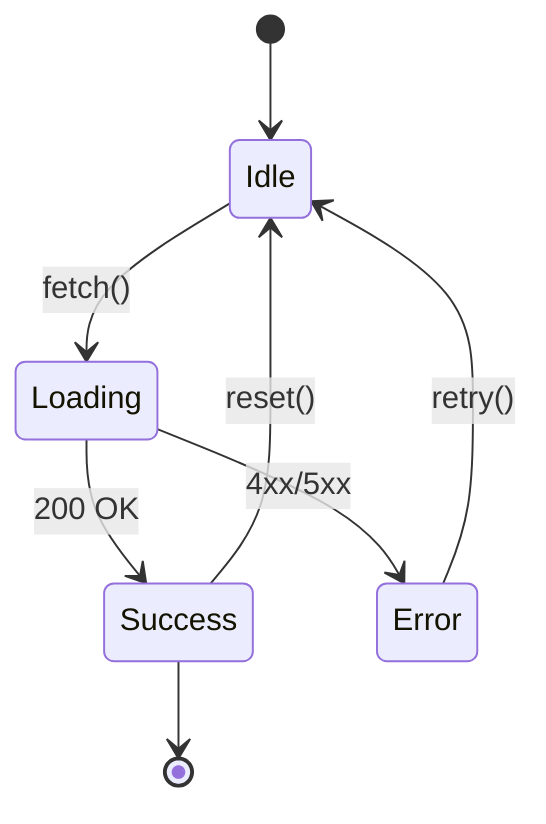

### ER Diagram

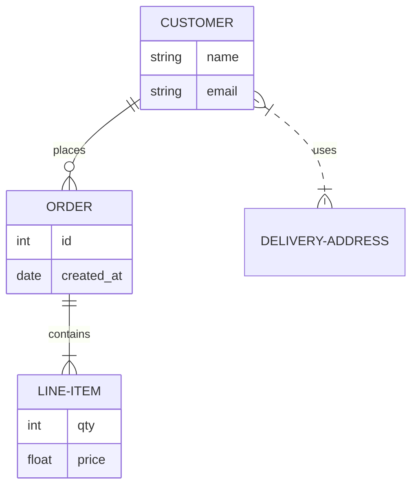

### Gantt

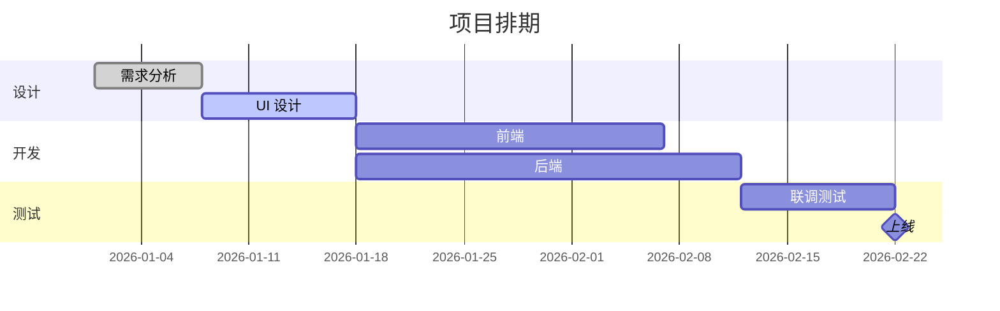

### Pie Chart

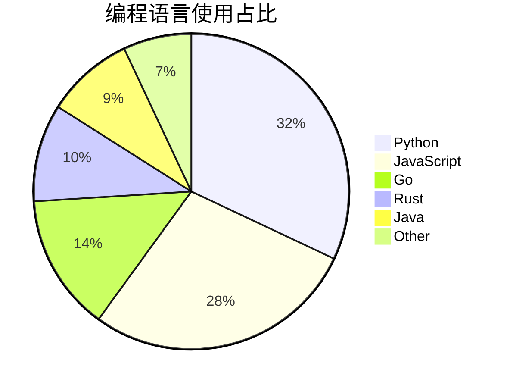

### Journey

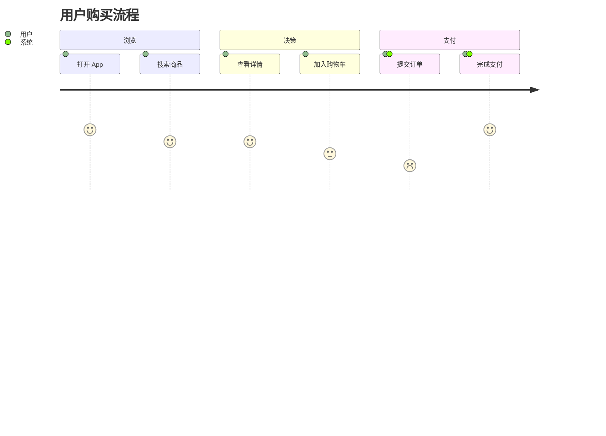

### Git Graph

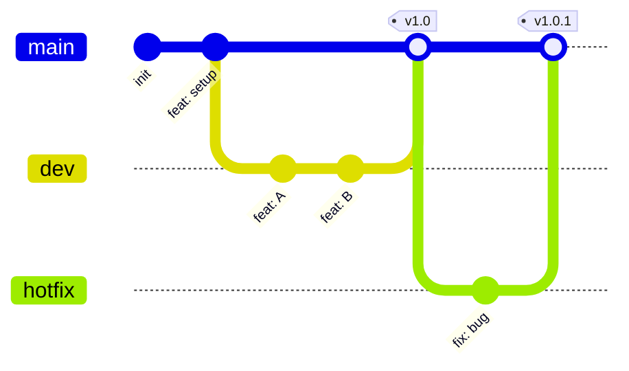

### Timeline

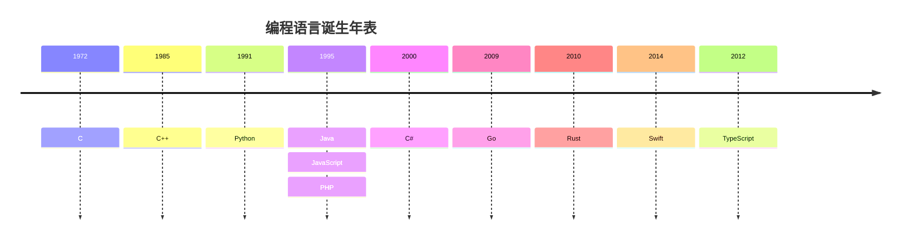

### Mindmap

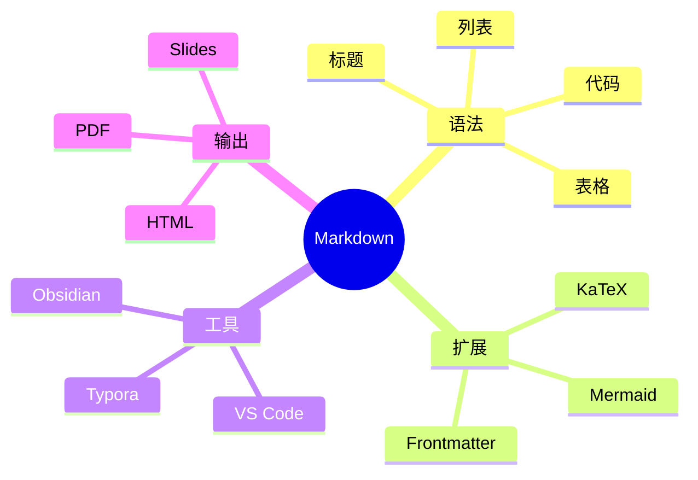

### Quadrant Chart

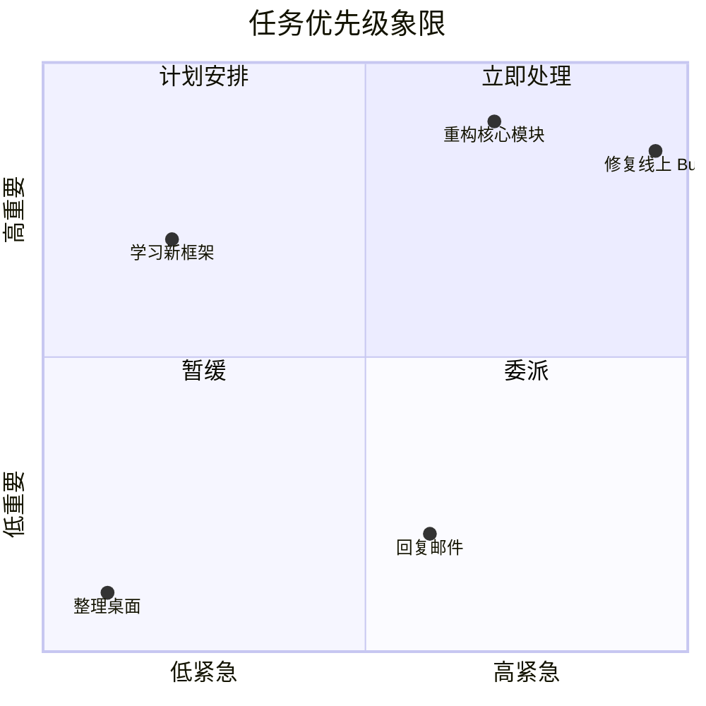

### Sankey Diagram

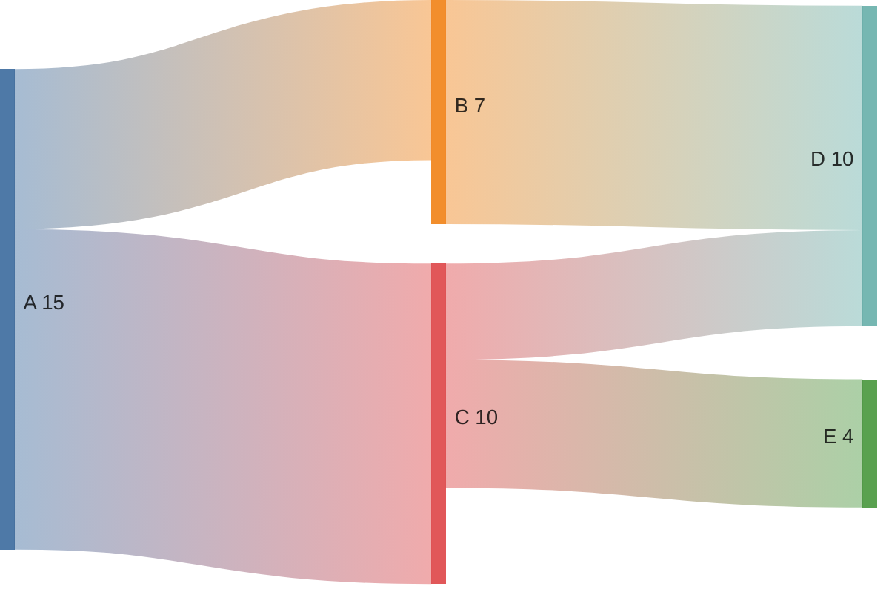

### Requirement Diagram

```mermaid
requirementDiagram
    requirement test_req {
      id: 1
      text: 系统应在 200ms 内响应
      risk: high
      verifymethod: test
    }
    element user_login {
      type: feature
    }
    user_login - satisfies -> test_req
```

### C4 Context

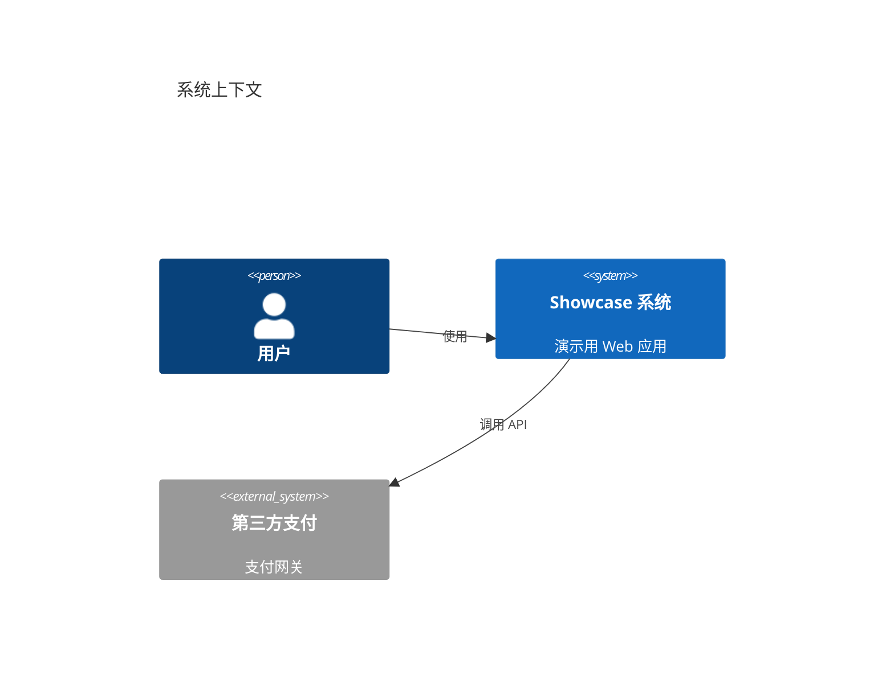

---

## 19. 代码示例集（多语言再演示）

**斐波那契生成器 — `python`**

```python
def fib_gen():
    a, b = 0, 1
    while True:
        yield a
        a, b = b, a + b
```

**Promise 链 — `javascript`**

```javascript
fetch('/api')
  .then(r => r.json())
  .then(d => console.log(d))
  .catch(e => console.error(e));
```

**泛型函数 — `typescript`**

```typescript
function identity<T>(x: T): T { return x; }
const n = identity<number>(42);
```

**trait + impl — `rust`**

```rust
trait Greet { fn hi(&self) -> String; }
struct W; impl Greet for W { fn hi(&self) -> String { "hi".into() } }
```

**goroutine — `go`**

```go
go func(){ for i := 0; i < 3; i++ { fmt.Println(i) } }()
```

**Stream API — `java`**

```java
list.stream().filter(x -> x > 0).mapToInt(Integer::intValue).sum();
```

**data class — `kotlin`**

```kotlin
data class User(val name: String, val age: Int)
```

**optional chaining — `swift`**

```swift
let len = user?.name?.count ?? 0
```

**指针 — `c`**

```c
int x = 10; int *p = &x; printf("%d\n", *p);
```

**lambda — `cpp`**

```cpp
auto add = [](int a, int b){ return a + b; };
```

**block — `ruby`**

```ruby
[1,2,3].each { |x| puts x * x }
```

**数组解构 — `php`**

```php
[$a, $b] = [1, 2];
```

**循环 — `bash`**

```bash
for f in *.md; do echo "$f"; done
```

**JOIN — `sql`**

```sql
SELECT u.id, COUNT(o.id) FROM users u LEFT JOIN orders o ON o.uid=u.id GROUP BY u.id;
```

**map — `haskell`**

```haskell
map (*2) [1..5] -- [2,4,6,8,10]
```

**case class — `scala`**

```scala
case class Point(x: Int, y: Int)
```

**向量化 — `r`**

```r
x <- 1:10; mean(x); sd(x)
```

**table — `lua`**

```lua
local t = {1,2,3}; for i,v in ipairs(t) do print(i,v) end
```

**管道 — `powershell`**

```powershell
Get-Process | Where-Object { $_.CPU -gt 100 } | Sort-Object CPU -Descending
```

---

## 20. 巨型语法循环演示（≥ 10000 行）

> 以下小节通过循环展开多个语法块来确保整个文档行数超过 10,000 行；
> 每个小节都用不同的 Markdown 语法组合展示，并间隔插入 Mermaid 图表。

### 20.1 样本块 #1 — 综合演示

这是第 **1** 个样本块，用于演示 *Markdown* 在大文档下的解析稳定性。包含粗体、斜体、`行内代码`、~~删除线~~、[链接](https://example.com/1) 与 emoji 🚀。

#### 列表
- 项目 A-1
- 项目 B-1
  - 子项 B1-1
  - 子项 B2-1
- 项目 C-1
1. 步骤 1 of block 1
2. 步骤 2 of block 1
3. 步骤 3 of block 1
- [x] 已完成的任务
- [ ] 待办任务

#### 表格
| ID | 名称 | 状态 | 描述 |
|---:|:----|:---:|:-----|
| 11 | item-1-1 | WARN | 描述-1-1 |
| 12 | item-1-2 | FAIL | 描述-1-2 |
| 13 | item-1-3 | INFO | 描述-1-3 |
| 14 | item-1-4 | OK | 描述-1-4 |

#### 代码
```python
# block #1
def handler_1(x):
    return x * 1 + 1
print(handler_1(1))
```

#### 引用
> 这是块 #1 中的引用文本。
> > 嵌套引用：value = 7

---

### 20.2 样本块 #2 — 综合演示

这是第 **2** 个样本块，用于演示 *Markdown* 在大文档下的解析稳定性。包含粗体、斜体、`行内代码`、~~删除线~~、[链接](https://example.com/2) 与 emoji 🚀。

#### 列表
- 项目 A-2
- 项目 B-2
  - 子项 B1-2
  - 子项 B2-2
- 项目 C-2
1. 步骤 1 of block 2
2. 步骤 2 of block 2
3. 步骤 3 of block 2
- [x] 已完成的任务
- [ ] 待办任务

#### 表格
| ID | 名称 | 状态 | 描述 |
|---:|:----|:---:|:-----|
| 21 | item-2-1 | WARN | 描述-2-1 |
| 22 | item-2-2 | FAIL | 描述-2-2 |
| 23 | item-2-3 | INFO | 描述-2-3 |
| 24 | item-2-4 | OK | 描述-2-4 |

#### 代码
```python
# block #2
def handler_2(x):
    return x * 2 + 4
print(handler_2(2))
```

#### 引用
> 这是块 #2 中的引用文本。
> > 嵌套引用：value = 14

---

### 20.3 样本块 #3 — 综合演示

这是第 **3** 个样本块，用于演示 *Markdown* 在大文档下的解析稳定性。包含粗体、斜体、`行内代码`、~~删除线~~、[链接](https://example.com/3) 与 emoji 🚀。

#### 列表
- 项目 A-3
- 项目 B-3
  - 子项 B1-3
  - 子项 B2-3
- 项目 C-3
1. 步骤 1 of block 3
2. 步骤 2 of block 3
3. 步骤 3 of block 3
- [x] 已完成的任务
- [ ] 待办任务

#### 表格
| ID | 名称 | 状态 | 描述 |
|---:|:----|:---:|:-----|
| 31 | item-3-1 | WARN | 描述-3-1 |
| 32 | item-3-2 | FAIL | 描述-3-2 |
| 33 | item-3-3 | INFO | 描述-3-3 |
| 34 | item-3-4 | OK | 描述-3-4 |

#### 代码
```python
# block #3
def handler_3(x):
    return x * 3 + 9
print(handler_3(3))
```

#### 引用
> 这是块 #3 中的引用文本。
> > 嵌套引用：value = 21

---

### 20.4 样本块 #4 — 综合演示

这是第 **4** 个样本块，用于演示 *Markdown* 在大文档下的解析稳定性。包含粗体、斜体、`行内代码`、~~删除线~~、[链接](https://example.com/4) 与 emoji 🚀。

#### 列表
- 项目 A-4
- 项目 B-4
  - 子项 B1-4
  - 子项 B2-4
- 项目 C-4
1. 步骤 1 of block 4
2. 步骤 2 of block 4
3. 步骤 3 of block 4
- [x] 已完成的任务
- [ ] 待办任务

#### 表格
| ID | 名称 | 状态 | 描述 |
|---:|:----|:---:|:-----|
| 41 | item-4-1 | WARN | 描述-4-1 |
| 42 | item-4-2 | FAIL | 描述-4-2 |
| 43 | item-4-3 | INFO | 描述-4-3 |
| 44 | item-4-4 | OK | 描述-4-4 |

#### 代码
```python
# block #4
def handler_4(x):
    return x * 4 + 16
print(handler_4(4))
```

#### 引用
> 这是块 #4 中的引用文本。
> > 嵌套引用：value = 28

---

### 20.5 样本块 #5 — 综合演示

这是第 **5** 个样本块，用于演示 *Markdown* 在大文档下的解析稳定性。包含粗体、斜体、`行内代码`、~~删除线~~、[链接](https://example.com/5) 与 emoji 🚀。

#### 列表
- 项目 A-5
- 项目 B-5
  - 子项 B1-5
  - 子项 B2-5
- 项目 C-5
1. 步骤 1 of block 5
2. 步骤 2 of block 5
3. 步骤 3 of block 5
- [x] 已完成的任务
- [ ] 待办任务

#### 表格
| ID | 名称 | 状态 | 描述 |
|---:|:----|:---:|:-----|
| 51 | item-5-1 | WARN | 描述-5-1 |
| 52 | item-5-2 | FAIL | 描述-5-2 |
| 53 | item-5-3 | INFO | 描述-5-3 |
| 54 | item-5-4 | OK | 描述-5-4 |

#### 代码
```python
# block #5
def handler_5(x):
    return x * 5 + 25
print(handler_5(5))
```

#### 引用
> 这是块 #5 中的引用文本。
> > 嵌套引用：value = 35

#### Mermaid 流程图
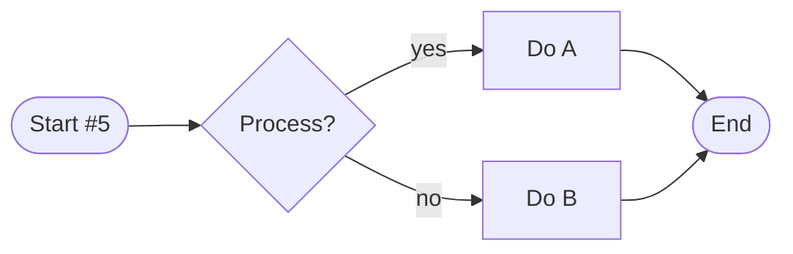

---

### 20.6 样本块 #6 — 综合演示

这是第 **6** 个样本块，用于演示 *Markdown* 在大文档下的解析稳定性。包含粗体、斜体、`行内代码`、~~删除线~~、[链接](https://example.com/6) 与 emoji 🚀。

#### 列表
- 项目 A-6
- 项目 B-6
  - 子项 B1-6
  - 子项 B2-6
- 项目 C-6
1. 步骤 1 of block 6
2. 步骤 2 of block 6
3. 步骤 3 of block 6
- [x] 已完成的任务
- [ ] 待办任务

#### 表格
| ID | 名称 | 状态 | 描述 |
|---:|:----|:---:|:-----|
| 61 | item-6-1 | WARN | 描述-6-1 |
| 62 | item-6-2 | FAIL | 描述-6-2 |
| 63 | item-6-3 | INFO | 描述-6-3 |
| 64 | item-6-4 | OK | 描述-6-4 |

#### 代码
```python
# block #6
def handler_6(x):
    return x * 6 + 36
print(handler_6(6))
```

#### 引用
> 这是块 #6 中的引用文本。
> > 嵌套引用：value = 42

---

### 20.7 样本块 #7 — 综合演示

这是第 **7** 个样本块，用于演示 *Markdown* 在大文档下的解析稳定性。包含粗体、斜体、`行内代码`、~~删除线~~、[链接](https://example.com/7) 与 emoji 🚀。

#### 列表
- 项目 A-7
- 项目 B-7
  - 子项 B1-7
  - 子项 B2-7
- 项目 C-7
1. 步骤 1 of block 7
2. 步骤 2 of block 7
3. 步骤 3 of block 7
- [x] 已完成的任务
- [ ] 待办任务

#### 表格
| ID | 名称 | 状态 | 描述 |
|---:|:----|:---:|:-----|
| 71 | item-7-1 | WARN | 描述-7-1 |
| 72 | item-7-2 | FAIL | 描述-7-2 |
| 73 | item-7-3 | INFO | 描述-7-3 |
| 74 | item-7-4 | OK | 描述-7-4 |

#### 代码
```python
# block #7
def handler_7(x):
    return x * 7 + 49
print(handler_7(7))
```

#### 引用
> 这是块 #7 中的引用文本。
> > 嵌套引用：value = 49

#### 数学公式
$$
f_{7}(x) = \sum_{k=1}^{7} \frac{x^k}{k!}
$$

---

### 20.8 样本块 #8 — 综合演示

这是第 **8** 个样本块，用于演示 *Markdown* 在大文档下的解析稳定性。包含粗体、斜体、`行内代码`、~~删除线~~、[链接](https://example.com/8) 与 emoji 🚀。

#### 列表
- 项目 A-8
- 项目 B-8
  - 子项 B1-8
  - 子项 B2-8
- 项目 C-8
1. 步骤 1 of block 8
2. 步骤 2 of block 8
3. 步骤 3 of block 8
- [x] 已完成的任务
- [ ] 待办任务

#### 表格
| ID | 名称 | 状态 | 描述 |
|---:|:----|:---:|:-----|
| 81 | item-8-1 | WARN | 描述-8-1 |
| 82 | item-8-2 | FAIL | 描述-8-2 |
| 83 | item-8-3 | INFO | 描述-8-3 |
| 84 | item-8-4 | OK | 描述-8-4 |

#### 代码
```python
# block #8
def handler_8(x):
    return x * 8 + 64
print(handler_8(8))
```

#### 引用
> 这是块 #8 中的引用文本。
> > 嵌套引用：value = 56

---

### 20.9 样本块 #9 — 综合演示

这是第 **9** 个样本块，用于演示 *Markdown* 在大文档下的解析稳定性。包含粗体、斜体、`行内代码`、~~删除线~~、[链接](https://example.com/9) 与 emoji 🚀。

#### 列表
- 项目 A-9
- 项目 B-9
  - 子项 B1-9
  - 子项 B2-9
- 项目 C-9
1. 步骤 1 of block 9
2. 步骤 2 of block 9
3. 步骤 3 of block 9
- [x] 已完成的任务
- [ ] 待办任务

#### 表格
| ID | 名称 | 状态 | 描述 |
|---:|:----|:---:|:-----|
| 91 | item-9-1 | WARN | 描述-9-1 |
| 92 | item-9-2 | FAIL | 描述-9-2 |
| 93 | item-9-3 | INFO | 描述-9-3 |
| 94 | item-9-4 | OK | 描述-9-4 |

#### 代码
```python
# block #9
def handler_9(x):
    return x * 9 + 81
print(handler_9(9))
```

#### 引用
> 这是块 #9 中的引用文本。
> > 嵌套引用：value = 63

---

### 20.10 样本块 #10 — 综合演示

这是第 **10** 个样本块，用于演示 *Markdown* 在大文档下的解析稳定性。包含粗体、斜体、`行内代码`、~~删除线~~、[链接](https://example.com/10) 与 emoji 🚀。

#### 列表
- 项目 A-10
- 项目 B-10
  - 子项 B1-10
  - 子项 B2-10
- 项目 C-10
1. 步骤 1 of block 10
2. 步骤 2 of block 10
3. 步骤 3 of block 10
- [x] 已完成的任务
- [ ] 待办任务

#### 表格
| ID | 名称 | 状态 | 描述 |
|---:|:----|:---:|:-----|
| 101 | item-10-1 | WARN | 描述-10-1 |
| 102 | item-10-2 | FAIL | 描述-10-2 |
| 103 | item-10-3 | INFO | 描述-10-3 |
| 104 | item-10-4 | OK | 描述-10-4 |

#### 代码
```python
# block #10
def handler_10(x):
    return x * 10 + 100
print(handler_10(10))
```

#### 引用
> 这是块 #10 中的引用文本。
> > 嵌套引用：value = 70

#### Mermaid 流程图
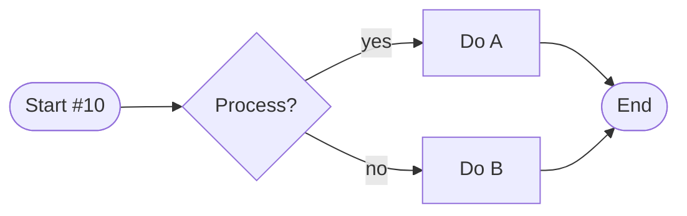

---

### 20.11 样本块 #11 — 综合演示

这是第 **11** 个样本块，用于演示 *Markdown* 在大文档下的解析稳定性。包含粗体、斜体、`行内代码`、~~删除线~~、[链接](https://example.com/11) 与 emoji 🚀。

#### 列表
- 项目 A-11
- 项目 B-11
  - 子项 B1-11
  - 子项 B2-11
- 项目 C-11
1. 步骤 1 of block 11
2. 步骤 2 of block 11
3. 步骤 3 of block 11
- [x] 已完成的任务
- [ ] 待办任务

#### 表格
| ID | 名称 | 状态 | 描述 |
|---:|:----|:---:|:-----|
| 111 | item-11-1 | WARN | 描述-11-1 |
| 112 | item-11-2 | FAIL | 描述-11-2 |
| 113 | item-11-3 | INFO | 描述-11-3 |
| 114 | item-11-4 | OK | 描述-11-4 |

#### 代码
```python
# block #11
def handler_11(x):
    return x * 11 + 121
print(handler_11(11))
```

#### 引用
> 这是块 #11 中的引用文本。
> > 嵌套引用：value = 77

#### 定义
Term-11
:  这是第 11 个术语的定义。包含 *斜体* 与 **粗体**。

---

### 20.12 样本块 #12 — 综合演示

这是第 **12** 个样本块，用于演示 *Markdown* 在大文档下的解析稳定性。包含粗体、斜体、`行内代码`、~~删除线~~、[链接](https://example.com/12) 与 emoji 🚀。

#### 列表
- 项目 A-12
- 项目 B-12
  - 子项 B1-12
  - 子项 B2-12
- 项目 C-12
1. 步骤 1 of block 12
2. 步骤 2 of block 12
3. 步骤 3 of block 12
- [x] 已完成的任务
- [ ] 待办任务

#### 表格
| ID | 名称 | 状态 | 描述 |
|---:|:----|:---:|:-----|
| 121 | item-12-1 | WARN | 描述-12-1 |
| 122 | item-12-2 | FAIL | 描述-12-2 |
| 123 | item-12-3 | INFO | 描述-12-3 |
| 124 | item-12-4 | OK | 描述-12-4 |

#### 代码
```python
# block #12
def handler_12(x):
    return x * 12 + 144
print(handler_12(12))
```

#### 引用
> 这是块 #12 中的引用文本。
> > 嵌套引用：value = 84

---

### 20.13 样本块 #13 — 综合演示

这是第 **13** 个样本块，用于演示 *Markdown* 在大文档下的解析稳定性。包含粗体、斜体、`行内代码`、~~删除线~~、[链接](https://example.com/13) 与 emoji 🚀。

#### 列表
- 项目 A-13
- 项目 B-13
  - 子项 B1-13
  - 子项 B2-13
- 项目 C-13
1. 步骤 1 of block 13
2. 步骤 2 of block 13
3. 步骤 3 of block 13
- [x] 已完成的任务
- [ ] 待办任务

#### 表格
| ID | 名称 | 状态 | 描述 |
|---:|:----|:---:|:-----|
| 131 | item-13-1 | WARN | 描述-13-1 |
| 132 | item-13-2 | FAIL | 描述-13-2 |
| 133 | item-13-3 | INFO | 描述-13-3 |
| 134 | item-13-4 | OK | 描述-13-4 |

#### 代码
```python
# block #13
def handler_13(x):
    return x * 13 + 169
print(handler_13(13))
```

#### 引用
> 这是块 #13 中的引用文本。
> > 嵌套引用：value = 91

<details>
<summary>📦 折叠详情 #13</summary>

隐藏内容 — 块 13

```bash
echo 'hidden-13'
```

</details>

---

### 20.14 样本块 #14 — 综合演示

这是第 **14** 个样本块，用于演示 *Markdown* 在大文档下的解析稳定性。包含粗体、斜体、`行内代码`、~~删除线~~、[链接](https://example.com/14) 与 emoji 🚀。

#### 列表
- 项目 A-14
- 项目 B-14
  - 子项 B1-14
  - 子项 B2-14
- 项目 C-14
1. 步骤 1 of block 14
2. 步骤 2 of block 14
3. 步骤 3 of block 14
- [x] 已完成的任务
- [ ] 待办任务

#### 表格
| ID | 名称 | 状态 | 描述 |
|---:|:----|:---:|:-----|
| 141 | item-14-1 | WARN | 描述-14-1 |
| 142 | item-14-2 | FAIL | 描述-14-2 |
| 143 | item-14-3 | INFO | 描述-14-3 |
| 144 | item-14-4 | OK | 描述-14-4 |

#### 代码
```python
# block #14
def handler_14(x):
    return x * 14 + 196
print(handler_14(14))
```

#### 引用
> 这是块 #14 中的引用文本。
> > 嵌套引用：value = 98

#### 数学公式
$$
f_{14}(x) = \sum_{k=1}^{14} \frac{x^k}{k!}
$$

---

### 20.15 样本块 #15 — 综合演示

这是第 **15** 个样本块，用于演示 *Markdown* 在大文档下的解析稳定性。包含粗体、斜体、`行内代码`、~~删除线~~、[链接](https://example.com/15) 与 emoji 🚀。

#### 列表
- 项目 A-15
- 项目 B-15
  - 子项 B1-15
  - 子项 B2-15
- 项目 C-15
1. 步骤 1 of block 15
2. 步骤 2 of block 15
3. 步骤 3 of block 15
- [x] 已完成的任务
- [ ] 待办任务

#### 表格
| ID | 名称 | 状态 | 描述 |
|---:|:----|:---:|:-----|
| 151 | item-15-1 | WARN | 描述-15-1 |
| 152 | item-15-2 | FAIL | 描述-15-2 |
| 153 | item-15-3 | INFO | 描述-15-3 |
| 154 | item-15-4 | OK | 描述-15-4 |

#### 代码
```python
# block #15
def handler_15(x):
    return x * 15 + 225
print(handler_15(15))
```

#### 引用
> 这是块 #15 中的引用文本。
> > 嵌套引用：value = 105

#### Mermaid 流程图


---

### 20.16 样本块 #16 — 综合演示

这是第 **16** 个样本块，用于演示 *Markdown* 在大文档下的解析稳定性。包含粗体、斜体、`行内代码`、~~删除线~~、[链接](https://example.com/16) 与 emoji 🚀。

#### 列表
- 项目 A-16
- 项目 B-16
  - 子项 B1-16
  - 子项 B2-16
- 项目 C-16
1. 步骤 1 of block 16
2. 步骤 2 of block 16
3. 步骤 3 of block 16
- [x] 已完成的任务
- [ ] 待办任务

#### 表格
| ID | 名称 | 状态 | 描述 |
|---:|:----|:---:|:-----|
| 161 | item-16-1 | WARN | 描述-16-1 |
| 162 | item-16-2 | FAIL | 描述-16-2 |
| 163 | item-16-3 | INFO | 描述-16-3 |
| 164 | item-16-4 | OK | 描述-16-4 |

#### 代码
```python
# block #16
def handler_16(x):
    return x * 16 + 256
print(handler_16(16))
```

#### 引用
> 这是块 #16 中的引用文本。
> > 嵌套引用：value = 112

---

### 20.17 样本块 #17 — 综合演示

这是第 **17** 个样本块，用于演示 *Markdown* 在大文档下的解析稳定性。包含粗体、斜体、`行内代码`、~~删除线~~、[链接](https://example.com/17) 与 emoji 🚀。

#### 列表
- 项目 A-17
- 项目 B-17
  - 子项 B1-17
  - 子项 B2-17
- 项目 C-17
1. 步骤 1 of block 17
2. 步骤 2 of block 17
3. 步骤 3 of block 17
- [x] 已完成的任务
- [ ] 待办任务

#### 表格
| ID | 名称 | 状态 | 描述 |
|---:|:----|:---:|:-----|
| 171 | item-17-1 | WARN | 描述-17-1 |
| 172 | item-17-2 | FAIL | 描述-17-2 |
| 173 | item-17-3 | INFO | 描述-17-3 |
| 174 | item-17-4 | OK | 描述-17-4 |

#### 代码
```python
# block #17
def handler_17(x):
    return x * 17 + 289
print(handler_17(17))
```

#### 引用
> 这是块 #17 中的引用文本。
> > 嵌套引用：value = 119

---

### 20.18 样本块 #18 — 综合演示

这是第 **18** 个样本块，用于演示 *Markdown* 在大文档下的解析稳定性。包含粗体、斜体、`行内代码`、~~删除线~~、[链接](https://example.com/18) 与 emoji 🚀。

#### 列表
- 项目 A-18
- 项目 B-18
  - 子项 B1-18
  - 子项 B2-18
- 项目 C-18
1. 步骤 1 of block 18
2. 步骤 2 of block 18
3. 步骤 3 of block 18
- [x] 已完成的任务
- [ ] 待办任务

#### 表格
| ID | 名称 | 状态 | 描述 |
|---:|:----|:---:|:-----|
| 181 | item-18-1 | WARN | 描述-18-1 |
| 182 | item-18-2 | FAIL | 描述-18-2 |
| 183 | item-18-3 | INFO | 描述-18-3 |
| 184 | item-18-4 | OK | 描述-18-4 |

#### 代码
```python
# block #18
def handler_18(x):
    return x * 18 + 324
print(handler_18(18))
```

#### 引用
> 这是块 #18 中的引用文本。
> > 嵌套引用：value = 126

---

### 20.19 样本块 #19 — 综合演示

这是第 **19** 个样本块，用于演示 *Markdown* 在大文档下的解析稳定性。包含粗体、斜体、`行内代码`、~~删除线~~、[链接](https://example.com/19) 与 emoji 🚀。

#### 列表
- 项目 A-19
- 项目 B-19
  - 子项 B1-19
  - 子项 B2-19
- 项目 C-19
1. 步骤 1 of block 19
2. 步骤 2 of block 19
3. 步骤 3 of block 19
- [x] 已完成的任务
- [ ] 待办任务

#### 表格
| ID | 名称 | 状态 | 描述 |
|---:|:----|:---:|:-----|
| 191 | item-19-1 | WARN | 描述-19-1 |
| 192 | item-19-2 | FAIL | 描述-19-2 |
| 193 | item-19-3 | INFO | 描述-19-3 |
| 194 | item-19-4 | OK | 描述-19-4 |

#### 代码
```python
# block #19
def handler_19(x):
    return x * 19 + 361
print(handler_19(19))
```

#### 引用
> 这是块 #19 中的引用文本。
> > 嵌套引用：value = 133

---

### 20.20 样本块 #20 — 综合演示

这是第 **20** 个样本块，用于演示 *Markdown* 在大文档下的解析稳定性。包含粗体、斜体、`行内代码`、~~删除线~~、[链接](https://example.com/20) 与 emoji 🚀。

#### 列表
- 项目 A-20
- 项目 B-20
  - 子项 B1-20
  - 子项 B2-20
- 项目 C-20
1. 步骤 1 of block 20
2. 步骤 2 of block 20
3. 步骤 3 of block 20
- [x] 已完成的任务
- [ ] 待办任务

#### 表格
| ID | 名称 | 状态 | 描述 |
|---:|:----|:---:|:-----|
| 201 | item-20-1 | WARN | 描述-20-1 |
| 202 | item-20-2 | FAIL | 描述-20-2 |
| 203 | item-20-3 | INFO | 描述-20-3 |
| 204 | item-20-4 | OK | 描述-20-4 |

#### 代码
```python
# block #20
def handler_20(x):
    return x * 20 + 400
print(handler_20(20))
```

#### 引用
> 这是块 #20 中的引用文本。
> > 嵌套引用：value = 140

#### Mermaid 流程图
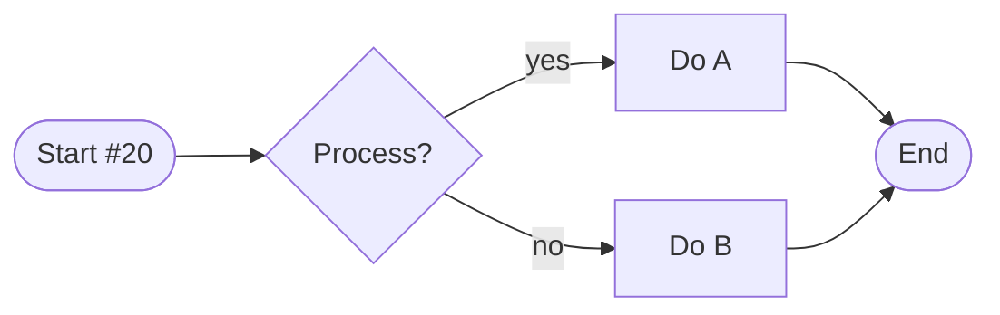

---

### 20.21 样本块 #21 — 综合演示

这是第 **21** 个样本块，用于演示 *Markdown* 在大文档下的解析稳定性。包含粗体、斜体、`行内代码`、~~删除线~~、[链接](https://example.com/21) 与 emoji 🚀。

#### 列表
- 项目 A-21
- 项目 B-21
  - 子项 B1-21
  - 子项 B2-21
- 项目 C-21
1. 步骤 1 of block 21
2. 步骤 2 of block 21
3. 步骤 3 of block 21
- [x] 已完成的任务
- [ ] 待办任务

#### 表格
| ID | 名称 | 状态 | 描述 |
|---:|:----|:---:|:-----|
| 211 | item-21-1 | WARN | 描述-21-1 |
| 212 | item-21-2 | FAIL | 描述-21-2 |
| 213 | item-21-3 | INFO | 描述-21-3 |
| 214 | item-21-4 | OK | 描述-21-4 |

#### 代码
```python
# block #21
def handler_21(x):
    return x * 21 + 441
print(handler_21(21))
```

#### 引用
> 这是块 #21 中的引用文本。
> > 嵌套引用：value = 147

#### 数学公式
$$
f_{21}(x) = \sum_{k=1}^{21} \frac{x^k}{k!}
$$

---

### 20.22 样本块 #22 — 综合演示

这是第 **22** 个样本块，用于演示 *Markdown* 在大文档下的解析稳定性。包含粗体、斜体、`行内代码`、~~删除线~~、[链接](https://example.com/22) 与 emoji 🚀。

#### 列表
- 项目 A-22
- 项目 B-22
  - 子项 B1-22
  - 子项 B2-22
- 项目 C-22
1. 步骤 1 of block 22
2. 步骤 2 of block 22
3. 步骤 3 of block 22
- [x] 已完成的任务
- [ ] 待办任务

#### 表格
| ID | 名称 | 状态 | 描述 |
|---:|:----|:---:|:-----|
| 221 | item-22-1 | WARN | 描述-22-1 |
| 222 | item-22-2 | FAIL | 描述-22-2 |
| 223 | item-22-3 | INFO | 描述-22-3 |
| 224 | item-22-4 | OK | 描述-22-4 |

#### 代码
```python
# block #22
def handler_22(x):
    return x * 22 + 484
print(handler_22(22))
```

#### 引用
> 这是块 #22 中的引用文本。
> > 嵌套引用：value = 154

#### 定义
Term-22
:  这是第 22 个术语的定义。包含 *斜体* 与 **粗体**。

---

### 20.23 样本块 #23 — 综合演示

这是第 **23** 个样本块，用于演示 *Markdown* 在大文档下的解析稳定性。包含粗体、斜体、`行内代码`、~~删除线~~、[链接](https://example.com/23) 与 emoji 🚀。

#### 列表
- 项目 A-23
- 项目 B-23
  - 子项 B1-23
  - 子项 B2-23
- 项目 C-23
1. 步骤 1 of block 23
2. 步骤 2 of block 23
3. 步骤 3 of block 23
- [x] 已完成的任务
- [ ] 待办任务

#### 表格
| ID | 名称 | 状态 | 描述 |
|---:|:----|:---:|:-----|
| 231 | item-23-1 | WARN | 描述-23-1 |
| 232 | item-23-2 | FAIL | 描述-23-2 |
| 233 | item-23-3 | INFO | 描述-23-3 |
| 234 | item-23-4 | OK | 描述-23-4 |

#### 代码
```python
# block #23
def handler_23(x):
    return x * 23 + 529
print(handler_23(23))
```

#### 引用
> 这是块 #23 中的引用文本。
> > 嵌套引用：value = 161

---

### 20.24 样本块 #24 — 综合演示

这是第 **24** 个样本块，用于演示 *Markdown* 在大文档下的解析稳定性。包含粗体、斜体、`行内代码`、~~删除线~~、[链接](https://example.com/24) 与 emoji 🚀。

#### 列表
- 项目 A-24
- 项目 B-24
  - 子项 B1-24
  - 子项 B2-24
- 项目 C-24
1. 步骤 1 of block 24
2. 步骤 2 of block 24
3. 步骤 3 of block 24
- [x] 已完成的任务
- [ ] 待办任务

#### 表格
| ID | 名称 | 状态 | 描述 |
|---:|:----|:---:|:-----|
| 241 | item-24-1 | WARN | 描述-24-1 |
| 242 | item-24-2 | FAIL | 描述-24-2 |
| 243 | item-24-3 | INFO | 描述-24-3 |
| 244 | item-24-4 | OK | 描述-24-4 |

#### 代码
```python
# block #24
def handler_24(x):
    return x * 24 + 576
print(handler_24(24))
```

#### 引用
> 这是块 #24 中的引用文本。
> > 嵌套引用：value = 168

---

### 20.25 样本块 #25 — 综合演示

这是第 **25** 个样本块，用于演示 *Markdown* 在大文档下的解析稳定性。包含粗体、斜体、`行内代码`、~~删除线~~、[链接](https://example.com/25) 与 emoji 🚀。

#### 列表
- 项目 A-25
- 项目 B-25
  - 子项 B1-25
  - 子项 B2-25
- 项目 C-25
1. 步骤 1 of block 25
2. 步骤 2 of block 25
3. 步骤 3 of block 25
- [x] 已完成的任务
- [ ] 待办任务

#### 表格
| ID | 名称 | 状态 | 描述 |
|---:|:----|:---:|:-----|
| 251 | item-25-1 | WARN | 描述-25-1 |
| 252 | item-25-2 | FAIL | 描述-25-2 |
| 253 | item-25-3 | INFO | 描述-25-3 |
| 254 | item-25-4 | OK | 描述-25-4 |

#### 代码
```python
# block #25
def handler_25(x):
    return x * 25 + 625
print(handler_25(25))
```

#### 引用
> 这是块 #25 中的引用文本。
> > 嵌套引用：value = 175

#### Mermaid 流程图
```mermaid
flowchart LR
    S25([Start #25]) --> P25{Process?}
    P25 -- yes --> A25[Do A]
    P25 -- no  --> B25[Do B]
    A25 --> E25([End])
    B25 --> E25
```

---

### 20.26 样本块 #26 — 综合演示

这是第 **26** 个样本块，用于演示 *Markdown* 在大文档下的解析稳定性。包含粗体、斜体、`行内代码`、~~删除线~~、[链接](https://example.com/26) 与 emoji 🚀。

#### 列表
- 项目 A-26
- 项目 B-26
  - 子项 B1-26
  - 子项 B2-26
- 项目 C-26
1. 步骤 1 of block 26
2. 步骤 2 of block 26
3. 步骤 3 of block 26
- [x] 已完成的任务
- [ ] 待办任务

#### 表格
| ID | 名称 | 状态 | 描述 |
|---:|:----|:---:|:-----|
| 261 | item-26-1 | WARN | 描述-26-1 |
| 262 | item-26-2 | FAIL | 描述-26-2 |
| 263 | item-26-3 | INFO | 描述-26-3 |
| 264 | item-26-4 | OK | 描述-26-4 |

#### 代码
```python
# block #26
def handler_26(x):
    return x * 26 + 676
print(handler_26(26))
```

#### 引用
> 这是块 #26 中的引用文本。
> > 嵌套引用：value = 182

<details>
<summary>📦 折叠详情 #26</summary>

隐藏内容 — 块 26

```bash
echo 'hidden-26'
```

</details>

---

### 20.27 样本块 #27 — 综合演示

这是第 **27** 个样本块，用于演示 *Markdown* 在大文档下的解析稳定性。包含粗体、斜体、`行内代码`、~~删除线~~、[链接](https://example.com/27) 与 emoji 🚀。

#### 列表
- 项目 A-27
- 项目 B-27
  - 子项 B1-27
  - 子项 B2-27
- 项目 C-27
1. 步骤 1 of block 27
2. 步骤 2 of block 27
3. 步骤 3 of block 27
- [x] 已完成的任务
- [ ] 待办任务

#### 表格
| ID | 名称 | 状态 | 描述 |
|---:|:----|:---:|:-----|
| 271 | item-27-1 | WARN | 描述-27-1 |
| 272 | item-27-2 | FAIL | 描述-27-2 |
| 273 | item-27-3 | INFO | 描述-27-3 |
| 274 | item-27-4 | OK | 描述-27-4 |

#### 代码
```python
# block #27
def handler_27(x):
    return x * 27 + 729
print(handler_27(27))
```

#### 引用
> 这是块 #27 中的引用文本。
> > 嵌套引用：value = 189

---

### 20.28 样本块 #28 — 综合演示

这是第 **28** 个样本块，用于演示 *Markdown* 在大文档下的解析稳定性。包含粗体、斜体、`行内代码`、~~删除线~~、[链接](https://example.com/28) 与 emoji 🚀。

#### 列表
- 项目 A-28
- 项目 B-28
  - 子项 B1-28
  - 子项 B2-28
- 项目 C-28
1. 步骤 1 of block 28
2. 步骤 2 of block 28
3. 步骤 3 of block 28
- [x] 已完成的任务
- [ ] 待办任务

#### 表格
| ID | 名称 | 状态 | 描述 |
|---:|:----|:---:|:-----|
| 281 | item-28-1 | WARN | 描述-28-1 |
| 282 | item-28-2 | FAIL | 描述-28-2 |
| 283 | item-28-3 | INFO | 描述-28-3 |
| 284 | item-28-4 | OK | 描述-28-4 |

#### 代码
```python
# block #28
def handler_28(x):
    return x * 28 + 784
print(handler_28(28))
```

#### 引用
> 这是块 #28 中的引用文本。
> > 嵌套引用：value = 196

#### 数学公式
$$
f_{28}(x) = \sum_{k=1}^{28} \frac{x^k}{k!}
$$

---

### 20.29 样本块 #29 — 综合演示

这是第 **29** 个样本块，用于演示 *Markdown* 在大文档下的解析稳定性。包含粗体、斜体、`行内代码`、~~删除线~~、[链接](https://example.com/29) 与 emoji 🚀。

#### 列表
- 项目 A-29
- 项目 B-29
  - 子项 B1-29
  - 子项 B2-29
- 项目 C-29
1. 步骤 1 of block 29
2. 步骤 2 of block 29
3. 步骤 3 of block 29
- [x] 已完成的任务
- [ ] 待办任务

#### 表格
| ID | 名称 | 状态 | 描述 |
|---:|:----|:---:|:-----|
| 291 | item-29-1 | WARN | 描述-29-1 |
| 292 | item-29-2 | FAIL | 描述-29-2 |
| 293 | item-29-3 | INFO | 描述-29-3 |
| 294 | item-29-4 | OK | 描述-29-4 |

#### 代码
```python
# block #29
def handler_29(x):
    return x * 29 + 841
print(handler_29(29))
```

#### 引用
> 这是块 #29 中的引用文本。
> > 嵌套引用：value = 203

---

### 20.30 样本块 #30 — 综合演示

这是第 **30** 个样本块，用于演示 *Markdown* 在大文档下的解析稳定性。包含粗体、斜体、`行内代码`、~~删除线~~、[链接](https://example.com/30) 与 emoji 🚀。

#### 列表
- 项目 A-30
- 项目 B-30
  - 子项 B1-30
  - 子项 B2-30
- 项目 C-30
1. 步骤 1 of block 30
2. 步骤 2 of block 30
3. 步骤 3 of block 30
- [x] 已完成的任务
- [ ] 待办任务

#### 表格
| ID | 名称 | 状态 | 描述 |
|---:|:----|:---:|:-----|
| 301 | item-30-1 | WARN | 描述-30-1 |
| 302 | item-30-2 | FAIL | 描述-30-2 |
| 303 | item-30-3 | INFO | 描述-30-3 |
| 304 | item-30-4 | OK | 描述-30-4 |

#### 代码
```python
# block #30
def handler_30(x):
    return x * 30 + 900
print(handler_30(30))
```

#### 引用
> 这是块 #30 中的引用文本。
> > 嵌套引用：value = 210

#### Mermaid 流程图
```mermaid
flowchart LR
    S30([Start #30]) --> P30{Process?}
    P30 -- yes --> A30[Do A]
    P30 -- no  --> B30[Do B]
    A30 --> E30([End])
    B30 --> E30
```

---

### 20.31 样本块 #31 — 综合演示

这是第 **31** 个样本块，用于演示 *Markdown* 在大文档下的解析稳定性。包含粗体、斜体、`行内代码`、~~删除线~~、[链接](https://example.com/31) 与 emoji 🚀。

#### 列表
- 项目 A-31
- 项目 B-31
  - 子项 B1-31
  - 子项 B2-31
- 项目 C-31
1. 步骤 1 of block 31
2. 步骤 2 of block 31
3. 步骤 3 of block 31
- [x] 已完成的任务
- [ ] 待办任务

#### 表格
| ID | 名称 | 状态 | 描述 |
|---:|:----|:---:|:-----|
| 311 | item-31-1 | WARN | 描述-31-1 |
| 312 | item-31-2 | FAIL | 描述-31-2 |
| 313 | item-31-3 | INFO | 描述-31-3 |
| 314 | item-31-4 | OK | 描述-31-4 |

#### 代码
```python
# block #31
def handler_31(x):
    return x * 31 + 961
print(handler_31(31))
```

#### 引用
> 这是块 #31 中的引用文本。
> > 嵌套引用：value = 217

---

### 20.32 样本块 #32 — 综合演示

这是第 **32** 个样本块，用于演示 *Markdown* 在大文档下的解析稳定性。包含粗体、斜体、`行内代码`、~~删除线~~、[链接](https://example.com/32) 与 emoji 🚀。

#### 列表
- 项目 A-32
- 项目 B-32
  - 子项 B1-32
  - 子项 B2-32
- 项目 C-32
1. 步骤 1 of block 32
2. 步骤 2 of block 32
3. 步骤 3 of block 32
- [x] 已完成的任务
- [ ] 待办任务

#### 表格
| ID | 名称 | 状态 | 描述 |
|---:|:----|:---:|:-----|
| 321 | item-32-1 | WARN | 描述-32-1 |
| 322 | item-32-2 | FAIL | 描述-32-2 |
| 323 | item-32-3 | INFO | 描述-32-3 |
| 324 | item-32-4 | OK | 描述-32-4 |

#### 代码
```python
# block #32
def handler_32(x):
    return x * 32 + 1024
print(handler_32(32))
```

#### 引用
> 这是块 #32 中的引用文本。
> > 嵌套引用：value = 224

---

### 20.33 样本块 #33 — 综合演示

这是第 **33** 个样本块，用于演示 *Markdown* 在大文档下的解析稳定性。包含粗体、斜体、`行内代码`、~~删除线~~、[链接](https://example.com/33) 与 emoji 🚀。

#### 列表
- 项目 A-33
- 项目 B-33
  - 子项 B1-33
  - 子项 B2-33
- 项目 C-33
1. 步骤 1 of block 33
2. 步骤 2 of block 33
3. 步骤 3 of block 33
- [x] 已完成的任务
- [ ] 待办任务

#### 表格
| ID | 名称 | 状态 | 描述 |
|---:|:----|:---:|:-----|
| 331 | item-33-1 | WARN | 描述-33-1 |
| 332 | item-33-2 | FAIL | 描述-33-2 |
| 333 | item-33-3 | INFO | 描述-33-3 |
| 334 | item-33-4 | OK | 描述-33-4 |

#### 代码
```python
# block #33
def handler_33(x):
    return x * 33 + 1089
print(handler_33(33))
```

#### 引用
> 这是块 #33 中的引用文本。
> > 嵌套引用：value = 231

#### 定义
Term-33
:  这是第 33 个术语的定义。包含 *斜体* 与 **粗体**。

---

### 20.34 样本块 #34 — 综合演示

这是第 **34** 个样本块，用于演示 *Markdown* 在大文档下的解析稳定性。包含粗体、斜体、`行内代码`、~~删除线~~、[链接](https://example.com/34) 与 emoji 🚀。

#### 列表
- 项目 A-34
- 项目 B-34
  - 子项 B1-34
  - 子项 B2-34
- 项目 C-34
1. 步骤 1 of block 34
2. 步骤 2 of block 34
3. 步骤 3 of block 34
- [x] 已完成的任务
- [ ] 待办任务

#### 表格
| ID | 名称 | 状态 | 描述 |
|---:|:----|:---:|:-----|
| 341 | item-34-1 | WARN | 描述-34-1 |
| 342 | item-34-2 | FAIL | 描述-34-2 |
| 343 | item-34-3 | INFO | 描述-34-3 |
| 344 | item-34-4 | OK | 描述-34-4 |

#### 代码
```python
# block #34
def handler_34(x):
    return x * 34 + 1156
print(handler_34(34))
```

#### 引用
> 这是块 #34 中的引用文本。
> > 嵌套引用：value = 238

---

### 20.35 样本块 #35 — 综合演示

这是第 **35** 个样本块，用于演示 *Markdown* 在大文档下的解析稳定性。包含粗体、斜体、`行内代码`、~~删除线~~、[链接](https://example.com/35) 与 emoji 🚀。

#### 列表
- 项目 A-35
- 项目 B-35
  - 子项 B1-35
  - 子项 B2-35
- 项目 C-35
1. 步骤 1 of block 35
2. 步骤 2 of block 35
3. 步骤 3 of block 35
- [x] 已完成的任务
- [ ] 待办任务

#### 表格
| ID | 名称 | 状态 | 描述 |
|---:|:----|:---:|:-----|
| 351 | item-35-1 | WARN | 描述-35-1 |
| 352 | item-35-2 | FAIL | 描述-35-2 |
| 353 | item-35-3 | INFO | 描述-35-3 |
| 354 | item-35-4 | OK | 描述-35-4 |

#### 代码
```python
# block #35
def handler_35(x):
    return x * 35 + 1225
print(handler_35(35))
```

#### 引用
> 这是块 #35 中的引用文本。
> > 嵌套引用：value = 245

#### Mermaid 流程图
```mermaid
flowchart LR
    S35([Start #35]) --> P35{Process?}
    P35 -- yes --> A35[Do A]
    P35 -- no  --> B35[Do B]
    A35 --> E35([End])
    B35 --> E35
```

#### 数学公式
$$
f_{35}(x) = \sum_{k=1}^{35} \frac{x^k}{k!}
$$

---

### 20.36 样本块 #36 — 综合演示

这是第 **36** 个样本块，用于演示 *Markdown* 在大文档下的解析稳定性。包含粗体、斜体、`行内代码`、~~删除线~~、[链接](https://example.com/36) 与 emoji 🚀。

#### 列表
- 项目 A-36
- 项目 B-36
  - 子项 B1-36
  - 子项 B2-36
- 项目 C-36
1. 步骤 1 of block 36
2. 步骤 2 of block 36
3. 步骤 3 of block 36
- [x] 已完成的任务
- [ ] 待办任务

#### 表格
| ID | 名称 | 状态 | 描述 |
|---:|:----|:---:|:-----|
| 361 | item-36-1 | WARN | 描述-36-1 |
| 362 | item-36-2 | FAIL | 描述-36-2 |
| 363 | item-36-3 | INFO | 描述-36-3 |
| 364 | item-36-4 | OK | 描述-36-4 |

#### 代码
```python
# block #36
def handler_36(x):
    return x * 36 + 1296
print(handler_36(36))
```

#### 引用
> 这是块 #36 中的引用文本。
> > 嵌套引用：value = 252

---

### 20.37 样本块 #37 — 综合演示

这是第 **37** 个样本块，用于演示 *Markdown* 在大文档下的解析稳定性。包含粗体、斜体、`行内代码`、~~删除线~~、[链接](https://example.com/37) 与 emoji 🚀。

#### 列表
- 项目 A-37
- 项目 B-37
  - 子项 B1-37
  - 子项 B2-37
- 项目 C-37
1. 步骤 1 of block 37
2. 步骤 2 of block 37
3. 步骤 3 of block 37
- [x] 已完成的任务
- [ ] 待办任务

#### 表格
| ID | 名称 | 状态 | 描述 |
|---:|:----|:---:|:-----|
| 371 | item-37-1 | WARN | 描述-37-1 |
| 372 | item-37-2 | FAIL | 描述-37-2 |
| 373 | item-37-3 | INFO | 描述-37-3 |
| 374 | item-37-4 | OK | 描述-37-4 |

#### 代码
```python
# block #37
def handler_37(x):
    return x * 37 + 1369
print(handler_37(37))
```

#### 引用
> 这是块 #37 中的引用文本。
> > 嵌套引用：value = 259

---

### 20.38 样本块 #38 — 综合演示

这是第 **38** 个样本块，用于演示 *Markdown* 在大文档下的解析稳定性。包含粗体、斜体、`行内代码`、~~删除线~~、[链接](https://example.com/38) 与 emoji 🚀。

#### 列表
- 项目 A-38
- 项目 B-38
  - 子项 B1-38
  - 子项 B2-38
- 项目 C-38
1. 步骤 1 of block 38
2. 步骤 2 of block 38
3. 步骤 3 of block 38
- [x] 已完成的任务
- [ ] 待办任务

#### 表格
| ID | 名称 | 状态 | 描述 |
|---:|:----|:---:|:-----|
| 381 | item-38-1 | WARN | 描述-38-1 |
| 382 | item-38-2 | FAIL | 描述-38-2 |
| 383 | item-38-3 | INFO | 描述-38-3 |
| 384 | item-38-4 | OK | 描述-38-4 |

#### 代码
```python
# block #38
def handler_38(x):
    return x * 38 + 1444
print(handler_38(38))
```

#### 引用
> 这是块 #38 中的引用文本。
> > 嵌套引用：value = 266

---

### 20.39 样本块 #39 — 综合演示

这是第 **39** 个样本块，用于演示 *Markdown* 在大文档下的解析稳定性。包含粗体、斜体、`行内代码`、~~删除线~~、[链接](https://example.com/39) 与 emoji 🚀。

#### 列表
- 项目 A-39
- 项目 B-39
  - 子项 B1-39
  - 子项 B2-39
- 项目 C-39
1. 步骤 1 of block 39
2. 步骤 2 of block 39
3. 步骤 3 of block 39
- [x] 已完成的任务
- [ ] 待办任务

#### 表格
| ID | 名称 | 状态 | 描述 |
|---:|:----|:---:|:-----|
| 391 | item-39-1 | WARN | 描述-39-1 |
| 392 | item-39-2 | FAIL | 描述-39-2 |
| 393 | item-39-3 | INFO | 描述-39-3 |
| 394 | item-39-4 | OK | 描述-39-4 |

#### 代码
```python
# block #39
def handler_39(x):
    return x * 39 + 1521
print(handler_39(39))
```

#### 引用
> 这是块 #39 中的引用文本。
> > 嵌套引用：value = 273

<details>
<summary>📦 折叠详情 #39</summary>

隐藏内容 — 块 39

```bash
echo 'hidden-39'
```

</details>

---

### 20.40 样本块 #40 — 综合演示

这是第 **40** 个样本块，用于演示 *Markdown* 在大文档下的解析稳定性。包含粗体、斜体、`行内代码`、~~删除线~~、[链接](https://example.com/40) 与 emoji 🚀。

#### 列表
- 项目 A-40
- 项目 B-40
  - 子项 B1-40
  - 子项 B2-40
- 项目 C-40
1. 步骤 1 of block 40
2. 步骤 2 of block 40
3. 步骤 3 of block 40
- [x] 已完成的任务
- [ ] 待办任务

#### 表格
| ID | 名称 | 状态 | 描述 |
|---:|:----|:---:|:-----|
| 401 | item-40-1 | WARN | 描述-40-1 |
| 402 | item-40-2 | FAIL | 描述-40-2 |
| 403 | item-40-3 | INFO | 描述-40-3 |
| 404 | item-40-4 | OK | 描述-40-4 |

#### 代码
```python
# block #40
def handler_40(x):
    return x * 40 + 1600
print(handler_40(40))
```

#### 引用
> 这是块 #40 中的引用文本。
> > 嵌套引用：value = 280

#### Mermaid 流程图
```mermaid
flowchart LR
    S40([Start #40]) --> P40{Process?}
    P40 -- yes --> A40[Do A]
    P40 -- no  --> B40[Do B]
    A40 --> E40([End])
    B40 --> E40
```

---

### 20.41 样本块 #41 — 综合演示

这是第 **41** 个样本块，用于演示 *Markdown* 在大文档下的解析稳定性。包含粗体、斜体、`行内代码`、~~删除线~~、[链接](https://example.com/41) 与 emoji 🚀。

#### 列表
- 项目 A-41
- 项目 B-41
  - 子项 B1-41
  - 子项 B2-41
- 项目 C-41
1. 步骤 1 of block 41
2. 步骤 2 of block 41
3. 步骤 3 of block 41
- [x] 已完成的任务
- [ ] 待办任务

#### 表格
| ID | 名称 | 状态 | 描述 |
|---:|:----|:---:|:-----|
| 411 | item-41-1 | WARN | 描述-41-1 |
| 412 | item-41-2 | FAIL | 描述-41-2 |
| 413 | item-41-3 | INFO | 描述-41-3 |
| 414 | item-41-4 | OK | 描述-41-4 |

#### 代码
```python
# block #41
def handler_41(x):
    return x * 41 + 1681
print(handler_41(41))
```

#### 引用
> 这是块 #41 中的引用文本。
> > 嵌套引用：value = 287

---

### 20.42 样本块 #42 — 综合演示

这是第 **42** 个样本块，用于演示 *Markdown* 在大文档下的解析稳定性。包含粗体、斜体、`行内代码`、~~删除线~~、[链接](https://example.com/42) 与 emoji 🚀。

#### 列表
- 项目 A-42
- 项目 B-42
  - 子项 B1-42
  - 子项 B2-42
- 项目 C-42
1. 步骤 1 of block 42
2. 步骤 2 of block 42
3. 步骤 3 of block 42
- [x] 已完成的任务
- [ ] 待办任务

#### 表格
| ID | 名称 | 状态 | 描述 |
|---:|:----|:---:|:-----|
| 421 | item-42-1 | WARN | 描述-42-1 |
| 422 | item-42-2 | FAIL | 描述-42-2 |
| 423 | item-42-3 | INFO | 描述-42-3 |
| 424 | item-42-4 | OK | 描述-42-4 |

#### 代码
```python
# block #42
def handler_42(x):
    return x * 42 + 1764
print(handler_42(42))
```

#### 引用
> 这是块 #42 中的引用文本。
> > 嵌套引用：value = 294

#### 数学公式
$$
f_{42}(x) = \sum_{k=1}^{42} \frac{x^k}{k!}
$$

---

### 20.43 样本块 #43 — 综合演示

这是第 **43** 个样本块，用于演示 *Markdown* 在大文档下的解析稳定性。包含粗体、斜体、`行内代码`、~~删除线~~、[链接](https://example.com/43) 与 emoji 🚀。

#### 列表
- 项目 A-43
- 项目 B-43
  - 子项 B1-43
  - 子项 B2-43
- 项目 C-43
1. 步骤 1 of block 43
2. 步骤 2 of block 43
3. 步骤 3 of block 43
- [x] 已完成的任务
- [ ] 待办任务

#### 表格
| ID | 名称 | 状态 | 描述 |
|---:|:----|:---:|:-----|
| 431 | item-43-1 | WARN | 描述-43-1 |
| 432 | item-43-2 | FAIL | 描述-43-2 |
| 433 | item-43-3 | INFO | 描述-43-3 |
| 434 | item-43-4 | OK | 描述-43-4 |

#### 代码
```python
# block #43
def handler_43(x):
    return x * 43 + 1849
print(handler_43(43))
```

#### 引用
> 这是块 #43 中的引用文本。
> > 嵌套引用：value = 301

---

### 20.44 样本块 #44 — 综合演示

这是第 **44** 个样本块，用于演示 *Markdown* 在大文档下的解析稳定性。包含粗体、斜体、`行内代码`、~~删除线~~、[链接](https://example.com/44) 与 emoji 🚀。

#### 列表
- 项目 A-44
- 项目 B-44
  - 子项 B1-44
  - 子项 B2-44
- 项目 C-44
1. 步骤 1 of block 44
2. 步骤 2 of block 44
3. 步骤 3 of block 44
- [x] 已完成的任务
- [ ] 待办任务

#### 表格
| ID | 名称 | 状态 | 描述 |
|---:|:----|:---:|:-----|
| 441 | item-44-1 | WARN | 描述-44-1 |
| 442 | item-44-2 | FAIL | 描述-44-2 |
| 443 | item-44-3 | INFO | 描述-44-3 |
| 444 | item-44-4 | OK | 描述-44-4 |

#### 代码
```python
# block #44
def handler_44(x):
    return x * 44 + 1936
print(handler_44(44))
```

#### 引用
> 这是块 #44 中的引用文本。
> > 嵌套引用：value = 308

#### 定义
Term-44
:  这是第 44 个术语的定义。包含 *斜体* 与 **粗体**。

---

### 20.45 样本块 #45 — 综合演示

这是第 **45** 个样本块，用于演示 *Markdown* 在大文档下的解析稳定性。包含粗体、斜体、`行内代码`、~~删除线~~、[链接](https://example.com/45) 与 emoji 🚀。

#### 列表
- 项目 A-45
- 项目 B-45
  - 子项 B1-45
  - 子项 B2-45
- 项目 C-45
1. 步骤 1 of block 45
2. 步骤 2 of block 45
3. 步骤 3 of block 45
- [x] 已完成的任务
- [ ] 待办任务

#### 表格
| ID | 名称 | 状态 | 描述 |
|---:|:----|:---:|:-----|
| 451 | item-45-1 | WARN | 描述-45-1 |
| 452 | item-45-2 | FAIL | 描述-45-2 |
| 453 | item-45-3 | INFO | 描述-45-3 |
| 454 | item-45-4 | OK | 描述-45-4 |

#### 代码
```python
# block #45
def handler_45(x):
    return x * 45 + 2025
print(handler_45(45))
```

#### 引用
> 这是块 #45 中的引用文本。
> > 嵌套引用：value = 315

#### Mermaid 流程图
```mermaid
flowchart LR
    S45([Start #45]) --> P45{Process?}
    P45 -- yes --> A45[Do A]
    P45 -- no  --> B45[Do B]
    A45 --> E45([End])
    B45 --> E45
```

---

### 20.46 样本块 #46 — 综合演示

这是第 **46** 个样本块，用于演示 *Markdown* 在大文档下的解析稳定性。包含粗体、斜体、`行内代码`、~~删除线~~、[链接](https://example.com/46) 与 emoji 🚀。

#### 列表
- 项目 A-46
- 项目 B-46
  - 子项 B1-46
  - 子项 B2-46
- 项目 C-46
1. 步骤 1 of block 46
2. 步骤 2 of block 46
3. 步骤 3 of block 46
- [x] 已完成的任务
- [ ] 待办任务

#### 表格
| ID | 名称 | 状态 | 描述 |
|---:|:----|:---:|:-----|
| 461 | item-46-1 | WARN | 描述-46-1 |
| 462 | item-46-2 | FAIL | 描述-46-2 |
| 463 | item-46-3 | INFO | 描述-46-3 |
| 464 | item-46-4 | OK | 描述-46-4 |

#### 代码
```python
# block #46
def handler_46(x):
    return x * 46 + 2116
print(handler_46(46))
```

#### 引用
> 这是块 #46 中的引用文本。
> > 嵌套引用：value = 322

---

### 20.47 样本块 #47 — 综合演示

这是第 **47** 个样本块，用于演示 *Markdown* 在大文档下的解析稳定性。包含粗体、斜体、`行内代码`、~~删除线~~、[链接](https://example.com/47) 与 emoji 🚀。

#### 列表
- 项目 A-47
- 项目 B-47
  - 子项 B1-47
  - 子项 B2-47
- 项目 C-47
1. 步骤 1 of block 47
2. 步骤 2 of block 47
3. 步骤 3 of block 47
- [x] 已完成的任务
- [ ] 待办任务

#### 表格
| ID | 名称 | 状态 | 描述 |
|---:|:----|:---:|:-----|
| 471 | item-47-1 | WARN | 描述-47-1 |
| 472 | item-47-2 | FAIL | 描述-47-2 |
| 473 | item-47-3 | INFO | 描述-47-3 |
| 474 | item-47-4 | OK | 描述-47-4 |

#### 代码
```python
# block #47
def handler_47(x):
    return x * 47 + 2209
print(handler_47(47))
```

#### 引用
> 这是块 #47 中的引用文本。
> > 嵌套引用：value = 329

---

### 20.48 样本块 #48 — 综合演示

这是第 **48** 个样本块，用于演示 *Markdown* 在大文档下的解析稳定性。包含粗体、斜体、`行内代码`、~~删除线~~、[链接](https://example.com/48) 与 emoji 🚀。

#### 列表
- 项目 A-48
- 项目 B-48
  - 子项 B1-48
  - 子项 B2-48
- 项目 C-48
1. 步骤 1 of block 48
2. 步骤 2 of block 48
3. 步骤 3 of block 48
- [x] 已完成的任务
- [ ] 待办任务

#### 表格
| ID | 名称 | 状态 | 描述 |
|---:|:----|:---:|:-----|
| 481 | item-48-1 | WARN | 描述-48-1 |
| 482 | item-48-2 | FAIL | 描述-48-2 |
| 483 | item-48-3 | INFO | 描述-48-3 |
| 484 | item-48-4 | OK | 描述-48-4 |

#### 代码
```python
# block #48
def handler_48(x):
    return x * 48 + 2304
print(handler_48(48))
```

#### 引用
> 这是块 #48 中的引用文本。
> > 嵌套引用：value = 336

---

### 20.49 样本块 #49 — 综合演示

这是第 **49** 个样本块，用于演示 *Markdown* 在大文档下的解析稳定性。包含粗体、斜体、`行内代码`、~~删除线~~、[链接](https://example.com/49) 与 emoji 🚀。

#### 列表
- 项目 A-49
- 项目 B-49
  - 子项 B1-49
  - 子项 B2-49
- 项目 C-49
1. 步骤 1 of block 49
2. 步骤 2 of block 49
3. 步骤 3 of block 49
- [x] 已完成的任务
- [ ] 待办任务

#### 表格
| ID | 名称 | 状态 | 描述 |
|---:|:----|:---:|:-----|
| 491 | item-49-1 | WARN | 描述-49-1 |
| 492 | item-49-2 | FAIL | 描述-49-2 |
| 493 | item-49-3 | INFO | 描述-49-3 |
| 494 | item-49-4 | OK | 描述-49-4 |

#### 代码
```python
# block #49
def handler_49(x):
    return x * 49 + 2401
print(handler_49(49))
```

#### 引用
> 这是块 #49 中的引用文本。
> > 嵌套引用：value = 343

#### 数学公式
$$
f_{49}(x) = \sum_{k=1}^{49} \frac{x^k}{k!}
$$

---

### 20.50 样本块 #50 — 综合演示

这是第 **50** 个样本块，用于演示 *Markdown* 在大文档下的解析稳定性。包含粗体、斜体、`行内代码`、~~删除线~~、[链接](https://example.com/50) 与 emoji 🚀。

#### 列表
- 项目 A-50
- 项目 B-50
  - 子项 B1-50
  - 子项 B2-50
- 项目 C-50
1. 步骤 1 of block 50
2. 步骤 2 of block 50
3. 步骤 3 of block 50
- [x] 已完成的任务
- [ ] 待办任务

#### 表格
| ID | 名称 | 状态 | 描述 |
|---:|:----|:---:|:-----|
| 501 | item-50-1 | WARN | 描述-50-1 |
| 502 | item-50-2 | FAIL | 描述-50-2 |
| 503 | item-50-3 | INFO | 描述-50-3 |
| 504 | item-50-4 | OK | 描述-50-4 |

#### 代码
```python
# block #50
def handler_50(x):
    return x * 50 + 2500
print(handler_50(50))
```

#### 引用
> 这是块 #50 中的引用文本。
> > 嵌套引用：value = 350

#### Mermaid 流程图
```mermaid
flowchart LR
    S50([Start #50]) --> P50{Process?}
    P50 -- yes --> A50[Do A]
    P50 -- no  --> B50[Do B]
    A50 --> E50([End])
    B50 --> E50
```

---

### 20.51 样本块 #51 — 综合演示

这是第 **51** 个样本块，用于演示 *Markdown* 在大文档下的解析稳定性。包含粗体、斜体、`行内代码`、~~删除线~~、[链接](https://example.com/51) 与 emoji 🚀。

#### 列表
- 项目 A-51
- 项目 B-51
  - 子项 B1-51
  - 子项 B2-51
- 项目 C-51
1. 步骤 1 of block 51
2. 步骤 2 of block 51
3. 步骤 3 of block 51
- [x] 已完成的任务
- [ ] 待办任务

#### 表格
| ID | 名称 | 状态 | 描述 |
|---:|:----|:---:|:-----|
| 511 | item-51-1 | WARN | 描述-51-1 |
| 512 | item-51-2 | FAIL | 描述-51-2 |
| 513 | item-51-3 | INFO | 描述-51-3 |
| 514 | item-51-4 | OK | 描述-51-4 |

#### 代码
```python
# block #51
def handler_51(x):
    return x * 51 + 2601
print(handler_51(51))
```

#### 引用
> 这是块 #51 中的引用文本。
> > 嵌套引用：value = 357

---

### 20.52 样本块 #52 — 综合演示

这是第 **52** 个样本块，用于演示 *Markdown* 在大文档下的解析稳定性。包含粗体、斜体、`行内代码`、~~删除线~~、[链接](https://example.com/52) 与 emoji 🚀。

#### 列表
- 项目 A-52
- 项目 B-52
  - 子项 B1-52
  - 子项 B2-52
- 项目 C-52
1. 步骤 1 of block 52
2. 步骤 2 of block 52
3. 步骤 3 of block 52
- [x] 已完成的任务
- [ ] 待办任务

#### 表格
| ID | 名称 | 状态 | 描述 |
|---:|:----|:---:|:-----|
| 521 | item-52-1 | WARN | 描述-52-1 |
| 522 | item-52-2 | FAIL | 描述-52-2 |
| 523 | item-52-3 | INFO | 描述-52-3 |
| 524 | item-52-4 | OK | 描述-52-4 |

#### 代码
```python
# block #52
def handler_52(x):
    return x * 52 + 2704
print(handler_52(52))
```

#### 引用
> 这是块 #52 中的引用文本。
> > 嵌套引用：value = 364

<details>
<summary>📦 折叠详情 #52</summary>

隐藏内容 — 块 52

```bash
echo 'hidden-52'
```

</details>

---

### 20.53 样本块 #53 — 综合演示

这是第 **53** 个样本块，用于演示 *Markdown* 在大文档下的解析稳定性。包含粗体、斜体、`行内代码`、~~删除线~~、[链接](https://example.com/53) 与 emoji 🚀。

#### 列表
- 项目 A-53
- 项目 B-53
  - 子项 B1-53
  - 子项 B2-53
- 项目 C-53
1. 步骤 1 of block 53
2. 步骤 2 of block 53
3. 步骤 3 of block 53
- [x] 已完成的任务
- [ ] 待办任务

#### 表格
| ID | 名称 | 状态 | 描述 |
|---:|:----|:---:|:-----|
| 531 | item-53-1 | WARN | 描述-53-1 |
| 532 | item-53-2 | FAIL | 描述-53-2 |
| 533 | item-53-3 | INFO | 描述-53-3 |
| 534 | item-53-4 | OK | 描述-53-4 |

#### 代码
```python
# block #53
def handler_53(x):
    return x * 53 + 2809
print(handler_53(53))
```

#### 引用
> 这是块 #53 中的引用文本。
> > 嵌套引用：value = 371

---

### 20.54 样本块 #54 — 综合演示

这是第 **54** 个样本块，用于演示 *Markdown* 在大文档下的解析稳定性。包含粗体、斜体、`行内代码`、~~删除线~~、[链接](https://example.com/54) 与 emoji 🚀。

#### 列表
- 项目 A-54
- 项目 B-54
  - 子项 B1-54
  - 子项 B2-54
- 项目 C-54
1. 步骤 1 of block 54
2. 步骤 2 of block 54
3. 步骤 3 of block 54
- [x] 已完成的任务
- [ ] 待办任务

#### 表格
| ID | 名称 | 状态 | 描述 |
|---:|:----|:---:|:-----|
| 541 | item-54-1 | WARN | 描述-54-1 |
| 542 | item-54-2 | FAIL | 描述-54-2 |
| 543 | item-54-3 | INFO | 描述-54-3 |
| 544 | item-54-4 | OK | 描述-54-4 |

#### 代码
```python
# block #54
def handler_54(x):
    return x * 54 + 2916
print(handler_54(54))
```

#### 引用
> 这是块 #54 中的引用文本。
> > 嵌套引用：value = 378

---

### 20.55 样本块 #55 — 综合演示

这是第 **55** 个样本块，用于演示 *Markdown* 在大文档下的解析稳定性。包含粗体、斜体、`行内代码`、~~删除线~~、[链接](https://example.com/55) 与 emoji 🚀。

#### 列表
- 项目 A-55
- 项目 B-55
  - 子项 B1-55
  - 子项 B2-55
- 项目 C-55
1. 步骤 1 of block 55
2. 步骤 2 of block 55
3. 步骤 3 of block 55
- [x] 已完成的任务
- [ ] 待办任务

#### 表格
| ID | 名称 | 状态 | 描述 |
|---:|:----|:---:|:-----|
| 551 | item-55-1 | WARN | 描述-55-1 |
| 552 | item-55-2 | FAIL | 描述-55-2 |
| 553 | item-55-3 | INFO | 描述-55-3 |
| 554 | item-55-4 | OK | 描述-55-4 |

#### 代码
```python
# block #55
def handler_55(x):
    return x * 55 + 3025
print(handler_55(55))
```

#### 引用
> 这是块 #55 中的引用文本。
> > 嵌套引用：value = 385

#### Mermaid 流程图
```mermaid
flowchart LR
    S55([Start #55]) --> P55{Process?}
    P55 -- yes --> A55[Do A]
    P55 -- no  --> B55[Do B]
    A55 --> E55([End])
    B55 --> E55
```

#### 定义
Term-55
:  这是第 55 个术语的定义。包含 *斜体* 与 **粗体**。

---

### 20.56 样本块 #56 — 综合演示

这是第 **56** 个样本块，用于演示 *Markdown* 在大文档下的解析稳定性。包含粗体、斜体、`行内代码`、~~删除线~~、[链接](https://example.com/56) 与 emoji 🚀。

#### 列表
- 项目 A-56
- 项目 B-56
  - 子项 B1-56
  - 子项 B2-56
- 项目 C-56
1. 步骤 1 of block 56
2. 步骤 2 of block 56
3. 步骤 3 of block 56
- [x] 已完成的任务
- [ ] 待办任务

#### 表格
| ID | 名称 | 状态 | 描述 |
|---:|:----|:---:|:-----|
| 561 | item-56-1 | WARN | 描述-56-1 |
| 562 | item-56-2 | FAIL | 描述-56-2 |
| 563 | item-56-3 | INFO | 描述-56-3 |
| 564 | item-56-4 | OK | 描述-56-4 |

#### 代码
```python
# block #56
def handler_56(x):
    return x * 56 + 3136
print(handler_56(56))
```

#### 引用
> 这是块 #56 中的引用文本。
> > 嵌套引用：value = 392

#### 数学公式
$$
f_{56}(x) = \sum_{k=1}^{56} \frac{x^k}{k!}
$$

---

### 20.57 样本块 #57 — 综合演示

这是第 **57** 个样本块，用于演示 *Markdown* 在大文档下的解析稳定性。包含粗体、斜体、`行内代码`、~~删除线~~、[链接](https://example.com/57) 与 emoji 🚀。

#### 列表
- 项目 A-57
- 项目 B-57
  - 子项 B1-57
  - 子项 B2-57
- 项目 C-57
1. 步骤 1 of block 57
2. 步骤 2 of block 57
3. 步骤 3 of block 57
- [x] 已完成的任务
- [ ] 待办任务

#### 表格
| ID | 名称 | 状态 | 描述 |
|---:|:----|:---:|:-----|
| 571 | item-57-1 | WARN | 描述-57-1 |
| 572 | item-57-2 | FAIL | 描述-57-2 |
| 573 | item-57-3 | INFO | 描述-57-3 |
| 574 | item-57-4 | OK | 描述-57-4 |

#### 代码
```python
# block #57
def handler_57(x):
    return x * 57 + 3249
print(handler_57(57))
```

#### 引用
> 这是块 #57 中的引用文本。
> > 嵌套引用：value = 399

---

### 20.58 样本块 #58 — 综合演示

这是第 **58** 个样本块，用于演示 *Markdown* 在大文档下的解析稳定性。包含粗体、斜体、`行内代码`、~~删除线~~、[链接](https://example.com/58) 与 emoji 🚀。

#### 列表
- 项目 A-58
- 项目 B-58
  - 子项 B1-58
  - 子项 B2-58
- 项目 C-58
1. 步骤 1 of block 58
2. 步骤 2 of block 58
3. 步骤 3 of block 58
- [x] 已完成的任务
- [ ] 待办任务

#### 表格
| ID | 名称 | 状态 | 描述 |
|---:|:----|:---:|:-----|
| 581 | item-58-1 | WARN | 描述-58-1 |
| 582 | item-58-2 | FAIL | 描述-58-2 |
| 583 | item-58-3 | INFO | 描述-58-3 |
| 584 | item-58-4 | OK | 描述-58-4 |

#### 代码
```python
# block #58
def handler_58(x):
    return x * 58 + 3364
print(handler_58(58))
```

#### 引用
> 这是块 #58 中的引用文本。
> > 嵌套引用：value = 406

---

### 20.59 样本块 #59 — 综合演示

这是第 **59** 个样本块，用于演示 *Markdown* 在大文档下的解析稳定性。包含粗体、斜体、`行内代码`、~~删除线~~、[链接](https://example.com/59) 与 emoji 🚀。

#### 列表
- 项目 A-59
- 项目 B-59
  - 子项 B1-59
  - 子项 B2-59
- 项目 C-59
1. 步骤 1 of block 59
2. 步骤 2 of block 59
3. 步骤 3 of block 59
- [x] 已完成的任务
- [ ] 待办任务

#### 表格
| ID | 名称 | 状态 | 描述 |
|---:|:----|:---:|:-----|
| 591 | item-59-1 | WARN | 描述-59-1 |
| 592 | item-59-2 | FAIL | 描述-59-2 |
| 593 | item-59-3 | INFO | 描述-59-3 |
| 594 | item-59-4 | OK | 描述-59-4 |

#### 代码
```python
# block #59
def handler_59(x):
    return x * 59 + 3481
print(handler_59(59))
```

#### 引用
> 这是块 #59 中的引用文本。
> > 嵌套引用：value = 413

---

### 20.60 样本块 #60 — 综合演示

这是第 **60** 个样本块，用于演示 *Markdown* 在大文档下的解析稳定性。包含粗体、斜体、`行内代码`、~~删除线~~、[链接](https://example.com/60) 与 emoji 🚀。

#### 列表
- 项目 A-60
- 项目 B-60
  - 子项 B1-60
  - 子项 B2-60
- 项目 C-60
1. 步骤 1 of block 60
2. 步骤 2 of block 60
3. 步骤 3 of block 60
- [x] 已完成的任务
- [ ] 待办任务

#### 表格
| ID | 名称 | 状态 | 描述 |
|---:|:----|:---:|:-----|
| 601 | item-60-1 | WARN | 描述-60-1 |
| 602 | item-60-2 | FAIL | 描述-60-2 |
| 603 | item-60-3 | INFO | 描述-60-3 |
| 604 | item-60-4 | OK | 描述-60-4 |

#### 代码
```python
# block #60
def handler_60(x):
    return x * 60 + 3600
print(handler_60(60))
```

#### 引用
> 这是块 #60 中的引用文本。
> > 嵌套引用：value = 420

#### Mermaid 流程图
```mermaid
flowchart LR
    S60([Start #60]) --> P60{Process?}
    P60 -- yes --> A60[Do A]
    P60 -- no  --> B60[Do B]
    A60 --> E60([End])
    B60 --> E60
```

---

### 20.61 样本块 #61 — 综合演示

这是第 **61** 个样本块，用于演示 *Markdown* 在大文档下的解析稳定性。包含粗体、斜体、`行内代码`、~~删除线~~、[链接](https://example.com/61) 与 emoji 🚀。

#### 列表
- 项目 A-61
- 项目 B-61
  - 子项 B1-61
  - 子项 B2-61
- 项目 C-61
1. 步骤 1 of block 61
2. 步骤 2 of block 61
3. 步骤 3 of block 61
- [x] 已完成的任务
- [ ] 待办任务

#### 表格
| ID | 名称 | 状态 | 描述 |
|---:|:----|:---:|:-----|
| 611 | item-61-1 | WARN | 描述-61-1 |
| 612 | item-61-2 | FAIL | 描述-61-2 |
| 613 | item-61-3 | INFO | 描述-61-3 |
| 614 | item-61-4 | OK | 描述-61-4 |

#### 代码
```python
# block #61
def handler_61(x):
    return x * 61 + 3721
print(handler_61(61))
```

#### 引用
> 这是块 #61 中的引用文本。
> > 嵌套引用：value = 427

---

### 20.62 样本块 #62 — 综合演示

这是第 **62** 个样本块，用于演示 *Markdown* 在大文档下的解析稳定性。包含粗体、斜体、`行内代码`、~~删除线~~、[链接](https://example.com/62) 与 emoji 🚀。

#### 列表
- 项目 A-62
- 项目 B-62
  - 子项 B1-62
  - 子项 B2-62
- 项目 C-62
1. 步骤 1 of block 62
2. 步骤 2 of block 62
3. 步骤 3 of block 62
- [x] 已完成的任务
- [ ] 待办任务

#### 表格
| ID | 名称 | 状态 | 描述 |
|---:|:----|:---:|:-----|
| 621 | item-62-1 | WARN | 描述-62-1 |
| 622 | item-62-2 | FAIL | 描述-62-2 |
| 623 | item-62-3 | INFO | 描述-62-3 |
| 624 | item-62-4 | OK | 描述-62-4 |

#### 代码
```python
# block #62
def handler_62(x):
    return x * 62 + 3844
print(handler_62(62))
```

#### 引用
> 这是块 #62 中的引用文本。
> > 嵌套引用：value = 434

---

### 20.63 样本块 #63 — 综合演示

这是第 **63** 个样本块，用于演示 *Markdown* 在大文档下的解析稳定性。包含粗体、斜体、`行内代码`、~~删除线~~、[链接](https://example.com/63) 与 emoji 🚀。

#### 列表
- 项目 A-63
- 项目 B-63
  - 子项 B1-63
  - 子项 B2-63
- 项目 C-63
1. 步骤 1 of block 63
2. 步骤 2 of block 63
3. 步骤 3 of block 63
- [x] 已完成的任务
- [ ] 待办任务

#### 表格
| ID | 名称 | 状态 | 描述 |
|---:|:----|:---:|:-----|
| 631 | item-63-1 | WARN | 描述-63-1 |
| 632 | item-63-2 | FAIL | 描述-63-2 |
| 633 | item-63-3 | INFO | 描述-63-3 |
| 634 | item-63-4 | OK | 描述-63-4 |

#### 代码
```python
# block #63
def handler_63(x):
    return x * 63 + 3969
print(handler_63(63))
```

#### 引用
> 这是块 #63 中的引用文本。
> > 嵌套引用：value = 441

#### 数学公式
$$
f_{63}(x) = \sum_{k=1}^{63} \frac{x^k}{k!}
$$

---

### 20.64 样本块 #64 — 综合演示

这是第 **64** 个样本块，用于演示 *Markdown* 在大文档下的解析稳定性。包含粗体、斜体、`行内代码`、~~删除线~~、[链接](https://example.com/64) 与 emoji 🚀。

#### 列表
- 项目 A-64
- 项目 B-64
  - 子项 B1-64
  - 子项 B2-64
- 项目 C-64
1. 步骤 1 of block 64
2. 步骤 2 of block 64
3. 步骤 3 of block 64
- [x] 已完成的任务
- [ ] 待办任务

#### 表格
| ID | 名称 | 状态 | 描述 |
|---:|:----|:---:|:-----|
| 641 | item-64-1 | WARN | 描述-64-1 |
| 642 | item-64-2 | FAIL | 描述-64-2 |
| 643 | item-64-3 | INFO | 描述-64-3 |
| 644 | item-64-4 | OK | 描述-64-4 |

#### 代码
```python
# block #64
def handler_64(x):
    return x * 64 + 4096
print(handler_64(64))
```

#### 引用
> 这是块 #64 中的引用文本。
> > 嵌套引用：value = 448

---

### 20.65 样本块 #65 — 综合演示

这是第 **65** 个样本块，用于演示 *Markdown* 在大文档下的解析稳定性。包含粗体、斜体、`行内代码`、~~删除线~~、[链接](https://example.com/65) 与 emoji 🚀。

#### 列表
- 项目 A-65
- 项目 B-65
  - 子项 B1-65
  - 子项 B2-65
- 项目 C-65
1. 步骤 1 of block 65
2. 步骤 2 of block 65
3. 步骤 3 of block 65
- [x] 已完成的任务
- [ ] 待办任务

#### 表格
| ID | 名称 | 状态 | 描述 |
|---:|:----|:---:|:-----|
| 651 | item-65-1 | WARN | 描述-65-1 |
| 652 | item-65-2 | FAIL | 描述-65-2 |
| 653 | item-65-3 | INFO | 描述-65-3 |
| 654 | item-65-4 | OK | 描述-65-4 |

#### 代码
```python
# block #65
def handler_65(x):
    return x * 65 + 4225
print(handler_65(65))
```

#### 引用
> 这是块 #65 中的引用文本。
> > 嵌套引用：value = 455

#### Mermaid 流程图
```mermaid
flowchart LR
    S65([Start #65]) --> P65{Process?}
    P65 -- yes --> A65[Do A]
    P65 -- no  --> B65[Do B]
    A65 --> E65([End])
    B65 --> E65
```

<details>
<summary>📦 折叠详情 #65</summary>

隐藏内容 — 块 65

```bash
echo 'hidden-65'
```

</details>

---

### 20.66 样本块 #66 — 综合演示

这是第 **66** 个样本块，用于演示 *Markdown* 在大文档下的解析稳定性。包含粗体、斜体、`行内代码`、~~删除线~~、[链接](https://example.com/66) 与 emoji 🚀。

#### 列表
- 项目 A-66
- 项目 B-66
  - 子项 B1-66
  - 子项 B2-66
- 项目 C-66
1. 步骤 1 of block 66
2. 步骤 2 of block 66
3. 步骤 3 of block 66
- [x] 已完成的任务
- [ ] 待办任务

#### 表格
| ID | 名称 | 状态 | 描述 |
|---:|:----|:---:|:-----|
| 661 | item-66-1 | WARN | 描述-66-1 |
| 662 | item-66-2 | FAIL | 描述-66-2 |
| 663 | item-66-3 | INFO | 描述-66-3 |
| 664 | item-66-4 | OK | 描述-66-4 |

#### 代码
```python
# block #66
def handler_66(x):
    return x * 66 + 4356
print(handler_66(66))
```

#### 引用
> 这是块 #66 中的引用文本。
> > 嵌套引用：value = 462

#### 定义
Term-66
:  这是第 66 个术语的定义。包含 *斜体* 与 **粗体**。

---

### 20.67 样本块 #67 — 综合演示

这是第 **67** 个样本块，用于演示 *Markdown* 在大文档下的解析稳定性。包含粗体、斜体、`行内代码`、~~删除线~~、[链接](https://example.com/67) 与 emoji 🚀。

#### 列表
- 项目 A-67
- 项目 B-67
  - 子项 B1-67
  - 子项 B2-67
- 项目 C-67
1. 步骤 1 of block 67
2. 步骤 2 of block 67
3. 步骤 3 of block 67
- [x] 已完成的任务
- [ ] 待办任务

#### 表格
| ID | 名称 | 状态 | 描述 |
|---:|:----|:---:|:-----|
| 671 | item-67-1 | WARN | 描述-67-1 |
| 672 | item-67-2 | FAIL | 描述-67-2 |
| 673 | item-67-3 | INFO | 描述-67-3 |
| 674 | item-67-4 | OK | 描述-67-4 |

#### 代码
```python
# block #67
def handler_67(x):
    return x * 67 + 4489
print(handler_67(67))
```

#### 引用
> 这是块 #67 中的引用文本。
> > 嵌套引用：value = 469

---

### 20.68 样本块 #68 — 综合演示

这是第 **68** 个样本块，用于演示 *Markdown* 在大文档下的解析稳定性。包含粗体、斜体、`行内代码`、~~删除线~~、[链接](https://example.com/68) 与 emoji 🚀。

#### 列表
- 项目 A-68
- 项目 B-68
  - 子项 B1-68
  - 子项 B2-68
- 项目 C-68
1. 步骤 1 of block 68
2. 步骤 2 of block 68
3. 步骤 3 of block 68
- [x] 已完成的任务
- [ ] 待办任务

#### 表格
| ID | 名称 | 状态 | 描述 |
|---:|:----|:---:|:-----|
| 681 | item-68-1 | WARN | 描述-68-1 |
| 682 | item-68-2 | FAIL | 描述-68-2 |
| 683 | item-68-3 | INFO | 描述-68-3 |
| 684 | item-68-4 | OK | 描述-68-4 |

#### 代码
```python
# block #68
def handler_68(x):
    return x * 68 + 4624
print(handler_68(68))
```

#### 引用
> 这是块 #68 中的引用文本。
> > 嵌套引用：value = 476

---

### 20.69 样本块 #69 — 综合演示

这是第 **69** 个样本块，用于演示 *Markdown* 在大文档下的解析稳定性。包含粗体、斜体、`行内代码`、~~删除线~~、[链接](https://example.com/69) 与 emoji 🚀。

#### 列表
- 项目 A-69
- 项目 B-69
  - 子项 B1-69
  - 子项 B2-69
- 项目 C-69
1. 步骤 1 of block 69
2. 步骤 2 of block 69
3. 步骤 3 of block 69
- [x] 已完成的任务
- [ ] 待办任务

#### 表格
| ID | 名称 | 状态 | 描述 |
|---:|:----|:---:|:-----|
| 691 | item-69-1 | WARN | 描述-69-1 |
| 692 | item-69-2 | FAIL | 描述-69-2 |
| 693 | item-69-3 | INFO | 描述-69-3 |
| 694 | item-69-4 | OK | 描述-69-4 |

#### 代码
```python
# block #69
def handler_69(x):
    return x * 69 + 4761
print(handler_69(69))
```

#### 引用
> 这是块 #69 中的引用文本。
> > 嵌套引用：value = 483

---

### 20.70 样本块 #70 — 综合演示

这是第 **70** 个样本块，用于演示 *Markdown* 在大文档下的解析稳定性。包含粗体、斜体、`行内代码`、~~删除线~~、[链接](https://example.com/70) 与 emoji 🚀。

#### 列表
- 项目 A-70
- 项目 B-70
  - 子项 B1-70
  - 子项 B2-70
- 项目 C-70
1. 步骤 1 of block 70
2. 步骤 2 of block 70
3. 步骤 3 of block 70
- [x] 已完成的任务
- [ ] 待办任务

#### 表格
| ID | 名称 | 状态 | 描述 |
|---:|:----|:---:|:-----|
| 701 | item-70-1 | WARN | 描述-70-1 |
| 702 | item-70-2 | FAIL | 描述-70-2 |
| 703 | item-70-3 | INFO | 描述-70-3 |
| 704 | item-70-4 | OK | 描述-70-4 |

#### 代码
```python
# block #70
def handler_70(x):
    return x * 70 + 4900
print(handler_70(70))
```

#### 引用
> 这是块 #70 中的引用文本。
> > 嵌套引用：value = 490

#### Mermaid 流程图
```mermaid
flowchart LR
    S70([Start #70]) --> P70{Process?}
    P70 -- yes --> A70[Do A]
    P70 -- no  --> B70[Do B]
    A70 --> E70([End])
    B70 --> E70
```

#### 数学公式
$$
f_{70}(x) = \sum_{k=1}^{70} \frac{x^k}{k!}
$$

---

### 20.71 样本块 #71 — 综合演示

这是第 **71** 个样本块，用于演示 *Markdown* 在大文档下的解析稳定性。包含粗体、斜体、`行内代码`、~~删除线~~、[链接](https://example.com/71) 与 emoji 🚀。

#### 列表
- 项目 A-71
- 项目 B-71
  - 子项 B1-71
  - 子项 B2-71
- 项目 C-71
1. 步骤 1 of block 71
2. 步骤 2 of block 71
3. 步骤 3 of block 71
- [x] 已完成的任务
- [ ] 待办任务

#### 表格
| ID | 名称 | 状态 | 描述 |
|---:|:----|:---:|:-----|
| 711 | item-71-1 | WARN | 描述-71-1 |
| 712 | item-71-2 | FAIL | 描述-71-2 |
| 713 | item-71-3 | INFO | 描述-71-3 |
| 714 | item-71-4 | OK | 描述-71-4 |

#### 代码
```python
# block #71
def handler_71(x):
    return x * 71 + 5041
print(handler_71(71))
```

#### 引用
> 这是块 #71 中的引用文本。
> > 嵌套引用：value = 497

---

### 20.72 样本块 #72 — 综合演示

这是第 **72** 个样本块，用于演示 *Markdown* 在大文档下的解析稳定性。包含粗体、斜体、`行内代码`、~~删除线~~、[链接](https://example.com/72) 与 emoji 🚀。

#### 列表
- 项目 A-72
- 项目 B-72
  - 子项 B1-72
  - 子项 B2-72
- 项目 C-72
1. 步骤 1 of block 72
2. 步骤 2 of block 72
3. 步骤 3 of block 72
- [x] 已完成的任务
- [ ] 待办任务

#### 表格
| ID | 名称 | 状态 | 描述 |
|---:|:----|:---:|:-----|
| 721 | item-72-1 | WARN | 描述-72-1 |
| 722 | item-72-2 | FAIL | 描述-72-2 |
| 723 | item-72-3 | INFO | 描述-72-3 |
| 724 | item-72-4 | OK | 描述-72-4 |

#### 代码
```python
# block #72
def handler_72(x):
    return x * 72 + 5184
print(handler_72(72))
```

#### 引用
> 这是块 #72 中的引用文本。
> > 嵌套引用：value = 504

---

### 20.73 样本块 #73 — 综合演示

这是第 **73** 个样本块，用于演示 *Markdown* 在大文档下的解析稳定性。包含粗体、斜体、`行内代码`、~~删除线~~、[链接](https://example.com/73) 与 emoji 🚀。

#### 列表
- 项目 A-73
- 项目 B-73
  - 子项 B1-73
  - 子项 B2-73
- 项目 C-73
1. 步骤 1 of block 73
2. 步骤 2 of block 73
3. 步骤 3 of block 73
- [x] 已完成的任务
- [ ] 待办任务

#### 表格
| ID | 名称 | 状态 | 描述 |
|---:|:----|:---:|:-----|
| 731 | item-73-1 | WARN | 描述-73-1 |
| 732 | item-73-2 | FAIL | 描述-73-2 |
| 733 | item-73-3 | INFO | 描述-73-3 |
| 734 | item-73-4 | OK | 描述-73-4 |

#### 代码
```python
# block #73
def handler_73(x):
    return x * 73 + 5329
print(handler_73(73))
```

#### 引用
> 这是块 #73 中的引用文本。
> > 嵌套引用：value = 511

---

### 20.74 样本块 #74 — 综合演示

这是第 **74** 个样本块，用于演示 *Markdown* 在大文档下的解析稳定性。包含粗体、斜体、`行内代码`、~~删除线~~、[链接](https://example.com/74) 与 emoji 🚀。

#### 列表
- 项目 A-74
- 项目 B-74
  - 子项 B1-74
  - 子项 B2-74
- 项目 C-74
1. 步骤 1 of block 74
2. 步骤 2 of block 74
3. 步骤 3 of block 74
- [x] 已完成的任务
- [ ] 待办任务

#### 表格
| ID | 名称 | 状态 | 描述 |
|---:|:----|:---:|:-----|
| 741 | item-74-1 | WARN | 描述-74-1 |
| 742 | item-74-2 | FAIL | 描述-74-2 |
| 743 | item-74-3 | INFO | 描述-74-3 |
| 744 | item-74-4 | OK | 描述-74-4 |

#### 代码
```python
# block #74
def handler_74(x):
    return x * 74 + 5476
print(handler_74(74))
```

#### 引用
> 这是块 #74 中的引用文本。
> > 嵌套引用：value = 518

---

### 20.75 样本块 #75 — 综合演示

这是第 **75** 个样本块，用于演示 *Markdown* 在大文档下的解析稳定性。包含粗体、斜体、`行内代码`、~~删除线~~、[链接](https://example.com/75) 与 emoji 🚀。

#### 列表
- 项目 A-75
- 项目 B-75
  - 子项 B1-75
  - 子项 B2-75
- 项目 C-75
1. 步骤 1 of block 75
2. 步骤 2 of block 75
3. 步骤 3 of block 75
- [x] 已完成的任务
- [ ] 待办任务

#### 表格
| ID | 名称 | 状态 | 描述 |
|---:|:----|:---:|:-----|
| 751 | item-75-1 | WARN | 描述-75-1 |
| 752 | item-75-2 | FAIL | 描述-75-2 |
| 753 | item-75-3 | INFO | 描述-75-3 |
| 754 | item-75-4 | OK | 描述-75-4 |

#### 代码
```python
# block #75
def handler_75(x):
    return x * 75 + 5625
print(handler_75(75))
```

#### 引用
> 这是块 #75 中的引用文本。
> > 嵌套引用：value = 525

#### Mermaid 流程图
```mermaid
flowchart LR
    S75([Start #75]) --> P75{Process?}
    P75 -- yes --> A75[Do A]
    P75 -- no  --> B75[Do B]
    A75 --> E75([End])
    B75 --> E75
```

---

### 20.76 样本块 #76 — 综合演示

这是第 **76** 个样本块，用于演示 *Markdown* 在大文档下的解析稳定性。包含粗体、斜体、`行内代码`、~~删除线~~、[链接](https://example.com/76) 与 emoji 🚀。

#### 列表
- 项目 A-76
- 项目 B-76
  - 子项 B1-76
  - 子项 B2-76
- 项目 C-76
1. 步骤 1 of block 76
2. 步骤 2 of block 76
3. 步骤 3 of block 76
- [x] 已完成的任务
- [ ] 待办任务

#### 表格
| ID | 名称 | 状态 | 描述 |
|---:|:----|:---:|:-----|
| 761 | item-76-1 | WARN | 描述-76-1 |
| 762 | item-76-2 | FAIL | 描述-76-2 |
| 763 | item-76-3 | INFO | 描述-76-3 |
| 764 | item-76-4 | OK | 描述-76-4 |

#### 代码
```python
# block #76
def handler_76(x):
    return x * 76 + 5776
print(handler_76(76))
```

#### 引用
> 这是块 #76 中的引用文本。
> > 嵌套引用：value = 532

---

### 20.77 样本块 #77 — 综合演示

这是第 **77** 个样本块，用于演示 *Markdown* 在大文档下的解析稳定性。包含粗体、斜体、`行内代码`、~~删除线~~、[链接](https://example.com/77) 与 emoji 🚀。

#### 列表
- 项目 A-77
- 项目 B-77
  - 子项 B1-77
  - 子项 B2-77
- 项目 C-77
1. 步骤 1 of block 77
2. 步骤 2 of block 77
3. 步骤 3 of block 77
- [x] 已完成的任务
- [ ] 待办任务

#### 表格
| ID | 名称 | 状态 | 描述 |
|---:|:----|:---:|:-----|
| 771 | item-77-1 | WARN | 描述-77-1 |
| 772 | item-77-2 | FAIL | 描述-77-2 |
| 773 | item-77-3 | INFO | 描述-77-3 |
| 774 | item-77-4 | OK | 描述-77-4 |

#### 代码
```python
# block #77
def handler_77(x):
    return x * 77 + 5929
print(handler_77(77))
```

#### 引用
> 这是块 #77 中的引用文本。
> > 嵌套引用：value = 539

#### 数学公式
$$
f_{77}(x) = \sum_{k=1}^{77} \frac{x^k}{k!}
$$

#### 定义
Term-77
:  这是第 77 个术语的定义。包含 *斜体* 与 **粗体**。

---

### 20.78 样本块 #78 — 综合演示

这是第 **78** 个样本块，用于演示 *Markdown* 在大文档下的解析稳定性。包含粗体、斜体、`行内代码`、~~删除线~~、[链接](https://example.com/78) 与 emoji 🚀。

#### 列表
- 项目 A-78
- 项目 B-78
  - 子项 B1-78
  - 子项 B2-78
- 项目 C-78
1. 步骤 1 of block 78
2. 步骤 2 of block 78
3. 步骤 3 of block 78
- [x] 已完成的任务
- [ ] 待办任务

#### 表格
| ID | 名称 | 状态 | 描述 |
|---:|:----|:---:|:-----|
| 781 | item-78-1 | WARN | 描述-78-1 |
| 782 | item-78-2 | FAIL | 描述-78-2 |
| 783 | item-78-3 | INFO | 描述-78-3 |
| 784 | item-78-4 | OK | 描述-78-4 |

#### 代码
```python
# block #78
def handler_78(x):
    return x * 78 + 6084
print(handler_78(78))
```

#### 引用
> 这是块 #78 中的引用文本。
> > 嵌套引用：value = 546

<details>
<summary>📦 折叠详情 #78</summary>

隐藏内容 — 块 78

```bash
echo 'hidden-78'
```

</details>

---

### 20.79 样本块 #79 — 综合演示

这是第 **79** 个样本块，用于演示 *Markdown* 在大文档下的解析稳定性。包含粗体、斜体、`行内代码`、~~删除线~~、[链接](https://example.com/79) 与 emoji 🚀。

#### 列表
- 项目 A-79
- 项目 B-79
  - 子项 B1-79
  - 子项 B2-79
- 项目 C-79
1. 步骤 1 of block 79
2. 步骤 2 of block 79
3. 步骤 3 of block 79
- [x] 已完成的任务
- [ ] 待办任务

#### 表格
| ID | 名称 | 状态 | 描述 |
|---:|:----|:---:|:-----|
| 791 | item-79-1 | WARN | 描述-79-1 |
| 792 | item-79-2 | FAIL | 描述-79-2 |
| 793 | item-79-3 | INFO | 描述-79-3 |
| 794 | item-79-4 | OK | 描述-79-4 |

#### 代码
```python
# block #79
def handler_79(x):
    return x * 79 + 6241
print(handler_79(79))
```

#### 引用
> 这是块 #79 中的引用文本。
> > 嵌套引用：value = 553

---

### 20.80 样本块 #80 — 综合演示

这是第 **80** 个样本块，用于演示 *Markdown* 在大文档下的解析稳定性。包含粗体、斜体、`行内代码`、~~删除线~~、[链接](https://example.com/80) 与 emoji 🚀。

#### 列表
- 项目 A-80
- 项目 B-80
  - 子项 B1-80
  - 子项 B2-80
- 项目 C-80
1. 步骤 1 of block 80
2. 步骤 2 of block 80
3. 步骤 3 of block 80
- [x] 已完成的任务
- [ ] 待办任务

#### 表格
| ID | 名称 | 状态 | 描述 |
|---:|:----|:---:|:-----|
| 801 | item-80-1 | WARN | 描述-80-1 |
| 802 | item-80-2 | FAIL | 描述-80-2 |
| 803 | item-80-3 | INFO | 描述-80-3 |
| 804 | item-80-4 | OK | 描述-80-4 |

#### 代码
```python
# block #80
def handler_80(x):
    return x * 80 + 6400
print(handler_80(80))
```

#### 引用
> 这是块 #80 中的引用文本。
> > 嵌套引用：value = 560

#### Mermaid 流程图
```mermaid
flowchart LR
    S80([Start #80]) --> P80{Process?}
    P80 -- yes --> A80[Do A]
    P80 -- no  --> B80[Do B]
    A80 --> E80([End])
    B80 --> E80
```

---

### 20.81 样本块 #81 — 综合演示

这是第 **81** 个样本块，用于演示 *Markdown* 在大文档下的解析稳定性。包含粗体、斜体、`行内代码`、~~删除线~~、[链接](https://example.com/81) 与 emoji 🚀。

#### 列表
- 项目 A-81
- 项目 B-81
  - 子项 B1-81
  - 子项 B2-81
- 项目 C-81
1. 步骤 1 of block 81
2. 步骤 2 of block 81
3. 步骤 3 of block 81
- [x] 已完成的任务
- [ ] 待办任务

#### 表格
| ID | 名称 | 状态 | 描述 |
|---:|:----|:---:|:-----|
| 811 | item-81-1 | WARN | 描述-81-1 |
| 812 | item-81-2 | FAIL | 描述-81-2 |
| 813 | item-81-3 | INFO | 描述-81-3 |
| 814 | item-81-4 | OK | 描述-81-4 |

#### 代码
```python
# block #81
def handler_81(x):
    return x * 81 + 6561
print(handler_81(81))
```

#### 引用
> 这是块 #81 中的引用文本。
> > 嵌套引用：value = 567

---

### 20.82 样本块 #82 — 综合演示

这是第 **82** 个样本块，用于演示 *Markdown* 在大文档下的解析稳定性。包含粗体、斜体、`行内代码`、~~删除线~~、[链接](https://example.com/82) 与 emoji 🚀。

#### 列表
- 项目 A-82
- 项目 B-82
  - 子项 B1-82
  - 子项 B2-82
- 项目 C-82
1. 步骤 1 of block 82
2. 步骤 2 of block 82
3. 步骤 3 of block 82
- [x] 已完成的任务
- [ ] 待办任务

#### 表格
| ID | 名称 | 状态 | 描述 |
|---:|:----|:---:|:-----|
| 821 | item-82-1 | WARN | 描述-82-1 |
| 822 | item-82-2 | FAIL | 描述-82-2 |
| 823 | item-82-3 | INFO | 描述-82-3 |
| 824 | item-82-4 | OK | 描述-82-4 |

#### 代码
```python
# block #82
def handler_82(x):
    return x * 82 + 6724
print(handler_82(82))
```

#### 引用
> 这是块 #82 中的引用文本。
> > 嵌套引用：value = 574

---

### 20.83 样本块 #83 — 综合演示

这是第 **83** 个样本块，用于演示 *Markdown* 在大文档下的解析稳定性。包含粗体、斜体、`行内代码`、~~删除线~~、[链接](https://example.com/83) 与 emoji 🚀。

#### 列表
- 项目 A-83
- 项目 B-83
  - 子项 B1-83
  - 子项 B2-83
- 项目 C-83
1. 步骤 1 of block 83
2. 步骤 2 of block 83
3. 步骤 3 of block 83
- [x] 已完成的任务
- [ ] 待办任务

#### 表格
| ID | 名称 | 状态 | 描述 |
|---:|:----|:---:|:-----|
| 831 | item-83-1 | WARN | 描述-83-1 |
| 832 | item-83-2 | FAIL | 描述-83-2 |
| 833 | item-83-3 | INFO | 描述-83-3 |
| 834 | item-83-4 | OK | 描述-83-4 |

#### 代码
```python
# block #83
def handler_83(x):
    return x * 83 + 6889
print(handler_83(83))
```

#### 引用
> 这是块 #83 中的引用文本。
> > 嵌套引用：value = 581

---

### 20.84 样本块 #84 — 综合演示

这是第 **84** 个样本块，用于演示 *Markdown* 在大文档下的解析稳定性。包含粗体、斜体、`行内代码`、~~删除线~~、[链接](https://example.com/84) 与 emoji 🚀。

#### 列表
- 项目 A-84
- 项目 B-84
  - 子项 B1-84
  - 子项 B2-84
- 项目 C-84
1. 步骤 1 of block 84
2. 步骤 2 of block 84
3. 步骤 3 of block 84
- [x] 已完成的任务
- [ ] 待办任务

#### 表格
| ID | 名称 | 状态 | 描述 |
|---:|:----|:---:|:-----|
| 841 | item-84-1 | WARN | 描述-84-1 |
| 842 | item-84-2 | FAIL | 描述-84-2 |
| 843 | item-84-3 | INFO | 描述-84-3 |
| 844 | item-84-4 | OK | 描述-84-4 |

#### 代码
```python
# block #84
def handler_84(x):
    return x * 84 + 7056
print(handler_84(84))
```

#### 引用
> 这是块 #84 中的引用文本。
> > 嵌套引用：value = 588

#### 数学公式
$$
f_{84}(x) = \sum_{k=1}^{84} \frac{x^k}{k!}
$$

---

### 20.85 样本块 #85 — 综合演示

这是第 **85** 个样本块，用于演示 *Markdown* 在大文档下的解析稳定性。包含粗体、斜体、`行内代码`、~~删除线~~、[链接](https://example.com/85) 与 emoji 🚀。

#### 列表
- 项目 A-85
- 项目 B-85
  - 子项 B1-85
  - 子项 B2-85
- 项目 C-85
1. 步骤 1 of block 85
2. 步骤 2 of block 85
3. 步骤 3 of block 85
- [x] 已完成的任务
- [ ] 待办任务

#### 表格
| ID | 名称 | 状态 | 描述 |
|---:|:----|:---:|:-----|
| 851 | item-85-1 | WARN | 描述-85-1 |
| 852 | item-85-2 | FAIL | 描述-85-2 |
| 853 | item-85-3 | INFO | 描述-85-3 |
| 854 | item-85-4 | OK | 描述-85-4 |

#### 代码
```python
# block #85
def handler_85(x):
    return x * 85 + 7225
print(handler_85(85))
```

#### 引用
> 这是块 #85 中的引用文本。
> > 嵌套引用：value = 595

#### Mermaid 流程图
```mermaid
flowchart LR
    S85([Start #85]) --> P85{Process?}
    P85 -- yes --> A85[Do A]
    P85 -- no  --> B85[Do B]
    A85 --> E85([End])
    B85 --> E85
```

---

### 20.86 样本块 #86 — 综合演示

这是第 **86** 个样本块，用于演示 *Markdown* 在大文档下的解析稳定性。包含粗体、斜体、`行内代码`、~~删除线~~、[链接](https://example.com/86) 与 emoji 🚀。

#### 列表
- 项目 A-86
- 项目 B-86
  - 子项 B1-86
  - 子项 B2-86
- 项目 C-86
1. 步骤 1 of block 86
2. 步骤 2 of block 86
3. 步骤 3 of block 86
- [x] 已完成的任务
- [ ] 待办任务

#### 表格
| ID | 名称 | 状态 | 描述 |
|---:|:----|:---:|:-----|
| 861 | item-86-1 | WARN | 描述-86-1 |
| 862 | item-86-2 | FAIL | 描述-86-2 |
| 863 | item-86-3 | INFO | 描述-86-3 |
| 864 | item-86-4 | OK | 描述-86-4 |

#### 代码
```python
# block #86
def handler_86(x):
    return x * 86 + 7396
print(handler_86(86))
```

#### 引用
> 这是块 #86 中的引用文本。
> > 嵌套引用：value = 602

---

### 20.87 样本块 #87 — 综合演示

这是第 **87** 个样本块，用于演示 *Markdown* 在大文档下的解析稳定性。包含粗体、斜体、`行内代码`、~~删除线~~、[链接](https://example.com/87) 与 emoji 🚀。

#### 列表
- 项目 A-87
- 项目 B-87
  - 子项 B1-87
  - 子项 B2-87
- 项目 C-87
1. 步骤 1 of block 87
2. 步骤 2 of block 87
3. 步骤 3 of block 87
- [x] 已完成的任务
- [ ] 待办任务

#### 表格
| ID | 名称 | 状态 | 描述 |
|---:|:----|:---:|:-----|
| 871 | item-87-1 | WARN | 描述-87-1 |
| 872 | item-87-2 | FAIL | 描述-87-2 |
| 873 | item-87-3 | INFO | 描述-87-3 |
| 874 | item-87-4 | OK | 描述-87-4 |

#### 代码
```python
# block #87
def handler_87(x):
    return x * 87 + 7569
print(handler_87(87))
```

#### 引用
> 这是块 #87 中的引用文本。
> > 嵌套引用：value = 609

---

### 20.88 样本块 #88 — 综合演示

这是第 **88** 个样本块，用于演示 *Markdown* 在大文档下的解析稳定性。包含粗体、斜体、`行内代码`、~~删除线~~、[链接](https://example.com/88) 与 emoji 🚀。

#### 列表
- 项目 A-88
- 项目 B-88
  - 子项 B1-88
  - 子项 B2-88
- 项目 C-88
1. 步骤 1 of block 88
2. 步骤 2 of block 88
3. 步骤 3 of block 88
- [x] 已完成的任务
- [ ] 待办任务

#### 表格
| ID | 名称 | 状态 | 描述 |
|---:|:----|:---:|:-----|
| 881 | item-88-1 | WARN | 描述-88-1 |
| 882 | item-88-2 | FAIL | 描述-88-2 |
| 883 | item-88-3 | INFO | 描述-88-3 |
| 884 | item-88-4 | OK | 描述-88-4 |

#### 代码
```python
# block #88
def handler_88(x):
    return x * 88 + 7744
print(handler_88(88))
```

#### 引用
> 这是块 #88 中的引用文本。
> > 嵌套引用：value = 616

#### 定义
Term-88
:  这是第 88 个术语的定义。包含 *斜体* 与 **粗体**。

---

### 20.89 样本块 #89 — 综合演示

这是第 **89** 个样本块，用于演示 *Markdown* 在大文档下的解析稳定性。包含粗体、斜体、`行内代码`、~~删除线~~、[链接](https://example.com/89) 与 emoji 🚀。

#### 列表
- 项目 A-89
- 项目 B-89
  - 子项 B1-89
  - 子项 B2-89
- 项目 C-89
1. 步骤 1 of block 89
2. 步骤 2 of block 89
3. 步骤 3 of block 89
- [x] 已完成的任务
- [ ] 待办任务

#### 表格
| ID | 名称 | 状态 | 描述 |
|---:|:----|:---:|:-----|
| 891 | item-89-1 | WARN | 描述-89-1 |
| 892 | item-89-2 | FAIL | 描述-89-2 |
| 893 | item-89-3 | INFO | 描述-89-3 |
| 894 | item-89-4 | OK | 描述-89-4 |

#### 代码
```python
# block #89
def handler_89(x):
    return x * 89 + 7921
print(handler_89(89))
```

#### 引用
> 这是块 #89 中的引用文本。
> > 嵌套引用：value = 623

---

### 20.90 样本块 #90 — 综合演示

这是第 **90** 个样本块，用于演示 *Markdown* 在大文档下的解析稳定性。包含粗体、斜体、`行内代码`、~~删除线~~、[链接](https://example.com/90) 与 emoji 🚀。

#### 列表
- 项目 A-90
- 项目 B-90
  - 子项 B1-90
  - 子项 B2-90
- 项目 C-90
1. 步骤 1 of block 90
2. 步骤 2 of block 90
3. 步骤 3 of block 90
- [x] 已完成的任务
- [ ] 待办任务

#### 表格
| ID | 名称 | 状态 | 描述 |
|---:|:----|:---:|:-----|
| 901 | item-90-1 | WARN | 描述-90-1 |
| 902 | item-90-2 | FAIL | 描述-90-2 |
| 903 | item-90-3 | INFO | 描述-90-3 |
| 904 | item-90-4 | OK | 描述-90-4 |

#### 代码
```python
# block #90
def handler_90(x):
    return x * 90 + 8100
print(handler_90(90))
```

#### 引用
> 这是块 #90 中的引用文本。
> > 嵌套引用：value = 630

#### Mermaid 流程图
```mermaid
flowchart LR
    S90([Start #90]) --> P90{Process?}
    P90 -- yes --> A90[Do A]
    P90 -- no  --> B90[Do B]
    A90 --> E90([End])
    B90 --> E90
```

---

### 20.91 样本块 #91 — 综合演示

这是第 **91** 个样本块，用于演示 *Markdown* 在大文档下的解析稳定性。包含粗体、斜体、`行内代码`、~~删除线~~、[链接](https://example.com/91) 与 emoji 🚀。

#### 列表
- 项目 A-91
- 项目 B-91
  - 子项 B1-91
  - 子项 B2-91
- 项目 C-91
1. 步骤 1 of block 91
2. 步骤 2 of block 91
3. 步骤 3 of block 91
- [x] 已完成的任务
- [ ] 待办任务

#### 表格
| ID | 名称 | 状态 | 描述 |
|---:|:----|:---:|:-----|
| 911 | item-91-1 | WARN | 描述-91-1 |
| 912 | item-91-2 | FAIL | 描述-91-2 |
| 913 | item-91-3 | INFO | 描述-91-3 |
| 914 | item-91-4 | OK | 描述-91-4 |

#### 代码
```python
# block #91
def handler_91(x):
    return x * 91 + 8281
print(handler_91(91))
```

#### 引用
> 这是块 #91 中的引用文本。
> > 嵌套引用：value = 637

#### 数学公式
$$
f_{91}(x) = \sum_{k=1}^{91} \frac{x^k}{k!}
$$

<details>
<summary>📦 折叠详情 #91</summary>

隐藏内容 — 块 91

```bash
echo 'hidden-91'
```

</details>

---

### 20.92 样本块 #92 — 综合演示

这是第 **92** 个样本块，用于演示 *Markdown* 在大文档下的解析稳定性。包含粗体、斜体、`行内代码`、~~删除线~~、[链接](https://example.com/92) 与 emoji 🚀。

#### 列表
- 项目 A-92
- 项目 B-92
  - 子项 B1-92
  - 子项 B2-92
- 项目 C-92
1. 步骤 1 of block 92
2. 步骤 2 of block 92
3. 步骤 3 of block 92
- [x] 已完成的任务
- [ ] 待办任务

#### 表格
| ID | 名称 | 状态 | 描述 |
|---:|:----|:---:|:-----|
| 921 | item-92-1 | WARN | 描述-92-1 |
| 922 | item-92-2 | FAIL | 描述-92-2 |
| 923 | item-92-3 | INFO | 描述-92-3 |
| 924 | item-92-4 | OK | 描述-92-4 |

#### 代码
```python
# block #92
def handler_92(x):
    return x * 92 + 8464
print(handler_92(92))
```

#### 引用
> 这是块 #92 中的引用文本。
> > 嵌套引用：value = 644

---

### 20.93 样本块 #93 — 综合演示

这是第 **93** 个样本块，用于演示 *Markdown* 在大文档下的解析稳定性。包含粗体、斜体、`行内代码`、~~删除线~~、[链接](https://example.com/93) 与 emoji 🚀。

#### 列表
- 项目 A-93
- 项目 B-93
  - 子项 B1-93
  - 子项 B2-93
- 项目 C-93
1. 步骤 1 of block 93
2. 步骤 2 of block 93
3. 步骤 3 of block 93
- [x] 已完成的任务
- [ ] 待办任务

#### 表格
| ID | 名称 | 状态 | 描述 |
|---:|:----|:---:|:-----|
| 931 | item-93-1 | WARN | 描述-93-1 |
| 932 | item-93-2 | FAIL | 描述-93-2 |
| 933 | item-93-3 | INFO | 描述-93-3 |
| 934 | item-93-4 | OK | 描述-93-4 |

#### 代码
```python
# block #93
def handler_93(x):
    return x * 93 + 8649
print(handler_93(93))
```

#### 引用
> 这是块 #93 中的引用文本。
> > 嵌套引用：value = 651

---

### 20.94 样本块 #94 — 综合演示

这是第 **94** 个样本块，用于演示 *Markdown* 在大文档下的解析稳定性。包含粗体、斜体、`行内代码`、~~删除线~~、[链接](https://example.com/94) 与 emoji 🚀。

#### 列表
- 项目 A-94
- 项目 B-94
  - 子项 B1-94
  - 子项 B2-94
- 项目 C-94
1. 步骤 1 of block 94
2. 步骤 2 of block 94
3. 步骤 3 of block 94
- [x] 已完成的任务
- [ ] 待办任务

#### 表格
| ID | 名称 | 状态 | 描述 |
|---:|:----|:---:|:-----|
| 941 | item-94-1 | WARN | 描述-94-1 |
| 942 | item-94-2 | FAIL | 描述-94-2 |
| 943 | item-94-3 | INFO | 描述-94-3 |
| 944 | item-94-4 | OK | 描述-94-4 |

#### 代码
```python
# block #94
def handler_94(x):
    return x * 94 + 8836
print(handler_94(94))
```

#### 引用
> 这是块 #94 中的引用文本。
> > 嵌套引用：value = 658

---

### 20.95 样本块 #95 — 综合演示

这是第 **95** 个样本块，用于演示 *Markdown* 在大文档下的解析稳定性。包含粗体、斜体、`行内代码`、~~删除线~~、[链接](https://example.com/95) 与 emoji 🚀。

#### 列表
- 项目 A-95
- 项目 B-95
  - 子项 B1-95
  - 子项 B2-95
- 项目 C-95
1. 步骤 1 of block 95
2. 步骤 2 of block 95
3. 步骤 3 of block 95
- [x] 已完成的任务
- [ ] 待办任务

#### 表格
| ID | 名称 | 状态 | 描述 |
|---:|:----|:---:|:-----|
| 951 | item-95-1 | WARN | 描述-95-1 |
| 952 | item-95-2 | FAIL | 描述-95-2 |
| 953 | item-95-3 | INFO | 描述-95-3 |
| 954 | item-95-4 | OK | 描述-95-4 |

#### 代码
```python
# block #95
def handler_95(x):
    return x * 95 + 9025
print(handler_95(95))
```

#### 引用
> 这是块 #95 中的引用文本。
> > 嵌套引用：value = 665

#### Mermaid 流程图
```mermaid
flowchart LR
    S95([Start #95]) --> P95{Process?}
    P95 -- yes --> A95[Do A]
    P95 -- no  --> B95[Do B]
    A95 --> E95([End])
    B95 --> E95
```

---

### 20.96 样本块 #96 — 综合演示

这是第 **96** 个样本块，用于演示 *Markdown* 在大文档下的解析稳定性。包含粗体、斜体、`行内代码`、~~删除线~~、[链接](https://example.com/96) 与 emoji 🚀。

#### 列表
- 项目 A-96
- 项目 B-96
  - 子项 B1-96
  - 子项 B2-96
- 项目 C-96
1. 步骤 1 of block 96
2. 步骤 2 of block 96
3. 步骤 3 of block 96
- [x] 已完成的任务
- [ ] 待办任务

#### 表格
| ID | 名称 | 状态 | 描述 |
|---:|:----|:---:|:-----|
| 961 | item-96-1 | WARN | 描述-96-1 |
| 962 | item-96-2 | FAIL | 描述-96-2 |
| 963 | item-96-3 | INFO | 描述-96-3 |
| 964 | item-96-4 | OK | 描述-96-4 |

#### 代码
```python
# block #96
def handler_96(x):
    return x * 96 + 9216
print(handler_96(96))
```

#### 引用
> 这是块 #96 中的引用文本。
> > 嵌套引用：value = 672

---

### 20.97 样本块 #97 — 综合演示

这是第 **97** 个样本块，用于演示 *Markdown* 在大文档下的解析稳定性。包含粗体、斜体、`行内代码`、~~删除线~~、[链接](https://example.com/97) 与 emoji 🚀。

#### 列表
- 项目 A-97
- 项目 B-97
  - 子项 B1-97
  - 子项 B2-97
- 项目 C-97
1. 步骤 1 of block 97
2. 步骤 2 of block 97
3. 步骤 3 of block 97
- [x] 已完成的任务
- [ ] 待办任务

#### 表格
| ID | 名称 | 状态 | 描述 |
|---:|:----|:---:|:-----|
| 971 | item-97-1 | WARN | 描述-97-1 |
| 972 | item-97-2 | FAIL | 描述-97-2 |
| 973 | item-97-3 | INFO | 描述-97-3 |
| 974 | item-97-4 | OK | 描述-97-4 |

#### 代码
```python
# block #97
def handler_97(x):
    return x * 97 + 9409
print(handler_97(97))
```

#### 引用
> 这是块 #97 中的引用文本。
> > 嵌套引用：value = 679

---

### 20.98 样本块 #98 — 综合演示

这是第 **98** 个样本块，用于演示 *Markdown* 在大文档下的解析稳定性。包含粗体、斜体、`行内代码`、~~删除线~~、[链接](https://example.com/98) 与 emoji 🚀。

#### 列表
- 项目 A-98
- 项目 B-98
  - 子项 B1-98
  - 子项 B2-98
- 项目 C-98
1. 步骤 1 of block 98
2. 步骤 2 of block 98
3. 步骤 3 of block 98
- [x] 已完成的任务
- [ ] 待办任务

#### 表格
| ID | 名称 | 状态 | 描述 |
|---:|:----|:---:|:-----|
| 981 | item-98-1 | WARN | 描述-98-1 |
| 982 | item-98-2 | FAIL | 描述-98-2 |
| 983 | item-98-3 | INFO | 描述-98-3 |
| 984 | item-98-4 | OK | 描述-98-4 |

#### 代码
```python
# block #98
def handler_98(x):
    return x * 98 + 9604
print(handler_98(98))
```

#### 引用
> 这是块 #98 中的引用文本。
> > 嵌套引用：value = 686

#### 数学公式
$$
f_{98}(x) = \sum_{k=1}^{98} \frac{x^k}{k!}
$$

---

### 20.99 样本块 #99 — 综合演示

这是第 **99** 个样本块，用于演示 *Markdown* 在大文档下的解析稳定性。包含粗体、斜体、`行内代码`、~~删除线~~、[链接](https://example.com/99) 与 emoji 🚀。

#### 列表
- 项目 A-99
- 项目 B-99
  - 子项 B1-99
  - 子项 B2-99
- 项目 C-99
1. 步骤 1 of block 99
2. 步骤 2 of block 99
3. 步骤 3 of block 99
- [x] 已完成的任务
- [ ] 待办任务

#### 表格
| ID | 名称 | 状态 | 描述 |
|---:|:----|:---:|:-----|
| 991 | item-99-1 | WARN | 描述-99-1 |
| 992 | item-99-2 | FAIL | 描述-99-2 |
| 993 | item-99-3 | INFO | 描述-99-3 |
| 994 | item-99-4 | OK | 描述-99-4 |

#### 代码
```python
# block #99
def handler_99(x):
    return x * 99 + 9801
print(handler_99(99))
```

#### 引用
> 这是块 #99 中的引用文本。
> > 嵌套引用：value = 693

#### 定义
Term-99
:  这是第 99 个术语的定义。包含 *斜体* 与 **粗体**。

---

### 20.100 样本块 #100 — 综合演示

这是第 **100** 个样本块，用于演示 *Markdown* 在大文档下的解析稳定性。包含粗体、斜体、`行内代码`、~~删除线~~、[链接](https://example.com/100) 与 emoji 🚀。

#### 列表
- 项目 A-100
- 项目 B-100
  - 子项 B1-100
  - 子项 B2-100
- 项目 C-100
1. 步骤 1 of block 100
2. 步骤 2 of block 100
3. 步骤 3 of block 100
- [x] 已完成的任务
- [ ] 待办任务

#### 表格
| ID | 名称 | 状态 | 描述 |
|---:|:----|:---:|:-----|
| 1001 | item-100-1 | WARN | 描述-100-1 |
| 1002 | item-100-2 | FAIL | 描述-100-2 |
| 1003 | item-100-3 | INFO | 描述-100-3 |
| 1004 | item-100-4 | OK | 描述-100-4 |

#### 代码
```python
# block #100
def handler_100(x):
    return x * 100 + 10000
print(handler_100(100))
```

#### 引用
> 这是块 #100 中的引用文本。
> > 嵌套引用：value = 700

#### Mermaid 流程图
```mermaid
flowchart LR
    S100([Start #100]) --> P100{Process?}
    P100 -- yes --> A100[Do A]
    P100 -- no  --> B100[Do B]
    A100 --> E100([End])
    B100 --> E100
```

---

### 20.101 样本块 #101 — 综合演示

这是第 **101** 个样本块，用于演示 *Markdown* 在大文档下的解析稳定性。包含粗体、斜体、`行内代码`、~~删除线~~、[链接](https://example.com/101) 与 emoji 🚀。

#### 列表
- 项目 A-101
- 项目 B-101
  - 子项 B1-101
  - 子项 B2-101
- 项目 C-101
1. 步骤 1 of block 101
2. 步骤 2 of block 101
3. 步骤 3 of block 101
- [x] 已完成的任务
- [ ] 待办任务

#### 表格
| ID | 名称 | 状态 | 描述 |
|---:|:----|:---:|:-----|
| 1011 | item-101-1 | WARN | 描述-101-1 |
| 1012 | item-101-2 | FAIL | 描述-101-2 |
| 1013 | item-101-3 | INFO | 描述-101-3 |
| 1014 | item-101-4 | OK | 描述-101-4 |

#### 代码
```python
# block #101
def handler_101(x):
    return x * 101 + 10201
print(handler_101(101))
```

#### 引用
> 这是块 #101 中的引用文本。
> > 嵌套引用：value = 707

---

### 20.102 样本块 #102 — 综合演示

这是第 **102** 个样本块，用于演示 *Markdown* 在大文档下的解析稳定性。包含粗体、斜体、`行内代码`、~~删除线~~、[链接](https://example.com/102) 与 emoji 🚀。

#### 列表
- 项目 A-102
- 项目 B-102
  - 子项 B1-102
  - 子项 B2-102
- 项目 C-102
1. 步骤 1 of block 102
2. 步骤 2 of block 102
3. 步骤 3 of block 102
- [x] 已完成的任务
- [ ] 待办任务

#### 表格
| ID | 名称 | 状态 | 描述 |
|---:|:----|:---:|:-----|
| 1021 | item-102-1 | WARN | 描述-102-1 |
| 1022 | item-102-2 | FAIL | 描述-102-2 |
| 1023 | item-102-3 | INFO | 描述-102-3 |
| 1024 | item-102-4 | OK | 描述-102-4 |

#### 代码
```python
# block #102
def handler_102(x):
    return x * 102 + 10404
print(handler_102(102))
```

#### 引用
> 这是块 #102 中的引用文本。
> > 嵌套引用：value = 714

---

### 20.103 样本块 #103 — 综合演示

这是第 **103** 个样本块，用于演示 *Markdown* 在大文档下的解析稳定性。包含粗体、斜体、`行内代码`、~~删除线~~、[链接](https://example.com/103) 与 emoji 🚀。

#### 列表
- 项目 A-103
- 项目 B-103
  - 子项 B1-103
  - 子项 B2-103
- 项目 C-103
1. 步骤 1 of block 103
2. 步骤 2 of block 103
3. 步骤 3 of block 103
- [x] 已完成的任务
- [ ] 待办任务

#### 表格
| ID | 名称 | 状态 | 描述 |
|---:|:----|:---:|:-----|
| 1031 | item-103-1 | WARN | 描述-103-1 |
| 1032 | item-103-2 | FAIL | 描述-103-2 |
| 1033 | item-103-3 | INFO | 描述-103-3 |
| 1034 | item-103-4 | OK | 描述-103-4 |

#### 代码
```python
# block #103
def handler_103(x):
    return x * 103 + 10609
print(handler_103(103))
```

#### 引用
> 这是块 #103 中的引用文本。
> > 嵌套引用：value = 721

---

### 20.104 样本块 #104 — 综合演示

这是第 **104** 个样本块，用于演示 *Markdown* 在大文档下的解析稳定性。包含粗体、斜体、`行内代码`、~~删除线~~、[链接](https://example.com/104) 与 emoji 🚀。

#### 列表
- 项目 A-104
- 项目 B-104
  - 子项 B1-104
  - 子项 B2-104
- 项目 C-104
1. 步骤 1 of block 104
2. 步骤 2 of block 104
3. 步骤 3 of block 104
- [x] 已完成的任务
- [ ] 待办任务

#### 表格
| ID | 名称 | 状态 | 描述 |
|---:|:----|:---:|:-----|
| 1041 | item-104-1 | WARN | 描述-104-1 |
| 1042 | item-104-2 | FAIL | 描述-104-2 |
| 1043 | item-104-3 | INFO | 描述-104-3 |
| 1044 | item-104-4 | OK | 描述-104-4 |

#### 代码
```python
# block #104
def handler_104(x):
    return x * 104 + 10816
print(handler_104(104))
```

#### 引用
> 这是块 #104 中的引用文本。
> > 嵌套引用：value = 728

<details>
<summary>📦 折叠详情 #104</summary>

隐藏内容 — 块 104

```bash
echo 'hidden-104'
```

</details>

---

### 20.105 样本块 #105 — 综合演示

这是第 **105** 个样本块，用于演示 *Markdown* 在大文档下的解析稳定性。包含粗体、斜体、`行内代码`、~~删除线~~、[链接](https://example.com/105) 与 emoji 🚀。

#### 列表
- 项目 A-105
- 项目 B-105
  - 子项 B1-105
  - 子项 B2-105
- 项目 C-105
1. 步骤 1 of block 105
2. 步骤 2 of block 105
3. 步骤 3 of block 105
- [x] 已完成的任务
- [ ] 待办任务

#### 表格
| ID | 名称 | 状态 | 描述 |
|---:|:----|:---:|:-----|
| 1051 | item-105-1 | WARN | 描述-105-1 |
| 1052 | item-105-2 | FAIL | 描述-105-2 |
| 1053 | item-105-3 | INFO | 描述-105-3 |
| 1054 | item-105-4 | OK | 描述-105-4 |

#### 代码
```python
# block #105
def handler_105(x):
    return x * 105 + 11025
print(handler_105(105))
```

#### 引用
> 这是块 #105 中的引用文本。
> > 嵌套引用：value = 735

#### Mermaid 流程图
```mermaid
flowchart LR
    S105([Start #105]) --> P105{Process?}
    P105 -- yes --> A105[Do A]
    P105 -- no  --> B105[Do B]
    A105 --> E105([End])
    B105 --> E105
```

#### 数学公式
$$
f_{105}(x) = \sum_{k=1}^{105} \frac{x^k}{k!}
$$

---

### 20.106 样本块 #106 — 综合演示

这是第 **106** 个样本块，用于演示 *Markdown* 在大文档下的解析稳定性。包含粗体、斜体、`行内代码`、~~删除线~~、[链接](https://example.com/106) 与 emoji 🚀。

#### 列表
- 项目 A-106
- 项目 B-106
  - 子项 B1-106
  - 子项 B2-106
- 项目 C-106
1. 步骤 1 of block 106
2. 步骤 2 of block 106
3. 步骤 3 of block 106
- [x] 已完成的任务
- [ ] 待办任务

#### 表格
| ID | 名称 | 状态 | 描述 |
|---:|:----|:---:|:-----|
| 1061 | item-106-1 | WARN | 描述-106-1 |
| 1062 | item-106-2 | FAIL | 描述-106-2 |
| 1063 | item-106-3 | INFO | 描述-106-3 |
| 1064 | item-106-4 | OK | 描述-106-4 |

#### 代码
```python
# block #106
def handler_106(x):
    return x * 106 + 11236
print(handler_106(106))
```

#### 引用
> 这是块 #106 中的引用文本。
> > 嵌套引用：value = 742

---

### 20.107 样本块 #107 — 综合演示

这是第 **107** 个样本块，用于演示 *Markdown* 在大文档下的解析稳定性。包含粗体、斜体、`行内代码`、~~删除线~~、[链接](https://example.com/107) 与 emoji 🚀。

#### 列表
- 项目 A-107
- 项目 B-107
  - 子项 B1-107
  - 子项 B2-107
- 项目 C-107
1. 步骤 1 of block 107
2. 步骤 2 of block 107
3. 步骤 3 of block 107
- [x] 已完成的任务
- [ ] 待办任务

#### 表格
| ID | 名称 | 状态 | 描述 |
|---:|:----|:---:|:-----|
| 1071 | item-107-1 | WARN | 描述-107-1 |
| 1072 | item-107-2 | FAIL | 描述-107-2 |
| 1073 | item-107-3 | INFO | 描述-107-3 |
| 1074 | item-107-4 | OK | 描述-107-4 |

#### 代码
```python
# block #107
def handler_107(x):
    return x * 107 + 11449
print(handler_107(107))
```

#### 引用
> 这是块 #107 中的引用文本。
> > 嵌套引用：value = 749

---

### 20.108 样本块 #108 — 综合演示

这是第 **108** 个样本块，用于演示 *Markdown* 在大文档下的解析稳定性。包含粗体、斜体、`行内代码`、~~删除线~~、[链接](https://example.com/108) 与 emoji 🚀。

#### 列表
- 项目 A-108
- 项目 B-108
  - 子项 B1-108
  - 子项 B2-108
- 项目 C-108
1. 步骤 1 of block 108
2. 步骤 2 of block 108
3. 步骤 3 of block 108
- [x] 已完成的任务
- [ ] 待办任务

#### 表格
| ID | 名称 | 状态 | 描述 |
|---:|:----|:---:|:-----|
| 1081 | item-108-1 | WARN | 描述-108-1 |
| 1082 | item-108-2 | FAIL | 描述-108-2 |
| 1083 | item-108-3 | INFO | 描述-108-3 |
| 1084 | item-108-4 | OK | 描述-108-4 |

#### 代码
```python
# block #108
def handler_108(x):
    return x * 108 + 11664
print(handler_108(108))
```

#### 引用
> 这是块 #108 中的引用文本。
> > 嵌套引用：value = 756

---

### 20.109 样本块 #109 — 综合演示

这是第 **109** 个样本块，用于演示 *Markdown* 在大文档下的解析稳定性。包含粗体、斜体、`行内代码`、~~删除线~~、[链接](https://example.com/109) 与 emoji 🚀。

#### 列表
- 项目 A-109
- 项目 B-109
  - 子项 B1-109
  - 子项 B2-109
- 项目 C-109
1. 步骤 1 of block 109
2. 步骤 2 of block 109
3. 步骤 3 of block 109
- [x] 已完成的任务
- [ ] 待办任务

#### 表格
| ID | 名称 | 状态 | 描述 |
|---:|:----|:---:|:-----|
| 1091 | item-109-1 | WARN | 描述-109-1 |
| 1092 | item-109-2 | FAIL | 描述-109-2 |
| 1093 | item-109-3 | INFO | 描述-109-3 |
| 1094 | item-109-4 | OK | 描述-109-4 |

#### 代码
```python
# block #109
def handler_109(x):
    return x * 109 + 11881
print(handler_109(109))
```

#### 引用
> 这是块 #109 中的引用文本。
> > 嵌套引用：value = 763

---

### 20.110 样本块 #110 — 综合演示

这是第 **110** 个样本块，用于演示 *Markdown* 在大文档下的解析稳定性。包含粗体、斜体、`行内代码`、~~删除线~~、[链接](https://example.com/110) 与 emoji 🚀。

#### 列表
- 项目 A-110
- 项目 B-110
  - 子项 B1-110
  - 子项 B2-110
- 项目 C-110
1. 步骤 1 of block 110
2. 步骤 2 of block 110
3. 步骤 3 of block 110
- [x] 已完成的任务
- [ ] 待办任务

#### 表格
| ID | 名称 | 状态 | 描述 |
|---:|:----|:---:|:-----|
| 1101 | item-110-1 | WARN | 描述-110-1 |
| 1102 | item-110-2 | FAIL | 描述-110-2 |
| 1103 | item-110-3 | INFO | 描述-110-3 |
| 1104 | item-110-4 | OK | 描述-110-4 |

#### 代码
```python
# block #110
def handler_110(x):
    return x * 110 + 12100
print(handler_110(110))
```

#### 引用
> 这是块 #110 中的引用文本。
> > 嵌套引用：value = 770

#### Mermaid 流程图
```mermaid
flowchart LR
    S110([Start #110]) --> P110{Process?}
    P110 -- yes --> A110[Do A]
    P110 -- no  --> B110[Do B]
    A110 --> E110([End])
    B110 --> E110
```

#### 定义
Term-110
:  这是第 110 个术语的定义。包含 *斜体* 与 **粗体**。

---

### 20.111 样本块 #111 — 综合演示

这是第 **111** 个样本块，用于演示 *Markdown* 在大文档下的解析稳定性。包含粗体、斜体、`行内代码`、~~删除线~~、[链接](https://example.com/111) 与 emoji 🚀。

#### 列表
- 项目 A-111
- 项目 B-111
  - 子项 B1-111
  - 子项 B2-111
- 项目 C-111
1. 步骤 1 of block 111
2. 步骤 2 of block 111
3. 步骤 3 of block 111
- [x] 已完成的任务
- [ ] 待办任务

#### 表格
| ID | 名称 | 状态 | 描述 |
|---:|:----|:---:|:-----|
| 1111 | item-111-1 | WARN | 描述-111-1 |
| 1112 | item-111-2 | FAIL | 描述-111-2 |
| 1113 | item-111-3 | INFO | 描述-111-3 |
| 1114 | item-111-4 | OK | 描述-111-4 |

#### 代码
```python
# block #111
def handler_111(x):
    return x * 111 + 12321
print(handler_111(111))
```

#### 引用
> 这是块 #111 中的引用文本。
> > 嵌套引用：value = 777

---

### 20.112 样本块 #112 — 综合演示

这是第 **112** 个样本块，用于演示 *Markdown* 在大文档下的解析稳定性。包含粗体、斜体、`行内代码`、~~删除线~~、[链接](https://example.com/112) 与 emoji 🚀。

#### 列表
- 项目 A-112
- 项目 B-112
  - 子项 B1-112
  - 子项 B2-112
- 项目 C-112
1. 步骤 1 of block 112
2. 步骤 2 of block 112
3. 步骤 3 of block 112
- [x] 已完成的任务
- [ ] 待办任务

#### 表格
| ID | 名称 | 状态 | 描述 |
|---:|:----|:---:|:-----|
| 1121 | item-112-1 | WARN | 描述-112-1 |
| 1122 | item-112-2 | FAIL | 描述-112-2 |
| 1123 | item-112-3 | INFO | 描述-112-3 |
| 1124 | item-112-4 | OK | 描述-112-4 |

#### 代码
```python
# block #112
def handler_112(x):
    return x * 112 + 12544
print(handler_112(112))
```

#### 引用
> 这是块 #112 中的引用文本。
> > 嵌套引用：value = 784

#### 数学公式
$$
f_{112}(x) = \sum_{k=1}^{112} \frac{x^k}{k!}
$$

---

### 20.113 样本块 #113 — 综合演示

这是第 **113** 个样本块，用于演示 *Markdown* 在大文档下的解析稳定性。包含粗体、斜体、`行内代码`、~~删除线~~、[链接](https://example.com/113) 与 emoji 🚀。

#### 列表
- 项目 A-113
- 项目 B-113
  - 子项 B1-113
  - 子项 B2-113
- 项目 C-113
1. 步骤 1 of block 113
2. 步骤 2 of block 113
3. 步骤 3 of block 113
- [x] 已完成的任务
- [ ] 待办任务

#### 表格
| ID | 名称 | 状态 | 描述 |
|---:|:----|:---:|:-----|
| 1131 | item-113-1 | WARN | 描述-113-1 |
| 1132 | item-113-2 | FAIL | 描述-113-2 |
| 1133 | item-113-3 | INFO | 描述-113-3 |
| 1134 | item-113-4 | OK | 描述-113-4 |

#### 代码
```python
# block #113
def handler_113(x):
    return x * 113 + 12769
print(handler_113(113))
```

#### 引用
> 这是块 #113 中的引用文本。
> > 嵌套引用：value = 791

---

### 20.114 样本块 #114 — 综合演示

这是第 **114** 个样本块，用于演示 *Markdown* 在大文档下的解析稳定性。包含粗体、斜体、`行内代码`、~~删除线~~、[链接](https://example.com/114) 与 emoji 🚀。

#### 列表
- 项目 A-114
- 项目 B-114
  - 子项 B1-114
  - 子项 B2-114
- 项目 C-114
1. 步骤 1 of block 114
2. 步骤 2 of block 114
3. 步骤 3 of block 114
- [x] 已完成的任务
- [ ] 待办任务

#### 表格
| ID | 名称 | 状态 | 描述 |
|---:|:----|:---:|:-----|
| 1141 | item-114-1 | WARN | 描述-114-1 |
| 1142 | item-114-2 | FAIL | 描述-114-2 |
| 1143 | item-114-3 | INFO | 描述-114-3 |
| 1144 | item-114-4 | OK | 描述-114-4 |

#### 代码
```python
# block #114
def handler_114(x):
    return x * 114 + 12996
print(handler_114(114))
```

#### 引用
> 这是块 #114 中的引用文本。
> > 嵌套引用：value = 798

---

### 20.115 样本块 #115 — 综合演示

这是第 **115** 个样本块，用于演示 *Markdown* 在大文档下的解析稳定性。包含粗体、斜体、`行内代码`、~~删除线~~、[链接](https://example.com/115) 与 emoji 🚀。

#### 列表
- 项目 A-115
- 项目 B-115
  - 子项 B1-115
  - 子项 B2-115
- 项目 C-115
1. 步骤 1 of block 115
2. 步骤 2 of block 115
3. 步骤 3 of block 115
- [x] 已完成的任务
- [ ] 待办任务

#### 表格
| ID | 名称 | 状态 | 描述 |
|---:|:----|:---:|:-----|
| 1151 | item-115-1 | WARN | 描述-115-1 |
| 1152 | item-115-2 | FAIL | 描述-115-2 |
| 1153 | item-115-3 | INFO | 描述-115-3 |
| 1154 | item-115-4 | OK | 描述-115-4 |

#### 代码
```python
# block #115
def handler_115(x):
    return x * 115 + 13225
print(handler_115(115))
```

#### 引用
> 这是块 #115 中的引用文本。
> > 嵌套引用：value = 805

#### Mermaid 流程图
```mermaid
flowchart LR
    S115([Start #115]) --> P115{Process?}
    P115 -- yes --> A115[Do A]
    P115 -- no  --> B115[Do B]
    A115 --> E115([End])
    B115 --> E115
```

---

### 20.116 样本块 #116 — 综合演示

这是第 **116** 个样本块，用于演示 *Markdown* 在大文档下的解析稳定性。包含粗体、斜体、`行内代码`、~~删除线~~、[链接](https://example.com/116) 与 emoji 🚀。

#### 列表
- 项目 A-116
- 项目 B-116
  - 子项 B1-116
  - 子项 B2-116
- 项目 C-116
1. 步骤 1 of block 116
2. 步骤 2 of block 116
3. 步骤 3 of block 116
- [x] 已完成的任务
- [ ] 待办任务

#### 表格
| ID | 名称 | 状态 | 描述 |
|---:|:----|:---:|:-----|
| 1161 | item-116-1 | WARN | 描述-116-1 |
| 1162 | item-116-2 | FAIL | 描述-116-2 |
| 1163 | item-116-3 | INFO | 描述-116-3 |
| 1164 | item-116-4 | OK | 描述-116-4 |

#### 代码
```python
# block #116
def handler_116(x):
    return x * 116 + 13456
print(handler_116(116))
```

#### 引用
> 这是块 #116 中的引用文本。
> > 嵌套引用：value = 812

---

### 20.117 样本块 #117 — 综合演示

这是第 **117** 个样本块，用于演示 *Markdown* 在大文档下的解析稳定性。包含粗体、斜体、`行内代码`、~~删除线~~、[链接](https://example.com/117) 与 emoji 🚀。

#### 列表
- 项目 A-117
- 项目 B-117
  - 子项 B1-117
  - 子项 B2-117
- 项目 C-117
1. 步骤 1 of block 117
2. 步骤 2 of block 117
3. 步骤 3 of block 117
- [x] 已完成的任务
- [ ] 待办任务

#### 表格
| ID | 名称 | 状态 | 描述 |
|---:|:----|:---:|:-----|
| 1171 | item-117-1 | WARN | 描述-117-1 |
| 1172 | item-117-2 | FAIL | 描述-117-2 |
| 1173 | item-117-3 | INFO | 描述-117-3 |
| 1174 | item-117-4 | OK | 描述-117-4 |

#### 代码
```python
# block #117
def handler_117(x):
    return x * 117 + 13689
print(handler_117(117))
```

#### 引用
> 这是块 #117 中的引用文本。
> > 嵌套引用：value = 819

<details>
<summary>📦 折叠详情 #117</summary>

隐藏内容 — 块 117

```bash
echo 'hidden-117'
```

</details>

---

### 20.118 样本块 #118 — 综合演示

这是第 **118** 个样本块，用于演示 *Markdown* 在大文档下的解析稳定性。包含粗体、斜体、`行内代码`、~~删除线~~、[链接](https://example.com/118) 与 emoji 🚀。

#### 列表
- 项目 A-118
- 项目 B-118
  - 子项 B1-118
  - 子项 B2-118
- 项目 C-118
1. 步骤 1 of block 118
2. 步骤 2 of block 118
3. 步骤 3 of block 118
- [x] 已完成的任务
- [ ] 待办任务

#### 表格
| ID | 名称 | 状态 | 描述 |
|---:|:----|:---:|:-----|
| 1181 | item-118-1 | WARN | 描述-118-1 |
| 1182 | item-118-2 | FAIL | 描述-118-2 |
| 1183 | item-118-3 | INFO | 描述-118-3 |
| 1184 | item-118-4 | OK | 描述-118-4 |

#### 代码
```python
# block #118
def handler_118(x):
    return x * 118 + 13924
print(handler_118(118))
```

#### 引用
> 这是块 #118 中的引用文本。
> > 嵌套引用：value = 826

---

### 20.119 样本块 #119 — 综合演示

这是第 **119** 个样本块，用于演示 *Markdown* 在大文档下的解析稳定性。包含粗体、斜体、`行内代码`、~~删除线~~、[链接](https://example.com/119) 与 emoji 🚀。

#### 列表
- 项目 A-119
- 项目 B-119
  - 子项 B1-119
  - 子项 B2-119
- 项目 C-119
1. 步骤 1 of block 119
2. 步骤 2 of block 119
3. 步骤 3 of block 119
- [x] 已完成的任务
- [ ] 待办任务

#### 表格
| ID | 名称 | 状态 | 描述 |
|---:|:----|:---:|:-----|
| 1191 | item-119-1 | WARN | 描述-119-1 |
| 1192 | item-119-2 | FAIL | 描述-119-2 |
| 1193 | item-119-3 | INFO | 描述-119-3 |
| 1194 | item-119-4 | OK | 描述-119-4 |

#### 代码
```python
# block #119
def handler_119(x):
    return x * 119 + 14161
print(handler_119(119))
```

#### 引用
> 这是块 #119 中的引用文本。
> > 嵌套引用：value = 833

#### 数学公式
$$
f_{119}(x) = \sum_{k=1}^{119} \frac{x^k}{k!}
$$

---

### 20.120 样本块 #120 — 综合演示

这是第 **120** 个样本块，用于演示 *Markdown* 在大文档下的解析稳定性。包含粗体、斜体、`行内代码`、~~删除线~~、[链接](https://example.com/120) 与 emoji 🚀。

#### 列表
- 项目 A-120
- 项目 B-120
  - 子项 B1-120
  - 子项 B2-120
- 项目 C-120
1. 步骤 1 of block 120
2. 步骤 2 of block 120
3. 步骤 3 of block 120
- [x] 已完成的任务
- [ ] 待办任务

#### 表格
| ID | 名称 | 状态 | 描述 |
|---:|:----|:---:|:-----|
| 1201 | item-120-1 | WARN | 描述-120-1 |
| 1202 | item-120-2 | FAIL | 描述-120-2 |
| 1203 | item-120-3 | INFO | 描述-120-3 |
| 1204 | item-120-4 | OK | 描述-120-4 |

#### 代码
```python
# block #120
def handler_120(x):
    return x * 120 + 14400
print(handler_120(120))
```

#### 引用
> 这是块 #120 中的引用文本。
> > 嵌套引用：value = 840

#### Mermaid 流程图
```mermaid
flowchart LR
    S120([Start #120]) --> P120{Process?}
    P120 -- yes --> A120[Do A]
    P120 -- no  --> B120[Do B]
    A120 --> E120([End])
    B120 --> E120
```

---

### 20.121 样本块 #121 — 综合演示

这是第 **121** 个样本块，用于演示 *Markdown* 在大文档下的解析稳定性。包含粗体、斜体、`行内代码`、~~删除线~~、[链接](https://example.com/121) 与 emoji 🚀。

#### 列表
- 项目 A-121
- 项目 B-121
  - 子项 B1-121
  - 子项 B2-121
- 项目 C-121
1. 步骤 1 of block 121
2. 步骤 2 of block 121
3. 步骤 3 of block 121
- [x] 已完成的任务
- [ ] 待办任务

#### 表格
| ID | 名称 | 状态 | 描述 |
|---:|:----|:---:|:-----|
| 1211 | item-121-1 | WARN | 描述-121-1 |
| 1212 | item-121-2 | FAIL | 描述-121-2 |
| 1213 | item-121-3 | INFO | 描述-121-3 |
| 1214 | item-121-4 | OK | 描述-121-4 |

#### 代码
```python
# block #121
def handler_121(x):
    return x * 121 + 14641
print(handler_121(121))
```

#### 引用
> 这是块 #121 中的引用文本。
> > 嵌套引用：value = 847

#### 定义
Term-121
:  这是第 121 个术语的定义。包含 *斜体* 与 **粗体**。

---

### 20.122 样本块 #122 — 综合演示

这是第 **122** 个样本块，用于演示 *Markdown* 在大文档下的解析稳定性。包含粗体、斜体、`行内代码`、~~删除线~~、[链接](https://example.com/122) 与 emoji 🚀。

#### 列表
- 项目 A-122
- 项目 B-122
  - 子项 B1-122
  - 子项 B2-122
- 项目 C-122
1. 步骤 1 of block 122
2. 步骤 2 of block 122
3. 步骤 3 of block 122
- [x] 已完成的任务
- [ ] 待办任务

#### 表格
| ID | 名称 | 状态 | 描述 |
|---:|:----|:---:|:-----|
| 1221 | item-122-1 | WARN | 描述-122-1 |
| 1222 | item-122-2 | FAIL | 描述-122-2 |
| 1223 | item-122-3 | INFO | 描述-122-3 |
| 1224 | item-122-4 | OK | 描述-122-4 |

#### 代码
```python
# block #122
def handler_122(x):
    return x * 122 + 14884
print(handler_122(122))
```

#### 引用
> 这是块 #122 中的引用文本。
> > 嵌套引用：value = 854

---

### 20.123 样本块 #123 — 综合演示

这是第 **123** 个样本块，用于演示 *Markdown* 在大文档下的解析稳定性。包含粗体、斜体、`行内代码`、~~删除线~~、[链接](https://example.com/123) 与 emoji 🚀。

#### 列表
- 项目 A-123
- 项目 B-123
  - 子项 B1-123
  - 子项 B2-123
- 项目 C-123
1. 步骤 1 of block 123
2. 步骤 2 of block 123
3. 步骤 3 of block 123
- [x] 已完成的任务
- [ ] 待办任务

#### 表格
| ID | 名称 | 状态 | 描述 |
|---:|:----|:---:|:-----|
| 1231 | item-123-1 | WARN | 描述-123-1 |
| 1232 | item-123-2 | FAIL | 描述-123-2 |
| 1233 | item-123-3 | INFO | 描述-123-3 |
| 1234 | item-123-4 | OK | 描述-123-4 |

#### 代码
```python
# block #123
def handler_123(x):
    return x * 123 + 15129
print(handler_123(123))
```

#### 引用
> 这是块 #123 中的引用文本。
> > 嵌套引用：value = 861

---

### 20.124 样本块 #124 — 综合演示

这是第 **124** 个样本块，用于演示 *Markdown* 在大文档下的解析稳定性。包含粗体、斜体、`行内代码`、~~删除线~~、[链接](https://example.com/124) 与 emoji 🚀。

#### 列表
- 项目 A-124
- 项目 B-124
  - 子项 B1-124
  - 子项 B2-124
- 项目 C-124
1. 步骤 1 of block 124
2. 步骤 2 of block 124
3. 步骤 3 of block 124
- [x] 已完成的任务
- [ ] 待办任务

#### 表格
| ID | 名称 | 状态 | 描述 |
|---:|:----|:---:|:-----|
| 1241 | item-124-1 | WARN | 描述-124-1 |
| 1242 | item-124-2 | FAIL | 描述-124-2 |
| 1243 | item-124-3 | INFO | 描述-124-3 |
| 1244 | item-124-4 | OK | 描述-124-4 |

#### 代码
```python
# block #124
def handler_124(x):
    return x * 124 + 15376
print(handler_124(124))
```

#### 引用
> 这是块 #124 中的引用文本。
> > 嵌套引用：value = 868

---

### 20.125 样本块 #125 — 综合演示

这是第 **125** 个样本块，用于演示 *Markdown* 在大文档下的解析稳定性。包含粗体、斜体、`行内代码`、~~删除线~~、[链接](https://example.com/125) 与 emoji 🚀。

#### 列表
- 项目 A-125
- 项目 B-125
  - 子项 B1-125
  - 子项 B2-125
- 项目 C-125
1. 步骤 1 of block 125
2. 步骤 2 of block 125
3. 步骤 3 of block 125
- [x] 已完成的任务
- [ ] 待办任务

#### 表格
| ID | 名称 | 状态 | 描述 |
|---:|:----|:---:|:-----|
| 1251 | item-125-1 | WARN | 描述-125-1 |
| 1252 | item-125-2 | FAIL | 描述-125-2 |
| 1253 | item-125-3 | INFO | 描述-125-3 |
| 1254 | item-125-4 | OK | 描述-125-4 |

#### 代码
```python
# block #125
def handler_125(x):
    return x * 125 + 15625
print(handler_125(125))
```

#### 引用
> 这是块 #125 中的引用文本。
> > 嵌套引用：value = 875

#### Mermaid 流程图
```mermaid
flowchart LR
    S125([Start #125]) --> P125{Process?}
    P125 -- yes --> A125[Do A]
    P125 -- no  --> B125[Do B]
    A125 --> E125([End])
    B125 --> E125
```

---

### 20.126 样本块 #126 — 综合演示

这是第 **126** 个样本块，用于演示 *Markdown* 在大文档下的解析稳定性。包含粗体、斜体、`行内代码`、~~删除线~~、[链接](https://example.com/126) 与 emoji 🚀。

#### 列表
- 项目 A-126
- 项目 B-126
  - 子项 B1-126
  - 子项 B2-126
- 项目 C-126
1. 步骤 1 of block 126
2. 步骤 2 of block 126
3. 步骤 3 of block 126
- [x] 已完成的任务
- [ ] 待办任务

#### 表格
| ID | 名称 | 状态 | 描述 |
|---:|:----|:---:|:-----|
| 1261 | item-126-1 | WARN | 描述-126-1 |
| 1262 | item-126-2 | FAIL | 描述-126-2 |
| 1263 | item-126-3 | INFO | 描述-126-3 |
| 1264 | item-126-4 | OK | 描述-126-4 |

#### 代码
```python
# block #126
def handler_126(x):
    return x * 126 + 15876
print(handler_126(126))
```

#### 引用
> 这是块 #126 中的引用文本。
> > 嵌套引用：value = 882

#### 数学公式
$$
f_{126}(x) = \sum_{k=1}^{126} \frac{x^k}{k!}
$$

---

### 20.127 样本块 #127 — 综合演示

这是第 **127** 个样本块，用于演示 *Markdown* 在大文档下的解析稳定性。包含粗体、斜体、`行内代码`、~~删除线~~、[链接](https://example.com/127) 与 emoji 🚀。

#### 列表
- 项目 A-127
- 项目 B-127
  - 子项 B1-127
  - 子项 B2-127
- 项目 C-127
1. 步骤 1 of block 127
2. 步骤 2 of block 127
3. 步骤 3 of block 127
- [x] 已完成的任务
- [ ] 待办任务

#### 表格
| ID | 名称 | 状态 | 描述 |
|---:|:----|:---:|:-----|
| 1271 | item-127-1 | WARN | 描述-127-1 |
| 1272 | item-127-2 | FAIL | 描述-127-2 |
| 1273 | item-127-3 | INFO | 描述-127-3 |
| 1274 | item-127-4 | OK | 描述-127-4 |

#### 代码
```python
# block #127
def handler_127(x):
    return x * 127 + 16129
print(handler_127(127))
```

#### 引用
> 这是块 #127 中的引用文本。
> > 嵌套引用：value = 889

---

### 20.128 样本块 #128 — 综合演示

这是第 **128** 个样本块，用于演示 *Markdown* 在大文档下的解析稳定性。包含粗体、斜体、`行内代码`、~~删除线~~、[链接](https://example.com/128) 与 emoji 🚀。

#### 列表
- 项目 A-128
- 项目 B-128
  - 子项 B1-128
  - 子项 B2-128
- 项目 C-128
1. 步骤 1 of block 128
2. 步骤 2 of block 128
3. 步骤 3 of block 128
- [x] 已完成的任务
- [ ] 待办任务

#### 表格
| ID | 名称 | 状态 | 描述 |
|---:|:----|:---:|:-----|
| 1281 | item-128-1 | WARN | 描述-128-1 |
| 1282 | item-128-2 | FAIL | 描述-128-2 |
| 1283 | item-128-3 | INFO | 描述-128-3 |
| 1284 | item-128-4 | OK | 描述-128-4 |

#### 代码
```python
# block #128
def handler_128(x):
    return x * 128 + 16384
print(handler_128(128))
```

#### 引用
> 这是块 #128 中的引用文本。
> > 嵌套引用：value = 896

---

### 20.129 样本块 #129 — 综合演示

这是第 **129** 个样本块，用于演示 *Markdown* 在大文档下的解析稳定性。包含粗体、斜体、`行内代码`、~~删除线~~、[链接](https://example.com/129) 与 emoji 🚀。

#### 列表
- 项目 A-129
- 项目 B-129
  - 子项 B1-129
  - 子项 B2-129
- 项目 C-129
1. 步骤 1 of block 129
2. 步骤 2 of block 129
3. 步骤 3 of block 129
- [x] 已完成的任务
- [ ] 待办任务

#### 表格
| ID | 名称 | 状态 | 描述 |
|---:|:----|:---:|:-----|
| 1291 | item-129-1 | WARN | 描述-129-1 |
| 1292 | item-129-2 | FAIL | 描述-129-2 |
| 1293 | item-129-3 | INFO | 描述-129-3 |
| 1294 | item-129-4 | OK | 描述-129-4 |

#### 代码
```python
# block #129
def handler_129(x):
    return x * 129 + 16641
print(handler_129(129))
```

#### 引用
> 这是块 #129 中的引用文本。
> > 嵌套引用：value = 903

---

### 20.130 样本块 #130 — 综合演示

这是第 **130** 个样本块，用于演示 *Markdown* 在大文档下的解析稳定性。包含粗体、斜体、`行内代码`、~~删除线~~、[链接](https://example.com/130) 与 emoji 🚀。

#### 列表
- 项目 A-130
- 项目 B-130
  - 子项 B1-130
  - 子项 B2-130
- 项目 C-130
1. 步骤 1 of block 130
2. 步骤 2 of block 130
3. 步骤 3 of block 130
- [x] 已完成的任务
- [ ] 待办任务

#### 表格
| ID | 名称 | 状态 | 描述 |
|---:|:----|:---:|:-----|
| 1301 | item-130-1 | WARN | 描述-130-1 |
| 1302 | item-130-2 | FAIL | 描述-130-2 |
| 1303 | item-130-3 | INFO | 描述-130-3 |
| 1304 | item-130-4 | OK | 描述-130-4 |

#### 代码
```python
# block #130
def handler_130(x):
    return x * 130 + 16900
print(handler_130(130))
```

#### 引用
> 这是块 #130 中的引用文本。
> > 嵌套引用：value = 910

#### Mermaid 流程图
```mermaid
flowchart LR
    S130([Start #130]) --> P130{Process?}
    P130 -- yes --> A130[Do A]
    P130 -- no  --> B130[Do B]
    A130 --> E130([End])
    B130 --> E130
```

<details>
<summary>📦 折叠详情 #130</summary>

隐藏内容 — 块 130

```bash
echo 'hidden-130'
```

</details>

---

### 20.131 样本块 #131 — 综合演示

这是第 **131** 个样本块，用于演示 *Markdown* 在大文档下的解析稳定性。包含粗体、斜体、`行内代码`、~~删除线~~、[链接](https://example.com/131) 与 emoji 🚀。

#### 列表
- 项目 A-131
- 项目 B-131
  - 子项 B1-131
  - 子项 B2-131
- 项目 C-131
1. 步骤 1 of block 131
2. 步骤 2 of block 131
3. 步骤 3 of block 131
- [x] 已完成的任务
- [ ] 待办任务

#### 表格
| ID | 名称 | 状态 | 描述 |
|---:|:----|:---:|:-----|
| 1311 | item-131-1 | WARN | 描述-131-1 |
| 1312 | item-131-2 | FAIL | 描述-131-2 |
| 1313 | item-131-3 | INFO | 描述-131-3 |
| 1314 | item-131-4 | OK | 描述-131-4 |

#### 代码
```python
# block #131
def handler_131(x):
    return x * 131 + 17161
print(handler_131(131))
```

#### 引用
> 这是块 #131 中的引用文本。
> > 嵌套引用：value = 917

---

### 20.132 样本块 #132 — 综合演示

这是第 **132** 个样本块，用于演示 *Markdown* 在大文档下的解析稳定性。包含粗体、斜体、`行内代码`、~~删除线~~、[链接](https://example.com/132) 与 emoji 🚀。

#### 列表
- 项目 A-132
- 项目 B-132
  - 子项 B1-132
  - 子项 B2-132
- 项目 C-132
1. 步骤 1 of block 132
2. 步骤 2 of block 132
3. 步骤 3 of block 132
- [x] 已完成的任务
- [ ] 待办任务

#### 表格
| ID | 名称 | 状态 | 描述 |
|---:|:----|:---:|:-----|
| 1321 | item-132-1 | WARN | 描述-132-1 |
| 1322 | item-132-2 | FAIL | 描述-132-2 |
| 1323 | item-132-3 | INFO | 描述-132-3 |
| 1324 | item-132-4 | OK | 描述-132-4 |

#### 代码
```python
# block #132
def handler_132(x):
    return x * 132 + 17424
print(handler_132(132))
```

#### 引用
> 这是块 #132 中的引用文本。
> > 嵌套引用：value = 924

#### 定义
Term-132
:  这是第 132 个术语的定义。包含 *斜体* 与 **粗体**。

---

### 20.133 样本块 #133 — 综合演示

这是第 **133** 个样本块，用于演示 *Markdown* 在大文档下的解析稳定性。包含粗体、斜体、`行内代码`、~~删除线~~、[链接](https://example.com/133) 与 emoji 🚀。

#### 列表
- 项目 A-133
- 项目 B-133
  - 子项 B1-133
  - 子项 B2-133
- 项目 C-133
1. 步骤 1 of block 133
2. 步骤 2 of block 133
3. 步骤 3 of block 133
- [x] 已完成的任务
- [ ] 待办任务

#### 表格
| ID | 名称 | 状态 | 描述 |
|---:|:----|:---:|:-----|
| 1331 | item-133-1 | WARN | 描述-133-1 |
| 1332 | item-133-2 | FAIL | 描述-133-2 |
| 1333 | item-133-3 | INFO | 描述-133-3 |
| 1334 | item-133-4 | OK | 描述-133-4 |

#### 代码
```python
# block #133
def handler_133(x):
    return x * 133 + 17689
print(handler_133(133))
```

#### 引用
> 这是块 #133 中的引用文本。
> > 嵌套引用：value = 931

#### 数学公式
$$
f_{133}(x) = \sum_{k=1}^{133} \frac{x^k}{k!}
$$

---

### 20.134 样本块 #134 — 综合演示

这是第 **134** 个样本块，用于演示 *Markdown* 在大文档下的解析稳定性。包含粗体、斜体、`行内代码`、~~删除线~~、[链接](https://example.com/134) 与 emoji 🚀。

#### 列表
- 项目 A-134
- 项目 B-134
  - 子项 B1-134
  - 子项 B2-134
- 项目 C-134
1. 步骤 1 of block 134
2. 步骤 2 of block 134
3. 步骤 3 of block 134
- [x] 已完成的任务
- [ ] 待办任务

#### 表格
| ID | 名称 | 状态 | 描述 |
|---:|:----|:---:|:-----|
| 1341 | item-134-1 | WARN | 描述-134-1 |
| 1342 | item-134-2 | FAIL | 描述-134-2 |
| 1343 | item-134-3 | INFO | 描述-134-3 |
| 1344 | item-134-4 | OK | 描述-134-4 |

#### 代码
```python
# block #134
def handler_134(x):
    return x * 134 + 17956
print(handler_134(134))
```

#### 引用
> 这是块 #134 中的引用文本。
> > 嵌套引用：value = 938

---

### 20.135 样本块 #135 — 综合演示

这是第 **135** 个样本块，用于演示 *Markdown* 在大文档下的解析稳定性。包含粗体、斜体、`行内代码`、~~删除线~~、[链接](https://example.com/135) 与 emoji 🚀。

#### 列表
- 项目 A-135
- 项目 B-135
  - 子项 B1-135
  - 子项 B2-135
- 项目 C-135
1. 步骤 1 of block 135
2. 步骤 2 of block 135
3. 步骤 3 of block 135
- [x] 已完成的任务
- [ ] 待办任务

#### 表格
| ID | 名称 | 状态 | 描述 |
|---:|:----|:---:|:-----|
| 1351 | item-135-1 | WARN | 描述-135-1 |
| 1352 | item-135-2 | FAIL | 描述-135-2 |
| 1353 | item-135-3 | INFO | 描述-135-3 |
| 1354 | item-135-4 | OK | 描述-135-4 |

#### 代码
```python
# block #135
def handler_135(x):
    return x * 135 + 18225
print(handler_135(135))
```

#### 引用
> 这是块 #135 中的引用文本。
> > 嵌套引用：value = 945

#### Mermaid 流程图
```mermaid
flowchart LR
    S135([Start #135]) --> P135{Process?}
    P135 -- yes --> A135[Do A]
    P135 -- no  --> B135[Do B]
    A135 --> E135([End])
    B135 --> E135
```

---

### 20.136 样本块 #136 — 综合演示

这是第 **136** 个样本块，用于演示 *Markdown* 在大文档下的解析稳定性。包含粗体、斜体、`行内代码`、~~删除线~~、[链接](https://example.com/136) 与 emoji 🚀。

#### 列表
- 项目 A-136
- 项目 B-136
  - 子项 B1-136
  - 子项 B2-136
- 项目 C-136
1. 步骤 1 of block 136
2. 步骤 2 of block 136
3. 步骤 3 of block 136
- [x] 已完成的任务
- [ ] 待办任务

#### 表格
| ID | 名称 | 状态 | 描述 |
|---:|:----|:---:|:-----|
| 1361 | item-136-1 | WARN | 描述-136-1 |
| 1362 | item-136-2 | FAIL | 描述-136-2 |
| 1363 | item-136-3 | INFO | 描述-136-3 |
| 1364 | item-136-4 | OK | 描述-136-4 |

#### 代码
```python
# block #136
def handler_136(x):
    return x * 136 + 18496
print(handler_136(136))
```

#### 引用
> 这是块 #136 中的引用文本。
> > 嵌套引用：value = 952

---

### 20.137 样本块 #137 — 综合演示

这是第 **137** 个样本块，用于演示 *Markdown* 在大文档下的解析稳定性。包含粗体、斜体、`行内代码`、~~删除线~~、[链接](https://example.com/137) 与 emoji 🚀。

#### 列表
- 项目 A-137
- 项目 B-137
  - 子项 B1-137
  - 子项 B2-137
- 项目 C-137
1. 步骤 1 of block 137
2. 步骤 2 of block 137
3. 步骤 3 of block 137
- [x] 已完成的任务
- [ ] 待办任务

#### 表格
| ID | 名称 | 状态 | 描述 |
|---:|:----|:---:|:-----|
| 1371 | item-137-1 | WARN | 描述-137-1 |
| 1372 | item-137-2 | FAIL | 描述-137-2 |
| 1373 | item-137-3 | INFO | 描述-137-3 |
| 1374 | item-137-4 | OK | 描述-137-4 |

#### 代码
```python
# block #137
def handler_137(x):
    return x * 137 + 18769
print(handler_137(137))
```

#### 引用
> 这是块 #137 中的引用文本。
> > 嵌套引用：value = 959

---

### 20.138 样本块 #138 — 综合演示

这是第 **138** 个样本块，用于演示 *Markdown* 在大文档下的解析稳定性。包含粗体、斜体、`行内代码`、~~删除线~~、[链接](https://example.com/138) 与 emoji 🚀。

#### 列表
- 项目 A-138
- 项目 B-138
  - 子项 B1-138
  - 子项 B2-138
- 项目 C-138
1. 步骤 1 of block 138
2. 步骤 2 of block 138
3. 步骤 3 of block 138
- [x] 已完成的任务
- [ ] 待办任务

#### 表格
| ID | 名称 | 状态 | 描述 |
|---:|:----|:---:|:-----|
| 1381 | item-138-1 | WARN | 描述-138-1 |
| 1382 | item-138-2 | FAIL | 描述-138-2 |
| 1383 | item-138-3 | INFO | 描述-138-3 |
| 1384 | item-138-4 | OK | 描述-138-4 |

#### 代码
```python
# block #138
def handler_138(x):
    return x * 138 + 19044
print(handler_138(138))
```

#### 引用
> 这是块 #138 中的引用文本。
> > 嵌套引用：value = 966

---

### 20.139 样本块 #139 — 综合演示

这是第 **139** 个样本块，用于演示 *Markdown* 在大文档下的解析稳定性。包含粗体、斜体、`行内代码`、~~删除线~~、[链接](https://example.com/139) 与 emoji 🚀。

#### 列表
- 项目 A-139
- 项目 B-139
  - 子项 B1-139
  - 子项 B2-139
- 项目 C-139
1. 步骤 1 of block 139
2. 步骤 2 of block 139
3. 步骤 3 of block 139
- [x] 已完成的任务
- [ ] 待办任务

#### 表格
| ID | 名称 | 状态 | 描述 |
|---:|:----|:---:|:-----|
| 1391 | item-139-1 | WARN | 描述-139-1 |
| 1392 | item-139-2 | FAIL | 描述-139-2 |
| 1393 | item-139-3 | INFO | 描述-139-3 |
| 1394 | item-139-4 | OK | 描述-139-4 |

#### 代码
```python
# block #139
def handler_139(x):
    return x * 139 + 19321
print(handler_139(139))
```

#### 引用
> 这是块 #139 中的引用文本。
> > 嵌套引用：value = 973

---

### 20.140 样本块 #140 — 综合演示

这是第 **140** 个样本块，用于演示 *Markdown* 在大文档下的解析稳定性。包含粗体、斜体、`行内代码`、~~删除线~~、[链接](https://example.com/140) 与 emoji 🚀。

#### 列表
- 项目 A-140
- 项目 B-140
  - 子项 B1-140
  - 子项 B2-140
- 项目 C-140
1. 步骤 1 of block 140
2. 步骤 2 of block 140
3. 步骤 3 of block 140
- [x] 已完成的任务
- [ ] 待办任务

#### 表格
| ID | 名称 | 状态 | 描述 |
|---:|:----|:---:|:-----|
| 1401 | item-140-1 | WARN | 描述-140-1 |
| 1402 | item-140-2 | FAIL | 描述-140-2 |
| 1403 | item-140-3 | INFO | 描述-140-3 |
| 1404 | item-140-4 | OK | 描述-140-4 |

#### 代码
```python
# block #140
def handler_140(x):
    return x * 140 + 19600
print(handler_140(140))
```

#### 引用
> 这是块 #140 中的引用文本。
> > 嵌套引用：value = 980

#### Mermaid 流程图
```mermaid
flowchart LR
    S140([Start #140]) --> P140{Process?}
    P140 -- yes --> A140[Do A]
    P140 -- no  --> B140[Do B]
    A140 --> E140([End])
    B140 --> E140
```

#### 数学公式
$$
f_{140}(x) = \sum_{k=1}^{140} \frac{x^k}{k!}
$$

---

### 20.141 样本块 #141 — 综合演示

这是第 **141** 个样本块，用于演示 *Markdown* 在大文档下的解析稳定性。包含粗体、斜体、`行内代码`、~~删除线~~、[链接](https://example.com/141) 与 emoji 🚀。

#### 列表
- 项目 A-141
- 项目 B-141
  - 子项 B1-141
  - 子项 B2-141
- 项目 C-141
1. 步骤 1 of block 141
2. 步骤 2 of block 141
3. 步骤 3 of block 141
- [x] 已完成的任务
- [ ] 待办任务

#### 表格
| ID | 名称 | 状态 | 描述 |
|---:|:----|:---:|:-----|
| 1411 | item-141-1 | WARN | 描述-141-1 |
| 1412 | item-141-2 | FAIL | 描述-141-2 |
| 1413 | item-141-3 | INFO | 描述-141-3 |
| 1414 | item-141-4 | OK | 描述-141-4 |

#### 代码
```python
# block #141
def handler_141(x):
    return x * 141 + 19881
print(handler_141(141))
```

#### 引用
> 这是块 #141 中的引用文本。
> > 嵌套引用：value = 987

---

### 20.142 样本块 #142 — 综合演示

这是第 **142** 个样本块，用于演示 *Markdown* 在大文档下的解析稳定性。包含粗体、斜体、`行内代码`、~~删除线~~、[链接](https://example.com/142) 与 emoji 🚀。

#### 列表
- 项目 A-142
- 项目 B-142
  - 子项 B1-142
  - 子项 B2-142
- 项目 C-142
1. 步骤 1 of block 142
2. 步骤 2 of block 142
3. 步骤 3 of block 142
- [x] 已完成的任务
- [ ] 待办任务

#### 表格
| ID | 名称 | 状态 | 描述 |
|---:|:----|:---:|:-----|
| 1421 | item-142-1 | WARN | 描述-142-1 |
| 1422 | item-142-2 | FAIL | 描述-142-2 |
| 1423 | item-142-3 | INFO | 描述-142-3 |
| 1424 | item-142-4 | OK | 描述-142-4 |

#### 代码
```python
# block #142
def handler_142(x):
    return x * 142 + 20164
print(handler_142(142))
```

#### 引用
> 这是块 #142 中的引用文本。
> > 嵌套引用：value = 994

---

### 20.143 样本块 #143 — 综合演示

这是第 **143** 个样本块，用于演示 *Markdown* 在大文档下的解析稳定性。包含粗体、斜体、`行内代码`、~~删除线~~、[链接](https://example.com/143) 与 emoji 🚀。

#### 列表
- 项目 A-143
- 项目 B-143
  - 子项 B1-143
  - 子项 B2-143
- 项目 C-143
1. 步骤 1 of block 143
2. 步骤 2 of block 143
3. 步骤 3 of block 143
- [x] 已完成的任务
- [ ] 待办任务

#### 表格
| ID | 名称 | 状态 | 描述 |
|---:|:----|:---:|:-----|
| 1431 | item-143-1 | WARN | 描述-143-1 |
| 1432 | item-143-2 | FAIL | 描述-143-2 |
| 1433 | item-143-3 | INFO | 描述-143-3 |
| 1434 | item-143-4 | OK | 描述-143-4 |

#### 代码
```python
# block #143
def handler_143(x):
    return x * 143 + 20449
print(handler_143(143))
```

#### 引用
> 这是块 #143 中的引用文本。
> > 嵌套引用：value = 1001

#### 定义
Term-143
:  这是第 143 个术语的定义。包含 *斜体* 与 **粗体**。

<details>
<summary>📦 折叠详情 #143</summary>

隐藏内容 — 块 143

```bash
echo 'hidden-143'
```

</details>

---

### 20.144 样本块 #144 — 综合演示

这是第 **144** 个样本块，用于演示 *Markdown* 在大文档下的解析稳定性。包含粗体、斜体、`行内代码`、~~删除线~~、[链接](https://example.com/144) 与 emoji 🚀。

#### 列表
- 项目 A-144
- 项目 B-144
  - 子项 B1-144
  - 子项 B2-144
- 项目 C-144
1. 步骤 1 of block 144
2. 步骤 2 of block 144
3. 步骤 3 of block 144
- [x] 已完成的任务
- [ ] 待办任务

#### 表格
| ID | 名称 | 状态 | 描述 |
|---:|:----|:---:|:-----|
| 1441 | item-144-1 | WARN | 描述-144-1 |
| 1442 | item-144-2 | FAIL | 描述-144-2 |
| 1443 | item-144-3 | INFO | 描述-144-3 |
| 1444 | item-144-4 | OK | 描述-144-4 |

#### 代码
```python
# block #144
def handler_144(x):
    return x * 144 + 20736
print(handler_144(144))
```

#### 引用
> 这是块 #144 中的引用文本。
> > 嵌套引用：value = 1008

---

### 20.145 样本块 #145 — 综合演示

这是第 **145** 个样本块，用于演示 *Markdown* 在大文档下的解析稳定性。包含粗体、斜体、`行内代码`、~~删除线~~、[链接](https://example.com/145) 与 emoji 🚀。

#### 列表
- 项目 A-145
- 项目 B-145
  - 子项 B1-145
  - 子项 B2-145
- 项目 C-145
1. 步骤 1 of block 145
2. 步骤 2 of block 145
3. 步骤 3 of block 145
- [x] 已完成的任务
- [ ] 待办任务

#### 表格
| ID | 名称 | 状态 | 描述 |
|---:|:----|:---:|:-----|
| 1451 | item-145-1 | WARN | 描述-145-1 |
| 1452 | item-145-2 | FAIL | 描述-145-2 |
| 1453 | item-145-3 | INFO | 描述-145-3 |
| 1454 | item-145-4 | OK | 描述-145-4 |

#### 代码
```python
# block #145
def handler_145(x):
    return x * 145 + 21025
print(handler_145(145))
```

#### 引用
> 这是块 #145 中的引用文本。
> > 嵌套引用：value = 1015

#### Mermaid 流程图
```mermaid
flowchart LR
    S145([Start #145]) --> P145{Process?}
    P145 -- yes --> A145[Do A]
    P145 -- no  --> B145[Do B]
    A145 --> E145([End])
    B145 --> E145
```

---

### 20.146 样本块 #146 — 综合演示

这是第 **146** 个样本块，用于演示 *Markdown* 在大文档下的解析稳定性。包含粗体、斜体、`行内代码`、~~删除线~~、[链接](https://example.com/146) 与 emoji 🚀。

#### 列表
- 项目 A-146
- 项目 B-146
  - 子项 B1-146
  - 子项 B2-146
- 项目 C-146
1. 步骤 1 of block 146
2. 步骤 2 of block 146
3. 步骤 3 of block 146
- [x] 已完成的任务
- [ ] 待办任务

#### 表格
| ID | 名称 | 状态 | 描述 |
|---:|:----|:---:|:-----|
| 1461 | item-146-1 | WARN | 描述-146-1 |
| 1462 | item-146-2 | FAIL | 描述-146-2 |
| 1463 | item-146-3 | INFO | 描述-146-3 |
| 1464 | item-146-4 | OK | 描述-146-4 |

#### 代码
```python
# block #146
def handler_146(x):
    return x * 146 + 21316
print(handler_146(146))
```

#### 引用
> 这是块 #146 中的引用文本。
> > 嵌套引用：value = 1022

---

### 20.147 样本块 #147 — 综合演示

这是第 **147** 个样本块，用于演示 *Markdown* 在大文档下的解析稳定性。包含粗体、斜体、`行内代码`、~~删除线~~、[链接](https://example.com/147) 与 emoji 🚀。

#### 列表
- 项目 A-147
- 项目 B-147
  - 子项 B1-147
  - 子项 B2-147
- 项目 C-147
1. 步骤 1 of block 147
2. 步骤 2 of block 147
3. 步骤 3 of block 147
- [x] 已完成的任务
- [ ] 待办任务

#### 表格
| ID | 名称 | 状态 | 描述 |
|---:|:----|:---:|:-----|
| 1471 | item-147-1 | WARN | 描述-147-1 |
| 1472 | item-147-2 | FAIL | 描述-147-2 |
| 1473 | item-147-3 | INFO | 描述-147-3 |
| 1474 | item-147-4 | OK | 描述-147-4 |

#### 代码
```python
# block #147
def handler_147(x):
    return x * 147 + 21609
print(handler_147(147))
```

#### 引用
> 这是块 #147 中的引用文本。
> > 嵌套引用：value = 1029

#### 数学公式
$$
f_{147}(x) = \sum_{k=1}^{147} \frac{x^k}{k!}
$$

---

### 20.148 样本块 #148 — 综合演示

这是第 **148** 个样本块，用于演示 *Markdown* 在大文档下的解析稳定性。包含粗体、斜体、`行内代码`、~~删除线~~、[链接](https://example.com/148) 与 emoji 🚀。

#### 列表
- 项目 A-148
- 项目 B-148
  - 子项 B1-148
  - 子项 B2-148
- 项目 C-148
1. 步骤 1 of block 148
2. 步骤 2 of block 148
3. 步骤 3 of block 148
- [x] 已完成的任务
- [ ] 待办任务

#### 表格
| ID | 名称 | 状态 | 描述 |
|---:|:----|:---:|:-----|
| 1481 | item-148-1 | WARN | 描述-148-1 |
| 1482 | item-148-2 | FAIL | 描述-148-2 |
| 1483 | item-148-3 | INFO | 描述-148-3 |
| 1484 | item-148-4 | OK | 描述-148-4 |

#### 代码
```python
# block #148
def handler_148(x):
    return x * 148 + 21904
print(handler_148(148))
```

#### 引用
> 这是块 #148 中的引用文本。
> > 嵌套引用：value = 1036

---

### 20.149 样本块 #149 — 综合演示

这是第 **149** 个样本块，用于演示 *Markdown* 在大文档下的解析稳定性。包含粗体、斜体、`行内代码`、~~删除线~~、[链接](https://example.com/149) 与 emoji 🚀。

#### 列表
- 项目 A-149
- 项目 B-149
  - 子项 B1-149
  - 子项 B2-149
- 项目 C-149
1. 步骤 1 of block 149
2. 步骤 2 of block 149
3. 步骤 3 of block 149
- [x] 已完成的任务
- [ ] 待办任务

#### 表格
| ID | 名称 | 状态 | 描述 |
|---:|:----|:---:|:-----|
| 1491 | item-149-1 | WARN | 描述-149-1 |
| 1492 | item-149-2 | FAIL | 描述-149-2 |
| 1493 | item-149-3 | INFO | 描述-149-3 |
| 1494 | item-149-4 | OK | 描述-149-4 |

#### 代码
```python
# block #149
def handler_149(x):
    return x * 149 + 22201
print(handler_149(149))
```

#### 引用
> 这是块 #149 中的引用文本。
> > 嵌套引用：value = 1043

---

### 20.150 样本块 #150 — 综合演示

这是第 **150** 个样本块，用于演示 *Markdown* 在大文档下的解析稳定性。包含粗体、斜体、`行内代码`、~~删除线~~、[链接](https://example.com/150) 与 emoji 🚀。

#### 列表
- 项目 A-150
- 项目 B-150
  - 子项 B1-150
  - 子项 B2-150
- 项目 C-150
1. 步骤 1 of block 150
2. 步骤 2 of block 150
3. 步骤 3 of block 150
- [x] 已完成的任务
- [ ] 待办任务

#### 表格
| ID | 名称 | 状态 | 描述 |
|---:|:----|:---:|:-----|
| 1501 | item-150-1 | WARN | 描述-150-1 |
| 1502 | item-150-2 | FAIL | 描述-150-2 |
| 1503 | item-150-3 | INFO | 描述-150-3 |
| 1504 | item-150-4 | OK | 描述-150-4 |

#### 代码
```python
# block #150
def handler_150(x):
    return x * 150 + 22500
print(handler_150(150))
```

#### 引用
> 这是块 #150 中的引用文本。
> > 嵌套引用：value = 1050

#### Mermaid 流程图
```mermaid
flowchart LR
    S150([Start #150]) --> P150{Process?}
    P150 -- yes --> A150[Do A]
    P150 -- no  --> B150[Do B]
    A150 --> E150([End])
    B150 --> E150
```

---

### 20.151 样本块 #151 — 综合演示

这是第 **151** 个样本块，用于演示 *Markdown* 在大文档下的解析稳定性。包含粗体、斜体、`行内代码`、~~删除线~~、[链接](https://example.com/151) 与 emoji 🚀。

#### 列表
- 项目 A-151
- 项目 B-151
  - 子项 B1-151
  - 子项 B2-151
- 项目 C-151
1. 步骤 1 of block 151
2. 步骤 2 of block 151
3. 步骤 3 of block 151
- [x] 已完成的任务
- [ ] 待办任务

#### 表格
| ID | 名称 | 状态 | 描述 |
|---:|:----|:---:|:-----|
| 1511 | item-151-1 | WARN | 描述-151-1 |
| 1512 | item-151-2 | FAIL | 描述-151-2 |
| 1513 | item-151-3 | INFO | 描述-151-3 |
| 1514 | item-151-4 | OK | 描述-151-4 |

#### 代码
```python
# block #151
def handler_151(x):
    return x * 151 + 22801
print(handler_151(151))
```

#### 引用
> 这是块 #151 中的引用文本。
> > 嵌套引用：value = 1057

---

### 20.152 样本块 #152 — 综合演示

这是第 **152** 个样本块，用于演示 *Markdown* 在大文档下的解析稳定性。包含粗体、斜体、`行内代码`、~~删除线~~、[链接](https://example.com/152) 与 emoji 🚀。

#### 列表
- 项目 A-152
- 项目 B-152
  - 子项 B1-152
  - 子项 B2-152
- 项目 C-152
1. 步骤 1 of block 152
2. 步骤 2 of block 152
3. 步骤 3 of block 152
- [x] 已完成的任务
- [ ] 待办任务

#### 表格
| ID | 名称 | 状态 | 描述 |
|---:|:----|:---:|:-----|
| 1521 | item-152-1 | WARN | 描述-152-1 |
| 1522 | item-152-2 | FAIL | 描述-152-2 |
| 1523 | item-152-3 | INFO | 描述-152-3 |
| 1524 | item-152-4 | OK | 描述-152-4 |

#### 代码
```python
# block #152
def handler_152(x):
    return x * 152 + 23104
print(handler_152(152))
```

#### 引用
> 这是块 #152 中的引用文本。
> > 嵌套引用：value = 1064

---

### 20.153 样本块 #153 — 综合演示

这是第 **153** 个样本块，用于演示 *Markdown* 在大文档下的解析稳定性。包含粗体、斜体、`行内代码`、~~删除线~~、[链接](https://example.com/153) 与 emoji 🚀。

#### 列表
- 项目 A-153
- 项目 B-153
  - 子项 B1-153
  - 子项 B2-153
- 项目 C-153
1. 步骤 1 of block 153
2. 步骤 2 of block 153
3. 步骤 3 of block 153
- [x] 已完成的任务
- [ ] 待办任务

#### 表格
| ID | 名称 | 状态 | 描述 |
|---:|:----|:---:|:-----|
| 1531 | item-153-1 | WARN | 描述-153-1 |
| 1532 | item-153-2 | FAIL | 描述-153-2 |
| 1533 | item-153-3 | INFO | 描述-153-3 |
| 1534 | item-153-4 | OK | 描述-153-4 |

#### 代码
```python
# block #153
def handler_153(x):
    return x * 153 + 23409
print(handler_153(153))
```

#### 引用
> 这是块 #153 中的引用文本。
> > 嵌套引用：value = 1071

---

### 20.154 样本块 #154 — 综合演示

这是第 **154** 个样本块，用于演示 *Markdown* 在大文档下的解析稳定性。包含粗体、斜体、`行内代码`、~~删除线~~、[链接](https://example.com/154) 与 emoji 🚀。

#### 列表
- 项目 A-154
- 项目 B-154
  - 子项 B1-154
  - 子项 B2-154
- 项目 C-154
1. 步骤 1 of block 154
2. 步骤 2 of block 154
3. 步骤 3 of block 154
- [x] 已完成的任务
- [ ] 待办任务

#### 表格
| ID | 名称 | 状态 | 描述 |
|---:|:----|:---:|:-----|
| 1541 | item-154-1 | WARN | 描述-154-1 |
| 1542 | item-154-2 | FAIL | 描述-154-2 |
| 1543 | item-154-3 | INFO | 描述-154-3 |
| 1544 | item-154-4 | OK | 描述-154-4 |

#### 代码
```python
# block #154
def handler_154(x):
    return x * 154 + 23716
print(handler_154(154))
```

#### 引用
> 这是块 #154 中的引用文本。
> > 嵌套引用：value = 1078

#### 数学公式
$$
f_{154}(x) = \sum_{k=1}^{154} \frac{x^k}{k!}
$$

#### 定义
Term-154
:  这是第 154 个术语的定义。包含 *斜体* 与 **粗体**。

---

### 20.155 样本块 #155 — 综合演示

这是第 **155** 个样本块，用于演示 *Markdown* 在大文档下的解析稳定性。包含粗体、斜体、`行内代码`、~~删除线~~、[链接](https://example.com/155) 与 emoji 🚀。

#### 列表
- 项目 A-155
- 项目 B-155
  - 子项 B1-155
  - 子项 B2-155
- 项目 C-155
1. 步骤 1 of block 155
2. 步骤 2 of block 155
3. 步骤 3 of block 155
- [x] 已完成的任务
- [ ] 待办任务

#### 表格
| ID | 名称 | 状态 | 描述 |
|---:|:----|:---:|:-----|
| 1551 | item-155-1 | WARN | 描述-155-1 |
| 1552 | item-155-2 | FAIL | 描述-155-2 |
| 1553 | item-155-3 | INFO | 描述-155-3 |
| 1554 | item-155-4 | OK | 描述-155-4 |

#### 代码
```python
# block #155
def handler_155(x):
    return x * 155 + 24025
print(handler_155(155))
```

#### 引用
> 这是块 #155 中的引用文本。
> > 嵌套引用：value = 1085

#### Mermaid 流程图
```mermaid
flowchart LR
    S155([Start #155]) --> P155{Process?}
    P155 -- yes --> A155[Do A]
    P155 -- no  --> B155[Do B]
    A155 --> E155([End])
    B155 --> E155
```

---

### 20.156 样本块 #156 — 综合演示

这是第 **156** 个样本块，用于演示 *Markdown* 在大文档下的解析稳定性。包含粗体、斜体、`行内代码`、~~删除线~~、[链接](https://example.com/156) 与 emoji 🚀。

#### 列表
- 项目 A-156
- 项目 B-156
  - 子项 B1-156
  - 子项 B2-156
- 项目 C-156
1. 步骤 1 of block 156
2. 步骤 2 of block 156
3. 步骤 3 of block 156
- [x] 已完成的任务
- [ ] 待办任务

#### 表格
| ID | 名称 | 状态 | 描述 |
|---:|:----|:---:|:-----|
| 1561 | item-156-1 | WARN | 描述-156-1 |
| 1562 | item-156-2 | FAIL | 描述-156-2 |
| 1563 | item-156-3 | INFO | 描述-156-3 |
| 1564 | item-156-4 | OK | 描述-156-4 |

#### 代码
```python
# block #156
def handler_156(x):
    return x * 156 + 24336
print(handler_156(156))
```

#### 引用
> 这是块 #156 中的引用文本。
> > 嵌套引用：value = 1092

<details>
<summary>📦 折叠详情 #156</summary>

隐藏内容 — 块 156

```bash
echo 'hidden-156'
```

</details>

---

### 20.157 样本块 #157 — 综合演示

这是第 **157** 个样本块，用于演示 *Markdown* 在大文档下的解析稳定性。包含粗体、斜体、`行内代码`、~~删除线~~、[链接](https://example.com/157) 与 emoji 🚀。

#### 列表
- 项目 A-157
- 项目 B-157
  - 子项 B1-157
  - 子项 B2-157
- 项目 C-157
1. 步骤 1 of block 157
2. 步骤 2 of block 157
3. 步骤 3 of block 157
- [x] 已完成的任务
- [ ] 待办任务

#### 表格
| ID | 名称 | 状态 | 描述 |
|---:|:----|:---:|:-----|
| 1571 | item-157-1 | WARN | 描述-157-1 |
| 1572 | item-157-2 | FAIL | 描述-157-2 |
| 1573 | item-157-3 | INFO | 描述-157-3 |
| 1574 | item-157-4 | OK | 描述-157-4 |

#### 代码
```python
# block #157
def handler_157(x):
    return x * 157 + 24649
print(handler_157(157))
```

#### 引用
> 这是块 #157 中的引用文本。
> > 嵌套引用：value = 1099

---

### 20.158 样本块 #158 — 综合演示

这是第 **158** 个样本块，用于演示 *Markdown* 在大文档下的解析稳定性。包含粗体、斜体、`行内代码`、~~删除线~~、[链接](https://example.com/158) 与 emoji 🚀。

#### 列表
- 项目 A-158
- 项目 B-158
  - 子项 B1-158
  - 子项 B2-158
- 项目 C-158
1. 步骤 1 of block 158
2. 步骤 2 of block 158
3. 步骤 3 of block 158
- [x] 已完成的任务
- [ ] 待办任务

#### 表格
| ID | 名称 | 状态 | 描述 |
|---:|:----|:---:|:-----|
| 1581 | item-158-1 | WARN | 描述-158-1 |
| 1582 | item-158-2 | FAIL | 描述-158-2 |
| 1583 | item-158-3 | INFO | 描述-158-3 |
| 1584 | item-158-4 | OK | 描述-158-4 |

#### 代码
```python
# block #158
def handler_158(x):
    return x * 158 + 24964
print(handler_158(158))
```

#### 引用
> 这是块 #158 中的引用文本。
> > 嵌套引用：value = 1106

---

### 20.159 样本块 #159 — 综合演示

这是第 **159** 个样本块，用于演示 *Markdown* 在大文档下的解析稳定性。包含粗体、斜体、`行内代码`、~~删除线~~、[链接](https://example.com/159) 与 emoji 🚀。

#### 列表
- 项目 A-159
- 项目 B-159
  - 子项 B1-159
  - 子项 B2-159
- 项目 C-159
1. 步骤 1 of block 159
2. 步骤 2 of block 159
3. 步骤 3 of block 159
- [x] 已完成的任务
- [ ] 待办任务

#### 表格
| ID | 名称 | 状态 | 描述 |
|---:|:----|:---:|:-----|
| 1591 | item-159-1 | WARN | 描述-159-1 |
| 1592 | item-159-2 | FAIL | 描述-159-2 |
| 1593 | item-159-3 | INFO | 描述-159-3 |
| 1594 | item-159-4 | OK | 描述-159-4 |

#### 代码
```python
# block #159
def handler_159(x):
    return x * 159 + 25281
print(handler_159(159))
```

#### 引用
> 这是块 #159 中的引用文本。
> > 嵌套引用：value = 1113

---

### 20.160 样本块 #160 — 综合演示

这是第 **160** 个样本块，用于演示 *Markdown* 在大文档下的解析稳定性。包含粗体、斜体、`行内代码`、~~删除线~~、[链接](https://example.com/160) 与 emoji 🚀。

#### 列表
- 项目 A-160
- 项目 B-160
  - 子项 B1-160
  - 子项 B2-160
- 项目 C-160
1. 步骤 1 of block 160
2. 步骤 2 of block 160
3. 步骤 3 of block 160
- [x] 已完成的任务
- [ ] 待办任务

#### 表格
| ID | 名称 | 状态 | 描述 |
|---:|:----|:---:|:-----|
| 1601 | item-160-1 | WARN | 描述-160-1 |
| 1602 | item-160-2 | FAIL | 描述-160-2 |
| 1603 | item-160-3 | INFO | 描述-160-3 |
| 1604 | item-160-4 | OK | 描述-160-4 |

#### 代码
```python
# block #160
def handler_160(x):
    return x * 160 + 25600
print(handler_160(160))
```

#### 引用
> 这是块 #160 中的引用文本。
> > 嵌套引用：value = 1120

#### Mermaid 流程图
```mermaid
flowchart LR
    S160([Start #160]) --> P160{Process?}
    P160 -- yes --> A160[Do A]
    P160 -- no  --> B160[Do B]
    A160 --> E160([End])
    B160 --> E160
```

---

### 20.161 样本块 #161 — 综合演示

这是第 **161** 个样本块，用于演示 *Markdown* 在大文档下的解析稳定性。包含粗体、斜体、`行内代码`、~~删除线~~、[链接](https://example.com/161) 与 emoji 🚀。

#### 列表
- 项目 A-161
- 项目 B-161
  - 子项 B1-161
  - 子项 B2-161
- 项目 C-161
1. 步骤 1 of block 161
2. 步骤 2 of block 161
3. 步骤 3 of block 161
- [x] 已完成的任务
- [ ] 待办任务

#### 表格
| ID | 名称 | 状态 | 描述 |
|---:|:----|:---:|:-----|
| 1611 | item-161-1 | WARN | 描述-161-1 |
| 1612 | item-161-2 | FAIL | 描述-161-2 |
| 1613 | item-161-3 | INFO | 描述-161-3 |
| 1614 | item-161-4 | OK | 描述-161-4 |

#### 代码
```python
# block #161
def handler_161(x):
    return x * 161 + 25921
print(handler_161(161))
```

#### 引用
> 这是块 #161 中的引用文本。
> > 嵌套引用：value = 1127

#### 数学公式
$$
f_{161}(x) = \sum_{k=1}^{161} \frac{x^k}{k!}
$$

---

### 20.162 样本块 #162 — 综合演示

这是第 **162** 个样本块，用于演示 *Markdown* 在大文档下的解析稳定性。包含粗体、斜体、`行内代码`、~~删除线~~、[链接](https://example.com/162) 与 emoji 🚀。

#### 列表
- 项目 A-162
- 项目 B-162
  - 子项 B1-162
  - 子项 B2-162
- 项目 C-162
1. 步骤 1 of block 162
2. 步骤 2 of block 162
3. 步骤 3 of block 162
- [x] 已完成的任务
- [ ] 待办任务

#### 表格
| ID | 名称 | 状态 | 描述 |
|---:|:----|:---:|:-----|
| 1621 | item-162-1 | WARN | 描述-162-1 |
| 1622 | item-162-2 | FAIL | 描述-162-2 |
| 1623 | item-162-3 | INFO | 描述-162-3 |
| 1624 | item-162-4 | OK | 描述-162-4 |

#### 代码
```python
# block #162
def handler_162(x):
    return x * 162 + 26244
print(handler_162(162))
```

#### 引用
> 这是块 #162 中的引用文本。
> > 嵌套引用：value = 1134

---

### 20.163 样本块 #163 — 综合演示

这是第 **163** 个样本块，用于演示 *Markdown* 在大文档下的解析稳定性。包含粗体、斜体、`行内代码`、~~删除线~~、[链接](https://example.com/163) 与 emoji 🚀。

#### 列表
- 项目 A-163
- 项目 B-163
  - 子项 B1-163
  - 子项 B2-163
- 项目 C-163
1. 步骤 1 of block 163
2. 步骤 2 of block 163
3. 步骤 3 of block 163
- [x] 已完成的任务
- [ ] 待办任务

#### 表格
| ID | 名称 | 状态 | 描述 |
|---:|:----|:---:|:-----|
| 1631 | item-163-1 | WARN | 描述-163-1 |
| 1632 | item-163-2 | FAIL | 描述-163-2 |
| 1633 | item-163-3 | INFO | 描述-163-3 |
| 1634 | item-163-4 | OK | 描述-163-4 |

#### 代码
```python
# block #163
def handler_163(x):
    return x * 163 + 26569
print(handler_163(163))
```

#### 引用
> 这是块 #163 中的引用文本。
> > 嵌套引用：value = 1141

---

### 20.164 样本块 #164 — 综合演示

这是第 **164** 个样本块，用于演示 *Markdown* 在大文档下的解析稳定性。包含粗体、斜体、`行内代码`、~~删除线~~、[链接](https://example.com/164) 与 emoji 🚀。

#### 列表
- 项目 A-164
- 项目 B-164
  - 子项 B1-164
  - 子项 B2-164
- 项目 C-164
1. 步骤 1 of block 164
2. 步骤 2 of block 164
3. 步骤 3 of block 164
- [x] 已完成的任务
- [ ] 待办任务

#### 表格
| ID | 名称 | 状态 | 描述 |
|---:|:----|:---:|:-----|
| 1641 | item-164-1 | WARN | 描述-164-1 |
| 1642 | item-164-2 | FAIL | 描述-164-2 |
| 1643 | item-164-3 | INFO | 描述-164-3 |
| 1644 | item-164-4 | OK | 描述-164-4 |

#### 代码
```python
# block #164
def handler_164(x):
    return x * 164 + 26896
print(handler_164(164))
```

#### 引用
> 这是块 #164 中的引用文本。
> > 嵌套引用：value = 1148

---

### 20.165 样本块 #165 — 综合演示

这是第 **165** 个样本块，用于演示 *Markdown* 在大文档下的解析稳定性。包含粗体、斜体、`行内代码`、~~删除线~~、[链接](https://example.com/165) 与 emoji 🚀。

#### 列表
- 项目 A-165
- 项目 B-165
  - 子项 B1-165
  - 子项 B2-165
- 项目 C-165
1. 步骤 1 of block 165
2. 步骤 2 of block 165
3. 步骤 3 of block 165
- [x] 已完成的任务
- [ ] 待办任务

#### 表格
| ID | 名称 | 状态 | 描述 |
|---:|:----|:---:|:-----|
| 1651 | item-165-1 | WARN | 描述-165-1 |
| 1652 | item-165-2 | FAIL | 描述-165-2 |
| 1653 | item-165-3 | INFO | 描述-165-3 |
| 1654 | item-165-4 | OK | 描述-165-4 |

#### 代码
```python
# block #165
def handler_165(x):
    return x * 165 + 27225
print(handler_165(165))
```

#### 引用
> 这是块 #165 中的引用文本。
> > 嵌套引用：value = 1155

#### Mermaid 流程图
```mermaid
flowchart LR
    S165([Start #165]) --> P165{Process?}
    P165 -- yes --> A165[Do A]
    P165 -- no  --> B165[Do B]
    A165 --> E165([End])
    B165 --> E165
```

#### 定义
Term-165
:  这是第 165 个术语的定义。包含 *斜体* 与 **粗体**。

---

### 20.166 样本块 #166 — 综合演示

这是第 **166** 个样本块，用于演示 *Markdown* 在大文档下的解析稳定性。包含粗体、斜体、`行内代码`、~~删除线~~、[链接](https://example.com/166) 与 emoji 🚀。

#### 列表
- 项目 A-166
- 项目 B-166
  - 子项 B1-166
  - 子项 B2-166
- 项目 C-166
1. 步骤 1 of block 166
2. 步骤 2 of block 166
3. 步骤 3 of block 166
- [x] 已完成的任务
- [ ] 待办任务

#### 表格
| ID | 名称 | 状态 | 描述 |
|---:|:----|:---:|:-----|
| 1661 | item-166-1 | WARN | 描述-166-1 |
| 1662 | item-166-2 | FAIL | 描述-166-2 |
| 1663 | item-166-3 | INFO | 描述-166-3 |
| 1664 | item-166-4 | OK | 描述-166-4 |

#### 代码
```python
# block #166
def handler_166(x):
    return x * 166 + 27556
print(handler_166(166))
```

#### 引用
> 这是块 #166 中的引用文本。
> > 嵌套引用：value = 1162

---

### 20.167 样本块 #167 — 综合演示

这是第 **167** 个样本块，用于演示 *Markdown* 在大文档下的解析稳定性。包含粗体、斜体、`行内代码`、~~删除线~~、[链接](https://example.com/167) 与 emoji 🚀。

#### 列表
- 项目 A-167
- 项目 B-167
  - 子项 B1-167
  - 子项 B2-167
- 项目 C-167
1. 步骤 1 of block 167
2. 步骤 2 of block 167
3. 步骤 3 of block 167
- [x] 已完成的任务
- [ ] 待办任务

#### 表格
| ID | 名称 | 状态 | 描述 |
|---:|:----|:---:|:-----|
| 1671 | item-167-1 | WARN | 描述-167-1 |
| 1672 | item-167-2 | FAIL | 描述-167-2 |
| 1673 | item-167-3 | INFO | 描述-167-3 |
| 1674 | item-167-4 | OK | 描述-167-4 |

#### 代码
```python
# block #167
def handler_167(x):
    return x * 167 + 27889
print(handler_167(167))
```

#### 引用
> 这是块 #167 中的引用文本。
> > 嵌套引用：value = 1169

---

### 20.168 样本块 #168 — 综合演示

这是第 **168** 个样本块，用于演示 *Markdown* 在大文档下的解析稳定性。包含粗体、斜体、`行内代码`、~~删除线~~、[链接](https://example.com/168) 与 emoji 🚀。

#### 列表
- 项目 A-168
- 项目 B-168
  - 子项 B1-168
  - 子项 B2-168
- 项目 C-168
1. 步骤 1 of block 168
2. 步骤 2 of block 168
3. 步骤 3 of block 168
- [x] 已完成的任务
- [ ] 待办任务

#### 表格
| ID | 名称 | 状态 | 描述 |
|---:|:----|:---:|:-----|
| 1681 | item-168-1 | WARN | 描述-168-1 |
| 1682 | item-168-2 | FAIL | 描述-168-2 |
| 1683 | item-168-3 | INFO | 描述-168-3 |
| 1684 | item-168-4 | OK | 描述-168-4 |

#### 代码
```python
# block #168
def handler_168(x):
    return x * 168 + 28224
print(handler_168(168))
```

#### 引用
> 这是块 #168 中的引用文本。
> > 嵌套引用：value = 1176

#### 数学公式
$$
f_{168}(x) = \sum_{k=1}^{168} \frac{x^k}{k!}
$$

---

### 20.169 样本块 #169 — 综合演示

这是第 **169** 个样本块，用于演示 *Markdown* 在大文档下的解析稳定性。包含粗体、斜体、`行内代码`、~~删除线~~、[链接](https://example.com/169) 与 emoji 🚀。

#### 列表
- 项目 A-169
- 项目 B-169
  - 子项 B1-169
  - 子项 B2-169
- 项目 C-169
1. 步骤 1 of block 169
2. 步骤 2 of block 169
3. 步骤 3 of block 169
- [x] 已完成的任务
- [ ] 待办任务

#### 表格
| ID | 名称 | 状态 | 描述 |
|---:|:----|:---:|:-----|
| 1691 | item-169-1 | WARN | 描述-169-1 |
| 1692 | item-169-2 | FAIL | 描述-169-2 |
| 1693 | item-169-3 | INFO | 描述-169-3 |
| 1694 | item-169-4 | OK | 描述-169-4 |

#### 代码
```python
# block #169
def handler_169(x):
    return x * 169 + 28561
print(handler_169(169))
```

#### 引用
> 这是块 #169 中的引用文本。
> > 嵌套引用：value = 1183

<details>
<summary>📦 折叠详情 #169</summary>

隐藏内容 — 块 169

```bash
echo 'hidden-169'
```

</details>

---

### 20.170 样本块 #170 — 综合演示

这是第 **170** 个样本块，用于演示 *Markdown* 在大文档下的解析稳定性。包含粗体、斜体、`行内代码`、~~删除线~~、[链接](https://example.com/170) 与 emoji 🚀。

#### 列表
- 项目 A-170
- 项目 B-170
  - 子项 B1-170
  - 子项 B2-170
- 项目 C-170
1. 步骤 1 of block 170
2. 步骤 2 of block 170
3. 步骤 3 of block 170
- [x] 已完成的任务
- [ ] 待办任务

#### 表格
| ID | 名称 | 状态 | 描述 |
|---:|:----|:---:|:-----|
| 1701 | item-170-1 | WARN | 描述-170-1 |
| 1702 | item-170-2 | FAIL | 描述-170-2 |
| 1703 | item-170-3 | INFO | 描述-170-3 |
| 1704 | item-170-4 | OK | 描述-170-4 |

#### 代码
```python
# block #170
def handler_170(x):
    return x * 170 + 28900
print(handler_170(170))
```

#### 引用
> 这是块 #170 中的引用文本。
> > 嵌套引用：value = 1190

#### Mermaid 流程图
```mermaid
flowchart LR
    S170([Start #170]) --> P170{Process?}
    P170 -- yes --> A170[Do A]
    P170 -- no  --> B170[Do B]
    A170 --> E170([End])
    B170 --> E170
```

---

### 20.171 样本块 #171 — 综合演示

这是第 **171** 个样本块，用于演示 *Markdown* 在大文档下的解析稳定性。包含粗体、斜体、`行内代码`、~~删除线~~、[链接](https://example.com/171) 与 emoji 🚀。

#### 列表
- 项目 A-171
- 项目 B-171
  - 子项 B1-171
  - 子项 B2-171
- 项目 C-171
1. 步骤 1 of block 171
2. 步骤 2 of block 171
3. 步骤 3 of block 171
- [x] 已完成的任务
- [ ] 待办任务

#### 表格
| ID | 名称 | 状态 | 描述 |
|---:|:----|:---:|:-----|
| 1711 | item-171-1 | WARN | 描述-171-1 |
| 1712 | item-171-2 | FAIL | 描述-171-2 |
| 1713 | item-171-3 | INFO | 描述-171-3 |
| 1714 | item-171-4 | OK | 描述-171-4 |

#### 代码
```python
# block #171
def handler_171(x):
    return x * 171 + 29241
print(handler_171(171))
```

#### 引用
> 这是块 #171 中的引用文本。
> > 嵌套引用：value = 1197

---

### 20.172 样本块 #172 — 综合演示

这是第 **172** 个样本块，用于演示 *Markdown* 在大文档下的解析稳定性。包含粗体、斜体、`行内代码`、~~删除线~~、[链接](https://example.com/172) 与 emoji 🚀。

#### 列表
- 项目 A-172
- 项目 B-172
  - 子项 B1-172
  - 子项 B2-172
- 项目 C-172
1. 步骤 1 of block 172
2. 步骤 2 of block 172
3. 步骤 3 of block 172
- [x] 已完成的任务
- [ ] 待办任务

#### 表格
| ID | 名称 | 状态 | 描述 |
|---:|:----|:---:|:-----|
| 1721 | item-172-1 | WARN | 描述-172-1 |
| 1722 | item-172-2 | FAIL | 描述-172-2 |
| 1723 | item-172-3 | INFO | 描述-172-3 |
| 1724 | item-172-4 | OK | 描述-172-4 |

#### 代码
```python
# block #172
def handler_172(x):
    return x * 172 + 29584
print(handler_172(172))
```

#### 引用
> 这是块 #172 中的引用文本。
> > 嵌套引用：value = 1204

---

### 20.173 样本块 #173 — 综合演示

这是第 **173** 个样本块，用于演示 *Markdown* 在大文档下的解析稳定性。包含粗体、斜体、`行内代码`、~~删除线~~、[链接](https://example.com/173) 与 emoji 🚀。

#### 列表
- 项目 A-173
- 项目 B-173
  - 子项 B1-173
  - 子项 B2-173
- 项目 C-173
1. 步骤 1 of block 173
2. 步骤 2 of block 173
3. 步骤 3 of block 173
- [x] 已完成的任务
- [ ] 待办任务

#### 表格
| ID | 名称 | 状态 | 描述 |
|---:|:----|:---:|:-----|
| 1731 | item-173-1 | WARN | 描述-173-1 |
| 1732 | item-173-2 | FAIL | 描述-173-2 |
| 1733 | item-173-3 | INFO | 描述-173-3 |
| 1734 | item-173-4 | OK | 描述-173-4 |

#### 代码
```python
# block #173
def handler_173(x):
    return x * 173 + 29929
print(handler_173(173))
```

#### 引用
> 这是块 #173 中的引用文本。
> > 嵌套引用：value = 1211

---

### 20.174 样本块 #174 — 综合演示

这是第 **174** 个样本块，用于演示 *Markdown* 在大文档下的解析稳定性。包含粗体、斜体、`行内代码`、~~删除线~~、[链接](https://example.com/174) 与 emoji 🚀。

#### 列表
- 项目 A-174
- 项目 B-174
  - 子项 B1-174
  - 子项 B2-174
- 项目 C-174
1. 步骤 1 of block 174
2. 步骤 2 of block 174
3. 步骤 3 of block 174
- [x] 已完成的任务
- [ ] 待办任务

#### 表格
| ID | 名称 | 状态 | 描述 |
|---:|:----|:---:|:-----|
| 1741 | item-174-1 | WARN | 描述-174-1 |
| 1742 | item-174-2 | FAIL | 描述-174-2 |
| 1743 | item-174-3 | INFO | 描述-174-3 |
| 1744 | item-174-4 | OK | 描述-174-4 |

#### 代码
```python
# block #174
def handler_174(x):
    return x * 174 + 30276
print(handler_174(174))
```

#### 引用
> 这是块 #174 中的引用文本。
> > 嵌套引用：value = 1218

---

### 20.175 样本块 #175 — 综合演示

这是第 **175** 个样本块，用于演示 *Markdown* 在大文档下的解析稳定性。包含粗体、斜体、`行内代码`、~~删除线~~、[链接](https://example.com/175) 与 emoji 🚀。

#### 列表
- 项目 A-175
- 项目 B-175
  - 子项 B1-175
  - 子项 B2-175
- 项目 C-175
1. 步骤 1 of block 175
2. 步骤 2 of block 175
3. 步骤 3 of block 175
- [x] 已完成的任务
- [ ] 待办任务

#### 表格
| ID | 名称 | 状态 | 描述 |
|---:|:----|:---:|:-----|
| 1751 | item-175-1 | WARN | 描述-175-1 |
| 1752 | item-175-2 | FAIL | 描述-175-2 |
| 1753 | item-175-3 | INFO | 描述-175-3 |
| 1754 | item-175-4 | OK | 描述-175-4 |

#### 代码
```python
# block #175
def handler_175(x):
    return x * 175 + 30625
print(handler_175(175))
```

#### 引用
> 这是块 #175 中的引用文本。
> > 嵌套引用：value = 1225

#### Mermaid 流程图
```mermaid
flowchart LR
    S175([Start #175]) --> P175{Process?}
    P175 -- yes --> A175[Do A]
    P175 -- no  --> B175[Do B]
    A175 --> E175([End])
    B175 --> E175
```

#### 数学公式
$$
f_{175}(x) = \sum_{k=1}^{175} \frac{x^k}{k!}
$$

---

### 20.176 样本块 #176 — 综合演示

这是第 **176** 个样本块，用于演示 *Markdown* 在大文档下的解析稳定性。包含粗体、斜体、`行内代码`、~~删除线~~、[链接](https://example.com/176) 与 emoji 🚀。

#### 列表
- 项目 A-176
- 项目 B-176
  - 子项 B1-176
  - 子项 B2-176
- 项目 C-176
1. 步骤 1 of block 176
2. 步骤 2 of block 176
3. 步骤 3 of block 176
- [x] 已完成的任务
- [ ] 待办任务

#### 表格
| ID | 名称 | 状态 | 描述 |
|---:|:----|:---:|:-----|
| 1761 | item-176-1 | WARN | 描述-176-1 |
| 1762 | item-176-2 | FAIL | 描述-176-2 |
| 1763 | item-176-3 | INFO | 描述-176-3 |
| 1764 | item-176-4 | OK | 描述-176-4 |

#### 代码
```python
# block #176
def handler_176(x):
    return x * 176 + 30976
print(handler_176(176))
```

#### 引用
> 这是块 #176 中的引用文本。
> > 嵌套引用：value = 1232

#### 定义
Term-176
:  这是第 176 个术语的定义。包含 *斜体* 与 **粗体**。

---

### 20.177 样本块 #177 — 综合演示

这是第 **177** 个样本块，用于演示 *Markdown* 在大文档下的解析稳定性。包含粗体、斜体、`行内代码`、~~删除线~~、[链接](https://example.com/177) 与 emoji 🚀。

#### 列表
- 项目 A-177
- 项目 B-177
  - 子项 B1-177
  - 子项 B2-177
- 项目 C-177
1. 步骤 1 of block 177
2. 步骤 2 of block 177
3. 步骤 3 of block 177
- [x] 已完成的任务
- [ ] 待办任务

#### 表格
| ID | 名称 | 状态 | 描述 |
|---:|:----|:---:|:-----|
| 1771 | item-177-1 | WARN | 描述-177-1 |
| 1772 | item-177-2 | FAIL | 描述-177-2 |
| 1773 | item-177-3 | INFO | 描述-177-3 |
| 1774 | item-177-4 | OK | 描述-177-4 |

#### 代码
```python
# block #177
def handler_177(x):
    return x * 177 + 31329
print(handler_177(177))
```

#### 引用
> 这是块 #177 中的引用文本。
> > 嵌套引用：value = 1239

---

### 20.178 样本块 #178 — 综合演示

这是第 **178** 个样本块，用于演示 *Markdown* 在大文档下的解析稳定性。包含粗体、斜体、`行内代码`、~~删除线~~、[链接](https://example.com/178) 与 emoji 🚀。

#### 列表
- 项目 A-178
- 项目 B-178
  - 子项 B1-178
  - 子项 B2-178
- 项目 C-178
1. 步骤 1 of block 178
2. 步骤 2 of block 178
3. 步骤 3 of block 178
- [x] 已完成的任务
- [ ] 待办任务

#### 表格
| ID | 名称 | 状态 | 描述 |
|---:|:----|:---:|:-----|
| 1781 | item-178-1 | WARN | 描述-178-1 |
| 1782 | item-178-2 | FAIL | 描述-178-2 |
| 1783 | item-178-3 | INFO | 描述-178-3 |
| 1784 | item-178-4 | OK | 描述-178-4 |

#### 代码
```python
# block #178
def handler_178(x):
    return x * 178 + 31684
print(handler_178(178))
```

#### 引用
> 这是块 #178 中的引用文本。
> > 嵌套引用：value = 1246

---

### 20.179 样本块 #179 — 综合演示

这是第 **179** 个样本块，用于演示 *Markdown* 在大文档下的解析稳定性。包含粗体、斜体、`行内代码`、~~删除线~~、[链接](https://example.com/179) 与 emoji 🚀。

#### 列表
- 项目 A-179
- 项目 B-179
  - 子项 B1-179
  - 子项 B2-179
- 项目 C-179
1. 步骤 1 of block 179
2. 步骤 2 of block 179
3. 步骤 3 of block 179
- [x] 已完成的任务
- [ ] 待办任务

#### 表格
| ID | 名称 | 状态 | 描述 |
|---:|:----|:---:|:-----|
| 1791 | item-179-1 | WARN | 描述-179-1 |
| 1792 | item-179-2 | FAIL | 描述-179-2 |
| 1793 | item-179-3 | INFO | 描述-179-3 |
| 1794 | item-179-4 | OK | 描述-179-4 |

#### 代码
```python
# block #179
def handler_179(x):
    return x * 179 + 32041
print(handler_179(179))
```

#### 引用
> 这是块 #179 中的引用文本。
> > 嵌套引用：value = 1253

---

### 20.180 样本块 #180 — 综合演示

这是第 **180** 个样本块，用于演示 *Markdown* 在大文档下的解析稳定性。包含粗体、斜体、`行内代码`、~~删除线~~、[链接](https://example.com/180) 与 emoji 🚀。

#### 列表
- 项目 A-180
- 项目 B-180
  - 子项 B1-180
  - 子项 B2-180
- 项目 C-180
1. 步骤 1 of block 180
2. 步骤 2 of block 180
3. 步骤 3 of block 180
- [x] 已完成的任务
- [ ] 待办任务

#### 表格
| ID | 名称 | 状态 | 描述 |
|---:|:----|:---:|:-----|
| 1801 | item-180-1 | WARN | 描述-180-1 |
| 1802 | item-180-2 | FAIL | 描述-180-2 |
| 1803 | item-180-3 | INFO | 描述-180-3 |
| 1804 | item-180-4 | OK | 描述-180-4 |

#### 代码
```python
# block #180
def handler_180(x):
    return x * 180 + 32400
print(handler_180(180))
```

#### 引用
> 这是块 #180 中的引用文本。
> > 嵌套引用：value = 1260

#### Mermaid 流程图
```mermaid
flowchart LR
    S180([Start #180]) --> P180{Process?}
    P180 -- yes --> A180[Do A]
    P180 -- no  --> B180[Do B]
    A180 --> E180([End])
    B180 --> E180
```

---

### 20.181 样本块 #181 — 综合演示

这是第 **181** 个样本块，用于演示 *Markdown* 在大文档下的解析稳定性。包含粗体、斜体、`行内代码`、~~删除线~~、[链接](https://example.com/181) 与 emoji 🚀。

#### 列表
- 项目 A-181
- 项目 B-181
  - 子项 B1-181
  - 子项 B2-181
- 项目 C-181
1. 步骤 1 of block 181
2. 步骤 2 of block 181
3. 步骤 3 of block 181
- [x] 已完成的任务
- [ ] 待办任务

#### 表格
| ID | 名称 | 状态 | 描述 |
|---:|:----|:---:|:-----|
| 1811 | item-181-1 | WARN | 描述-181-1 |
| 1812 | item-181-2 | FAIL | 描述-181-2 |
| 1813 | item-181-3 | INFO | 描述-181-3 |
| 1814 | item-181-4 | OK | 描述-181-4 |

#### 代码
```python
# block #181
def handler_181(x):
    return x * 181 + 32761
print(handler_181(181))
```

#### 引用
> 这是块 #181 中的引用文本。
> > 嵌套引用：value = 1267

---

### 20.182 样本块 #182 — 综合演示

这是第 **182** 个样本块，用于演示 *Markdown* 在大文档下的解析稳定性。包含粗体、斜体、`行内代码`、~~删除线~~、[链接](https://example.com/182) 与 emoji 🚀。

#### 列表
- 项目 A-182
- 项目 B-182
  - 子项 B1-182
  - 子项 B2-182
- 项目 C-182
1. 步骤 1 of block 182
2. 步骤 2 of block 182
3. 步骤 3 of block 182
- [x] 已完成的任务
- [ ] 待办任务

#### 表格
| ID | 名称 | 状态 | 描述 |
|---:|:----|:---:|:-----|
| 1821 | item-182-1 | WARN | 描述-182-1 |
| 1822 | item-182-2 | FAIL | 描述-182-2 |
| 1823 | item-182-3 | INFO | 描述-182-3 |
| 1824 | item-182-4 | OK | 描述-182-4 |

#### 代码
```python
# block #182
def handler_182(x):
    return x * 182 + 33124
print(handler_182(182))
```

#### 引用
> 这是块 #182 中的引用文本。
> > 嵌套引用：value = 1274

#### 数学公式
$$
f_{182}(x) = \sum_{k=1}^{182} \frac{x^k}{k!}
$$

<details>
<summary>📦 折叠详情 #182</summary>

隐藏内容 — 块 182

```bash
echo 'hidden-182'
```

</details>

---

### 20.183 样本块 #183 — 综合演示

这是第 **183** 个样本块，用于演示 *Markdown* 在大文档下的解析稳定性。包含粗体、斜体、`行内代码`、~~删除线~~、[链接](https://example.com/183) 与 emoji 🚀。

#### 列表
- 项目 A-183
- 项目 B-183
  - 子项 B1-183
  - 子项 B2-183
- 项目 C-183
1. 步骤 1 of block 183
2. 步骤 2 of block 183
3. 步骤 3 of block 183
- [x] 已完成的任务
- [ ] 待办任务

#### 表格
| ID | 名称 | 状态 | 描述 |
|---:|:----|:---:|:-----|
| 1831 | item-183-1 | WARN | 描述-183-1 |
| 1832 | item-183-2 | FAIL | 描述-183-2 |
| 1833 | item-183-3 | INFO | 描述-183-3 |
| 1834 | item-183-4 | OK | 描述-183-4 |

#### 代码
```python
# block #183
def handler_183(x):
    return x * 183 + 33489
print(handler_183(183))
```

#### 引用
> 这是块 #183 中的引用文本。
> > 嵌套引用：value = 1281

---

### 20.184 样本块 #184 — 综合演示

这是第 **184** 个样本块，用于演示 *Markdown* 在大文档下的解析稳定性。包含粗体、斜体、`行内代码`、~~删除线~~、[链接](https://example.com/184) 与 emoji 🚀。

#### 列表
- 项目 A-184
- 项目 B-184
  - 子项 B1-184
  - 子项 B2-184
- 项目 C-184
1. 步骤 1 of block 184
2. 步骤 2 of block 184
3. 步骤 3 of block 184
- [x] 已完成的任务
- [ ] 待办任务

#### 表格
| ID | 名称 | 状态 | 描述 |
|---:|:----|:---:|:-----|
| 1841 | item-184-1 | WARN | 描述-184-1 |
| 1842 | item-184-2 | FAIL | 描述-184-2 |
| 1843 | item-184-3 | INFO | 描述-184-3 |
| 1844 | item-184-4 | OK | 描述-184-4 |

#### 代码
```python
# block #184
def handler_184(x):
    return x * 184 + 33856
print(handler_184(184))
```

#### 引用
> 这是块 #184 中的引用文本。
> > 嵌套引用：value = 1288

---

### 20.185 样本块 #185 — 综合演示

这是第 **185** 个样本块，用于演示 *Markdown* 在大文档下的解析稳定性。包含粗体、斜体、`行内代码`、~~删除线~~、[链接](https://example.com/185) 与 emoji 🚀。

#### 列表
- 项目 A-185
- 项目 B-185
  - 子项 B1-185
  - 子项 B2-185
- 项目 C-185
1. 步骤 1 of block 185
2. 步骤 2 of block 185
3. 步骤 3 of block 185
- [x] 已完成的任务
- [ ] 待办任务

#### 表格
| ID | 名称 | 状态 | 描述 |
|---:|:----|:---:|:-----|
| 1851 | item-185-1 | WARN | 描述-185-1 |
| 1852 | item-185-2 | FAIL | 描述-185-2 |
| 1853 | item-185-3 | INFO | 描述-185-3 |
| 1854 | item-185-4 | OK | 描述-185-4 |

#### 代码
```python
# block #185
def handler_185(x):
    return x * 185 + 34225
print(handler_185(185))
```

#### 引用
> 这是块 #185 中的引用文本。
> > 嵌套引用：value = 1295

#### Mermaid 流程图
```mermaid
flowchart LR
    S185([Start #185]) --> P185{Process?}
    P185 -- yes --> A185[Do A]
    P185 -- no  --> B185[Do B]
    A185 --> E185([End])
    B185 --> E185
```

---

### 20.186 样本块 #186 — 综合演示

这是第 **186** 个样本块，用于演示 *Markdown* 在大文档下的解析稳定性。包含粗体、斜体、`行内代码`、~~删除线~~、[链接](https://example.com/186) 与 emoji 🚀。

#### 列表
- 项目 A-186
- 项目 B-186
  - 子项 B1-186
  - 子项 B2-186
- 项目 C-186
1. 步骤 1 of block 186
2. 步骤 2 of block 186
3. 步骤 3 of block 186
- [x] 已完成的任务
- [ ] 待办任务

#### 表格
| ID | 名称 | 状态 | 描述 |
|---:|:----|:---:|:-----|
| 1861 | item-186-1 | WARN | 描述-186-1 |
| 1862 | item-186-2 | FAIL | 描述-186-2 |
| 1863 | item-186-3 | INFO | 描述-186-3 |
| 1864 | item-186-4 | OK | 描述-186-4 |

#### 代码
```python
# block #186
def handler_186(x):
    return x * 186 + 34596
print(handler_186(186))
```

#### 引用
> 这是块 #186 中的引用文本。
> > 嵌套引用：value = 1302

---

### 20.187 样本块 #187 — 综合演示

这是第 **187** 个样本块，用于演示 *Markdown* 在大文档下的解析稳定性。包含粗体、斜体、`行内代码`、~~删除线~~、[链接](https://example.com/187) 与 emoji 🚀。

#### 列表
- 项目 A-187
- 项目 B-187
  - 子项 B1-187
  - 子项 B2-187
- 项目 C-187
1. 步骤 1 of block 187
2. 步骤 2 of block 187
3. 步骤 3 of block 187
- [x] 已完成的任务
- [ ] 待办任务

#### 表格
| ID | 名称 | 状态 | 描述 |
|---:|:----|:---:|:-----|
| 1871 | item-187-1 | WARN | 描述-187-1 |
| 1872 | item-187-2 | FAIL | 描述-187-2 |
| 1873 | item-187-3 | INFO | 描述-187-3 |
| 1874 | item-187-4 | OK | 描述-187-4 |

#### 代码
```python
# block #187
def handler_187(x):
    return x * 187 + 34969
print(handler_187(187))
```

#### 引用
> 这是块 #187 中的引用文本。
> > 嵌套引用：value = 1309

#### 定义
Term-187
:  这是第 187 个术语的定义。包含 *斜体* 与 **粗体**。

---

### 20.188 样本块 #188 — 综合演示

这是第 **188** 个样本块，用于演示 *Markdown* 在大文档下的解析稳定性。包含粗体、斜体、`行内代码`、~~删除线~~、[链接](https://example.com/188) 与 emoji 🚀。

#### 列表
- 项目 A-188
- 项目 B-188
  - 子项 B1-188
  - 子项 B2-188
- 项目 C-188
1. 步骤 1 of block 188
2. 步骤 2 of block 188
3. 步骤 3 of block 188
- [x] 已完成的任务
- [ ] 待办任务

#### 表格
| ID | 名称 | 状态 | 描述 |
|---:|:----|:---:|:-----|
| 1881 | item-188-1 | WARN | 描述-188-1 |
| 1882 | item-188-2 | FAIL | 描述-188-2 |
| 1883 | item-188-3 | INFO | 描述-188-3 |
| 1884 | item-188-4 | OK | 描述-188-4 |

#### 代码
```python
# block #188
def handler_188(x):
    return x * 188 + 35344
print(handler_188(188))
```

#### 引用
> 这是块 #188 中的引用文本。
> > 嵌套引用：value = 1316

---

### 20.189 样本块 #189 — 综合演示

这是第 **189** 个样本块，用于演示 *Markdown* 在大文档下的解析稳定性。包含粗体、斜体、`行内代码`、~~删除线~~、[链接](https://example.com/189) 与 emoji 🚀。

#### 列表
- 项目 A-189
- 项目 B-189
  - 子项 B1-189
  - 子项 B2-189
- 项目 C-189
1. 步骤 1 of block 189
2. 步骤 2 of block 189
3. 步骤 3 of block 189
- [x] 已完成的任务
- [ ] 待办任务

#### 表格
| ID | 名称 | 状态 | 描述 |
|---:|:----|:---:|:-----|
| 1891 | item-189-1 | WARN | 描述-189-1 |
| 1892 | item-189-2 | FAIL | 描述-189-2 |
| 1893 | item-189-3 | INFO | 描述-189-3 |
| 1894 | item-189-4 | OK | 描述-189-4 |

#### 代码
```python
# block #189
def handler_189(x):
    return x * 189 + 35721
print(handler_189(189))
```

#### 引用
> 这是块 #189 中的引用文本。
> > 嵌套引用：value = 1323

#### 数学公式
$$
f_{189}(x) = \sum_{k=1}^{189} \frac{x^k}{k!}
$$

---

### 20.190 样本块 #190 — 综合演示

这是第 **190** 个样本块，用于演示 *Markdown* 在大文档下的解析稳定性。包含粗体、斜体、`行内代码`、~~删除线~~、[链接](https://example.com/190) 与 emoji 🚀。

#### 列表
- 项目 A-190
- 项目 B-190
  - 子项 B1-190
  - 子项 B2-190
- 项目 C-190
1. 步骤 1 of block 190
2. 步骤 2 of block 190
3. 步骤 3 of block 190
- [x] 已完成的任务
- [ ] 待办任务

#### 表格
| ID | 名称 | 状态 | 描述 |
|---:|:----|:---:|:-----|
| 1901 | item-190-1 | WARN | 描述-190-1 |
| 1902 | item-190-2 | FAIL | 描述-190-2 |
| 1903 | item-190-3 | INFO | 描述-190-3 |
| 1904 | item-190-4 | OK | 描述-190-4 |

#### 代码
```python
# block #190
def handler_190(x):
    return x * 190 + 36100
print(handler_190(190))
```

#### 引用
> 这是块 #190 中的引用文本。
> > 嵌套引用：value = 1330

#### Mermaid 流程图
```mermaid
flowchart LR
    S190([Start #190]) --> P190{Process?}
    P190 -- yes --> A190[Do A]
    P190 -- no  --> B190[Do B]
    A190 --> E190([End])
    B190 --> E190
```

---

### 20.191 样本块 #191 — 综合演示

这是第 **191** 个样本块，用于演示 *Markdown* 在大文档下的解析稳定性。包含粗体、斜体、`行内代码`、~~删除线~~、[链接](https://example.com/191) 与 emoji 🚀。

#### 列表
- 项目 A-191
- 项目 B-191
  - 子项 B1-191
  - 子项 B2-191
- 项目 C-191
1. 步骤 1 of block 191
2. 步骤 2 of block 191
3. 步骤 3 of block 191
- [x] 已完成的任务
- [ ] 待办任务

#### 表格
| ID | 名称 | 状态 | 描述 |
|---:|:----|:---:|:-----|
| 1911 | item-191-1 | WARN | 描述-191-1 |
| 1912 | item-191-2 | FAIL | 描述-191-2 |
| 1913 | item-191-3 | INFO | 描述-191-3 |
| 1914 | item-191-4 | OK | 描述-191-4 |

#### 代码
```python
# block #191
def handler_191(x):
    return x * 191 + 36481
print(handler_191(191))
```

#### 引用
> 这是块 #191 中的引用文本。
> > 嵌套引用：value = 1337

---

### 20.192 样本块 #192 — 综合演示

这是第 **192** 个样本块，用于演示 *Markdown* 在大文档下的解析稳定性。包含粗体、斜体、`行内代码`、~~删除线~~、[链接](https://example.com/192) 与 emoji 🚀。

#### 列表
- 项目 A-192
- 项目 B-192
  - 子项 B1-192
  - 子项 B2-192
- 项目 C-192
1. 步骤 1 of block 192
2. 步骤 2 of block 192
3. 步骤 3 of block 192
- [x] 已完成的任务
- [ ] 待办任务

#### 表格
| ID | 名称 | 状态 | 描述 |
|---:|:----|:---:|:-----|
| 1921 | item-192-1 | WARN | 描述-192-1 |
| 1922 | item-192-2 | FAIL | 描述-192-2 |
| 1923 | item-192-3 | INFO | 描述-192-3 |
| 1924 | item-192-4 | OK | 描述-192-4 |

#### 代码
```python
# block #192
def handler_192(x):
    return x * 192 + 36864
print(handler_192(192))
```

#### 引用
> 这是块 #192 中的引用文本。
> > 嵌套引用：value = 1344

---

### 20.193 样本块 #193 — 综合演示

这是第 **193** 个样本块，用于演示 *Markdown* 在大文档下的解析稳定性。包含粗体、斜体、`行内代码`、~~删除线~~、[链接](https://example.com/193) 与 emoji 🚀。

#### 列表
- 项目 A-193
- 项目 B-193
  - 子项 B1-193
  - 子项 B2-193
- 项目 C-193
1. 步骤 1 of block 193
2. 步骤 2 of block 193
3. 步骤 3 of block 193
- [x] 已完成的任务
- [ ] 待办任务

#### 表格
| ID | 名称 | 状态 | 描述 |
|---:|:----|:---:|:-----|
| 1931 | item-193-1 | WARN | 描述-193-1 |
| 1932 | item-193-2 | FAIL | 描述-193-2 |
| 1933 | item-193-3 | INFO | 描述-193-3 |
| 1934 | item-193-4 | OK | 描述-193-4 |

#### 代码
```python
# block #193
def handler_193(x):
    return x * 193 + 37249
print(handler_193(193))
```

#### 引用
> 这是块 #193 中的引用文本。
> > 嵌套引用：value = 1351

---

### 20.194 样本块 #194 — 综合演示

这是第 **194** 个样本块，用于演示 *Markdown* 在大文档下的解析稳定性。包含粗体、斜体、`行内代码`、~~删除线~~、[链接](https://example.com/194) 与 emoji 🚀。

#### 列表
- 项目 A-194
- 项目 B-194
  - 子项 B1-194
  - 子项 B2-194
- 项目 C-194
1. 步骤 1 of block 194
2. 步骤 2 of block 194
3. 步骤 3 of block 194
- [x] 已完成的任务
- [ ] 待办任务

#### 表格
| ID | 名称 | 状态 | 描述 |
|---:|:----|:---:|:-----|
| 1941 | item-194-1 | WARN | 描述-194-1 |
| 1942 | item-194-2 | FAIL | 描述-194-2 |
| 1943 | item-194-3 | INFO | 描述-194-3 |
| 1944 | item-194-4 | OK | 描述-194-4 |

#### 代码
```python
# block #194
def handler_194(x):
    return x * 194 + 37636
print(handler_194(194))
```

#### 引用
> 这是块 #194 中的引用文本。
> > 嵌套引用：value = 1358

---

### 20.195 样本块 #195 — 综合演示

这是第 **195** 个样本块，用于演示 *Markdown* 在大文档下的解析稳定性。包含粗体、斜体、`行内代码`、~~删除线~~、[链接](https://example.com/195) 与 emoji 🚀。

#### 列表
- 项目 A-195
- 项目 B-195
  - 子项 B1-195
  - 子项 B2-195
- 项目 C-195
1. 步骤 1 of block 195
2. 步骤 2 of block 195
3. 步骤 3 of block 195
- [x] 已完成的任务
- [ ] 待办任务

#### 表格
| ID | 名称 | 状态 | 描述 |
|---:|:----|:---:|:-----|
| 1951 | item-195-1 | WARN | 描述-195-1 |
| 1952 | item-195-2 | FAIL | 描述-195-2 |
| 1953 | item-195-3 | INFO | 描述-195-3 |
| 1954 | item-195-4 | OK | 描述-195-4 |

#### 代码
```python
# block #195
def handler_195(x):
    return x * 195 + 38025
print(handler_195(195))
```

#### 引用
> 这是块 #195 中的引用文本。
> > 嵌套引用：value = 1365

#### Mermaid 流程图
```mermaid
flowchart LR
    S195([Start #195]) --> P195{Process?}
    P195 -- yes --> A195[Do A]
    P195 -- no  --> B195[Do B]
    A195 --> E195([End])
    B195 --> E195
```

<details>
<summary>📦 折叠详情 #195</summary>

隐藏内容 — 块 195

```bash
echo 'hidden-195'
```

</details>

---

### 20.196 样本块 #196 — 综合演示

这是第 **196** 个样本块，用于演示 *Markdown* 在大文档下的解析稳定性。包含粗体、斜体、`行内代码`、~~删除线~~、[链接](https://example.com/196) 与 emoji 🚀。

#### 列表
- 项目 A-196
- 项目 B-196
  - 子项 B1-196
  - 子项 B2-196
- 项目 C-196
1. 步骤 1 of block 196
2. 步骤 2 of block 196
3. 步骤 3 of block 196
- [x] 已完成的任务
- [ ] 待办任务

#### 表格
| ID | 名称 | 状态 | 描述 |
|---:|:----|:---:|:-----|
| 1961 | item-196-1 | WARN | 描述-196-1 |
| 1962 | item-196-2 | FAIL | 描述-196-2 |
| 1963 | item-196-3 | INFO | 描述-196-3 |
| 1964 | item-196-4 | OK | 描述-196-4 |

#### 代码
```python
# block #196
def handler_196(x):
    return x * 196 + 38416
print(handler_196(196))
```

#### 引用
> 这是块 #196 中的引用文本。
> > 嵌套引用：value = 1372

#### 数学公式
$$
f_{196}(x) = \sum_{k=1}^{196} \frac{x^k}{k!}
$$

---

### 20.197 样本块 #197 — 综合演示

这是第 **197** 个样本块，用于演示 *Markdown* 在大文档下的解析稳定性。包含粗体、斜体、`行内代码`、~~删除线~~、[链接](https://example.com/197) 与 emoji 🚀。

#### 列表
- 项目 A-197
- 项目 B-197
  - 子项 B1-197
  - 子项 B2-197
- 项目 C-197
1. 步骤 1 of block 197
2. 步骤 2 of block 197
3. 步骤 3 of block 197
- [x] 已完成的任务
- [ ] 待办任务

#### 表格
| ID | 名称 | 状态 | 描述 |
|---:|:----|:---:|:-----|
| 1971 | item-197-1 | WARN | 描述-197-1 |
| 1972 | item-197-2 | FAIL | 描述-197-2 |
| 1973 | item-197-3 | INFO | 描述-197-3 |
| 1974 | item-197-4 | OK | 描述-197-4 |

#### 代码
```python
# block #197
def handler_197(x):
    return x * 197 + 38809
print(handler_197(197))
```

#### 引用
> 这是块 #197 中的引用文本。
> > 嵌套引用：value = 1379

---

### 20.198 样本块 #198 — 综合演示

这是第 **198** 个样本块，用于演示 *Markdown* 在大文档下的解析稳定性。包含粗体、斜体、`行内代码`、~~删除线~~、[链接](https://example.com/198) 与 emoji 🚀。

#### 列表
- 项目 A-198
- 项目 B-198
  - 子项 B1-198
  - 子项 B2-198
- 项目 C-198
1. 步骤 1 of block 198
2. 步骤 2 of block 198
3. 步骤 3 of block 198
- [x] 已完成的任务
- [ ] 待办任务

#### 表格
| ID | 名称 | 状态 | 描述 |
|---:|:----|:---:|:-----|
| 1981 | item-198-1 | WARN | 描述-198-1 |
| 1982 | item-198-2 | FAIL | 描述-198-2 |
| 1983 | item-198-3 | INFO | 描述-198-3 |
| 1984 | item-198-4 | OK | 描述-198-4 |

#### 代码
```python
# block #198
def handler_198(x):
    return x * 198 + 39204
print(handler_198(198))
```

#### 引用
> 这是块 #198 中的引用文本。
> > 嵌套引用：value = 1386

#### 定义
Term-198
:  这是第 198 个术语的定义。包含 *斜体* 与 **粗体**。

---

### 20.199 样本块 #199 — 综合演示

这是第 **199** 个样本块，用于演示 *Markdown* 在大文档下的解析稳定性。包含粗体、斜体、`行内代码`、~~删除线~~、[链接](https://example.com/199) 与 emoji 🚀。

#### 列表
- 项目 A-199
- 项目 B-199
  - 子项 B1-199
  - 子项 B2-199
- 项目 C-199
1. 步骤 1 of block 199
2. 步骤 2 of block 199
3. 步骤 3 of block 199
- [x] 已完成的任务
- [ ] 待办任务

#### 表格
| ID | 名称 | 状态 | 描述 |
|---:|:----|:---:|:-----|
| 1991 | item-199-1 | WARN | 描述-199-1 |
| 1992 | item-199-2 | FAIL | 描述-199-2 |
| 1993 | item-199-3 | INFO | 描述-199-3 |
| 1994 | item-199-4 | OK | 描述-199-4 |

#### 代码
```python
# block #199
def handler_199(x):
    return x * 199 + 39601
print(handler_199(199))
```

#### 引用
> 这是块 #199 中的引用文本。
> > 嵌套引用：value = 1393

---

### 20.200 样本块 #200 — 综合演示

这是第 **200** 个样本块，用于演示 *Markdown* 在大文档下的解析稳定性。包含粗体、斜体、`行内代码`、~~删除线~~、[链接](https://example.com/200) 与 emoji 🚀。

#### 列表
- 项目 A-200
- 项目 B-200
  - 子项 B1-200
  - 子项 B2-200
- 项目 C-200
1. 步骤 1 of block 200
2. 步骤 2 of block 200
3. 步骤 3 of block 200
- [x] 已完成的任务
- [ ] 待办任务

#### 表格
| ID | 名称 | 状态 | 描述 |
|---:|:----|:---:|:-----|
| 2001 | item-200-1 | WARN | 描述-200-1 |
| 2002 | item-200-2 | FAIL | 描述-200-2 |
| 2003 | item-200-3 | INFO | 描述-200-3 |
| 2004 | item-200-4 | OK | 描述-200-4 |

#### 代码
```python
# block #200
def handler_200(x):
    return x * 200 + 40000
print(handler_200(200))
```

#### 引用
> 这是块 #200 中的引用文本。
> > 嵌套引用：value = 1400

#### Mermaid 流程图
```mermaid
flowchart LR
    S200([Start #200]) --> P200{Process?}
    P200 -- yes --> A200[Do A]
    P200 -- no  --> B200[Do B]
    A200 --> E200([End])
    B200 --> E200
```

---

### 20.201 样本块 #201 — 综合演示

这是第 **201** 个样本块，用于演示 *Markdown* 在大文档下的解析稳定性。包含粗体、斜体、`行内代码`、~~删除线~~、[链接](https://example.com/201) 与 emoji 🚀。

#### 列表
- 项目 A-201
- 项目 B-201
  - 子项 B1-201
  - 子项 B2-201
- 项目 C-201
1. 步骤 1 of block 201
2. 步骤 2 of block 201
3. 步骤 3 of block 201
- [x] 已完成的任务
- [ ] 待办任务

#### 表格
| ID | 名称 | 状态 | 描述 |
|---:|:----|:---:|:-----|
| 2011 | item-201-1 | WARN | 描述-201-1 |
| 2012 | item-201-2 | FAIL | 描述-201-2 |
| 2013 | item-201-3 | INFO | 描述-201-3 |
| 2014 | item-201-4 | OK | 描述-201-4 |

#### 代码
```python
# block #201
def handler_201(x):
    return x * 201 + 40401
print(handler_201(201))
```

#### 引用
> 这是块 #201 中的引用文本。
> > 嵌套引用：value = 1407

---

### 20.202 样本块 #202 — 综合演示

这是第 **202** 个样本块，用于演示 *Markdown* 在大文档下的解析稳定性。包含粗体、斜体、`行内代码`、~~删除线~~、[链接](https://example.com/202) 与 emoji 🚀。

#### 列表
- 项目 A-202
- 项目 B-202
  - 子项 B1-202
  - 子项 B2-202
- 项目 C-202
1. 步骤 1 of block 202
2. 步骤 2 of block 202
3. 步骤 3 of block 202
- [x] 已完成的任务
- [ ] 待办任务

#### 表格
| ID | 名称 | 状态 | 描述 |
|---:|:----|:---:|:-----|
| 2021 | item-202-1 | WARN | 描述-202-1 |
| 2022 | item-202-2 | FAIL | 描述-202-2 |
| 2023 | item-202-3 | INFO | 描述-202-3 |
| 2024 | item-202-4 | OK | 描述-202-4 |

#### 代码
```python
# block #202
def handler_202(x):
    return x * 202 + 40804
print(handler_202(202))
```

#### 引用
> 这是块 #202 中的引用文本。
> > 嵌套引用：value = 1414

---

### 20.203 样本块 #203 — 综合演示

这是第 **203** 个样本块，用于演示 *Markdown* 在大文档下的解析稳定性。包含粗体、斜体、`行内代码`、~~删除线~~、[链接](https://example.com/203) 与 emoji 🚀。

#### 列表
- 项目 A-203
- 项目 B-203
  - 子项 B1-203
  - 子项 B2-203
- 项目 C-203
1. 步骤 1 of block 203
2. 步骤 2 of block 203
3. 步骤 3 of block 203
- [x] 已完成的任务
- [ ] 待办任务

#### 表格
| ID | 名称 | 状态 | 描述 |
|---:|:----|:---:|:-----|
| 2031 | item-203-1 | WARN | 描述-203-1 |
| 2032 | item-203-2 | FAIL | 描述-203-2 |
| 2033 | item-203-3 | INFO | 描述-203-3 |
| 2034 | item-203-4 | OK | 描述-203-4 |

#### 代码
```python
# block #203
def handler_203(x):
    return x * 203 + 41209
print(handler_203(203))
```

#### 引用
> 这是块 #203 中的引用文本。
> > 嵌套引用：value = 1421

#### 数学公式
$$
f_{203}(x) = \sum_{k=1}^{203} \frac{x^k}{k!}
$$

---

### 20.204 样本块 #204 — 综合演示

这是第 **204** 个样本块，用于演示 *Markdown* 在大文档下的解析稳定性。包含粗体、斜体、`行内代码`、~~删除线~~、[链接](https://example.com/204) 与 emoji 🚀。

#### 列表
- 项目 A-204
- 项目 B-204
  - 子项 B1-204
  - 子项 B2-204
- 项目 C-204
1. 步骤 1 of block 204
2. 步骤 2 of block 204
3. 步骤 3 of block 204
- [x] 已完成的任务
- [ ] 待办任务

#### 表格
| ID | 名称 | 状态 | 描述 |
|---:|:----|:---:|:-----|
| 2041 | item-204-1 | WARN | 描述-204-1 |
| 2042 | item-204-2 | FAIL | 描述-204-2 |
| 2043 | item-204-3 | INFO | 描述-204-3 |
| 2044 | item-204-4 | OK | 描述-204-4 |

#### 代码
```python
# block #204
def handler_204(x):
    return x * 204 + 41616
print(handler_204(204))
```

#### 引用
> 这是块 #204 中的引用文本。
> > 嵌套引用：value = 1428

---

### 20.205 样本块 #205 — 综合演示

这是第 **205** 个样本块，用于演示 *Markdown* 在大文档下的解析稳定性。包含粗体、斜体、`行内代码`、~~删除线~~、[链接](https://example.com/205) 与 emoji 🚀。

#### 列表
- 项目 A-205
- 项目 B-205
  - 子项 B1-205
  - 子项 B2-205
- 项目 C-205
1. 步骤 1 of block 205
2. 步骤 2 of block 205
3. 步骤 3 of block 205
- [x] 已完成的任务
- [ ] 待办任务

#### 表格
| ID | 名称 | 状态 | 描述 |
|---:|:----|:---:|:-----|
| 2051 | item-205-1 | WARN | 描述-205-1 |
| 2052 | item-205-2 | FAIL | 描述-205-2 |
| 2053 | item-205-3 | INFO | 描述-205-3 |
| 2054 | item-205-4 | OK | 描述-205-4 |

#### 代码
```python
# block #205
def handler_205(x):
    return x * 205 + 42025
print(handler_205(205))
```

#### 引用
> 这是块 #205 中的引用文本。
> > 嵌套引用：value = 1435

#### Mermaid 流程图
```mermaid
flowchart LR
    S205([Start #205]) --> P205{Process?}
    P205 -- yes --> A205[Do A]
    P205 -- no  --> B205[Do B]
    A205 --> E205([End])
    B205 --> E205
```

---

### 20.206 样本块 #206 — 综合演示

这是第 **206** 个样本块，用于演示 *Markdown* 在大文档下的解析稳定性。包含粗体、斜体、`行内代码`、~~删除线~~、[链接](https://example.com/206) 与 emoji 🚀。

#### 列表
- 项目 A-206
- 项目 B-206
  - 子项 B1-206
  - 子项 B2-206
- 项目 C-206
1. 步骤 1 of block 206
2. 步骤 2 of block 206
3. 步骤 3 of block 206
- [x] 已完成的任务
- [ ] 待办任务

#### 表格
| ID | 名称 | 状态 | 描述 |
|---:|:----|:---:|:-----|
| 2061 | item-206-1 | WARN | 描述-206-1 |
| 2062 | item-206-2 | FAIL | 描述-206-2 |
| 2063 | item-206-3 | INFO | 描述-206-3 |
| 2064 | item-206-4 | OK | 描述-206-4 |

#### 代码
```python
# block #206
def handler_206(x):
    return x * 206 + 42436
print(handler_206(206))
```

#### 引用
> 这是块 #206 中的引用文本。
> > 嵌套引用：value = 1442

---

### 20.207 样本块 #207 — 综合演示

这是第 **207** 个样本块，用于演示 *Markdown* 在大文档下的解析稳定性。包含粗体、斜体、`行内代码`、~~删除线~~、[链接](https://example.com/207) 与 emoji 🚀。

#### 列表
- 项目 A-207
- 项目 B-207
  - 子项 B1-207
  - 子项 B2-207
- 项目 C-207
1. 步骤 1 of block 207
2. 步骤 2 of block 207
3. 步骤 3 of block 207
- [x] 已完成的任务
- [ ] 待办任务

#### 表格
| ID | 名称 | 状态 | 描述 |
|---:|:----|:---:|:-----|
| 2071 | item-207-1 | WARN | 描述-207-1 |
| 2072 | item-207-2 | FAIL | 描述-207-2 |
| 2073 | item-207-3 | INFO | 描述-207-3 |
| 2074 | item-207-4 | OK | 描述-207-4 |

#### 代码
```python
# block #207
def handler_207(x):
    return x * 207 + 42849
print(handler_207(207))
```

#### 引用
> 这是块 #207 中的引用文本。
> > 嵌套引用：value = 1449

---

### 20.208 样本块 #208 — 综合演示

这是第 **208** 个样本块，用于演示 *Markdown* 在大文档下的解析稳定性。包含粗体、斜体、`行内代码`、~~删除线~~、[链接](https://example.com/208) 与 emoji 🚀。

#### 列表
- 项目 A-208
- 项目 B-208
  - 子项 B1-208
  - 子项 B2-208
- 项目 C-208
1. 步骤 1 of block 208
2. 步骤 2 of block 208
3. 步骤 3 of block 208
- [x] 已完成的任务
- [ ] 待办任务

#### 表格
| ID | 名称 | 状态 | 描述 |
|---:|:----|:---:|:-----|
| 2081 | item-208-1 | WARN | 描述-208-1 |
| 2082 | item-208-2 | FAIL | 描述-208-2 |
| 2083 | item-208-3 | INFO | 描述-208-3 |
| 2084 | item-208-4 | OK | 描述-208-4 |

#### 代码
```python
# block #208
def handler_208(x):
    return x * 208 + 43264
print(handler_208(208))
```

#### 引用
> 这是块 #208 中的引用文本。
> > 嵌套引用：value = 1456

<details>
<summary>📦 折叠详情 #208</summary>

隐藏内容 — 块 208

```bash
echo 'hidden-208'
```

</details>

---

### 20.209 样本块 #209 — 综合演示

这是第 **209** 个样本块，用于演示 *Markdown* 在大文档下的解析稳定性。包含粗体、斜体、`行内代码`、~~删除线~~、[链接](https://example.com/209) 与 emoji 🚀。

#### 列表
- 项目 A-209
- 项目 B-209
  - 子项 B1-209
  - 子项 B2-209
- 项目 C-209
1. 步骤 1 of block 209
2. 步骤 2 of block 209
3. 步骤 3 of block 209
- [x] 已完成的任务
- [ ] 待办任务

#### 表格
| ID | 名称 | 状态 | 描述 |
|---:|:----|:---:|:-----|
| 2091 | item-209-1 | WARN | 描述-209-1 |
| 2092 | item-209-2 | FAIL | 描述-209-2 |
| 2093 | item-209-3 | INFO | 描述-209-3 |
| 2094 | item-209-4 | OK | 描述-209-4 |

#### 代码
```python
# block #209
def handler_209(x):
    return x * 209 + 43681
print(handler_209(209))
```

#### 引用
> 这是块 #209 中的引用文本。
> > 嵌套引用：value = 1463

#### 定义
Term-209
:  这是第 209 个术语的定义。包含 *斜体* 与 **粗体**。

---

### 20.210 样本块 #210 — 综合演示

这是第 **210** 个样本块，用于演示 *Markdown* 在大文档下的解析稳定性。包含粗体、斜体、`行内代码`、~~删除线~~、[链接](https://example.com/210) 与 emoji 🚀。

#### 列表
- 项目 A-210
- 项目 B-210
  - 子项 B1-210
  - 子项 B2-210
- 项目 C-210
1. 步骤 1 of block 210
2. 步骤 2 of block 210
3. 步骤 3 of block 210
- [x] 已完成的任务
- [ ] 待办任务

#### 表格
| ID | 名称 | 状态 | 描述 |
|---:|:----|:---:|:-----|
| 2101 | item-210-1 | WARN | 描述-210-1 |
| 2102 | item-210-2 | FAIL | 描述-210-2 |
| 2103 | item-210-3 | INFO | 描述-210-3 |
| 2104 | item-210-4 | OK | 描述-210-4 |

#### 代码
```python
# block #210
def handler_210(x):
    return x * 210 + 44100
print(handler_210(210))
```

#### 引用
> 这是块 #210 中的引用文本。
> > 嵌套引用：value = 1470

#### Mermaid 流程图
```mermaid
flowchart LR
    S210([Start #210]) --> P210{Process?}
    P210 -- yes --> A210[Do A]
    P210 -- no  --> B210[Do B]
    A210 --> E210([End])
    B210 --> E210
```

#### 数学公式
$$
f_{210}(x) = \sum_{k=1}^{210} \frac{x^k}{k!}
$$

---

### 20.211 样本块 #211 — 综合演示

这是第 **211** 个样本块，用于演示 *Markdown* 在大文档下的解析稳定性。包含粗体、斜体、`行内代码`、~~删除线~~、[链接](https://example.com/211) 与 emoji 🚀。

#### 列表
- 项目 A-211
- 项目 B-211
  - 子项 B1-211
  - 子项 B2-211
- 项目 C-211
1. 步骤 1 of block 211
2. 步骤 2 of block 211
3. 步骤 3 of block 211
- [x] 已完成的任务
- [ ] 待办任务

#### 表格
| ID | 名称 | 状态 | 描述 |
|---:|:----|:---:|:-----|
| 2111 | item-211-1 | WARN | 描述-211-1 |
| 2112 | item-211-2 | FAIL | 描述-211-2 |
| 2113 | item-211-3 | INFO | 描述-211-3 |
| 2114 | item-211-4 | OK | 描述-211-4 |

#### 代码
```python
# block #211
def handler_211(x):
    return x * 211 + 44521
print(handler_211(211))
```

#### 引用
> 这是块 #211 中的引用文本。
> > 嵌套引用：value = 1477

---

### 20.212 样本块 #212 — 综合演示

这是第 **212** 个样本块，用于演示 *Markdown* 在大文档下的解析稳定性。包含粗体、斜体、`行内代码`、~~删除线~~、[链接](https://example.com/212) 与 emoji 🚀。

#### 列表
- 项目 A-212
- 项目 B-212
  - 子项 B1-212
  - 子项 B2-212
- 项目 C-212
1. 步骤 1 of block 212
2. 步骤 2 of block 212
3. 步骤 3 of block 212
- [x] 已完成的任务
- [ ] 待办任务

#### 表格
| ID | 名称 | 状态 | 描述 |
|---:|:----|:---:|:-----|
| 2121 | item-212-1 | WARN | 描述-212-1 |
| 2122 | item-212-2 | FAIL | 描述-212-2 |
| 2123 | item-212-3 | INFO | 描述-212-3 |
| 2124 | item-212-4 | OK | 描述-212-4 |

#### 代码
```python
# block #212
def handler_212(x):
    return x * 212 + 44944
print(handler_212(212))
```

#### 引用
> 这是块 #212 中的引用文本。
> > 嵌套引用：value = 1484

---

### 20.213 样本块 #213 — 综合演示

这是第 **213** 个样本块，用于演示 *Markdown* 在大文档下的解析稳定性。包含粗体、斜体、`行内代码`、~~删除线~~、[链接](https://example.com/213) 与 emoji 🚀。

#### 列表
- 项目 A-213
- 项目 B-213
  - 子项 B1-213
  - 子项 B2-213
- 项目 C-213
1. 步骤 1 of block 213
2. 步骤 2 of block 213
3. 步骤 3 of block 213
- [x] 已完成的任务
- [ ] 待办任务

#### 表格
| ID | 名称 | 状态 | 描述 |
|---:|:----|:---:|:-----|
| 2131 | item-213-1 | WARN | 描述-213-1 |
| 2132 | item-213-2 | FAIL | 描述-213-2 |
| 2133 | item-213-3 | INFO | 描述-213-3 |
| 2134 | item-213-4 | OK | 描述-213-4 |

#### 代码
```python
# block #213
def handler_213(x):
    return x * 213 + 45369
print(handler_213(213))
```

#### 引用
> 这是块 #213 中的引用文本。
> > 嵌套引用：value = 1491

---

### 20.214 样本块 #214 — 综合演示

这是第 **214** 个样本块，用于演示 *Markdown* 在大文档下的解析稳定性。包含粗体、斜体、`行内代码`、~~删除线~~、[链接](https://example.com/214) 与 emoji 🚀。

#### 列表
- 项目 A-214
- 项目 B-214
  - 子项 B1-214
  - 子项 B2-214
- 项目 C-214
1. 步骤 1 of block 214
2. 步骤 2 of block 214
3. 步骤 3 of block 214
- [x] 已完成的任务
- [ ] 待办任务

#### 表格
| ID | 名称 | 状态 | 描述 |
|---:|:----|:---:|:-----|
| 2141 | item-214-1 | WARN | 描述-214-1 |
| 2142 | item-214-2 | FAIL | 描述-214-2 |
| 2143 | item-214-3 | INFO | 描述-214-3 |
| 2144 | item-214-4 | OK | 描述-214-4 |

#### 代码
```python
# block #214
def handler_214(x):
    return x * 214 + 45796
print(handler_214(214))
```

#### 引用
> 这是块 #214 中的引用文本。
> > 嵌套引用：value = 1498

---

### 20.215 样本块 #215 — 综合演示

这是第 **215** 个样本块，用于演示 *Markdown* 在大文档下的解析稳定性。包含粗体、斜体、`行内代码`、~~删除线~~、[链接](https://example.com/215) 与 emoji 🚀。

#### 列表
- 项目 A-215
- 项目 B-215
  - 子项 B1-215
  - 子项 B2-215
- 项目 C-215
1. 步骤 1 of block 215
2. 步骤 2 of block 215
3. 步骤 3 of block 215
- [x] 已完成的任务
- [ ] 待办任务

#### 表格
| ID | 名称 | 状态 | 描述 |
|---:|:----|:---:|:-----|
| 2151 | item-215-1 | WARN | 描述-215-1 |
| 2152 | item-215-2 | FAIL | 描述-215-2 |
| 2153 | item-215-3 | INFO | 描述-215-3 |
| 2154 | item-215-4 | OK | 描述-215-4 |

#### 代码
```python
# block #215
def handler_215(x):
    return x * 215 + 46225
print(handler_215(215))
```

#### 引用
> 这是块 #215 中的引用文本。
> > 嵌套引用：value = 1505

#### Mermaid 流程图
```mermaid
flowchart LR
    S215([Start #215]) --> P215{Process?}
    P215 -- yes --> A215[Do A]
    P215 -- no  --> B215[Do B]
    A215 --> E215([End])
    B215 --> E215
```

---

### 20.216 样本块 #216 — 综合演示

这是第 **216** 个样本块，用于演示 *Markdown* 在大文档下的解析稳定性。包含粗体、斜体、`行内代码`、~~删除线~~、[链接](https://example.com/216) 与 emoji 🚀。

#### 列表
- 项目 A-216
- 项目 B-216
  - 子项 B1-216
  - 子项 B2-216
- 项目 C-216
1. 步骤 1 of block 216
2. 步骤 2 of block 216
3. 步骤 3 of block 216
- [x] 已完成的任务
- [ ] 待办任务

#### 表格
| ID | 名称 | 状态 | 描述 |
|---:|:----|:---:|:-----|
| 2161 | item-216-1 | WARN | 描述-216-1 |
| 2162 | item-216-2 | FAIL | 描述-216-2 |
| 2163 | item-216-3 | INFO | 描述-216-3 |
| 2164 | item-216-4 | OK | 描述-216-4 |

#### 代码
```python
# block #216
def handler_216(x):
    return x * 216 + 46656
print(handler_216(216))
```

#### 引用
> 这是块 #216 中的引用文本。
> > 嵌套引用：value = 1512

---

### 20.217 样本块 #217 — 综合演示

这是第 **217** 个样本块，用于演示 *Markdown* 在大文档下的解析稳定性。包含粗体、斜体、`行内代码`、~~删除线~~、[链接](https://example.com/217) 与 emoji 🚀。

#### 列表
- 项目 A-217
- 项目 B-217
  - 子项 B1-217
  - 子项 B2-217
- 项目 C-217
1. 步骤 1 of block 217
2. 步骤 2 of block 217
3. 步骤 3 of block 217
- [x] 已完成的任务
- [ ] 待办任务

#### 表格
| ID | 名称 | 状态 | 描述 |
|---:|:----|:---:|:-----|
| 2171 | item-217-1 | WARN | 描述-217-1 |
| 2172 | item-217-2 | FAIL | 描述-217-2 |
| 2173 | item-217-3 | INFO | 描述-217-3 |
| 2174 | item-217-4 | OK | 描述-217-4 |

#### 代码
```python
# block #217
def handler_217(x):
    return x * 217 + 47089
print(handler_217(217))
```

#### 引用
> 这是块 #217 中的引用文本。
> > 嵌套引用：value = 1519

#### 数学公式
$$
f_{217}(x) = \sum_{k=1}^{217} \frac{x^k}{k!}
$$

---

### 20.218 样本块 #218 — 综合演示

这是第 **218** 个样本块，用于演示 *Markdown* 在大文档下的解析稳定性。包含粗体、斜体、`行内代码`、~~删除线~~、[链接](https://example.com/218) 与 emoji 🚀。

#### 列表
- 项目 A-218
- 项目 B-218
  - 子项 B1-218
  - 子项 B2-218
- 项目 C-218
1. 步骤 1 of block 218
2. 步骤 2 of block 218
3. 步骤 3 of block 218
- [x] 已完成的任务
- [ ] 待办任务

#### 表格
| ID | 名称 | 状态 | 描述 |
|---:|:----|:---:|:-----|
| 2181 | item-218-1 | WARN | 描述-218-1 |
| 2182 | item-218-2 | FAIL | 描述-218-2 |
| 2183 | item-218-3 | INFO | 描述-218-3 |
| 2184 | item-218-4 | OK | 描述-218-4 |

#### 代码
```python
# block #218
def handler_218(x):
    return x * 218 + 47524
print(handler_218(218))
```

#### 引用
> 这是块 #218 中的引用文本。
> > 嵌套引用：value = 1526

---

### 20.219 样本块 #219 — 综合演示

这是第 **219** 个样本块，用于演示 *Markdown* 在大文档下的解析稳定性。包含粗体、斜体、`行内代码`、~~删除线~~、[链接](https://example.com/219) 与 emoji 🚀。

#### 列表
- 项目 A-219
- 项目 B-219
  - 子项 B1-219
  - 子项 B2-219
- 项目 C-219
1. 步骤 1 of block 219
2. 步骤 2 of block 219
3. 步骤 3 of block 219
- [x] 已完成的任务
- [ ] 待办任务

#### 表格
| ID | 名称 | 状态 | 描述 |
|---:|:----|:---:|:-----|
| 2191 | item-219-1 | WARN | 描述-219-1 |
| 2192 | item-219-2 | FAIL | 描述-219-2 |
| 2193 | item-219-3 | INFO | 描述-219-3 |
| 2194 | item-219-4 | OK | 描述-219-4 |

#### 代码
```python
# block #219
def handler_219(x):
    return x * 219 + 47961
print(handler_219(219))
```

#### 引用
> 这是块 #219 中的引用文本。
> > 嵌套引用：value = 1533

---

### 20.220 样本块 #220 — 综合演示

这是第 **220** 个样本块，用于演示 *Markdown* 在大文档下的解析稳定性。包含粗体、斜体、`行内代码`、~~删除线~~、[链接](https://example.com/220) 与 emoji 🚀。

#### 列表
- 项目 A-220
- 项目 B-220
  - 子项 B1-220
  - 子项 B2-220
- 项目 C-220
1. 步骤 1 of block 220
2. 步骤 2 of block 220
3. 步骤 3 of block 220
- [x] 已完成的任务
- [ ] 待办任务

#### 表格
| ID | 名称 | 状态 | 描述 |
|---:|:----|:---:|:-----|
| 2201 | item-220-1 | WARN | 描述-220-1 |
| 2202 | item-220-2 | FAIL | 描述-220-2 |
| 2203 | item-220-3 | INFO | 描述-220-3 |
| 2204 | item-220-4 | OK | 描述-220-4 |

#### 代码
```python
# block #220
def handler_220(x):
    return x * 220 + 48400
print(handler_220(220))
```

#### 引用
> 这是块 #220 中的引用文本。
> > 嵌套引用：value = 1540

#### Mermaid 流程图
```mermaid
flowchart LR
    S220([Start #220]) --> P220{Process?}
    P220 -- yes --> A220[Do A]
    P220 -- no  --> B220[Do B]
    A220 --> E220([End])
    B220 --> E220
```

#### 定义
Term-220
:  这是第 220 个术语的定义。包含 *斜体* 与 **粗体**。

---

### 20.221 样本块 #221 — 综合演示

这是第 **221** 个样本块，用于演示 *Markdown* 在大文档下的解析稳定性。包含粗体、斜体、`行内代码`、~~删除线~~、[链接](https://example.com/221) 与 emoji 🚀。

#### 列表
- 项目 A-221
- 项目 B-221
  - 子项 B1-221
  - 子项 B2-221
- 项目 C-221
1. 步骤 1 of block 221
2. 步骤 2 of block 221
3. 步骤 3 of block 221
- [x] 已完成的任务
- [ ] 待办任务

#### 表格
| ID | 名称 | 状态 | 描述 |
|---:|:----|:---:|:-----|
| 2211 | item-221-1 | WARN | 描述-221-1 |
| 2212 | item-221-2 | FAIL | 描述-221-2 |
| 2213 | item-221-3 | INFO | 描述-221-3 |
| 2214 | item-221-4 | OK | 描述-221-4 |

#### 代码
```python
# block #221
def handler_221(x):
    return x * 221 + 48841
print(handler_221(221))
```

#### 引用
> 这是块 #221 中的引用文本。
> > 嵌套引用：value = 1547

<details>
<summary>📦 折叠详情 #221</summary>

隐藏内容 — 块 221

```bash
echo 'hidden-221'
```

</details>

---

### 20.222 样本块 #222 — 综合演示

这是第 **222** 个样本块，用于演示 *Markdown* 在大文档下的解析稳定性。包含粗体、斜体、`行内代码`、~~删除线~~、[链接](https://example.com/222) 与 emoji 🚀。

#### 列表
- 项目 A-222
- 项目 B-222
  - 子项 B1-222
  - 子项 B2-222
- 项目 C-222
1. 步骤 1 of block 222
2. 步骤 2 of block 222
3. 步骤 3 of block 222
- [x] 已完成的任务
- [ ] 待办任务

#### 表格
| ID | 名称 | 状态 | 描述 |
|---:|:----|:---:|:-----|
| 2221 | item-222-1 | WARN | 描述-222-1 |
| 2222 | item-222-2 | FAIL | 描述-222-2 |
| 2223 | item-222-3 | INFO | 描述-222-3 |
| 2224 | item-222-4 | OK | 描述-222-4 |

#### 代码
```python
# block #222
def handler_222(x):
    return x * 222 + 49284
print(handler_222(222))
```

#### 引用
> 这是块 #222 中的引用文本。
> > 嵌套引用：value = 1554

---

### 20.223 样本块 #223 — 综合演示

这是第 **223** 个样本块，用于演示 *Markdown* 在大文档下的解析稳定性。包含粗体、斜体、`行内代码`、~~删除线~~、[链接](https://example.com/223) 与 emoji 🚀。

#### 列表
- 项目 A-223
- 项目 B-223
  - 子项 B1-223
  - 子项 B2-223
- 项目 C-223
1. 步骤 1 of block 223
2. 步骤 2 of block 223
3. 步骤 3 of block 223
- [x] 已完成的任务
- [ ] 待办任务

#### 表格
| ID | 名称 | 状态 | 描述 |
|---:|:----|:---:|:-----|
| 2231 | item-223-1 | WARN | 描述-223-1 |
| 2232 | item-223-2 | FAIL | 描述-223-2 |
| 2233 | item-223-3 | INFO | 描述-223-3 |
| 2234 | item-223-4 | OK | 描述-223-4 |

#### 代码
```python
# block #223
def handler_223(x):
    return x * 223 + 49729
print(handler_223(223))
```

#### 引用
> 这是块 #223 中的引用文本。
> > 嵌套引用：value = 1561

---

### 20.224 样本块 #224 — 综合演示

这是第 **224** 个样本块，用于演示 *Markdown* 在大文档下的解析稳定性。包含粗体、斜体、`行内代码`、~~删除线~~、[链接](https://example.com/224) 与 emoji 🚀。

#### 列表
- 项目 A-224
- 项目 B-224
  - 子项 B1-224
  - 子项 B2-224
- 项目 C-224
1. 步骤 1 of block 224
2. 步骤 2 of block 224
3. 步骤 3 of block 224
- [x] 已完成的任务
- [ ] 待办任务

#### 表格
| ID | 名称 | 状态 | 描述 |
|---:|:----|:---:|:-----|
| 2241 | item-224-1 | WARN | 描述-224-1 |
| 2242 | item-224-2 | FAIL | 描述-224-2 |
| 2243 | item-224-3 | INFO | 描述-224-3 |
| 2244 | item-224-4 | OK | 描述-224-4 |

#### 代码
```python
# block #224
def handler_224(x):
    return x * 224 + 50176
print(handler_224(224))
```

#### 引用
> 这是块 #224 中的引用文本。
> > 嵌套引用：value = 1568

#### 数学公式
$$
f_{224}(x) = \sum_{k=1}^{224} \frac{x^k}{k!}
$$

---

### 20.225 样本块 #225 — 综合演示

这是第 **225** 个样本块，用于演示 *Markdown* 在大文档下的解析稳定性。包含粗体、斜体、`行内代码`、~~删除线~~、[链接](https://example.com/225) 与 emoji 🚀。

#### 列表
- 项目 A-225
- 项目 B-225
  - 子项 B1-225
  - 子项 B2-225
- 项目 C-225
1. 步骤 1 of block 225
2. 步骤 2 of block 225
3. 步骤 3 of block 225
- [x] 已完成的任务
- [ ] 待办任务

#### 表格
| ID | 名称 | 状态 | 描述 |
|---:|:----|:---:|:-----|
| 2251 | item-225-1 | WARN | 描述-225-1 |
| 2252 | item-225-2 | FAIL | 描述-225-2 |
| 2253 | item-225-3 | INFO | 描述-225-3 |
| 2254 | item-225-4 | OK | 描述-225-4 |

#### 代码
```python
# block #225
def handler_225(x):
    return x * 225 + 50625
print(handler_225(225))
```

#### 引用
> 这是块 #225 中的引用文本。
> > 嵌套引用：value = 1575

#### Mermaid 流程图
```mermaid
flowchart LR
    S225([Start #225]) --> P225{Process?}
    P225 -- yes --> A225[Do A]
    P225 -- no  --> B225[Do B]
    A225 --> E225([End])
    B225 --> E225
```

---

### 20.226 样本块 #226 — 综合演示

这是第 **226** 个样本块，用于演示 *Markdown* 在大文档下的解析稳定性。包含粗体、斜体、`行内代码`、~~删除线~~、[链接](https://example.com/226) 与 emoji 🚀。

#### 列表
- 项目 A-226
- 项目 B-226
  - 子项 B1-226
  - 子项 B2-226
- 项目 C-226
1. 步骤 1 of block 226
2. 步骤 2 of block 226
3. 步骤 3 of block 226
- [x] 已完成的任务
- [ ] 待办任务

#### 表格
| ID | 名称 | 状态 | 描述 |
|---:|:----|:---:|:-----|
| 2261 | item-226-1 | WARN | 描述-226-1 |
| 2262 | item-226-2 | FAIL | 描述-226-2 |
| 2263 | item-226-3 | INFO | 描述-226-3 |
| 2264 | item-226-4 | OK | 描述-226-4 |

#### 代码
```python
# block #226
def handler_226(x):
    return x * 226 + 51076
print(handler_226(226))
```

#### 引用
> 这是块 #226 中的引用文本。
> > 嵌套引用：value = 1582

---

### 20.227 样本块 #227 — 综合演示

这是第 **227** 个样本块，用于演示 *Markdown* 在大文档下的解析稳定性。包含粗体、斜体、`行内代码`、~~删除线~~、[链接](https://example.com/227) 与 emoji 🚀。

#### 列表
- 项目 A-227
- 项目 B-227
  - 子项 B1-227
  - 子项 B2-227
- 项目 C-227
1. 步骤 1 of block 227
2. 步骤 2 of block 227
3. 步骤 3 of block 227
- [x] 已完成的任务
- [ ] 待办任务

#### 表格
| ID | 名称 | 状态 | 描述 |
|---:|:----|:---:|:-----|
| 2271 | item-227-1 | WARN | 描述-227-1 |
| 2272 | item-227-2 | FAIL | 描述-227-2 |
| 2273 | item-227-3 | INFO | 描述-227-3 |
| 2274 | item-227-4 | OK | 描述-227-4 |

#### 代码
```python
# block #227
def handler_227(x):
    return x * 227 + 51529
print(handler_227(227))
```

#### 引用
> 这是块 #227 中的引用文本。
> > 嵌套引用：value = 1589

---

### 20.228 样本块 #228 — 综合演示

这是第 **228** 个样本块，用于演示 *Markdown* 在大文档下的解析稳定性。包含粗体、斜体、`行内代码`、~~删除线~~、[链接](https://example.com/228) 与 emoji 🚀。

#### 列表
- 项目 A-228
- 项目 B-228
  - 子项 B1-228
  - 子项 B2-228
- 项目 C-228
1. 步骤 1 of block 228
2. 步骤 2 of block 228
3. 步骤 3 of block 228
- [x] 已完成的任务
- [ ] 待办任务

#### 表格
| ID | 名称 | 状态 | 描述 |
|---:|:----|:---:|:-----|
| 2281 | item-228-1 | WARN | 描述-228-1 |
| 2282 | item-228-2 | FAIL | 描述-228-2 |
| 2283 | item-228-3 | INFO | 描述-228-3 |
| 2284 | item-228-4 | OK | 描述-228-4 |

#### 代码
```python
# block #228
def handler_228(x):
    return x * 228 + 51984
print(handler_228(228))
```

#### 引用
> 这是块 #228 中的引用文本。
> > 嵌套引用：value = 1596

---

### 20.229 样本块 #229 — 综合演示

这是第 **229** 个样本块，用于演示 *Markdown* 在大文档下的解析稳定性。包含粗体、斜体、`行内代码`、~~删除线~~、[链接](https://example.com/229) 与 emoji 🚀。

#### 列表
- 项目 A-229
- 项目 B-229
  - 子项 B1-229
  - 子项 B2-229
- 项目 C-229
1. 步骤 1 of block 229
2. 步骤 2 of block 229
3. 步骤 3 of block 229
- [x] 已完成的任务
- [ ] 待办任务

#### 表格
| ID | 名称 | 状态 | 描述 |
|---:|:----|:---:|:-----|
| 2291 | item-229-1 | WARN | 描述-229-1 |
| 2292 | item-229-2 | FAIL | 描述-229-2 |
| 2293 | item-229-3 | INFO | 描述-229-3 |
| 2294 | item-229-4 | OK | 描述-229-4 |

#### 代码
```python
# block #229
def handler_229(x):
    return x * 229 + 52441
print(handler_229(229))
```

#### 引用
> 这是块 #229 中的引用文本。
> > 嵌套引用：value = 1603

---

### 20.230 样本块 #230 — 综合演示

这是第 **230** 个样本块，用于演示 *Markdown* 在大文档下的解析稳定性。包含粗体、斜体、`行内代码`、~~删除线~~、[链接](https://example.com/230) 与 emoji 🚀。

#### 列表
- 项目 A-230
- 项目 B-230
  - 子项 B1-230
  - 子项 B2-230
- 项目 C-230
1. 步骤 1 of block 230
2. 步骤 2 of block 230
3. 步骤 3 of block 230
- [x] 已完成的任务
- [ ] 待办任务

#### 表格
| ID | 名称 | 状态 | 描述 |
|---:|:----|:---:|:-----|
| 2301 | item-230-1 | WARN | 描述-230-1 |
| 2302 | item-230-2 | FAIL | 描述-230-2 |
| 2303 | item-230-3 | INFO | 描述-230-3 |
| 2304 | item-230-4 | OK | 描述-230-4 |

#### 代码
```python
# block #230
def handler_230(x):
    return x * 230 + 52900
print(handler_230(230))
```

#### 引用
> 这是块 #230 中的引用文本。
> > 嵌套引用：value = 1610

#### Mermaid 流程图
```mermaid
flowchart LR
    S230([Start #230]) --> P230{Process?}
    P230 -- yes --> A230[Do A]
    P230 -- no  --> B230[Do B]
    A230 --> E230([End])
    B230 --> E230
```

---

### 20.231 样本块 #231 — 综合演示

这是第 **231** 个样本块，用于演示 *Markdown* 在大文档下的解析稳定性。包含粗体、斜体、`行内代码`、~~删除线~~、[链接](https://example.com/231) 与 emoji 🚀。

#### 列表
- 项目 A-231
- 项目 B-231
  - 子项 B1-231
  - 子项 B2-231
- 项目 C-231
1. 步骤 1 of block 231
2. 步骤 2 of block 231
3. 步骤 3 of block 231
- [x] 已完成的任务
- [ ] 待办任务

#### 表格
| ID | 名称 | 状态 | 描述 |
|---:|:----|:---:|:-----|
| 2311 | item-231-1 | WARN | 描述-231-1 |
| 2312 | item-231-2 | FAIL | 描述-231-2 |
| 2313 | item-231-3 | INFO | 描述-231-3 |
| 2314 | item-231-4 | OK | 描述-231-4 |

#### 代码
```python
# block #231
def handler_231(x):
    return x * 231 + 53361
print(handler_231(231))
```

#### 引用
> 这是块 #231 中的引用文本。
> > 嵌套引用：value = 1617

#### 数学公式
$$
f_{231}(x) = \sum_{k=1}^{231} \frac{x^k}{k!}
$$

#### 定义
Term-231
:  这是第 231 个术语的定义。包含 *斜体* 与 **粗体**。

---

### 20.232 样本块 #232 — 综合演示

这是第 **232** 个样本块，用于演示 *Markdown* 在大文档下的解析稳定性。包含粗体、斜体、`行内代码`、~~删除线~~、[链接](https://example.com/232) 与 emoji 🚀。

#### 列表
- 项目 A-232
- 项目 B-232
  - 子项 B1-232
  - 子项 B2-232
- 项目 C-232
1. 步骤 1 of block 232
2. 步骤 2 of block 232
3. 步骤 3 of block 232
- [x] 已完成的任务
- [ ] 待办任务

#### 表格
| ID | 名称 | 状态 | 描述 |
|---:|:----|:---:|:-----|
| 2321 | item-232-1 | WARN | 描述-232-1 |
| 2322 | item-232-2 | FAIL | 描述-232-2 |
| 2323 | item-232-3 | INFO | 描述-232-3 |
| 2324 | item-232-4 | OK | 描述-232-4 |

#### 代码
```python
# block #232
def handler_232(x):
    return x * 232 + 53824
print(handler_232(232))
```

#### 引用
> 这是块 #232 中的引用文本。
> > 嵌套引用：value = 1624

---

### 20.233 样本块 #233 — 综合演示

这是第 **233** 个样本块，用于演示 *Markdown* 在大文档下的解析稳定性。包含粗体、斜体、`行内代码`、~~删除线~~、[链接](https://example.com/233) 与 emoji 🚀。

#### 列表
- 项目 A-233
- 项目 B-233
  - 子项 B1-233
  - 子项 B2-233
- 项目 C-233
1. 步骤 1 of block 233
2. 步骤 2 of block 233
3. 步骤 3 of block 233
- [x] 已完成的任务
- [ ] 待办任务

#### 表格
| ID | 名称 | 状态 | 描述 |
|---:|:----|:---:|:-----|
| 2331 | item-233-1 | WARN | 描述-233-1 |
| 2332 | item-233-2 | FAIL | 描述-233-2 |
| 2333 | item-233-3 | INFO | 描述-233-3 |
| 2334 | item-233-4 | OK | 描述-233-4 |

#### 代码
```python
# block #233
def handler_233(x):
    return x * 233 + 54289
print(handler_233(233))
```

#### 引用
> 这是块 #233 中的引用文本。
> > 嵌套引用：value = 1631

---

### 20.234 样本块 #234 — 综合演示

这是第 **234** 个样本块，用于演示 *Markdown* 在大文档下的解析稳定性。包含粗体、斜体、`行内代码`、~~删除线~~、[链接](https://example.com/234) 与 emoji 🚀。

#### 列表
- 项目 A-234
- 项目 B-234
  - 子项 B1-234
  - 子项 B2-234
- 项目 C-234
1. 步骤 1 of block 234
2. 步骤 2 of block 234
3. 步骤 3 of block 234
- [x] 已完成的任务
- [ ] 待办任务

#### 表格
| ID | 名称 | 状态 | 描述 |
|---:|:----|:---:|:-----|
| 2341 | item-234-1 | WARN | 描述-234-1 |
| 2342 | item-234-2 | FAIL | 描述-234-2 |
| 2343 | item-234-3 | INFO | 描述-234-3 |
| 2344 | item-234-4 | OK | 描述-234-4 |

#### 代码
```python
# block #234
def handler_234(x):
    return x * 234 + 54756
print(handler_234(234))
```

#### 引用
> 这是块 #234 中的引用文本。
> > 嵌套引用：value = 1638

<details>
<summary>📦 折叠详情 #234</summary>

隐藏内容 — 块 234

```bash
echo 'hidden-234'
```

</details>

---

### 20.235 样本块 #235 — 综合演示

这是第 **235** 个样本块，用于演示 *Markdown* 在大文档下的解析稳定性。包含粗体、斜体、`行内代码`、~~删除线~~、[链接](https://example.com/235) 与 emoji 🚀。

#### 列表
- 项目 A-235
- 项目 B-235
  - 子项 B1-235
  - 子项 B2-235
- 项目 C-235
1. 步骤 1 of block 235
2. 步骤 2 of block 235
3. 步骤 3 of block 235
- [x] 已完成的任务
- [ ] 待办任务

#### 表格
| ID | 名称 | 状态 | 描述 |
|---:|:----|:---:|:-----|
| 2351 | item-235-1 | WARN | 描述-235-1 |
| 2352 | item-235-2 | FAIL | 描述-235-2 |
| 2353 | item-235-3 | INFO | 描述-235-3 |
| 2354 | item-235-4 | OK | 描述-235-4 |

#### 代码
```python
# block #235
def handler_235(x):
    return x * 235 + 55225
print(handler_235(235))
```

#### 引用
> 这是块 #235 中的引用文本。
> > 嵌套引用：value = 1645

#### Mermaid 流程图
```mermaid
flowchart LR
    S235([Start #235]) --> P235{Process?}
    P235 -- yes --> A235[Do A]
    P235 -- no  --> B235[Do B]
    A235 --> E235([End])
    B235 --> E235
```

---

### 20.236 样本块 #236 — 综合演示

这是第 **236** 个样本块，用于演示 *Markdown* 在大文档下的解析稳定性。包含粗体、斜体、`行内代码`、~~删除线~~、[链接](https://example.com/236) 与 emoji 🚀。

#### 列表
- 项目 A-236
- 项目 B-236
  - 子项 B1-236
  - 子项 B2-236
- 项目 C-236
1. 步骤 1 of block 236
2. 步骤 2 of block 236
3. 步骤 3 of block 236
- [x] 已完成的任务
- [ ] 待办任务

#### 表格
| ID | 名称 | 状态 | 描述 |
|---:|:----|:---:|:-----|
| 2361 | item-236-1 | WARN | 描述-236-1 |
| 2362 | item-236-2 | FAIL | 描述-236-2 |
| 2363 | item-236-3 | INFO | 描述-236-3 |
| 2364 | item-236-4 | OK | 描述-236-4 |

#### 代码
```python
# block #236
def handler_236(x):
    return x * 236 + 55696
print(handler_236(236))
```

#### 引用
> 这是块 #236 中的引用文本。
> > 嵌套引用：value = 1652

---

### 20.237 样本块 #237 — 综合演示

这是第 **237** 个样本块，用于演示 *Markdown* 在大文档下的解析稳定性。包含粗体、斜体、`行内代码`、~~删除线~~、[链接](https://example.com/237) 与 emoji 🚀。

#### 列表
- 项目 A-237
- 项目 B-237
  - 子项 B1-237
  - 子项 B2-237
- 项目 C-237
1. 步骤 1 of block 237
2. 步骤 2 of block 237
3. 步骤 3 of block 237
- [x] 已完成的任务
- [ ] 待办任务

#### 表格
| ID | 名称 | 状态 | 描述 |
|---:|:----|:---:|:-----|
| 2371 | item-237-1 | WARN | 描述-237-1 |
| 2372 | item-237-2 | FAIL | 描述-237-2 |
| 2373 | item-237-3 | INFO | 描述-237-3 |
| 2374 | item-237-4 | OK | 描述-237-4 |

#### 代码
```python
# block #237
def handler_237(x):
    return x * 237 + 56169
print(handler_237(237))
```

#### 引用
> 这是块 #237 中的引用文本。
> > 嵌套引用：value = 1659

---

### 20.238 样本块 #238 — 综合演示

这是第 **238** 个样本块，用于演示 *Markdown* 在大文档下的解析稳定性。包含粗体、斜体、`行内代码`、~~删除线~~、[链接](https://example.com/238) 与 emoji 🚀。

#### 列表
- 项目 A-238
- 项目 B-238
  - 子项 B1-238
  - 子项 B2-238
- 项目 C-238
1. 步骤 1 of block 238
2. 步骤 2 of block 238
3. 步骤 3 of block 238
- [x] 已完成的任务
- [ ] 待办任务

#### 表格
| ID | 名称 | 状态 | 描述 |
|---:|:----|:---:|:-----|
| 2381 | item-238-1 | WARN | 描述-238-1 |
| 2382 | item-238-2 | FAIL | 描述-238-2 |
| 2383 | item-238-3 | INFO | 描述-238-3 |
| 2384 | item-238-4 | OK | 描述-238-4 |

#### 代码
```python
# block #238
def handler_238(x):
    return x * 238 + 56644
print(handler_238(238))
```

#### 引用
> 这是块 #238 中的引用文本。
> > 嵌套引用：value = 1666

#### 数学公式
$$
f_{238}(x) = \sum_{k=1}^{238} \frac{x^k}{k!}
$$

---

### 20.239 样本块 #239 — 综合演示

这是第 **239** 个样本块，用于演示 *Markdown* 在大文档下的解析稳定性。包含粗体、斜体、`行内代码`、~~删除线~~、[链接](https://example.com/239) 与 emoji 🚀。

#### 列表
- 项目 A-239
- 项目 B-239
  - 子项 B1-239
  - 子项 B2-239
- 项目 C-239
1. 步骤 1 of block 239
2. 步骤 2 of block 239
3. 步骤 3 of block 239
- [x] 已完成的任务
- [ ] 待办任务

#### 表格
| ID | 名称 | 状态 | 描述 |
|---:|:----|:---:|:-----|
| 2391 | item-239-1 | WARN | 描述-239-1 |
| 2392 | item-239-2 | FAIL | 描述-239-2 |
| 2393 | item-239-3 | INFO | 描述-239-3 |
| 2394 | item-239-4 | OK | 描述-239-4 |

#### 代码
```python
# block #239
def handler_239(x):
    return x * 239 + 57121
print(handler_239(239))
```

#### 引用
> 这是块 #239 中的引用文本。
> > 嵌套引用：value = 1673

---

### 20.240 样本块 #240 — 综合演示

这是第 **240** 个样本块，用于演示 *Markdown* 在大文档下的解析稳定性。包含粗体、斜体、`行内代码`、~~删除线~~、[链接](https://example.com/240) 与 emoji 🚀。

#### 列表
- 项目 A-240
- 项目 B-240
  - 子项 B1-240
  - 子项 B2-240
- 项目 C-240
1. 步骤 1 of block 240
2. 步骤 2 of block 240
3. 步骤 3 of block 240
- [x] 已完成的任务
- [ ] 待办任务

#### 表格
| ID | 名称 | 状态 | 描述 |
|---:|:----|:---:|:-----|
| 2401 | item-240-1 | WARN | 描述-240-1 |
| 2402 | item-240-2 | FAIL | 描述-240-2 |
| 2403 | item-240-3 | INFO | 描述-240-3 |
| 2404 | item-240-4 | OK | 描述-240-4 |

#### 代码
```python
# block #240
def handler_240(x):
    return x * 240 + 57600
print(handler_240(240))
```

#### 引用
> 这是块 #240 中的引用文本。
> > 嵌套引用：value = 1680

#### Mermaid 流程图
```mermaid
flowchart LR
    S240([Start #240]) --> P240{Process?}
    P240 -- yes --> A240[Do A]
    P240 -- no  --> B240[Do B]
    A240 --> E240([End])
    B240 --> E240
```

---

### 20.241 样本块 #241 — 综合演示

这是第 **241** 个样本块，用于演示 *Markdown* 在大文档下的解析稳定性。包含粗体、斜体、`行内代码`、~~删除线~~、[链接](https://example.com/241) 与 emoji 🚀。

#### 列表
- 项目 A-241
- 项目 B-241
  - 子项 B1-241
  - 子项 B2-241
- 项目 C-241
1. 步骤 1 of block 241
2. 步骤 2 of block 241
3. 步骤 3 of block 241
- [x] 已完成的任务
- [ ] 待办任务

#### 表格
| ID | 名称 | 状态 | 描述 |
|---:|:----|:---:|:-----|
| 2411 | item-241-1 | WARN | 描述-241-1 |
| 2412 | item-241-2 | FAIL | 描述-241-2 |
| 2413 | item-241-3 | INFO | 描述-241-3 |
| 2414 | item-241-4 | OK | 描述-241-4 |

#### 代码
```python
# block #241
def handler_241(x):
    return x * 241 + 58081
print(handler_241(241))
```

#### 引用
> 这是块 #241 中的引用文本。
> > 嵌套引用：value = 1687

---

### 20.242 样本块 #242 — 综合演示

这是第 **242** 个样本块，用于演示 *Markdown* 在大文档下的解析稳定性。包含粗体、斜体、`行内代码`、~~删除线~~、[链接](https://example.com/242) 与 emoji 🚀。

#### 列表
- 项目 A-242
- 项目 B-242
  - 子项 B1-242
  - 子项 B2-242
- 项目 C-242
1. 步骤 1 of block 242
2. 步骤 2 of block 242
3. 步骤 3 of block 242
- [x] 已完成的任务
- [ ] 待办任务

#### 表格
| ID | 名称 | 状态 | 描述 |
|---:|:----|:---:|:-----|
| 2421 | item-242-1 | WARN | 描述-242-1 |
| 2422 | item-242-2 | FAIL | 描述-242-2 |
| 2423 | item-242-3 | INFO | 描述-242-3 |
| 2424 | item-242-4 | OK | 描述-242-4 |

#### 代码
```python
# block #242
def handler_242(x):
    return x * 242 + 58564
print(handler_242(242))
```

#### 引用
> 这是块 #242 中的引用文本。
> > 嵌套引用：value = 1694

#### 定义
Term-242
:  这是第 242 个术语的定义。包含 *斜体* 与 **粗体**。

---

### 20.243 样本块 #243 — 综合演示

这是第 **243** 个样本块，用于演示 *Markdown* 在大文档下的解析稳定性。包含粗体、斜体、`行内代码`、~~删除线~~、[链接](https://example.com/243) 与 emoji 🚀。

#### 列表
- 项目 A-243
- 项目 B-243
  - 子项 B1-243
  - 子项 B2-243
- 项目 C-243
1. 步骤 1 of block 243
2. 步骤 2 of block 243
3. 步骤 3 of block 243
- [x] 已完成的任务
- [ ] 待办任务

#### 表格
| ID | 名称 | 状态 | 描述 |
|---:|:----|:---:|:-----|
| 2431 | item-243-1 | WARN | 描述-243-1 |
| 2432 | item-243-2 | FAIL | 描述-243-2 |
| 2433 | item-243-3 | INFO | 描述-243-3 |
| 2434 | item-243-4 | OK | 描述-243-4 |

#### 代码
```python
# block #243
def handler_243(x):
    return x * 243 + 59049
print(handler_243(243))
```

#### 引用
> 这是块 #243 中的引用文本。
> > 嵌套引用：value = 1701

---

### 20.244 样本块 #244 — 综合演示

这是第 **244** 个样本块，用于演示 *Markdown* 在大文档下的解析稳定性。包含粗体、斜体、`行内代码`、~~删除线~~、[链接](https://example.com/244) 与 emoji 🚀。

#### 列表
- 项目 A-244
- 项目 B-244
  - 子项 B1-244
  - 子项 B2-244
- 项目 C-244
1. 步骤 1 of block 244
2. 步骤 2 of block 244
3. 步骤 3 of block 244
- [x] 已完成的任务
- [ ] 待办任务

#### 表格
| ID | 名称 | 状态 | 描述 |
|---:|:----|:---:|:-----|
| 2441 | item-244-1 | WARN | 描述-244-1 |
| 2442 | item-244-2 | FAIL | 描述-244-2 |
| 2443 | item-244-3 | INFO | 描述-244-3 |
| 2444 | item-244-4 | OK | 描述-244-4 |

#### 代码
```python
# block #244
def handler_244(x):
    return x * 244 + 59536
print(handler_244(244))
```

#### 引用
> 这是块 #244 中的引用文本。
> > 嵌套引用：value = 1708

---

### 20.245 样本块 #245 — 综合演示

这是第 **245** 个样本块，用于演示 *Markdown* 在大文档下的解析稳定性。包含粗体、斜体、`行内代码`、~~删除线~~、[链接](https://example.com/245) 与 emoji 🚀。

#### 列表
- 项目 A-245
- 项目 B-245
  - 子项 B1-245
  - 子项 B2-245
- 项目 C-245
1. 步骤 1 of block 245
2. 步骤 2 of block 245
3. 步骤 3 of block 245
- [x] 已完成的任务
- [ ] 待办任务

#### 表格
| ID | 名称 | 状态 | 描述 |
|---:|:----|:---:|:-----|
| 2451 | item-245-1 | WARN | 描述-245-1 |
| 2452 | item-245-2 | FAIL | 描述-245-2 |
| 2453 | item-245-3 | INFO | 描述-245-3 |
| 2454 | item-245-4 | OK | 描述-245-4 |

#### 代码
```python
# block #245
def handler_245(x):
    return x * 245 + 60025
print(handler_245(245))
```

#### 引用
> 这是块 #245 中的引用文本。
> > 嵌套引用：value = 1715

#### Mermaid 流程图
```mermaid
flowchart LR
    S245([Start #245]) --> P245{Process?}
    P245 -- yes --> A245[Do A]
    P245 -- no  --> B245[Do B]
    A245 --> E245([End])
    B245 --> E245
```

#### 数学公式
$$
f_{245}(x) = \sum_{k=1}^{245} \frac{x^k}{k!}
$$

---

### 20.246 样本块 #246 — 综合演示

这是第 **246** 个样本块，用于演示 *Markdown* 在大文档下的解析稳定性。包含粗体、斜体、`行内代码`、~~删除线~~、[链接](https://example.com/246) 与 emoji 🚀。

#### 列表
- 项目 A-246
- 项目 B-246
  - 子项 B1-246
  - 子项 B2-246
- 项目 C-246
1. 步骤 1 of block 246
2. 步骤 2 of block 246
3. 步骤 3 of block 246
- [x] 已完成的任务
- [ ] 待办任务

#### 表格
| ID | 名称 | 状态 | 描述 |
|---:|:----|:---:|:-----|
| 2461 | item-246-1 | WARN | 描述-246-1 |
| 2462 | item-246-2 | FAIL | 描述-246-2 |
| 2463 | item-246-3 | INFO | 描述-246-3 |
| 2464 | item-246-4 | OK | 描述-246-4 |

#### 代码
```python
# block #246
def handler_246(x):
    return x * 246 + 60516
print(handler_246(246))
```

#### 引用
> 这是块 #246 中的引用文本。
> > 嵌套引用：value = 1722

---

### 20.247 样本块 #247 — 综合演示

这是第 **247** 个样本块，用于演示 *Markdown* 在大文档下的解析稳定性。包含粗体、斜体、`行内代码`、~~删除线~~、[链接](https://example.com/247) 与 emoji 🚀。

#### 列表
- 项目 A-247
- 项目 B-247
  - 子项 B1-247
  - 子项 B2-247
- 项目 C-247
1. 步骤 1 of block 247
2. 步骤 2 of block 247
3. 步骤 3 of block 247
- [x] 已完成的任务
- [ ] 待办任务

#### 表格
| ID | 名称 | 状态 | 描述 |
|---:|:----|:---:|:-----|
| 2471 | item-247-1 | WARN | 描述-247-1 |
| 2472 | item-247-2 | FAIL | 描述-247-2 |
| 2473 | item-247-3 | INFO | 描述-247-3 |
| 2474 | item-247-4 | OK | 描述-247-4 |

#### 代码
```python
# block #247
def handler_247(x):
    return x * 247 + 61009
print(handler_247(247))
```

#### 引用
> 这是块 #247 中的引用文本。
> > 嵌套引用：value = 1729

<details>
<summary>📦 折叠详情 #247</summary>

隐藏内容 — 块 247

```bash
echo 'hidden-247'
```

</details>

---

### 20.248 样本块 #248 — 综合演示

这是第 **248** 个样本块，用于演示 *Markdown* 在大文档下的解析稳定性。包含粗体、斜体、`行内代码`、~~删除线~~、[链接](https://example.com/248) 与 emoji 🚀。

#### 列表
- 项目 A-248
- 项目 B-248
  - 子项 B1-248
  - 子项 B2-248
- 项目 C-248
1. 步骤 1 of block 248
2. 步骤 2 of block 248
3. 步骤 3 of block 248
- [x] 已完成的任务
- [ ] 待办任务

#### 表格
| ID | 名称 | 状态 | 描述 |
|---:|:----|:---:|:-----|
| 2481 | item-248-1 | WARN | 描述-248-1 |
| 2482 | item-248-2 | FAIL | 描述-248-2 |
| 2483 | item-248-3 | INFO | 描述-248-3 |
| 2484 | item-248-4 | OK | 描述-248-4 |

#### 代码
```python
# block #248
def handler_248(x):
    return x * 248 + 61504
print(handler_248(248))
```

#### 引用
> 这是块 #248 中的引用文本。
> > 嵌套引用：value = 1736

---

### 20.249 样本块 #249 — 综合演示

这是第 **249** 个样本块，用于演示 *Markdown* 在大文档下的解析稳定性。包含粗体、斜体、`行内代码`、~~删除线~~、[链接](https://example.com/249) 与 emoji 🚀。

#### 列表
- 项目 A-249
- 项目 B-249
  - 子项 B1-249
  - 子项 B2-249
- 项目 C-249
1. 步骤 1 of block 249
2. 步骤 2 of block 249
3. 步骤 3 of block 249
- [x] 已完成的任务
- [ ] 待办任务

#### 表格
| ID | 名称 | 状态 | 描述 |
|---:|:----|:---:|:-----|
| 2491 | item-249-1 | WARN | 描述-249-1 |
| 2492 | item-249-2 | FAIL | 描述-249-2 |
| 2493 | item-249-3 | INFO | 描述-249-3 |
| 2494 | item-249-4 | OK | 描述-249-4 |

#### 代码
```python
# block #249
def handler_249(x):
    return x * 249 + 62001
print(handler_249(249))
```

#### 引用
> 这是块 #249 中的引用文本。
> > 嵌套引用：value = 1743

---

### 20.250 样本块 #250 — 综合演示

这是第 **250** 个样本块，用于演示 *Markdown* 在大文档下的解析稳定性。包含粗体、斜体、`行内代码`、~~删除线~~、[链接](https://example.com/250) 与 emoji 🚀。

#### 列表
- 项目 A-250
- 项目 B-250
  - 子项 B1-250
  - 子项 B2-250
- 项目 C-250
1. 步骤 1 of block 250
2. 步骤 2 of block 250
3. 步骤 3 of block 250
- [x] 已完成的任务
- [ ] 待办任务

#### 表格
| ID | 名称 | 状态 | 描述 |
|---:|:----|:---:|:-----|
| 2501 | item-250-1 | WARN | 描述-250-1 |
| 2502 | item-250-2 | FAIL | 描述-250-2 |
| 2503 | item-250-3 | INFO | 描述-250-3 |
| 2504 | item-250-4 | OK | 描述-250-4 |

#### 代码
```python
# block #250
def handler_250(x):
    return x * 250 + 62500
print(handler_250(250))
```

#### 引用
> 这是块 #250 中的引用文本。
> > 嵌套引用：value = 1750

#### Mermaid 流程图
```mermaid
flowchart LR
    S250([Start #250]) --> P250{Process?}
    P250 -- yes --> A250[Do A]
    P250 -- no  --> B250[Do B]
    A250 --> E250([End])
    B250 --> E250
```

---

### 20.251 样本块 #251 — 综合演示

这是第 **251** 个样本块，用于演示 *Markdown* 在大文档下的解析稳定性。包含粗体、斜体、`行内代码`、~~删除线~~、[链接](https://example.com/251) 与 emoji 🚀。

#### 列表
- 项目 A-251
- 项目 B-251
  - 子项 B1-251
  - 子项 B2-251
- 项目 C-251
1. 步骤 1 of block 251
2. 步骤 2 of block 251
3. 步骤 3 of block 251
- [x] 已完成的任务
- [ ] 待办任务

#### 表格
| ID | 名称 | 状态 | 描述 |
|---:|:----|:---:|:-----|
| 2511 | item-251-1 | WARN | 描述-251-1 |
| 2512 | item-251-2 | FAIL | 描述-251-2 |
| 2513 | item-251-3 | INFO | 描述-251-3 |
| 2514 | item-251-4 | OK | 描述-251-4 |

#### 代码
```python
# block #251
def handler_251(x):
    return x * 251 + 63001
print(handler_251(251))
```

#### 引用
> 这是块 #251 中的引用文本。
> > 嵌套引用：value = 1757

---

### 20.252 样本块 #252 — 综合演示

这是第 **252** 个样本块，用于演示 *Markdown* 在大文档下的解析稳定性。包含粗体、斜体、`行内代码`、~~删除线~~、[链接](https://example.com/252) 与 emoji 🚀。

#### 列表
- 项目 A-252
- 项目 B-252
  - 子项 B1-252
  - 子项 B2-252
- 项目 C-252
1. 步骤 1 of block 252
2. 步骤 2 of block 252
3. 步骤 3 of block 252
- [x] 已完成的任务
- [ ] 待办任务

#### 表格
| ID | 名称 | 状态 | 描述 |
|---:|:----|:---:|:-----|
| 2521 | item-252-1 | WARN | 描述-252-1 |
| 2522 | item-252-2 | FAIL | 描述-252-2 |
| 2523 | item-252-3 | INFO | 描述-252-3 |
| 2524 | item-252-4 | OK | 描述-252-4 |

#### 代码
```python
# block #252
def handler_252(x):
    return x * 252 + 63504
print(handler_252(252))
```

#### 引用
> 这是块 #252 中的引用文本。
> > 嵌套引用：value = 1764

#### 数学公式
$$
f_{252}(x) = \sum_{k=1}^{252} \frac{x^k}{k!}
$$

---

### 20.253 样本块 #253 — 综合演示

这是第 **253** 个样本块，用于演示 *Markdown* 在大文档下的解析稳定性。包含粗体、斜体、`行内代码`、~~删除线~~、[链接](https://example.com/253) 与 emoji 🚀。

#### 列表
- 项目 A-253
- 项目 B-253
  - 子项 B1-253
  - 子项 B2-253
- 项目 C-253
1. 步骤 1 of block 253
2. 步骤 2 of block 253
3. 步骤 3 of block 253
- [x] 已完成的任务
- [ ] 待办任务

#### 表格
| ID | 名称 | 状态 | 描述 |
|---:|:----|:---:|:-----|
| 2531 | item-253-1 | WARN | 描述-253-1 |
| 2532 | item-253-2 | FAIL | 描述-253-2 |
| 2533 | item-253-3 | INFO | 描述-253-3 |
| 2534 | item-253-4 | OK | 描述-253-4 |

#### 代码
```python
# block #253
def handler_253(x):
    return x * 253 + 64009
print(handler_253(253))
```

#### 引用
> 这是块 #253 中的引用文本。
> > 嵌套引用：value = 1771

#### 定义
Term-253
:  这是第 253 个术语的定义。包含 *斜体* 与 **粗体**。

---

### 20.254 样本块 #254 — 综合演示

这是第 **254** 个样本块，用于演示 *Markdown* 在大文档下的解析稳定性。包含粗体、斜体、`行内代码`、~~删除线~~、[链接](https://example.com/254) 与 emoji 🚀。

#### 列表
- 项目 A-254
- 项目 B-254
  - 子项 B1-254
  - 子项 B2-254
- 项目 C-254
1. 步骤 1 of block 254
2. 步骤 2 of block 254
3. 步骤 3 of block 254
- [x] 已完成的任务
- [ ] 待办任务

#### 表格
| ID | 名称 | 状态 | 描述 |
|---:|:----|:---:|:-----|
| 2541 | item-254-1 | WARN | 描述-254-1 |
| 2542 | item-254-2 | FAIL | 描述-254-2 |
| 2543 | item-254-3 | INFO | 描述-254-3 |
| 2544 | item-254-4 | OK | 描述-254-4 |

#### 代码
```python
# block #254
def handler_254(x):
    return x * 254 + 64516
print(handler_254(254))
```

#### 引用
> 这是块 #254 中的引用文本。
> > 嵌套引用：value = 1778

---

### 20.255 样本块 #255 — 综合演示

这是第 **255** 个样本块，用于演示 *Markdown* 在大文档下的解析稳定性。包含粗体、斜体、`行内代码`、~~删除线~~、[链接](https://example.com/255) 与 emoji 🚀。

#### 列表
- 项目 A-255
- 项目 B-255
  - 子项 B1-255
  - 子项 B2-255
- 项目 C-255
1. 步骤 1 of block 255
2. 步骤 2 of block 255
3. 步骤 3 of block 255
- [x] 已完成的任务
- [ ] 待办任务

#### 表格
| ID | 名称 | 状态 | 描述 |
|---:|:----|:---:|:-----|
| 2551 | item-255-1 | WARN | 描述-255-1 |
| 2552 | item-255-2 | FAIL | 描述-255-2 |
| 2553 | item-255-3 | INFO | 描述-255-3 |
| 2554 | item-255-4 | OK | 描述-255-4 |

#### 代码
```python
# block #255
def handler_255(x):
    return x * 255 + 65025
print(handler_255(255))
```

#### 引用
> 这是块 #255 中的引用文本。
> > 嵌套引用：value = 1785

#### Mermaid 流程图
```mermaid
flowchart LR
    S255([Start #255]) --> P255{Process?}
    P255 -- yes --> A255[Do A]
    P255 -- no  --> B255[Do B]
    A255 --> E255([End])
    B255 --> E255
```

---

### 20.256 样本块 #256 — 综合演示

这是第 **256** 个样本块，用于演示 *Markdown* 在大文档下的解析稳定性。包含粗体、斜体、`行内代码`、~~删除线~~、[链接](https://example.com/256) 与 emoji 🚀。

#### 列表
- 项目 A-256
- 项目 B-256
  - 子项 B1-256
  - 子项 B2-256
- 项目 C-256
1. 步骤 1 of block 256
2. 步骤 2 of block 256
3. 步骤 3 of block 256
- [x] 已完成的任务
- [ ] 待办任务

#### 表格
| ID | 名称 | 状态 | 描述 |
|---:|:----|:---:|:-----|
| 2561 | item-256-1 | WARN | 描述-256-1 |
| 2562 | item-256-2 | FAIL | 描述-256-2 |
| 2563 | item-256-3 | INFO | 描述-256-3 |
| 2564 | item-256-4 | OK | 描述-256-4 |

#### 代码
```python
# block #256
def handler_256(x):
    return x * 256 + 65536
print(handler_256(256))
```

#### 引用
> 这是块 #256 中的引用文本。
> > 嵌套引用：value = 1792

---

### 20.257 样本块 #257 — 综合演示

这是第 **257** 个样本块，用于演示 *Markdown* 在大文档下的解析稳定性。包含粗体、斜体、`行内代码`、~~删除线~~、[链接](https://example.com/257) 与 emoji 🚀。

#### 列表
- 项目 A-257
- 项目 B-257
  - 子项 B1-257
  - 子项 B2-257
- 项目 C-257
1. 步骤 1 of block 257
2. 步骤 2 of block 257
3. 步骤 3 of block 257
- [x] 已完成的任务
- [ ] 待办任务

#### 表格
| ID | 名称 | 状态 | 描述 |
|---:|:----|:---:|:-----|
| 2571 | item-257-1 | WARN | 描述-257-1 |
| 2572 | item-257-2 | FAIL | 描述-257-2 |
| 2573 | item-257-3 | INFO | 描述-257-3 |
| 2574 | item-257-4 | OK | 描述-257-4 |

#### 代码
```python
# block #257
def handler_257(x):
    return x * 257 + 66049
print(handler_257(257))
```

#### 引用
> 这是块 #257 中的引用文本。
> > 嵌套引用：value = 1799

---

### 20.258 样本块 #258 — 综合演示

这是第 **258** 个样本块，用于演示 *Markdown* 在大文档下的解析稳定性。包含粗体、斜体、`行内代码`、~~删除线~~、[链接](https://example.com/258) 与 emoji 🚀。

#### 列表
- 项目 A-258
- 项目 B-258
  - 子项 B1-258
  - 子项 B2-258
- 项目 C-258
1. 步骤 1 of block 258
2. 步骤 2 of block 258
3. 步骤 3 of block 258
- [x] 已完成的任务
- [ ] 待办任务

#### 表格
| ID | 名称 | 状态 | 描述 |
|---:|:----|:---:|:-----|
| 2581 | item-258-1 | WARN | 描述-258-1 |
| 2582 | item-258-2 | FAIL | 描述-258-2 |
| 2583 | item-258-3 | INFO | 描述-258-3 |
| 2584 | item-258-4 | OK | 描述-258-4 |

#### 代码
```python
# block #258
def handler_258(x):
    return x * 258 + 66564
print(handler_258(258))
```

#### 引用
> 这是块 #258 中的引用文本。
> > 嵌套引用：value = 1806

---

### 20.259 样本块 #259 — 综合演示

这是第 **259** 个样本块，用于演示 *Markdown* 在大文档下的解析稳定性。包含粗体、斜体、`行内代码`、~~删除线~~、[链接](https://example.com/259) 与 emoji 🚀。

#### 列表
- 项目 A-259
- 项目 B-259
  - 子项 B1-259
  - 子项 B2-259
- 项目 C-259
1. 步骤 1 of block 259
2. 步骤 2 of block 259
3. 步骤 3 of block 259
- [x] 已完成的任务
- [ ] 待办任务

#### 表格
| ID | 名称 | 状态 | 描述 |
|---:|:----|:---:|:-----|
| 2591 | item-259-1 | WARN | 描述-259-1 |
| 2592 | item-259-2 | FAIL | 描述-259-2 |
| 2593 | item-259-3 | INFO | 描述-259-3 |
| 2594 | item-259-4 | OK | 描述-259-4 |

#### 代码
```python
# block #259
def handler_259(x):
    return x * 259 + 67081
print(handler_259(259))
```

#### 引用
> 这是块 #259 中的引用文本。
> > 嵌套引用：value = 1813

#### 数学公式
$$
f_{259}(x) = \sum_{k=1}^{259} \frac{x^k}{k!}
$$

---

### 20.260 样本块 #260 — 综合演示

这是第 **260** 个样本块，用于演示 *Markdown* 在大文档下的解析稳定性。包含粗体、斜体、`行内代码`、~~删除线~~、[链接](https://example.com/260) 与 emoji 🚀。

#### 列表
- 项目 A-260
- 项目 B-260
  - 子项 B1-260
  - 子项 B2-260
- 项目 C-260
1. 步骤 1 of block 260
2. 步骤 2 of block 260
3. 步骤 3 of block 260
- [x] 已完成的任务
- [ ] 待办任务

#### 表格
| ID | 名称 | 状态 | 描述 |
|---:|:----|:---:|:-----|
| 2601 | item-260-1 | WARN | 描述-260-1 |
| 2602 | item-260-2 | FAIL | 描述-260-2 |
| 2603 | item-260-3 | INFO | 描述-260-3 |
| 2604 | item-260-4 | OK | 描述-260-4 |

#### 代码
```python
# block #260
def handler_260(x):
    return x * 260 + 67600
print(handler_260(260))
```

#### 引用
> 这是块 #260 中的引用文本。
> > 嵌套引用：value = 1820

#### Mermaid 流程图
```mermaid
flowchart LR
    S260([Start #260]) --> P260{Process?}
    P260 -- yes --> A260[Do A]
    P260 -- no  --> B260[Do B]
    A260 --> E260([End])
    B260 --> E260
```

<details>
<summary>📦 折叠详情 #260</summary>

隐藏内容 — 块 260

```bash
echo 'hidden-260'
```

</details>

---

### 20.261 样本块 #261 — 综合演示

这是第 **261** 个样本块，用于演示 *Markdown* 在大文档下的解析稳定性。包含粗体、斜体、`行内代码`、~~删除线~~、[链接](https://example.com/261) 与 emoji 🚀。

#### 列表
- 项目 A-261
- 项目 B-261
  - 子项 B1-261
  - 子项 B2-261
- 项目 C-261
1. 步骤 1 of block 261
2. 步骤 2 of block 261
3. 步骤 3 of block 261
- [x] 已完成的任务
- [ ] 待办任务

#### 表格
| ID | 名称 | 状态 | 描述 |
|---:|:----|:---:|:-----|
| 2611 | item-261-1 | WARN | 描述-261-1 |
| 2612 | item-261-2 | FAIL | 描述-261-2 |
| 2613 | item-261-3 | INFO | 描述-261-3 |
| 2614 | item-261-4 | OK | 描述-261-4 |

#### 代码
```python
# block #261
def handler_261(x):
    return x * 261 + 68121
print(handler_261(261))
```

#### 引用
> 这是块 #261 中的引用文本。
> > 嵌套引用：value = 1827

---

### 20.262 样本块 #262 — 综合演示

这是第 **262** 个样本块，用于演示 *Markdown* 在大文档下的解析稳定性。包含粗体、斜体、`行内代码`、~~删除线~~、[链接](https://example.com/262) 与 emoji 🚀。

#### 列表
- 项目 A-262
- 项目 B-262
  - 子项 B1-262
  - 子项 B2-262
- 项目 C-262
1. 步骤 1 of block 262
2. 步骤 2 of block 262
3. 步骤 3 of block 262
- [x] 已完成的任务
- [ ] 待办任务

#### 表格
| ID | 名称 | 状态 | 描述 |
|---:|:----|:---:|:-----|
| 2621 | item-262-1 | WARN | 描述-262-1 |
| 2622 | item-262-2 | FAIL | 描述-262-2 |
| 2623 | item-262-3 | INFO | 描述-262-3 |
| 2624 | item-262-4 | OK | 描述-262-4 |

#### 代码
```python
# block #262
def handler_262(x):
    return x * 262 + 68644
print(handler_262(262))
```

#### 引用
> 这是块 #262 中的引用文本。
> > 嵌套引用：value = 1834

---

### 20.263 样本块 #263 — 综合演示

这是第 **263** 个样本块，用于演示 *Markdown* 在大文档下的解析稳定性。包含粗体、斜体、`行内代码`、~~删除线~~、[链接](https://example.com/263) 与 emoji 🚀。

#### 列表
- 项目 A-263
- 项目 B-263
  - 子项 B1-263
  - 子项 B2-263
- 项目 C-263
1. 步骤 1 of block 263
2. 步骤 2 of block 263
3. 步骤 3 of block 263
- [x] 已完成的任务
- [ ] 待办任务

#### 表格
| ID | 名称 | 状态 | 描述 |
|---:|:----|:---:|:-----|
| 2631 | item-263-1 | WARN | 描述-263-1 |
| 2632 | item-263-2 | FAIL | 描述-263-2 |
| 2633 | item-263-3 | INFO | 描述-263-3 |
| 2634 | item-263-4 | OK | 描述-263-4 |

#### 代码
```python
# block #263
def handler_263(x):
    return x * 263 + 69169
print(handler_263(263))
```

#### 引用
> 这是块 #263 中的引用文本。
> > 嵌套引用：value = 1841

---

### 20.264 样本块 #264 — 综合演示

这是第 **264** 个样本块，用于演示 *Markdown* 在大文档下的解析稳定性。包含粗体、斜体、`行内代码`、~~删除线~~、[链接](https://example.com/264) 与 emoji 🚀。

#### 列表
- 项目 A-264
- 项目 B-264
  - 子项 B1-264
  - 子项 B2-264
- 项目 C-264
1. 步骤 1 of block 264
2. 步骤 2 of block 264
3. 步骤 3 of block 264
- [x] 已完成的任务
- [ ] 待办任务

#### 表格
| ID | 名称 | 状态 | 描述 |
|---:|:----|:---:|:-----|
| 2641 | item-264-1 | WARN | 描述-264-1 |
| 2642 | item-264-2 | FAIL | 描述-264-2 |
| 2643 | item-264-3 | INFO | 描述-264-3 |
| 2644 | item-264-4 | OK | 描述-264-4 |

#### 代码
```python
# block #264
def handler_264(x):
    return x * 264 + 69696
print(handler_264(264))
```

#### 引用
> 这是块 #264 中的引用文本。
> > 嵌套引用：value = 1848

#### 定义
Term-264
:  这是第 264 个术语的定义。包含 *斜体* 与 **粗体**。

---

### 20.265 样本块 #265 — 综合演示

这是第 **265** 个样本块，用于演示 *Markdown* 在大文档下的解析稳定性。包含粗体、斜体、`行内代码`、~~删除线~~、[链接](https://example.com/265) 与 emoji 🚀。

#### 列表
- 项目 A-265
- 项目 B-265
  - 子项 B1-265
  - 子项 B2-265
- 项目 C-265
1. 步骤 1 of block 265
2. 步骤 2 of block 265
3. 步骤 3 of block 265
- [x] 已完成的任务
- [ ] 待办任务

#### 表格
| ID | 名称 | 状态 | 描述 |
|---:|:----|:---:|:-----|
| 2651 | item-265-1 | WARN | 描述-265-1 |
| 2652 | item-265-2 | FAIL | 描述-265-2 |
| 2653 | item-265-3 | INFO | 描述-265-3 |
| 2654 | item-265-4 | OK | 描述-265-4 |

#### 代码
```python
# block #265
def handler_265(x):
    return x * 265 + 70225
print(handler_265(265))
```

#### 引用
> 这是块 #265 中的引用文本。
> > 嵌套引用：value = 1855

#### Mermaid 流程图
```mermaid
flowchart LR
    S265([Start #265]) --> P265{Process?}
    P265 -- yes --> A265[Do A]
    P265 -- no  --> B265[Do B]
    A265 --> E265([End])
    B265 --> E265
```

---

### 20.266 样本块 #266 — 综合演示

这是第 **266** 个样本块，用于演示 *Markdown* 在大文档下的解析稳定性。包含粗体、斜体、`行内代码`、~~删除线~~、[链接](https://example.com/266) 与 emoji 🚀。

#### 列表
- 项目 A-266
- 项目 B-266
  - 子项 B1-266
  - 子项 B2-266
- 项目 C-266
1. 步骤 1 of block 266
2. 步骤 2 of block 266
3. 步骤 3 of block 266
- [x] 已完成的任务
- [ ] 待办任务

#### 表格
| ID | 名称 | 状态 | 描述 |
|---:|:----|:---:|:-----|
| 2661 | item-266-1 | WARN | 描述-266-1 |
| 2662 | item-266-2 | FAIL | 描述-266-2 |
| 2663 | item-266-3 | INFO | 描述-266-3 |
| 2664 | item-266-4 | OK | 描述-266-4 |

#### 代码
```python
# block #266
def handler_266(x):
    return x * 266 + 70756
print(handler_266(266))
```

#### 引用
> 这是块 #266 中的引用文本。
> > 嵌套引用：value = 1862

#### 数学公式
$$
f_{266}(x) = \sum_{k=1}^{266} \frac{x^k}{k!}
$$

---

### 20.267 样本块 #267 — 综合演示

这是第 **267** 个样本块，用于演示 *Markdown* 在大文档下的解析稳定性。包含粗体、斜体、`行内代码`、~~删除线~~、[链接](https://example.com/267) 与 emoji 🚀。

#### 列表
- 项目 A-267
- 项目 B-267
  - 子项 B1-267
  - 子项 B2-267
- 项目 C-267
1. 步骤 1 of block 267
2. 步骤 2 of block 267
3. 步骤 3 of block 267
- [x] 已完成的任务
- [ ] 待办任务

#### 表格
| ID | 名称 | 状态 | 描述 |
|---:|:----|:---:|:-----|
| 2671 | item-267-1 | WARN | 描述-267-1 |
| 2672 | item-267-2 | FAIL | 描述-267-2 |
| 2673 | item-267-3 | INFO | 描述-267-3 |
| 2674 | item-267-4 | OK | 描述-267-4 |

#### 代码
```python
# block #267
def handler_267(x):
    return x * 267 + 71289
print(handler_267(267))
```

#### 引用
> 这是块 #267 中的引用文本。
> > 嵌套引用：value = 1869

---

### 20.268 样本块 #268 — 综合演示

这是第 **268** 个样本块，用于演示 *Markdown* 在大文档下的解析稳定性。包含粗体、斜体、`行内代码`、~~删除线~~、[链接](https://example.com/268) 与 emoji 🚀。

#### 列表
- 项目 A-268
- 项目 B-268
  - 子项 B1-268
  - 子项 B2-268
- 项目 C-268
1. 步骤 1 of block 268
2. 步骤 2 of block 268
3. 步骤 3 of block 268
- [x] 已完成的任务
- [ ] 待办任务

#### 表格
| ID | 名称 | 状态 | 描述 |
|---:|:----|:---:|:-----|
| 2681 | item-268-1 | WARN | 描述-268-1 |
| 2682 | item-268-2 | FAIL | 描述-268-2 |
| 2683 | item-268-3 | INFO | 描述-268-3 |
| 2684 | item-268-4 | OK | 描述-268-4 |

#### 代码
```python
# block #268
def handler_268(x):
    return x * 268 + 71824
print(handler_268(268))
```

#### 引用
> 这是块 #268 中的引用文本。
> > 嵌套引用：value = 1876

---

### 20.269 样本块 #269 — 综合演示

这是第 **269** 个样本块，用于演示 *Markdown* 在大文档下的解析稳定性。包含粗体、斜体、`行内代码`、~~删除线~~、[链接](https://example.com/269) 与 emoji 🚀。

#### 列表
- 项目 A-269
- 项目 B-269
  - 子项 B1-269
  - 子项 B2-269
- 项目 C-269
1. 步骤 1 of block 269
2. 步骤 2 of block 269
3. 步骤 3 of block 269
- [x] 已完成的任务
- [ ] 待办任务

#### 表格
| ID | 名称 | 状态 | 描述 |
|---:|:----|:---:|:-----|
| 2691 | item-269-1 | WARN | 描述-269-1 |
| 2692 | item-269-2 | FAIL | 描述-269-2 |
| 2693 | item-269-3 | INFO | 描述-269-3 |
| 2694 | item-269-4 | OK | 描述-269-4 |

#### 代码
```python
# block #269
def handler_269(x):
    return x * 269 + 72361
print(handler_269(269))
```

#### 引用
> 这是块 #269 中的引用文本。
> > 嵌套引用：value = 1883

---

### 20.270 样本块 #270 — 综合演示

这是第 **270** 个样本块，用于演示 *Markdown* 在大文档下的解析稳定性。包含粗体、斜体、`行内代码`、~~删除线~~、[链接](https://example.com/270) 与 emoji 🚀。

#### 列表
- 项目 A-270
- 项目 B-270
  - 子项 B1-270
  - 子项 B2-270
- 项目 C-270
1. 步骤 1 of block 270
2. 步骤 2 of block 270
3. 步骤 3 of block 270
- [x] 已完成的任务
- [ ] 待办任务

#### 表格
| ID | 名称 | 状态 | 描述 |
|---:|:----|:---:|:-----|
| 2701 | item-270-1 | WARN | 描述-270-1 |
| 2702 | item-270-2 | FAIL | 描述-270-2 |
| 2703 | item-270-3 | INFO | 描述-270-3 |
| 2704 | item-270-4 | OK | 描述-270-4 |

#### 代码
```python
# block #270
def handler_270(x):
    return x * 270 + 72900
print(handler_270(270))
```

#### 引用
> 这是块 #270 中的引用文本。
> > 嵌套引用：value = 1890

#### Mermaid 流程图
```mermaid
flowchart LR
    S270([Start #270]) --> P270{Process?}
    P270 -- yes --> A270[Do A]
    P270 -- no  --> B270[Do B]
    A270 --> E270([End])
    B270 --> E270
```

---

### 20.271 样本块 #271 — 综合演示

这是第 **271** 个样本块，用于演示 *Markdown* 在大文档下的解析稳定性。包含粗体、斜体、`行内代码`、~~删除线~~、[链接](https://example.com/271) 与 emoji 🚀。

#### 列表
- 项目 A-271
- 项目 B-271
  - 子项 B1-271
  - 子项 B2-271
- 项目 C-271
1. 步骤 1 of block 271
2. 步骤 2 of block 271
3. 步骤 3 of block 271
- [x] 已完成的任务
- [ ] 待办任务

#### 表格
| ID | 名称 | 状态 | 描述 |
|---:|:----|:---:|:-----|
| 2711 | item-271-1 | WARN | 描述-271-1 |
| 2712 | item-271-2 | FAIL | 描述-271-2 |
| 2713 | item-271-3 | INFO | 描述-271-3 |
| 2714 | item-271-4 | OK | 描述-271-4 |

#### 代码
```python
# block #271
def handler_271(x):
    return x * 271 + 73441
print(handler_271(271))
```

#### 引用
> 这是块 #271 中的引用文本。
> > 嵌套引用：value = 1897

---

### 20.272 样本块 #272 — 综合演示

这是第 **272** 个样本块，用于演示 *Markdown* 在大文档下的解析稳定性。包含粗体、斜体、`行内代码`、~~删除线~~、[链接](https://example.com/272) 与 emoji 🚀。

#### 列表
- 项目 A-272
- 项目 B-272
  - 子项 B1-272
  - 子项 B2-272
- 项目 C-272
1. 步骤 1 of block 272
2. 步骤 2 of block 272
3. 步骤 3 of block 272
- [x] 已完成的任务
- [ ] 待办任务

#### 表格
| ID | 名称 | 状态 | 描述 |
|---:|:----|:---:|:-----|
| 2721 | item-272-1 | WARN | 描述-272-1 |
| 2722 | item-272-2 | FAIL | 描述-272-2 |
| 2723 | item-272-3 | INFO | 描述-272-3 |
| 2724 | item-272-4 | OK | 描述-272-4 |

#### 代码
```python
# block #272
def handler_272(x):
    return x * 272 + 73984
print(handler_272(272))
```

#### 引用
> 这是块 #272 中的引用文本。
> > 嵌套引用：value = 1904

---

### 20.273 样本块 #273 — 综合演示

这是第 **273** 个样本块，用于演示 *Markdown* 在大文档下的解析稳定性。包含粗体、斜体、`行内代码`、~~删除线~~、[链接](https://example.com/273) 与 emoji 🚀。

#### 列表
- 项目 A-273
- 项目 B-273
  - 子项 B1-273
  - 子项 B2-273
- 项目 C-273
1. 步骤 1 of block 273
2. 步骤 2 of block 273
3. 步骤 3 of block 273
- [x] 已完成的任务
- [ ] 待办任务

#### 表格
| ID | 名称 | 状态 | 描述 |
|---:|:----|:---:|:-----|
| 2731 | item-273-1 | WARN | 描述-273-1 |
| 2732 | item-273-2 | FAIL | 描述-273-2 |
| 2733 | item-273-3 | INFO | 描述-273-3 |
| 2734 | item-273-4 | OK | 描述-273-4 |

#### 代码
```python
# block #273
def handler_273(x):
    return x * 273 + 74529
print(handler_273(273))
```

#### 引用
> 这是块 #273 中的引用文本。
> > 嵌套引用：value = 1911

#### 数学公式
$$
f_{273}(x) = \sum_{k=1}^{273} \frac{x^k}{k!}
$$

<details>
<summary>📦 折叠详情 #273</summary>

隐藏内容 — 块 273

```bash
echo 'hidden-273'
```

</details>

---

### 20.274 样本块 #274 — 综合演示

这是第 **274** 个样本块，用于演示 *Markdown* 在大文档下的解析稳定性。包含粗体、斜体、`行内代码`、~~删除线~~、[链接](https://example.com/274) 与 emoji 🚀。

#### 列表
- 项目 A-274
- 项目 B-274
  - 子项 B1-274
  - 子项 B2-274
- 项目 C-274
1. 步骤 1 of block 274
2. 步骤 2 of block 274
3. 步骤 3 of block 274
- [x] 已完成的任务
- [ ] 待办任务

#### 表格
| ID | 名称 | 状态 | 描述 |
|---:|:----|:---:|:-----|
| 2741 | item-274-1 | WARN | 描述-274-1 |
| 2742 | item-274-2 | FAIL | 描述-274-2 |
| 2743 | item-274-3 | INFO | 描述-274-3 |
| 2744 | item-274-4 | OK | 描述-274-4 |

#### 代码
```python
# block #274
def handler_274(x):
    return x * 274 + 75076
print(handler_274(274))
```

#### 引用
> 这是块 #274 中的引用文本。
> > 嵌套引用：value = 1918

---

### 20.275 样本块 #275 — 综合演示

这是第 **275** 个样本块，用于演示 *Markdown* 在大文档下的解析稳定性。包含粗体、斜体、`行内代码`、~~删除线~~、[链接](https://example.com/275) 与 emoji 🚀。

#### 列表
- 项目 A-275
- 项目 B-275
  - 子项 B1-275
  - 子项 B2-275
- 项目 C-275
1. 步骤 1 of block 275
2. 步骤 2 of block 275
3. 步骤 3 of block 275
- [x] 已完成的任务
- [ ] 待办任务

#### 表格
| ID | 名称 | 状态 | 描述 |
|---:|:----|:---:|:-----|
| 2751 | item-275-1 | WARN | 描述-275-1 |
| 2752 | item-275-2 | FAIL | 描述-275-2 |
| 2753 | item-275-3 | INFO | 描述-275-3 |
| 2754 | item-275-4 | OK | 描述-275-4 |

#### 代码
```python
# block #275
def handler_275(x):
    return x * 275 + 75625
print(handler_275(275))
```

#### 引用
> 这是块 #275 中的引用文本。
> > 嵌套引用：value = 1925

#### Mermaid 流程图
```mermaid
flowchart LR
    S275([Start #275]) --> P275{Process?}
    P275 -- yes --> A275[Do A]
    P275 -- no  --> B275[Do B]
    A275 --> E275([End])
    B275 --> E275
```

#### 定义
Term-275
:  这是第 275 个术语的定义。包含 *斜体* 与 **粗体**。

---

### 20.276 样本块 #276 — 综合演示

这是第 **276** 个样本块，用于演示 *Markdown* 在大文档下的解析稳定性。包含粗体、斜体、`行内代码`、~~删除线~~、[链接](https://example.com/276) 与 emoji 🚀。

#### 列表
- 项目 A-276
- 项目 B-276
  - 子项 B1-276
  - 子项 B2-276
- 项目 C-276
1. 步骤 1 of block 276
2. 步骤 2 of block 276
3. 步骤 3 of block 276
- [x] 已完成的任务
- [ ] 待办任务

#### 表格
| ID | 名称 | 状态 | 描述 |
|---:|:----|:---:|:-----|
| 2761 | item-276-1 | WARN | 描述-276-1 |
| 2762 | item-276-2 | FAIL | 描述-276-2 |
| 2763 | item-276-3 | INFO | 描述-276-3 |
| 2764 | item-276-4 | OK | 描述-276-4 |

#### 代码
```python
# block #276
def handler_276(x):
    return x * 276 + 76176
print(handler_276(276))
```

#### 引用
> 这是块 #276 中的引用文本。
> > 嵌套引用：value = 1932

---

### 20.277 样本块 #277 — 综合演示

这是第 **277** 个样本块，用于演示 *Markdown* 在大文档下的解析稳定性。包含粗体、斜体、`行内代码`、~~删除线~~、[链接](https://example.com/277) 与 emoji 🚀。

#### 列表
- 项目 A-277
- 项目 B-277
  - 子项 B1-277
  - 子项 B2-277
- 项目 C-277
1. 步骤 1 of block 277
2. 步骤 2 of block 277
3. 步骤 3 of block 277
- [x] 已完成的任务
- [ ] 待办任务

#### 表格
| ID | 名称 | 状态 | 描述 |
|---:|:----|:---:|:-----|
| 2771 | item-277-1 | WARN | 描述-277-1 |
| 2772 | item-277-2 | FAIL | 描述-277-2 |
| 2773 | item-277-3 | INFO | 描述-277-3 |
| 2774 | item-277-4 | OK | 描述-277-4 |

#### 代码
```python
# block #277
def handler_277(x):
    return x * 277 + 76729
print(handler_277(277))
```

#### 引用
> 这是块 #277 中的引用文本。
> > 嵌套引用：value = 1939

---

### 20.278 样本块 #278 — 综合演示

这是第 **278** 个样本块，用于演示 *Markdown* 在大文档下的解析稳定性。包含粗体、斜体、`行内代码`、~~删除线~~、[链接](https://example.com/278) 与 emoji 🚀。

#### 列表
- 项目 A-278
- 项目 B-278
  - 子项 B1-278
  - 子项 B2-278
- 项目 C-278
1. 步骤 1 of block 278
2. 步骤 2 of block 278
3. 步骤 3 of block 278
- [x] 已完成的任务
- [ ] 待办任务

#### 表格
| ID | 名称 | 状态 | 描述 |
|---:|:----|:---:|:-----|
| 2781 | item-278-1 | WARN | 描述-278-1 |
| 2782 | item-278-2 | FAIL | 描述-278-2 |
| 2783 | item-278-3 | INFO | 描述-278-3 |
| 2784 | item-278-4 | OK | 描述-278-4 |

#### 代码
```python
# block #278
def handler_278(x):
    return x * 278 + 77284
print(handler_278(278))
```

#### 引用
> 这是块 #278 中的引用文本。
> > 嵌套引用：value = 1946

---

### 20.279 样本块 #279 — 综合演示

这是第 **279** 个样本块，用于演示 *Markdown* 在大文档下的解析稳定性。包含粗体、斜体、`行内代码`、~~删除线~~、[链接](https://example.com/279) 与 emoji 🚀。

#### 列表
- 项目 A-279
- 项目 B-279
  - 子项 B1-279
  - 子项 B2-279
- 项目 C-279
1. 步骤 1 of block 279
2. 步骤 2 of block 279
3. 步骤 3 of block 279
- [x] 已完成的任务
- [ ] 待办任务

#### 表格
| ID | 名称 | 状态 | 描述 |
|---:|:----|:---:|:-----|
| 2791 | item-279-1 | WARN | 描述-279-1 |
| 2792 | item-279-2 | FAIL | 描述-279-2 |
| 2793 | item-279-3 | INFO | 描述-279-3 |
| 2794 | item-279-4 | OK | 描述-279-4 |

#### 代码
```python
# block #279
def handler_279(x):
    return x * 279 + 77841
print(handler_279(279))
```

#### 引用
> 这是块 #279 中的引用文本。
> > 嵌套引用：value = 1953

---

### 20.280 样本块 #280 — 综合演示

这是第 **280** 个样本块，用于演示 *Markdown* 在大文档下的解析稳定性。包含粗体、斜体、`行内代码`、~~删除线~~、[链接](https://example.com/280) 与 emoji 🚀。

#### 列表
- 项目 A-280
- 项目 B-280
  - 子项 B1-280
  - 子项 B2-280
- 项目 C-280
1. 步骤 1 of block 280
2. 步骤 2 of block 280
3. 步骤 3 of block 280
- [x] 已完成的任务
- [ ] 待办任务

#### 表格
| ID | 名称 | 状态 | 描述 |
|---:|:----|:---:|:-----|
| 2801 | item-280-1 | WARN | 描述-280-1 |
| 2802 | item-280-2 | FAIL | 描述-280-2 |
| 2803 | item-280-3 | INFO | 描述-280-3 |
| 2804 | item-280-4 | OK | 描述-280-4 |

#### 代码
```python
# block #280
def handler_280(x):
    return x * 280 + 78400
print(handler_280(280))
```

#### 引用
> 这是块 #280 中的引用文本。
> > 嵌套引用：value = 1960

#### Mermaid 流程图
```mermaid
flowchart LR
    S280([Start #280]) --> P280{Process?}
    P280 -- yes --> A280[Do A]
    P280 -- no  --> B280[Do B]
    A280 --> E280([End])
    B280 --> E280
```

#### 数学公式
$$
f_{280}(x) = \sum_{k=1}^{280} \frac{x^k}{k!}
$$

---

## 结尾

如果你滚到了这里，恭喜你 🎉 已经看完了一个超过 10,000 行的 Markdown 大全。

```text
                                ┌──────────────────────────┐
                                │   THE END / 完           │
                                └──────────────────────────┘
```

> *— Generated by `gen_markdown_showcase.py`*

