# Mermaid 全类型示例

> 本文件覆盖 Mermaid 所有主流图表类型，每个示例均附说明，语法严格符合 Mermaid 规范，可在 GitHub、GitLab、Obsidian、Typora、VS Code（Markdown Preview Mermaid Support）等环境直接渲染。

---

## 目录

- [1. Flowchart — 流程图](#1-flowchart--流程图)
- [2. Sequence Diagram — 时序图](#2-sequence-diagram--时序图)
- [3. Class Diagram — 类图](#3-class-diagram--类图)
- [4. State Diagram — 状态图](#4-state-diagram--状态图)
- [5. Entity Relationship Diagram — ER 图](#5-entity-relationship-diagram--er-图)
- [6. Gantt — 甘特图](#6-gantt--甘特图)
- [7. Pie Chart — 饼图](#7-pie-chart--饼图)
- [8. Git Graph — Git 提交图](#8-git-graph--git-提交图)
- [9. Journey — 用户旅程图](#9-journey--用户旅程图)
- [10. Timeline — 时间轴](#10-timeline--时间轴)
- [11. Mindmap — 思维导图](#11-mindmap--思维导图)
- [12. Quadrant Chart — 四象限图](#12-quadrant-chart--四象限图)
- [13. XY Chart — XY 折线/柱状图](#13-xy-chart--xy-折线柱状图)
- [14. Block Diagram — 块状图](#14-block-diagram--块状图)
- [15. Sankey Diagram — 桑基图](#15-sankey-diagram--桑基图)
- [16. Requirement Diagram — 需求图](#16-requirement-diagram--需求图)
- [17. C4 Diagram — C4 架构图](#17-c4-diagram--c4-架构图)
- [18. Packet Diagram — 数据包图](#18-packet-diagram--数据包图)
- [19. Architecture Diagram — 架构图](#19-architecture-diagram--架构图)

---

## 1. Flowchart — 流程图

> 最常用的图类型，支持 TD（从上到下）、LR（从左到右）、BT、RL 方向，支持子图、样式类。

### 1.1 基础流程图（TD）

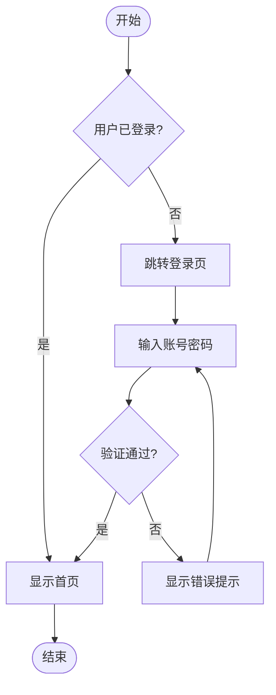

### 1.2 横向流程图（LR）+ 子图

```mermaid
flowchart LR[yaml_frontmatter_showcase.md](yaml_frontmatter_showcase.md)
    subgraph 客户端
        A[浏览器] --> B[发送请求]
    end
    subgraph 服务端
        C[Nginx] --> D[应用服务器]
        D --> E[(数据库)]
    end
    subgraph 缓存层
        F[(Redis)]
    end
    B --> C
    D -- 缓存命中 --> F
    F -- 返回数据 --> D
```

### 1.3 节点形状大全

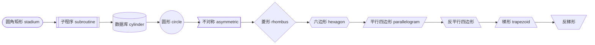

### 1.4 样式 & 链接样式

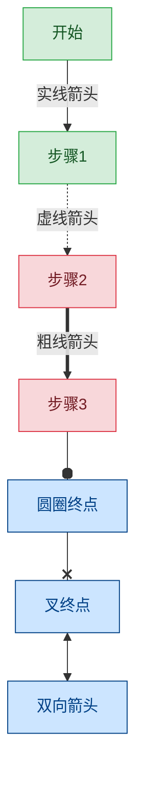

---

## 2. Sequence Diagram — 时序图

> 描述对象间消息交互顺序，支持循环、条件、注释、激活框。

### 2.1 基础时序图

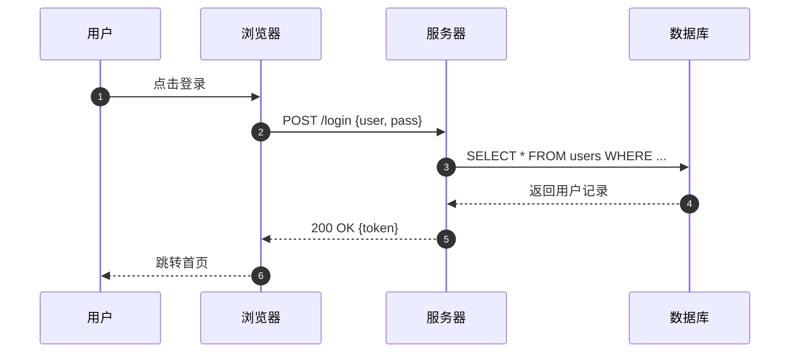

### 2.2 循环 / 条件 / 注释

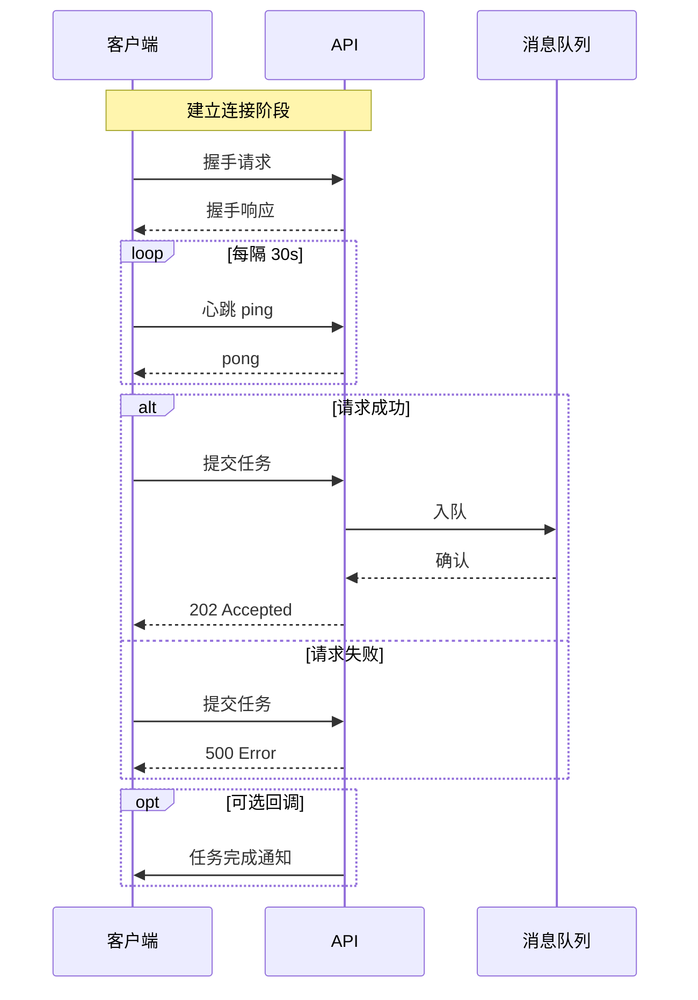

### 2.3 激活框 & 创建/销毁

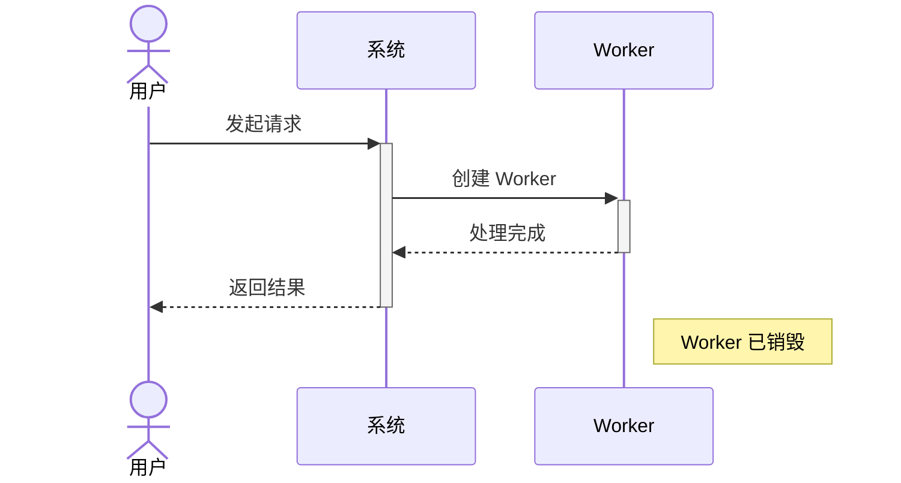

---

## 3. Class Diagram — 类图

> UML 类图，支持继承、接口、关联、聚合、组合、依赖关系。

### 3.1 完整类图

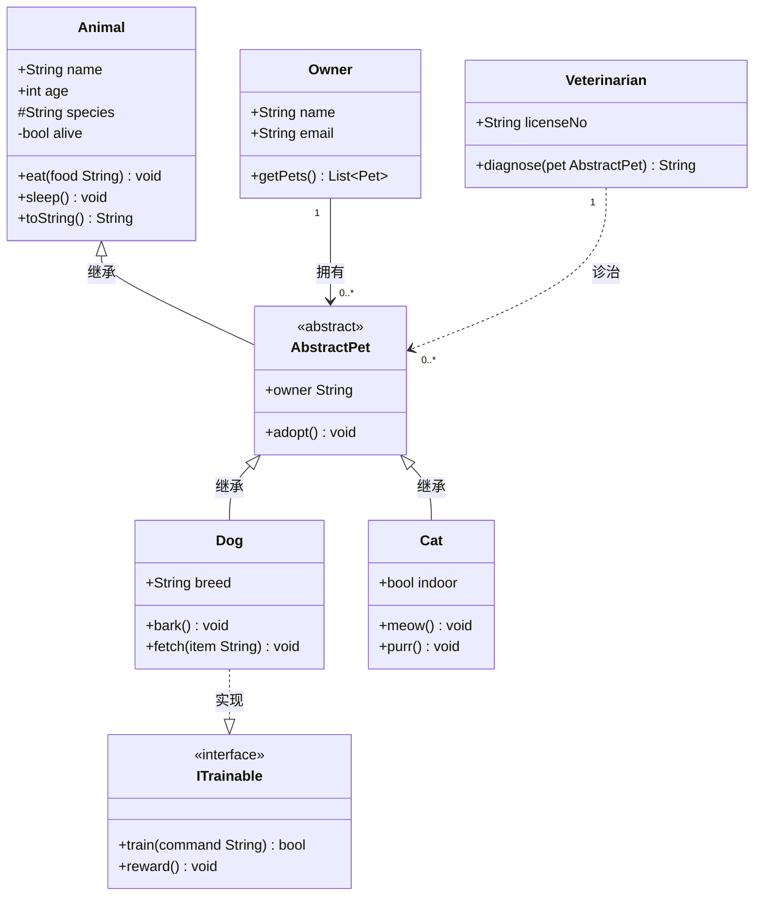

### 3.2 泛型 & 注解

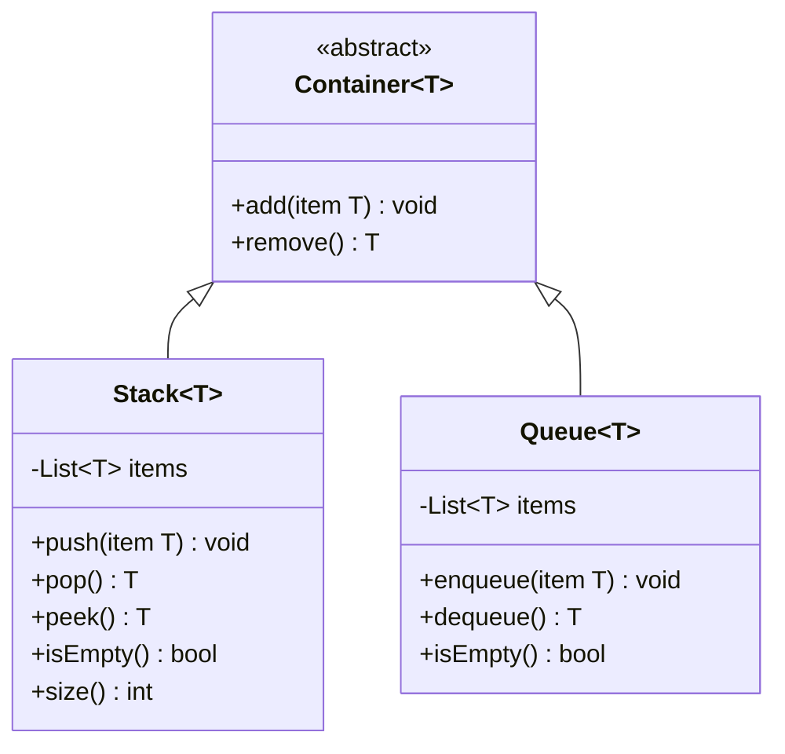

---

## 4. State Diagram — 状态图

> 描述对象的状态转换，支持嵌套状态、并发状态、历史节点。

### 4.1 基础状态机

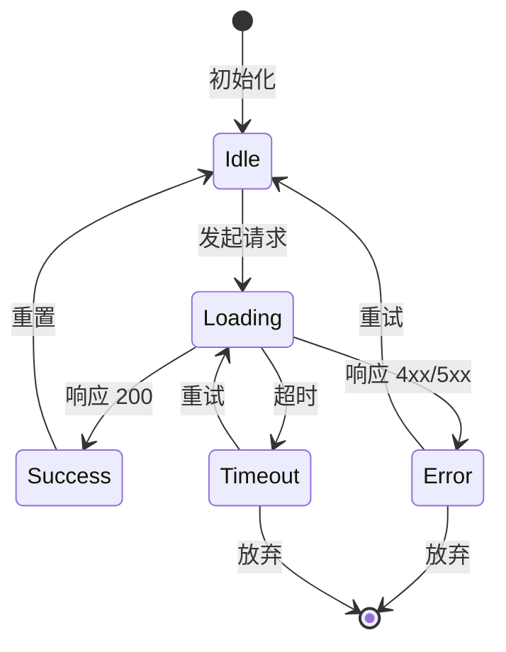

### 4.2 嵌套状态

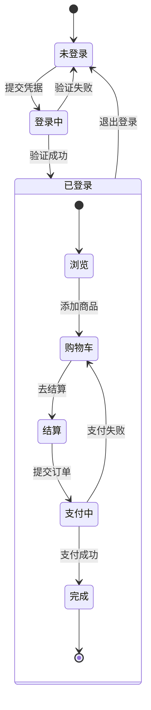

### 4.3 并发状态（fork/join）

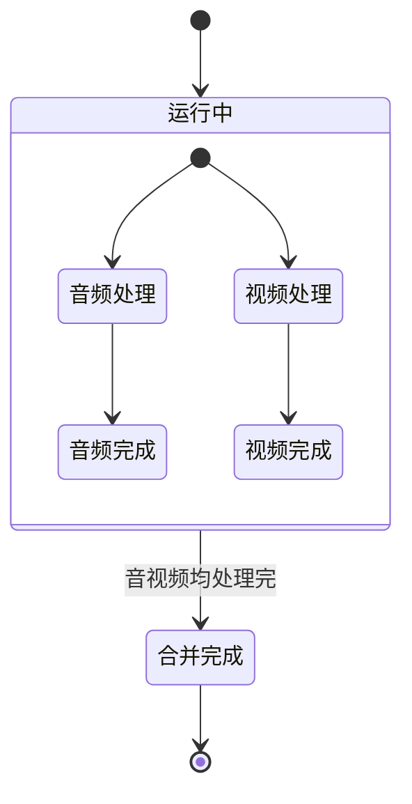

---

## 5. Entity Relationship Diagram — ER 图

> 数据库实体关系图，支持属性类型标注和关系基数。

### 5.1 电商系统 ER 图

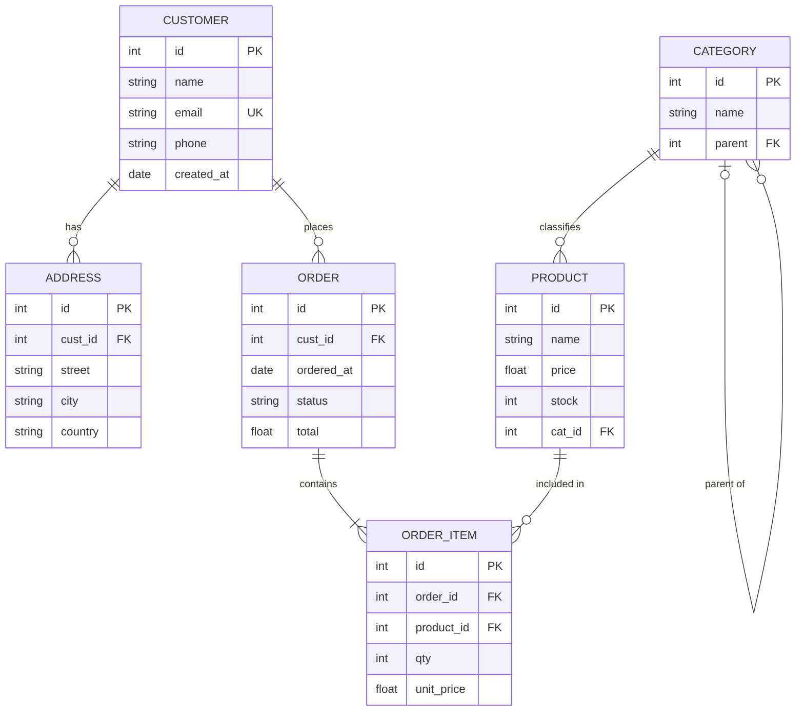

---

## 6. Gantt — 甘特图

> 项目排期图，支持 `done`、`active`、`crit`、`milestone` 标记。

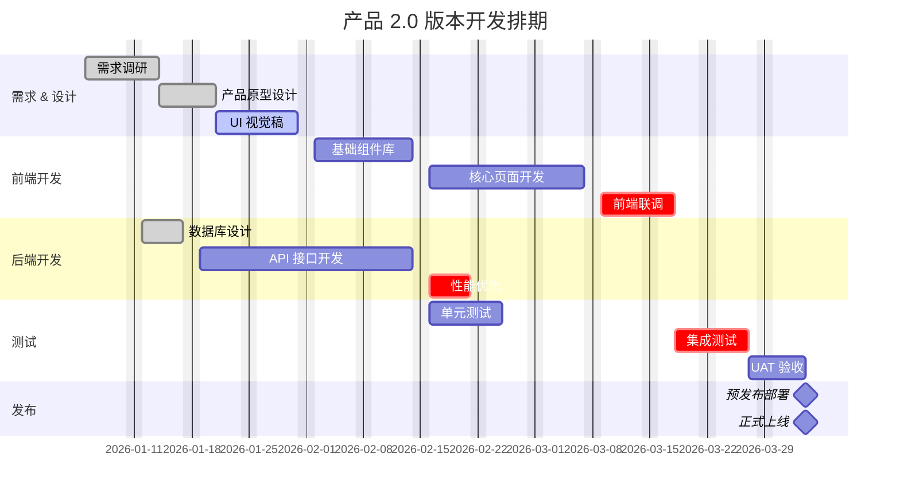

---

## 7. Pie Chart — 饼图

> 用于展示占比分布，`showData` 可显示原始数值。

### 7.1 基础饼图

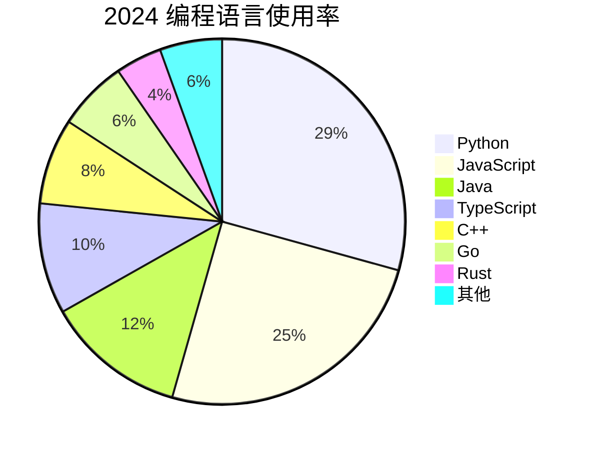

### 7.2 显示原始数据

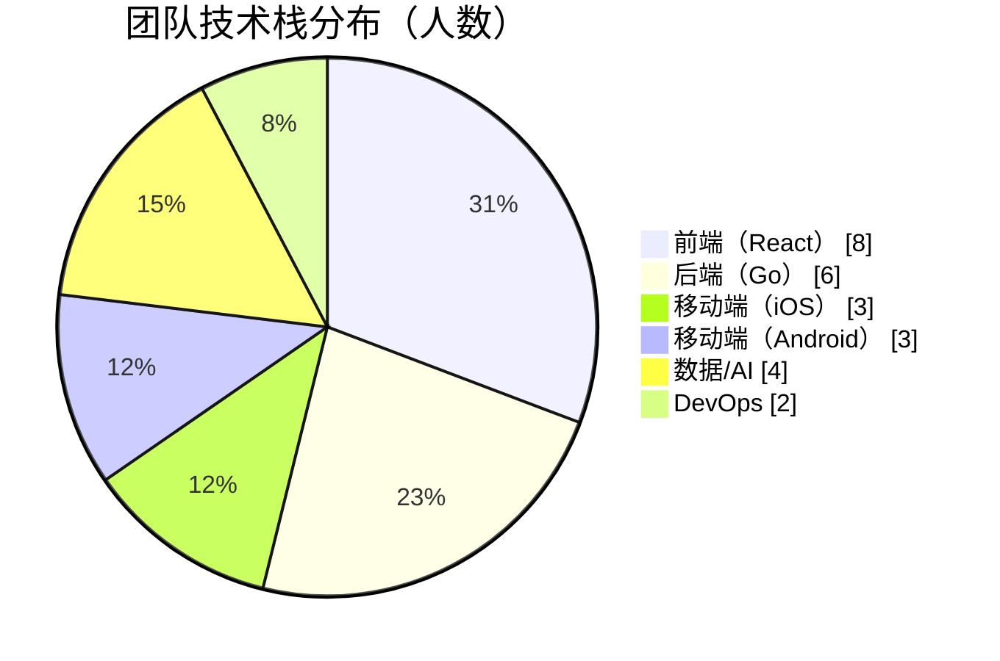

---

## 8. Git Graph — Git 提交图

> 可视化 Git 分支模型，支持 commit、branch、merge、tag、cherry-pick。

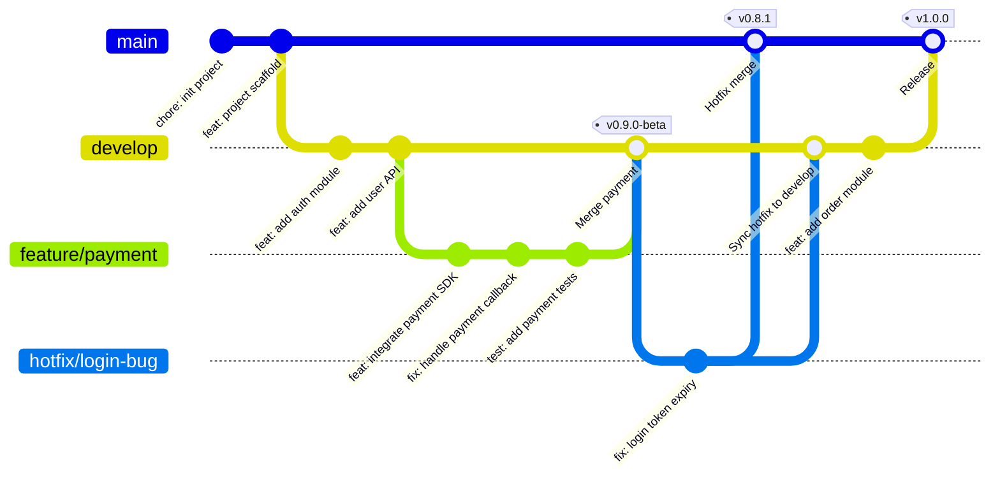

---

## 9. Journey — 用户旅程图

> 描述用户在产品中的操作体验流程，每步可标注满意度（1–5）和参与角色。

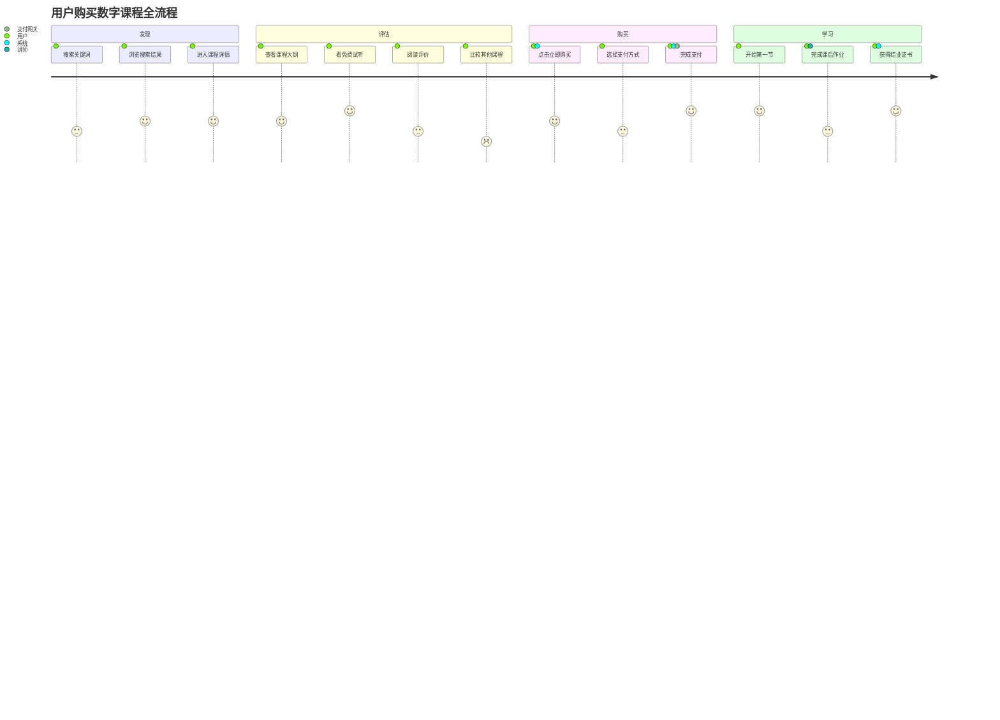

---

## 10. Timeline — 时间轴

> 按时间顺序排列事件，支持分节。

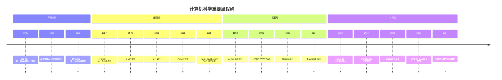

---

## 11. Mindmap — 思维导图

> 树形思维导图，支持多种节点形状（圆角矩形、圆形、方形、爆炸形、云形）。

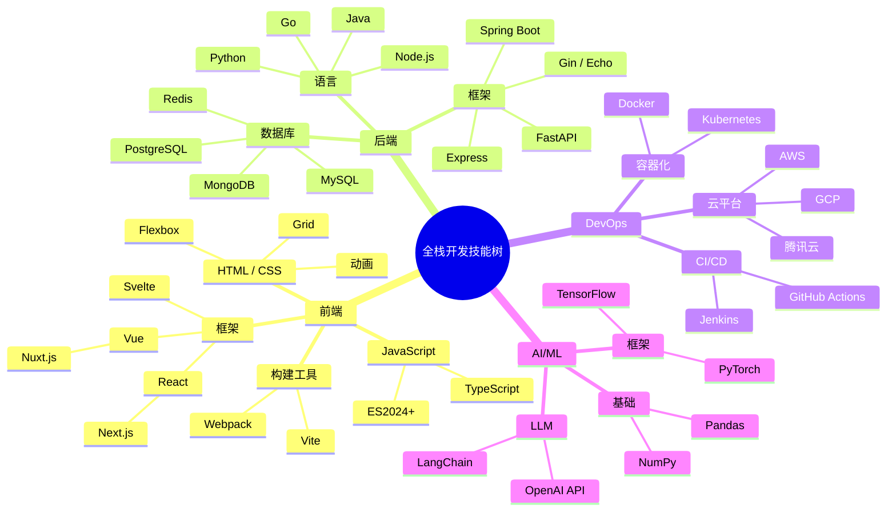

---

## 12. Quadrant Chart — 四象限图

> 用于优先级评估、技术选型等场景。

```mermaid
quadrantChart
    title 技术债务优先级矩阵
    x-axis 低影响范围 --> 高影响范围
    y-axis 低修复成本 --> 高修复成本
    quadrant-1 计划重构
    quadrant-2 立即处理
    quadrant-3 暂缓
    quadrant-4 委派/自动化

    旧版认证模块: [0.85, 0.80]
    数据库慢查询: [0.90, 0.35]
    日志格式不统一: [0.25, 0.20]
    硬编码配置项: [0.55, 0.25]
    无单元测试的核心逻辑: [0.75, 0.70]
    过时的第三方依赖: [0.60, 0.45]
    前端组件重复代码: [0.30, 0.50]
    API 文档缺失: [0.45, 0.15]
```

---

## 13. XY Chart — XY 折线/柱状图

> 支持折线图和柱状图，适合展示趋势和对比数据。

### 13.1 柱状图

```mermaid
xychart-beta
    title "各月营收（万元）"
    x-axis ["1月","2月","3月","4月","5月","6月","7月","8月","9月","10月","11月","12月"]
    y-axis "营收（万元）" 0 --> 500
    bar [120, 135, 160, 180, 220, 260, 290, 310, 275, 240, 330, 410]
```

### 13.2 折线图

```mermaid
xychart-beta
    title "DAU 与 MAU 趋势（单位：万）"
    x-axis ["Jan","Feb","Mar","Apr","May","Jun","Jul","Aug","Sep","Oct","Nov","Dec"]
    y-axis "用户数（万）" 0 --> 1000
    line [120, 145, 170, 210, 265, 310, 380, 420, 460, 500, 560, 620]
```

---

## 14. Block Diagram — 块状图

> 用于描述系统组件结构与数据流向。

```mermaid
block-beta
    columns 3

    A["用户浏览器"]:1
    space:1
    B["CDN"]:1

    space:3

    C["负载均衡器"]:3

    space:3

    D["Web 服务器 1"]:1
    E["Web 服务器 2"]:1
    F["Web 服务器 3"]:1

    space:3

    G["应用服务器集群"]:2
    H["消息队列\nKafka"]:1

    space:3

    I["主数据库\nPostgreSQL"]:1
    J["从数据库\nPostgreSQL"]:1
    K["缓存\nRedis"]:1

    A --> C
    B --> C
    C --> D
    C --> E
    C --> F
    D --> G
    E --> G
    F --> G
    G --> H
    G --> I
    G --> K
    I --> J
```

---

## 15. Sankey Diagram — 桑基图

> 展示流量/能量/资金的流向与比例。

```mermaid
sankey-beta

%% 用户流量来源 → 渠道 → 转化
自然搜索,移动端,3200
自然搜索,桌面端,2800
付费广告,移动端,1800
付费广告,桌面端,1200
社交媒体,移动端,2400
社交媒体,桌面端,600
邮件营销,移动端,400
邮件营销,桌面端,800
移动端,注册用户,1500
移动端,游客,6400
桌面端,注册用户,2100
桌面端,游客,3300
注册用户,付费转化,900
注册用户,免费留存,2700
游客,流失,7200
游客,再访,2500
```

---

## 16. Requirement Diagram — 需求图

> 描述需求与系统元素之间的关系。

```mermaid
requirementDiagram

    requirement 性能需求 {
        id: REQ-001
        text: 系统 P99 响应时间不超过 200ms
        risk: high
        verifymethod: test
    }

    requirement 安全需求 {
        id: REQ-002
        text: 所有接口必须经过身份验证
        risk: high
        verifymethod: inspection
    }

    requirement 可用性需求 {
        id: REQ-003
        text: 系统年可用性不低于 99.9%
        risk: medium
        verifymethod: analysis
    }

    functionalRequirement 用户登录 {
        id: FUNC-001
        text: 用户可以使用邮箱和密码登录
        risk: low
        verifymethod: demonstration
    }

    element 认证服务 {
        type: service
        docref: /docs/auth-service
    }

    element 负载均衡 {
        type: component
        docref: /docs/load-balancer
    }

    认证服务 - satisfies -> 安全需求
    认证服务 - satisfies -> 用户登录
    负载均衡 - satisfies -> 性能需求
    负载均衡 - satisfies -> 可用性需求
    用户登录 - refines -> 安全需求
```

---

## 17. C4 Diagram — C4 架构图

> C4 模型（Context / Container / Component / Code）用于描述软件架构。

### 17.1 System Context（系统上下文）

```mermaid
C4Context
    title 在线教育平台 — 系统上下文图

    Person(student, "学生", "在线学习课程")
    Person(teacher, "讲师", "创建和管理课程")
    Person(admin, "管理员", "平台运营管理")

    System(platform, "在线教育平台", "提供课程学习、直播、作业等功能")

    System_Ext(payment, "支付系统", "微信支付 / 支付宝")
    System_Ext(cdn, "CDN", "视频内容分发网络")
    System_Ext(sms, "短信服务", "验证码 & 通知")
    System_Ext(email, "邮件服务", "SendGrid")

    Rel(student, platform, "学习课程、提交作业")
    Rel(teacher, platform, "上传视频、批改作业")
    Rel(admin, platform, "管理用户和内容")
    Rel(platform, payment, "处理支付")
    Rel(platform, cdn, "视频存储与分发")
    Rel(platform, sms, "发送验证码")
    Rel(platform, email, "发送通知邮件")
```

### 17.2 Container（容器图）

```mermaid
C4Container
    title 在线教育平台 — 容器图

    Person(student, "学生")

    Container_Boundary(platform, "在线教育平台") {
        Container(web, "Web 应用", "React / Next.js", "学生和讲师的 Web 界面")
        Container(app, "移动 App", "React Native", "iOS & Android 客户端")
        Container(api, "API Gateway", "Go / Gin", "统一入口，鉴权路由")
        Container(course_svc, "课程服务", "Go", "课程 CRUD、进度记录")
        Container(user_svc, "用户服务", "Go", "注册、登录、权限")
        Container(live_svc, "直播服务", "Node.js", "实时音视频")
        ContainerDb(pg, "PostgreSQL", "关系型数据库", "用户、课程、订单数据")
        ContainerDb(redis, "Redis", "缓存", "会话、热点数据")
        ContainerDb(oss, "对象存储", "MinIO / OSS", "视频、图片文件")
    }

    Rel(student, web, "使用", "HTTPS")
    Rel(student, app, "使用", "HTTPS")
    Rel(web, api, "调用", "REST/HTTPS")
    Rel(app, api, "调用", "REST/HTTPS")
    Rel(api, course_svc, "路由", "gRPC")
    Rel(api, user_svc, "路由", "gRPC")
    Rel(api, live_svc, "路由", "WebSocket")
    Rel(course_svc, pg, "读写")
    Rel(user_svc, pg, "读写")
    Rel(course_svc, redis, "缓存")
    Rel(live_svc, oss, "存储回放")
```

---

## 18. Packet Diagram — 数据包图

> 描述网络协议数据包的字段结构与位宽。

```mermaid
packet-beta
    title IPv4 Header
    0-3: "Version (4)"
    4-7: "IHL"
    8-15: "DSCP + ECN"
    16-31: "Total Length"
    32-47: "Identification"
    48-50: "Flags"
    51-63: "Fragment Offset"
    64-71: "TTL"
    72-79: "Protocol"
    80-95: "Header Checksum"
    96-127: "Source Address"
    128-159: "Destination Address"
    160-191: "Options (if IHL > 5)"
```

---

## 19. Architecture Diagram — 架构图

> 新版 Mermaid（v11+）架构图，支持服务、数据库、云服务节点。

```mermaid
architecture-beta
    group api(cloud)[API 层]

    service client(internet)[客户端] in api
    service gateway(server)[API 网关] in api

    group backend(cloud)[后端服务]

    service auth(server)[认证服务] in backend
    service order(server)[订单服务] in backend
    service notify(server)[通知服务] in backend

    group data(cloud)[数据层]

    service db(database)[PostgreSQL] in data
    service cache(database)[Redis] in data
    service queue(server)[Kafka] in data

    client:R --> L:gateway
    gateway:R --> L:auth
    gateway:B --> T:order
    order:R --> L:db
    order:B --> T:cache
    order:R --> L:queue
    queue:B --> T:notify
```

---

## 附录：Mermaid 语法速查

| 图类型 | 关键字 | 主要用途 |
|:---|:---|:---|
| 流程图 | `flowchart TD/LR/BT/RL` | 业务流程、算法流程 |
| 时序图 | `sequenceDiagram` | 接口交互、时序分析 |
| 类图 | `classDiagram` | UML 类结构、面向对象设计 |
| 状态图 | `stateDiagram-v2` | 状态机、工作流 |
| ER 图 | `erDiagram` | 数据库设计 |
| 甘特图 | `gantt` | 项目排期 |
| 饼图 | `pie` | 占比分布 |
| Git 图 | `gitGraph` | 分支策略可视化 |
| 旅程图 | `journey` | 用户体验设计 |
| 时间轴 | `timeline` | 历史沿革、里程碑 |
| 思维导图 | `mindmap` | 知识结构、头脑风暴 |
| 四象限 | `quadrantChart` | 优先级/选型矩阵 |
| XY 图 | `xychart-beta` | 趋势、对比数据 |
| 块图 | `block-beta` | 系统组件结构 |
| 桑基图 | `sankey-beta` | 流量/资金流向 |
| 需求图 | `requirementDiagram` | 需求追踪 |
| C4 图 | `C4Context/Container` | 软件架构 |
| 数据包图 | `packet-beta` | 协议字段结构 |
| 架构图 | `architecture-beta` | 云原生架构 |

---

*文件生成时间：2026-05-27 | Mermaid 版本兼容：v10+ / v11+*
